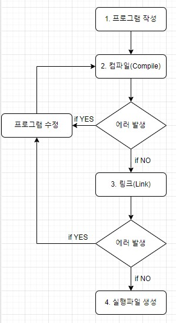

# Chapter 01 이것이 C언어다.

## 목차

- [C언어의 개론적인 이야기](#c0언어의-개론적인-이야기)
- [C 프로그램의 완성과정](#c-프로그램의-완성과정)

## C언어의 개론적인 이야기

> C언어는 프로그래밍 언어이다.

컴퓨터는 기계어만 이해하기 때문에 사람과 컴퓨터가 소통하기 위해선 사람이 기계어를 배우거나 컴퓨터가 사람의 언어를 배워야 한다.  
현재로선 둘 다 아주 어렵거나 불가능한 일이기 때문에 컴퓨터와 사람 사이에 __컴파일러(compiler)__라는 통역가를 만들었다. __컴파일러__는 C언어와 기계어를 이해한다.

__컴파일러__ 의 역할은 프로그래밍 언어로 작성한 프로그램을 컴퓨터가 이해할 수 있도록 기계어로 번역하는 일을 한다. 이런 과정 자체를 __컴파일(compile)__이라 한다.

> C언어의 역사와 특징

C언어는 1971년경 UNIX라는 운영체제의 개발을 위해 Dennis Ritchie와 Ken Thompson이 함께 설계한 범용적인 __고급(high-level)언어__이다.  
C언어라는 이름은 B언어(1970)다음에 탄생했기 때문에 붙여진 이름이다.  
기존의 UNIX는 어셈블리어라는 __저급(low-level)언어__로 만들어졌기 때문에 하드웨어 의존도가 높았다(이를 이식성이 낮다고 표현한다.).  
이러한 단점을 해결하기 위해서 이식성도 좋고, 저급 언어적 특성을 가지고, 익히기도 쉬운 언어로 개발된 것이 C언어이다.  
C언어의 개발 이후로 UNIX 운영체제의 90% 이상이 C언어로 대체되었다.  
__저급 언어와 고급 언어의 차이는__ 컴퓨터가 이해하기 쉬운 언어인지 사람이 이해하기 쉬운 언어인지에 따라 구분된다.  
저급 언어에 가까울수록 컴퓨터가 이해하기 쉽고, 고급 언어에 가까울수록 사람이 이해하기 쉽다.

> C언어의 장점

- C언어는 절차지향적 특성을 지닌다. 그로인해 익숙해지는데 많은 시간이 걸리지 않는다.

  절차지향이란? 정해진 순서의 실행흐름을 중시한다는 의미가 담겨있다.  
  즉 인간의 일반적인 사고 방식과 유사하기 때문에 쉽게 익숙해질수 있다.

  

- C언어로 작성된 프로그램은 이식성이 좋다.

  C언어로 작성된 프로그램은 cpu의 종류에 상관없이 실행이 가능하고, 운영체제 차이에도 덜 민감하다.

  

- C언어로 구현된 프로그램은 좋은 성능을 보인다.

  C언어는 사용하는 메모리의 양이 다른 언어에 비해 상대적으로 적고, 속도를 저하시키는 요소를 최소화한 언어이다.

## C 프로그램의 완성과정

> C 프로그램 완성과정의 전체적인 이해

위 그림은 하나의 프로그램이 완성되는 과정을 보여준다.  
실행 파일을 얻기 위해선 다음의 세 단계를 반드시 거쳐야 한다.

1. 프로그램의 작성
2. 작성한 프로그램의 컴파일
3. 컴파일 된 결과물의 링크

이 중에서 링크의 과정은 보통 컴파일과정에서 함께 진행되기 때문에  프로그램 작성과 컴파일의 두단계로 줄여서 말하기도 한다.

