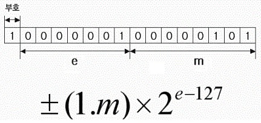

# 데이터 표현 방식의 이해


## 목차

- 컴퓨터가 데이터를 표현하는 방식
- 정수와 실수의 표현방식
- 비트 연산자


## 컴퓨터가 데이터를 표현하는 방식

> 2진수란 무엇인가? 더불어 10진수, 16진수란 무엇인가?

n진수란? n개의 기호를 사용하여 데이터를 표현하는것을 말한다.


> 데이터의 표현단위인 비트(Bit)와 바이트(Byte)

__비트란?__ 컴퓨터가 표현하는 __데이터의 최소 단위__로서 2진수 값 하나를 저장할 수 있는 메모리의 크기를 뜻한다.

__바이트란?__ 8개의 비트를 묶어서 바이트라고 표현한다.


> 8진수와 16진수를 이용한 데이터 표현

C언어는 10진수 이외에 8진수와 16진수의 데이터 표현도 허용을 한다.  
따라서 변수 선언 후에 10진수가 아닌, 16진수나 8진수의 표현방식으로도 변수에 값을 채울 수 있다.

```
int num = 10;        //특별한 선언이 없으면 10진수의 표현
int num = 0xA;       //0x로 시작하면 16진수로 인식
int num = 012;       //0으로 시작하면 8진수로 인식
```

위의 예제에서 본 것처럼 0x로 시작하면 16진수의 표현인 것으로, 숫자 0으로 시작하면 8진수의 표현인 것으로 약속되어 있다.  
주의해야 할 점은 표현의 방식이 다르다고 해서 저장되는 값이 달라지는 것은 아니라는 점이다.  
16진수 A와 8진수 12는 둘다 10진수로 10이다. 즉 위의 세 문장에 의해서 변수에 초기화 되는 값은 모두 동일하다.  
물론 컴퓨터는 __내부적으로 2진수의 형태로 값을 저장__한다.


Notation.c

```c
#include <stdio.h>

int main(void){
    int num1=0xA7, num2=0x43;
    int num3=032, num4=024;
    
    printf("0xA7의 10진수 정수 값: %d\n", num1);
    printf("0x43의 10진수 정수 값: %d\n", num2);
    printf("032의 10진수 정수 값: %d\n", num3);
    printf("024의 10진수 정수 값: %d\n", num4);
    
    printf("%d-%d=%d\n", num1, num2, num1-num2);
    printf("%d+%d=%d\n", num3, num4, num3+num4);
    return 0;
}
```


실행 결과

```
0xA7의 10진수 정수 값: 167
0x43의 10진수 정수 값: 67
032의 10진수 정수 값: 26
024의 10진수 정수 값: 20
167-67=100
26+20=46
```


## 정수와 실수의 표현방식

> 정수의 표현방식

C언어는 보통 하나의 정수를 4바이트로 표현하지만 여기서는 1바이트를 기준으로 설명한다.  

- 정수의 가장 왼쪽에 존재하는 비트는 '부호비트'이다.

```
00000001
```

컴퓨터가 1바이트 메모리 공간에 정수를 저장할 때 위에 보이는 것과 같이 가장 왼쪽에 존재하는 비트는 부호를 표현하는데 사용된다. __양수라면 0, 음수라면 1을 저장하여 부호를 표시한다.__  
부호를 표현하는데 사용하는 비트를 __MSB(Most Significant Bit)__라고 한다.

위 그림의 경우 MSB가 0이고, 나머지 7비트가 0000001이므로 크기는 1이다. 즉 나타내는 값은 +1임을 알 수 있다.  
그렇다면 00001001은 무슨 값일까? MSB가 0이고, 나머지 7비트가 0001001이므로 +9이다.

- 음의 정수를 표현할 때에는 2의 보수를 취해야 한다.

앞에서 배운 것을 응용하면 MSB만 1로 바꿔 주면 -1을 표현할수 있다고 생각할 수 있다.  
하지만 아래 예제를 살펴보자.

```
 0 0 0 0 0 1 0 1 [정수 +5]
+1 0 0 0 0 1 0 1 [MSB만 음수로 바꾼 정수 +5]
-----------------------------------------
 1 0 0 0 1 0 1 0 [더하면 0이 나와야 하지만 0이 아닌 값이 나온다.]
```

MSB만 바꿔서 기존 값과 더해주면 0이 나와야 하지만 전혀 다른 값이 나오는 것을 알 수 있다.  
그렇다면 음의 정수는 어떻게 표현해야 하는 것일까?  
다음 예제를 살펴보자.

```
 0 0 0 0 0 1 0 1 [정수 +5]
 ↓             ↓ [1의 보수를 취한다.]
 1 1 1 1 1 0 1 0
 ↓             ↓ [1을 더한다.]
 1 1 1 1 1 0 1 1 [정수 -5]
```

즉 음수를 표현하려면 
1.양수에 1의 보수를 취해준다.

2.1을 더해준다.

를 통해 음수를 표현할 수 있다는 것을 알 수 있다.  
예제를 통해 확인해보면

```
  0 0 0 0 0 1 0 1 [정수 +5]
 +1 1 1 1 1 0 1 1 [정수 -5]
 ----------------------------
1 0 0 0 0 0 0 0 0 [올림수는 버려져서 0]
```

0이 됨을 확인할 수 있다.  
이러한 과정을 가리켜 __2의 보수법__이라고 한다. 1의 보수를 취하고 1을 더하는 과정이 2의 보수를 구하는 과정이기 때문이다.


> 실수의 표현방식

컴퓨터는 실수를 2진수로만 표현해야 되기 때문에 정수에 비해 훨씬 표현하기 복잡하다.  
컴퓨터가 실수를 표현하는 방법은 두 가지로 나뉜다.

1. 고정 소수점(Fixed Point)방식

   실수는 일반적으로 정수부와 소수부로 나눌 수 있다.  
   따라서 소수를 표현하는 간단한 방법은 소수부의 자릿수를 정하여, 고정된 자릿수의 소수를 표현하는것이다.  

   | 부호 | 정수부 | 소수부 |
   | :--: | :----: | :----: |
   | 1bit | 15bit  | 16bit  |

   32bit 실수를 고정 소수점 방식으로 표현하면 위처럼 표현할 수 있는데, 이 방식은 정수부와 소수부의 자리수가 크지 않으므로 표현할 수 있는 값의 범위가 매우 좁다는 단점이 있다.  
   만약 정수부를 표현하는 bit수를 늘리면 큰 숫자를 표현할 수 있지만 정밀한 숫자를 표현하기 힘들어지고,  
   소수부를 표현하는 bit수를 늘리면 정밀한 숫자를 표현할 수 있지만 큰 숫자를 표현하기 어려워진다.

   이러한 문제를 해결하기 위해서 소수점을 고정하지 않고 소수를 표현할 수 있는 부동 소수점방식을 사용한다.

   

2. 부동 소수점(Floating Point)방식

   부동 소수점 방식은 하나의 실수를 __부호(sign)__, __가수(mantissa)__, __지수(exponent)__로 나누어 표현하는 방식이다.  
   현재 대부분의 시스템은 부동 소수점 방식으로 실수를 표현하고 있다.  
   부동 소수점 방식은 고정 소수점보다 넓은 범위의 수를 나타낼 수 있지만 연산속도가 느리다는 특징이 있다.  
   고정 소수점 방식과 달리 정수 부분과 소수 부분의 자릿수가 일정하지 않으나, 유효 숫자의 자릿수는 정해져 있다.  

   

   m: 가수부

   e: 지수부

   예제

   ```
   101.101을 부동 소수점으로 표시하면
   
   1.01101 * 2^2        //소수점을 오른쪽으로 2칸 움직여서 표현
   10.1101 * 2^1        //소수점을 오른쪽으로 1칸 움직여서 표현
   101101  * 2^-3       //소수점을 왼쪽으로 3칸 움직여서 표현
   ```

   하지만 위처럼 표기하면 같은 수를 서로 다른 부동 소수로 표기가 가능하다.  
   그래서 __정규화된 표기법(normalized notation)__을 사용한다.


컴퓨터가 실수를 표현하는 방식에는 오차가 존재한다.  
컴퓨터는 실수의 값을 정확하게 표현하는 것이 아니라 문제가 없을 만큼의 근사치를 통해서 실수를 표현하게 된다.  
이러한 오차를 가리켜 __부동 소수점 오차__라고 한다.


FloatError.c

```c
#include <stdio.h>

int main(void){
    int i;
    float num=0.0;
    
    for(i=0;i<100;i++)
        num+=0.1;        //이 연산을 총 100회 진행
    
    printf("0.1을 100번 더한 결과: %f\n", num);
    return 0;
}
```


실행 결과

```
0.1을 100번 더한 결과: 10.000002
```


위 예제를 보면 실제로 10.0이 출력되어야 하는데 다른 값이 출력되었다.  
위 실행 결과의 오차는 작은 오차들이 모여서 생긴 것이다.  
__컴퓨터는 실수를 100% 정확히 표현하지 못한다. 다만 근사치를 표현할 뿐이다.__


## 비트 연산자

> 비트 연산자의 종류

- & 결합방향: →

  비트 단위로 AND 연산을 한다. 예) num1 & num2;

- | 결합방향: →

  비트 단위로 OR 연산을 한다. 예)num1 | num2;

- ^ 결합방향: →

  비트 단위로 XOR 연산을 한다. 예) num1 ^ num2;

- ~ 결합방향: ←

  단항 연산자로서 피연산자의 모든 비트를 반전시킨다. 예) ~num; //num은 변화 없음, 반전 결과만 반환

- << 결합방향: →

  피연산자의 비트 열을 왼쪽으로 이동시킨다. 예) num<<2; //num은 변화 없음, 두 칸 왼쪽 이동 결과만 반환

- &#62;&#62; 결합방향: →

  피연산자의 비트 열을 오른쪽으로 이동시킨다. 예) num>2; //num은 변화 없음, 두 칸 오른쪽 이동 결과만 반환


> & 연산자: 비트단위 AND

& 연산은 두 개의 비트가 모두 1일때 1을 반환하는 연산이다.

- 0 & 0    0을 반환
- 0 & 1    0을 반환
- 1 & 0    0을 반환
- 1 & 1    1을 반환


> | 연산자: 비트단위 OR

| 연산은 두 개의 비트 중 하나라도 1이면 1을 반환하는 연산이다.  

- 0 | 0    0을 반환
- 0 | 1    1을 반환
- 1 | 0    1을 반환
- 1 | 1    1을 반환


> ^ 연산자: 비트단위 XOR

^ 연산은 두 개의 비트가 서로 다른 경우에 1을 반환하는 연산이다.

- 0 ^ 0    0을 반환
- 0 ^ 1    1을 반환
- 1 ^ 0    1을 반환
- 1 ^ 1    0을 반환


> ~ 연산자: 비트단위 NOT

~ 연산은 비트를 0에서 1로, 1에서 0으로 반전시키기 때문에 __보수연산__이라고도 불린다.

- ~0     1을 반환
- ~1     0을 반환

아래 예제를 보자

BitNotOperation.c

```c
#include <stdio.h>

int main(void){
    int num1 = 15;    // 00000000 00000000 00000000 00001111
    int num2 = ~num1;
    printf("NOT 연산의 결과: %d\n", num2);
    return 0;
}
```


실행 결과

```
NOT 연산의 결과: -16
```


위 예제 6행의 비트 단위 NOT 연산의 결과는 다음과 같다.

11111111 11111111 11111111 11110000

이는 num1의 모든 비트를 반전시킨 결과인데 MSB 역시 반전되었기 때문에 값이 음수로 바뀐다.


> << 연산자: 비트의 왼쪽 이동(Shift)