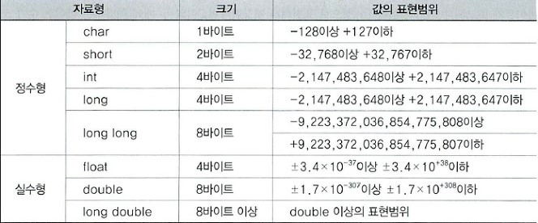
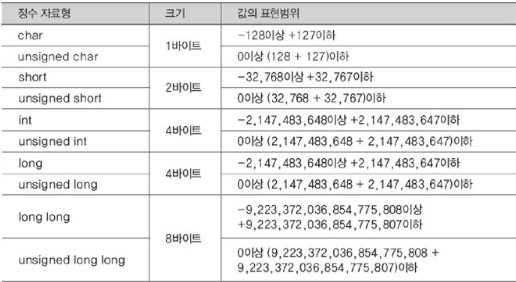

# 상수와 기본 자료형


## 목차

- [C언어가 제공하는 기본 자료형의 이해](#c언어가-제공하는-기본-자료형의-이해)
- [문자의 표현방식과 문자를 위한 자료형](#문자의-표현방식과-문자를-위한-자료형)
- [상수에 대한 이해](#상수에-대한-이해)
- [자료형의 변환](#자료형의-변환)


## C언어가 제공하는 기본 자료형의 이해

> 자료형은 데이터를 표현하는 방법입니다.

우리는 공간을 할당하기에 앞서 아래의 내용을 먼저 결정해야 한다.

__정수를 저장할 것인지, 실수를 저장할 것인지, 문자열을 저장할 것인지__

따라서 메모리 공간을 할당할 때, 그 용도가 결정되어야 한다.  
정수를 저장하기로 했다면 이어서 다음의 내용도 결정해야 한다.

__정수를 저장하기 위해서 몇 바이트를 사용할까요?__

정수는 몇 바이트를 사용하건 저장할 수 있다. 다만 바이트의 크기가 크면 클수록 저장할 수 있는 정수의 크기가 커질 뿐이다.  
정리하자면 num이라는 이름의 변수를 선언하기 위해서는 프로그램상에서 다음과 같은 내용을 담은 문장을 구성해야 한다.

__정수를 저장할것이고, 크기는 4바이트로, 변수의 이름은 num으로 한다.__

이 문장을 나타내는 키워드가 바로 __int__이다. 따라서 아래와 같이 간단하게 표현이 가능하다.

__int num;__

즉, __자료형(data type)이란?__ 데이터를 표현하는 방법을 뜻한다.


> 기본 자료형의 종류와 데이터의 표현범위

기본적으로 제공되는 자료형을 __기본 자료형__이라 하며, 그 종류와 특징은 아래와 같다.



위의 표에서도 알수 있듯이 같은 정수 자료형이라고 하더라도 바이트의 크기가 커질수록 표현범위가 넓어짐을 알 수 있다.  
참고로 C의 표준을 정하는 ANSI에서는 아래와 같이 자료형의 크기를 표준화하고 있다.

__short과 int는 최소 2바이트이되, int는 short와 크기가 같거나 더 커야 한다.__

즉, __자료형 별 크기를 정확히 제한하고 있지 않다.__   
따라서 자료형 별 크기는 컴파일러마다 차이를 보인다.

이렇게 많은 수의 자료형을 제공하는 이유는 무엇일까? 그 이유는

1. 데이터의 표현방식이 다르므로, 최소 둘 이상의 자료형이 필요하다.

   위의 표를 보면 알 수 있듯이 자료형의 종류는 크게 정수 자료형과 실수 자료형으로 나뉜다.  
   이렇게 크게 두 가지로 나눠놓은 이유는 컴퓨터가 정수와 실수를 표현하는 방식이 다르기 때문이다.  
   따라서 정수와 실수를 각각 표현하기 위해 자료형은 최소 2가지는 있어야 한다.  
   하지만 위의 표를 살펴보면 2가지가 훨씬 넘는 종류의 자료형이 있음을 알 수 있는데 그 이유는

   

2. 메모리 공간의 적절한 사용을 위해서 다양한 크기의 자료형이 필요하다.

   예를 들어 5000개의 정수를 저장한다고 가정했을때, 이 정수들은 short형으로 표현이 가능한 정수들이다.  
   따라서 이 정수들을 short로 표현하여 저장한다면 총 5000*2=10000바이트가 소모된다.  
   반면, 이를 int형으로 저장한다면, 이의 두 배에 해당하는 바이트 수가 소모되어 그만큼 메모리를 낭비하는 결과로 이어질 수 있다.  
   즉, __메모리의 효율적 사용을 위해서 다양한 크기의 자료형이 존재하는 것이다.__

   

> 연산자 sizeof를 이용하면 자료형의 크기를 확인할 수 있습니다.

메모리 공간에서 소모하는 메모리의 크기를 바이트 단위로 계산하여 반환하는 sizeof라는 연산자가 존재한다.  
이 연산자의 피연산자로는 변수와 상수뿐만 아니라, 자료형의 이름도 올 수 있기 때문에 이 연산자를 사용하여  
자신이 사용하는 컴파일러의 자료형 별 바이트 크기도 확인할 수 있다.

sizeof 연산자의 사용법은 다음과 같다.

```c
int main(void) {
    int num = 10;
    int sz1 = sizeof(num);        //변수 num의 크기를 계산하여 sz1을 초기화
    int sz2 = sizeof(int);        //자료형 int의 크기를 계산하여 sz2를 초기화
    .....
}
```


위의 코드에서는 sizeof의 피연산자를 모두 소괄호로 감싸줬는데, __이 소괄호는 int와 같은 자료형의 이름에는 필수지만, 나머지 피연산자에 대해서는 선택적이다.__  
하지만 소괄호를 사용하는 것이 문장을 이해하는데 도움이 되기 때문에, __피연산자의 종류에 상관없이 무조건 소괄호를 사용하는 것이 일반적__이다.


SizeOfOperator.c

```c
#include <stdio.h>

int main(void){
    char ch=9;
    int inum=1052;
    double dnum=3.1415;
    printf("변수 ch의  크기: %d\n", sizeof(ch));
    printf("변수 inum의  크기: %d\n", sizeof(inum));
    printf("변수 dnum의  크기: %d\n", sizeof(dnum));
    
    printf("char의 크기: %d\n", sizeof(char));
    printf("int의 크기: %d\n", sizeof(int));
    printf("long의 크기: %d\n", sizeof(long));
    printf("long long의 크기: %d\n", sizeof(long long));
    printf("float의 크기: %d\n", sizeof(float));
    printf("double의 크기: %d\n", sizeof(double));
    return 0;
}
```


실행 결과

```
변수 ch의 크기: 1
변수 inum의 크기: 4
변수 dnum의 크기: 8
char의 크기: 1
int의 크기: 4
long의 크기: 4
long long의 크기: 8
float의 크기: 4
double의 크기: 8
```


> 정수를 표현 및 처리하기 위한 일반적인 자료형의 선택

정수형 변수의 자료형을 선택할 때, 가장 먼저 생각할 문제는 __저장하고자 하는 값의 범위__이다.  
예를 들어, short형 변수가 저장할 수 있는 값의 범위는 -32,768 ~ +32,767이하이다.  
이의 범위를 넘어서는 변수를 저장하기 위해서는 int형 변수를 선언해야 한다.  
그렇다면 저장하고자 하는 값이 short형 변수의 범위 내에 있다면 int형 변수를 선언하는것보다 short형 변수를 선언하는 것이 더 효율적일까? 그것은 상황에 따라 다르다.


CharShortBaseAdd.c

```c
#include <stdio.h>

int main(void){
    char num1=1, num2=2, result1=0;
    short num3=300, num4=400, result2=0;
    
    printf("size of num1 & num2: %d, %d\n", sizeof(num1), sizeof(num2));
    printf("size of num3 & num4: %d, %d\n", sizeof(num3), sizeof(num4));
    
    printf("size of char add: %d\n", sizeof(num1+num2));
    printf("size of short add: %d\n", sizeof(num3+num4));
    result1=num1+num2;
    result2=num3+num4;
    printf("size of result1 & result2: %d, %d\n", sizeof(result1), sizeof(result2));
    return 0;
}
```


실행 결과

```
size of num1 & num2: 1, 1
size of num3 & num4: 2, 2
size of char add: 4
size of short add: 4
size of result1 & result2: 1,2
```


위 예제의 핵심은 아래의 두 문장에 있다.

```c
    printf("size of char add: %d\n", sizeof(num1+num2));        //4
    printf("size of short add: %d\n", sizeof(num3+num4));       //4
```

위의 두 문장이 실행되는 순서를 정리하면

1. num1+num2
2. num1+num2의 결과로 반환되는 값을 대상으로 sizeof 연산
3. sizeof 연산의 반환 값을 대상으로 printf 함수를 호출

이처럼 __연산의 결과로 반환되는 값을 대상으로도 size of 연산이 가능하며__, 그 결과는 연산의 결과로 반환되는 값의 크기가 된다.

```
sizeof(num1+num2)   // num1+num2의 결과값의 크기를 바이트 단위로 반환
sizeof(num3+num4)   // num3+num4의 결과값의 크기를 바이트 단위로 반환
```


또한 위 예제를 다시 살펴보면 char형 덧셈 결과로 반환된 값의 크기는 1바이트, short형 덧셈 결과로 반환된 크기는 2바이트가 될 것 같은데, 출력 결과에서는 그 크기가 모두 4바이트임을 알 수 있다.  
이것은 __컴퓨터가 CPU성능을 내기 가장 좋은 연산인 int형으로 데이터를 바꿔서 연산이 진행된 것__이다.  
그러므로 __연산의 대상이 되는 변수를 선언하는 경우에는, 특히 연산의 경우가 빈번한 경우에는 저장되는 값의 크기가 작더라도 int형 변수를 사용하는 것이 좋다.__


> 실수를 표현 및 처리하기 위한 일반적인 자료형의 선택

실수형 데이터가 표현할 수 있는 값의 표현범위는 매우 넓다.  
double형이나 float형이나 둘 다 범위는 매우 넓기 때문에 값의 표현 범위는 중요한 요소가 되지 않는다.  
그렇다면 실수 자료형의 선택에 있어서 중요하게 고려되어야 할 요소는 무엇일까?

그것은 __정밀도__이다.

여기서 말하는 정밀도는 __오차가 발생하지 않는 소수점 이하의 자릿수__를 뜻한다.  
앞에서 실수의 표현에는 오차가 존재할 수 밖에 없음을 살펴보았다. 그런데 이러한 오차도 데이터 표현에 사용되는 바이트의 수가 커지면 줄어들기 마련이다.

| 실수 자료형 | 소수점 이하 정밀도 | 바이트 수 |
| :---------: | :----------------: | :-------: |
|    float    |       6자리        |     4     |
|   double    |       15자리       |     8     |
| long double |       18자리       |    12     |

정수 자료형에서는 보편적으로 int형을 선택하듯이 __실수 자료형에서는 보편적으로 double형을 선택__한다.(float형은 정밀도가 너무 낮음)


CircleArea.c

```c
#include <stdio.h>

int main(void){
    double rad;
    double area;
    printf("원의 반지름 입력: ");
    scanf("%lf, &rad");
    
    area = rad*rad*3.1415;
    printf("원의 넓이: %f\n", area);
    return 0;
}
```


실행 결과

```
원의 반지름 입력: 2.4
원의 넓이: 18.095040
```


> unsigned를 붙여서 0과 양의 정수만 표현하게 할 수 있습니다.

정수 자료형의 이름에 한해서 unsigned 선언을 추가하면, 0 이상의 값만 표현하는 자료형이 되어서 표현할 수 있는 값의 범위가 양의 정수 방향으로 두 배 더 넓어지게 된다.

unsigned를 붙이면 자료형의 가장 왼쪽 비트인 MSB조차 크기를 나타내는 비트로 사용하게 된다.  
다시 말하면 +, -의 기준이 사라져서 표현하는 모든 값은 0 이상의 값이 되는 것이다.

- 정수 자료형의 이름 앞에만 unsigned를 붙일 수 있다.
- unsigned가 붙으면, MSB도 데이터의 크기를 표현하는데 사용이 된다.
- 따라서 표현할 수 있는 값이 0 이상의 범위로 두 배가 된다.




## 문자의 표현방식과 문자를 위한 자료형

> 문자의 표현을 위한 약속 아스키(ASCII) 코드

컴퓨터는 숫자를 이용하여 무엇인가를 인식하기 때문에 우리는 문자를 표현하기 위해서 숫자를 문자에 연결(mapping)시켜야 한다.

C언어는 미국 표준 협회(ANSI)에서 제정된 아스키(ASCII) 코드라는 표준을 선택해서 문자를 표현한다.


> 문자의 표현

```c
int main(void){
    char ch1 = 'A';        //이렇듯 문자는 작은 따옴표로 감싸서 표현한다.
    char ch2 = 'C';
}
```


위 예제에서 본 것처럼 __프로그램상에서의 문자표현에는 작은 따옴표가 사용된다.__
그리고 이렇게 표현된 문자는 컴파일러에 의해서 다음과 같이 변환이 된다.

```c
int main(void){
    char ch1 = 65;        //문자 A의 아스키 코드 값은 65
    char ch2 = 67;        //문자 C의 아스키 코드 값은 67
}
```


HowChar.c

```c
#include <stdio.h>

int main(void){
    char ch1='A', ch2=65;
    int ch3='Z', ch4=90;
    
    printf("%c %d\n", ch1, ch1);
    printf("%c %d\n", ch2, ch2);
    printf("%c %d\n", ch3, ch3);
    printf("%c %d\n", ch4, ch4);
    return 0;
}
```


실행 결과

```
A 65
A 65
Z 90
Z 90
```


위 예제에서 __%c의 의미는 문자의 형태로 데이터를 출력(또는 입력)하라는 뜻이다.__  
따라서 해당 정수를 아스키코드 값으로 해석해서 아스키 코드 문자를 출력한다.  
또한 printf()함수의 출력 결과 값을 보면 정수는 출력의 방법에 따라서 문자, 또는 숫자의 형태로 출력할 수 있음을 알 수 있다.


문제 1

프로그램 사용자로부터 두 점의 x, y 좌표를 입력 받아서, 두 점이 이루는 직사각형의 넓이를 계산하여 출력하는 프로그램을 작성해보자.  
단, 좌 상단의 x, y 좌표 값이 우 하단의 x, y 좌표 값보다 작다고 가정하고, 좌 상단의 좌표정보를 먼저 입력 받는 형태로 예제를 작성해보자.  
실행 예

```
좌 상단의 x, y 좌표: 2 4
우 하단의 x, y 좌표: 4 8
두 점이 이루는 직사각형의 넓이는 8입니다.
```


[답안](./Chapter1Challenge/5-1.c)


문제2

프로그램 사용자로부터 두 개의 실수를 입력 받아서 double형 변수에 저장하자. 그리고 두 수의 사칙연산 결과를 출력해보자.


[답안](./Chapter1Challenge/5-2.c)


문제3

아스키 코드 표를 참조하여 다음 질문의 답을 해 보자.

질문1 아스키 코드를 구성하는 값의 범위는 어떻게 되는가? 0~127

질문2  대문자 A에서부터 대문자 Z까지 값이 어떻게 증가하는가? 증가의 폭을 말해보자 1

질문3 알파벳 대문자와 소문자간의 값의 차는 어떻게 되는가? 규칙성을 찾아보자. 32


문제4

프로그램 사용자로부터 아스키 코드 값을 정수의 형태로 입력 받은 후에 해당 정수의 아스키 코드 문자를 출력하는 프로그램을 작성해보자.  
예를 들어서 프로그램 사용자가 정수 65를 입력하면 문자 A를 출력해야 한다.


[답안](./Chapter1Challenge/5-4.c)


문제 5

프로그램 사용자로부터 알파벳 문자 하나를 입력 받는다. 그리고 이에 해당하는 아스키 코드 값을 출력하는 프로그램을 작성해보자.  
예를 들어서 프로그램 사용자가 문자 A를 입력하면 정수 65를 출력해야 한다.


[답안](./Chapter1Challenge/5-5.c)


## 상수에 대한 이해

__상수 역시 앞서 설명한 int, double과 같은 자료형을 근거로 표현이 된다.__


> 이름을 지니지 않는 리터럴(Literal) 상수

__상수란?__ 이름이 의미하듯이 변경이 불가능한 데이터를 말한다.

```c
int main(void){
    int num = 30 + 40;        // 30과 40은 상수
    ....
}
```

위 예제는 3가지 단계로 진행되고 있다.

1. 정수 30과 40이 메모리 공간에 상수의 형태로 저장된다.
2. 두 상수를 기반으로 덧셈이 진행된다.
3. 덧셈의 결과로 얻어진 정수 70이 변수 num에 저장된다.

30과 40은 변수 num과는 달리 메모리 공간에 이름이 없다.  
이렇듯 이름이 없는 상수를 가리켜 __리터럴 상수__ 또는 __리터럴__이라고 한다.


> 리터럴 상수의 자료형

자료형은 정수형 뿐만 아니라 상수를 위해서도 존재한다.  
메모리 공간에 저장되는 모든 데이터는 자료형이 결정되어야 한다.

아래 예제를 보자

```c
int main(void){
    int inum = 5;        //정수형 상수
    double dnum = 7.16;  //실수형 상수
    ....
}
```

위에서 등장하는 상수 5와 같이 __int형으로 표현 가능한 정수형 상수는 int형으로 메모리에 저장하기로 약속되어있다.__ 물론 int형으로 표현이 불가능한 크기의 정수는 그보다 큰 자료형의 정수로 표현이 된다.  
그리고 상수 7.16과 같이 __double형으로 표현 가능한 실수형 상수는 double형으로 저장하기로 약속되어있다.__

하지만 위 예제를 보고 오해하진 말자 대입 연산자(=)의 왼편에 있는 변수의 자료형에 따라서 오른편에 있는 상수의 자료형이 결정되는 것은 아니다. 아래 문장을 보자.

```
char ch = 'A';
```

위 문장에서 보이는 문자형 상수는 어떻게 표현이 될까? 아마도 char형으로 표현된다고 생각할 것이다.  
그렇지만 우리는 앞에서 위 문장은 컴파일러에 의해 아래처럼 바뀐다는 것을 배웠다.

```
char ch = 65;
```

만약 그렇다면 65는 정수이니 4바이트 크기의 int형으로 표현되어야 한다.

아래 예제를 통해 확인해보자.


LiteralSize.c

```c
#include <stdio.h>

int main(void){
    printf("literal int size: %d\n", sizeof(7));
    printf("literal double size: %d\n", sizeof(7.14));
    printf("literal char size: %d\n", sizeof('A'));
    return 0;
}
```


실행 결과

```
literal int size: 4
literal double size: 8
literal char size: 4
```


> 접미사를 이용한 다양한 상수의 표현

정수형에는 int만 있는 것이 아니고, 실수형에는 double만 있는 것이 아니다.  
그렇다면 그 이외의 자료형을 기반으로 상수를 표현하려면 어떻게 해야 할까? __해당 자료형을 의미하는 접미사를 붙여주면 된다.__

```c
int main(void){
    float num1 = 5.789;            //경고 메시지 발생
    float num2 = 3.24 + 5.12;      //경고 메시지 발생
}
```

위의 코드를 컴파일하면 아래와 같은 에러 메시지를 만나볼 수 있다.

__초기화할 때, double형 데이터를 float형 변수에 저장하였으니, 데이터가 잘려나갈 수도 있습니다.__

5.789는 8바이트 크기의 double형 상수이고, 변수 num1은 4바이트 크기의 float형 변수이므로, 이러한 경고 메시지는 당연하다.  
그렇다면 float형 상수를 float형 변수에 저장하려면 어떻게 해야 할까?  
아래와 같이 float형을 의미하는 f를 상수의 뒤에 붙여주면 된다.

```C
float num1 = 5.789f;            //경고 메시지 발생 안함
float num2 = 3.24F + 5.12F;     // 소문자 f 대신 대문자 F를 사용해도 된다.
```


이처럼 C언어는 다양한 자료형의 상수를 표현할 수 있도록 다음과 같이 접미사를 정의하고 있다.

| 접미사 | 자료형             | 사용의 예                      |
| ------ | ------------------ | ------------------------------ |
| U      | unsigned int       | unsigned int n = 1025U         |
| L      | long               | long n = 2467L                 |
| UL     | unsigned long      | unsigned long n = 3456UL       |
| LL     | long long          | long long n = 5768LL           |
| ULL    | unsigned long long | unsigned long long n = 8979ULL |


| 접미사 | 자료형      | 사용의 예              |
| ------ | ----------- | ---------------------- |
| F      | float       | float f = 3.15F        |
| L      | long double | long double f = 5.789L |


> 이름을 지니는 심볼릭(Symbolic) 상수 : const 상수

심볼릭 상수는 변수와 마찬가지로 이름을 지니는 상수이다.  
심볼릭 상수를 표현하는 방법에는 'const' 키워드를 이용하는 방법과 매크로를 이용하는 방법이 있다.  

```c
int main(void){
    const int MAX=100;            //MAX는 상수! 따라서 값의 변경 불가!
    const double PI=3.1415;       //PI는 상수! 따라서 값의 변경 불가!
}
```

위의 예제에서는 MAX라는 이름의 상수와 PI라는 이름의 상수를 선언하고 있다.  
이처럼 이름을 지니는 상수를 심볼릭 상수라고 한다. 심볼릭 상수도 상수의 일종이므로 일단 초기화되면 그 값을 변경시킬수 없다. 뿐만 아니라, 다음과 같이 선언과 초기화를 분리시킬수도 없다.

```c
int main(void){
    const int MAX;        //쓰레기 값으로 초기화 되어버림
    MAX=100;              // 값의 변경 불가! 따라서 컴파일 에러 발생!
    ....
}
```

주석을 통해서 언급하고 있는 것처럼, const 상수도 일반 변수와 마찬가지로 선언만하고 초기화하지 않으면 쓰레기 값으로 초기화되어 이후에 값을 변경하려 들 때 컴파일 에러가 발생한다.  
참고로 상수와 관련해서 아래의 관례도 기억해두자.

__상수의 이름은 모두 대문자로 표시하고, 둘 이상의 단어로 연결할 때에는 MY_AGE와 같이 언더바를 이용하여 두 단어를 구분하는 것이 관례이다.__


## 자료형의 변환

char형으로 표현되어 있는 데이터의 표현방식을 int형으로 바꾸거나, int형으로 표현되어 있는 데이터의 표현방식을 double형으로 바꾸는 것이 자료형의 변환이다.  
즉, __자료형의 변환이라는 것은 데이터의 표현 방식을 바꾸는 것이다.__  
이러한 자료형의 변환은 크게 두 종류로 나뉜다.

- 자동 형 변환(묵시적 형 변환)
- 강제 형 변환(명시적 형 변환)


> 대입연산의 전달과정에서 발생하는 자동 형 변환

대입 연산자의 왼편과 오른편에 존재하는 두 피연산자의 자료형이 일치하지 않으면,  
__왼편에 있는 피연산자를 대상으로 형 변환이 자동으로 일어난다__(저장소의 자료형에 맞춰서 형 변환이 일어나야 값의 저장이 가능하므로).

```c
double num1=245;        // int형 정수 245를 double형으로 자동 형 변환
```

이 경우 대입 연산자의 왼편에 있는 num1은 double형이지만 245는 int형이다.  
따라서 int형인 245가 double형 실수 245.0으로 변환되어서 num1에 저장된다.

```c
int num2=3.1415;        // double형 실수 3.1415를 int형으로 자동 형 변환
```

이 경우에는 double형 상수 3.1415가 int형으로 변환되어서 정수 num2에 저장된다.  
그런데 int형으로는 소수점 이하의 값을 표현할 수 없으므로, 형 변환의 과정에서 3.1415가 정수 3으로 변환되어서, 그 결과값이 num2에 저장된다.

__이렇듯 실수형 데이터를 정수형 데이터로 변환하는 과정에서는 '소수부의 손실'이 발생한다.__

```c
int num3=129;
char ch=num3;        //int형 변수 num3에 저장된 값이 char형으로 자동 형 변환
```

129가 저장된 변수 num3의 비트 열은 다음과 같다.

```
00000000 00000000 00000000 10000001
```

그런데 이 데이터를 변수 ch에 저장하기 위해서는 1바이트 크기로 줄여야 한다.  
따라서 이 경우에는 __상위 바이트의 손실__이 발생하며 그 결과는 아래와 같다.

```c
10000001        //이는 정수로 -127
```

이렇게 상위 바이트의 손실로 인해서 부호가 바뀌는 경우도 있으니 주의해야 한다. 

다시 형 변환에 대해 정리하자면

- 정수를 실수로 형 변환하는 경우

  실수의 표현범위가 정수에 비해 훨씬 넓기 때문에 데이터의 손실은 일어나지 않는다.  
  다만, 실수의 표현이기 때문에 오차는 존재하게 된다.

  

- 실수를 정수로 형 변환하는 경우

  정수는 소수점 이하의 값을 표현하지 못하기 때문에 소수점 이하는 버려진다.

  

- 바이트 크기가 큰 정수를 바이트 크기가 작은 정수로 형 변환하는 경우

  변환하고자 하는 정수의 크기에 맞춰서 상위 바이트를 단순히 소멸시킨다.  
  그리고 이로 인해서 부호가 변할 수 있으니 주의해야 한다.


AutoConvOne.c

```c
#include <stdio.h>

int main(void){
    double num1=245;
    int num2=3.1415;
    int num3=129;
    char ch=num3;
    
    printf("정수 245를 실수로: %f\n", num1);
    printf("실수 3.1415를 정수로: %d\n", num2);
    printf("큰 정수 129를 작은 정수로: %d\n", ch);
    return 0;
}
```


실행 결과

```
정수 245를 실수로: 245.000000
실수 3.1415를 정수로: 3
큰 정수 129를 작은 정수로: -127
```


> ''정수의 승격(Integral Promotion)'에 의한 자동 형 변환

앞에서 int보다 작은 크기의 정수형 데이터는 int형 데이터로 형 변환이 되어서 연산이 진행된다고 하였다.  
즉, 다음과 같은 경우에도 int형으로의 자동 형 변환이 발생한다.

```c
int main(void){
    short num1=15, num2=25;
    short num3=num1+num2;        // num1과 num2가 int형으로 형 변환
    ....
}
```

이러한 형태의 형 변환을 가리켜 __정수의 승격(Integral Promotion)__ 이라 한다.  
그런데 위의 예제에서는 정수의 승격만 일어난 것이 아니다. num1+num2의 계산 결과는 4바이트의 정수이다.  
따라서 이 값을 변수 num3에 저장하기 위해서, 앞서 언급한 대입연산 과정에서의 형 변환이 다시 일어나게 된다.


> 피연산자의 자료형 불일치로 발생하는 자동 형 변환

기본적인 산술연산에는 두 개의 피연산자가 필요하다. 그런데 이 둘의 자료형은 일치해야 하며, 만약 일치하지 않을 경우 자료형의 일치를 목적으로 자동 형 변환이 일어난다.  
다음 예제를 보자.

```c
double num1 = 5.15 + 19;
```

이 문장에서는 실수형 데이터 5.15와 정수형 데이터 19의 합을 요구하고 있다.  
그런데 정수와 실수는 표현방식이 다르므로 사실상 덧셈이 불가능하다. 이러한 경우엔 어떻게 될까?  
만약 5.15를 정수로 변환한다면 소수부의 손실이 발생해서 5가 된다. 그래서 이 덧셈의 결과는 24가 된다.  
만약 19를 실수로 변환하면 19.0이 되어, 덧셈 결과는 24.15가 된다.  
이 경우에는, 비록 오차가 존재하지만 정확한 연산의 결과로 볼 수 있다.  
__즉, 데이터의 손실을 최소화하려면 다음과 같이 형 변환이 이뤄져야 한다.__

__int형 정수를 double형 실수로 변환한다.__

__피연산자의 자료형이 일치하지 않아서 발생하는 자동 형 변환은 데이터의 손실을 최소화하는 방향으로 진행된다.__

그리고 여기서 말하는 데이터 손실의 최소화 기준은 다음과 같다.

int → long → long long → float → double → long double

여기서 4바이트 크기의 float변수가 8바이트 크기의 long long 변수보다 우선순위가 높은 것에 주의하자.  
변환의 기준은 __데이터 손실의 최소화__에 있기 때문에 __형 변환의 우선 순위는 정수 자료형보다 실수 자료형이 무조건 앞서는 형태로 정의되어 있다.__


> 명시적 형 변환: 강제로 일으키는 형 변환

__명시적 형 변환이란?__ 형 변환 연산자를 이용해서 강제로 형 변환을 명령하는 것을 의미한다.

ConvDiv.c

```c
#include <stdio.h>

int main(void){
    int num1=3, num2=4;
    double divResult;
    divResult = num1 / num2;
    printf("나눗셈 결과: %f\n", divResult);
    return 0;
}
```


실행 결과

```
나눗셈 결과: 0.000000
```

__연산 결과의 자료형은 피연산자의 자료형과 일치__하기 때문에, 나눗셈의 결과는 0이 되고 이 값이 double형으로 자동 형 변환되어 변수 divResult에 저장된다.  
그렇다면 위 예제를 이렇게 변경해보자.

```c
divResult = (double)num1 / num2;
```

C언어에서의 소괄호는 연산의 우선순위를 지정하기 위해서도 사용되지만, 형 변환을 명령할 때에도 사용이 된다.  
이렇게 사용되는 소괄호를 가리켜 __형 변환 연산자(type casting operator)__라 하며 연산의 결과로는 변환된 값이 반환된다.  
즉, 위의 문장에서 제일 먼저 진해오디는 연산은 형 변환 연산이고, 이 연산의 결과로 위의 문장은 다음과 같은 형태가 된다.

```c
divResult = 3.0 / num2;
```

이어서 / 연산을 진행해야 할 차례인데 산술연산의 형 변환 규칙에 따라 num2에 저장된 값도 double형으로 자동 형 변환된다.

```c
divResult = 3.0 / 4.0;
```

그리고 마지막으로 나눗셈이 진행되고, 그 결과가 변수 divResult에 저장된다. 따라서 저장되는 값은 0.75가 된다.

참고로 다음과 같이 자동 형 변환이 발생하는 경우에는

```c
int main(void){
    int num1 = 3;
    double num2 = 2.5 * num1;
    ....
}
```

다음과 같이 형 변환 연산을 명시해주는 것이 좋다.  
이는 형 변환이 발생하는 위치를 표시해서 코드의 분석을 돕는 효과가 있기 때문이다.

```c
int main(void){
    int num1 =3;
    double num2 = 2.5 * (double)num1;
    ....
}
```

