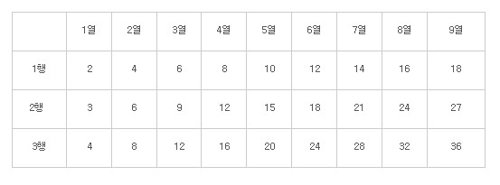
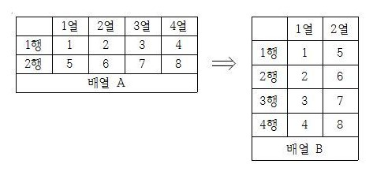
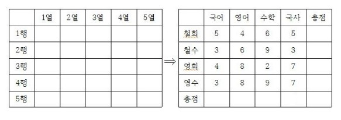
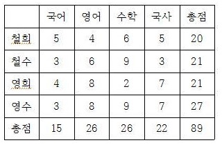

# 다차원 배열


## 목차

- [다차원 배열의 이해와 활용](#다차원-배열의-이해와-활용)
- [3차원 배열](#3차원-배열)


## 다차원 배열의 이해와 활용

다차원 배열은 2차원 이상의 배열을 의미한다. 즉 2차원, 3차원 배열을 총칭해서 다차원 배열이라 한다.

> 2차원, 3차원 배열? OK! 4차원, 5차원 배열? NO!

1차원 배열은 논리적으로 1차원의 형태를 띈다. 마찬가지로 2차원 3차원 배열은 논리적으로 각각 2차원과 3차원의 형태를 띤다.  
즉, 2차원 배열은 평면구조의 배열이고, 3차원 배열은 직육면체 구조의 배열이다.

C언어의 문법은  4차원 이상의 배열선언을 문법적으로 허용하고 있다.  
하지만 이는 불필요하기도 하고 논리적으로 이해하기도 어려운 형태의 배열이다. 따라서 다차원 배열은 2차원 배열과 3차원 배열을 의미하는 것으로 이해하면 된다.  
참고로 1차원, 2차원, 3차원 배열의 선언형태는 다음과 같다.

```c
int arrOneDim[10];			길이가 10인 1차원 int형 배열
int arrTwoDim[5][5];		가로, 세로의 길이가 각각 5인 2차원 int형 배열
int arrThreeDim[3][3][3];	가로, 세로, 높이의 길이가 각각 3인 3차원 int형 배열
```

이 중에서 실제로 많이 사용되는 것은 1차원 배열과 2차원 배열이다.  
따라서 사실상 2차원 배열이 다차원 배열을 대표한다고 보면 된다.


> 다차원 배열을 대표하는 2차원 배열의 선언

다음 두 2차원 배열의 선언을 보자.

```c
int arr1[3][4];			//세로가 3, 가로가 4인 int형 2차원 배열
int arr2[2][6];			//세로가 2, 가로가 6인 int형 2차원 배열
```

위에서 보이는 것처럼 2차원 배열의 선언 방식은 1차원 배열의 선언 방식과 매우 유사하다.  
다만 그 특성상 세로와 가로의 길이를 각각 명시하는 형태를 띨 뿐이다.  
정리하자면 배열의 이름이 arr이고 배열요소의 자료형이 TYPE이라 할 때, 2차원 배열의 선언 형태는 다음과 같다.

```c
TYPE arr[세로길이][가로길이]
```

이전에 sizeof 연산자의 피연산자로 배열의 이름이 오면, 배열의 크기가 바이트 단위로 계산되어서 반환됨을 설명하였다.  
그런데 이는 2차원 배열의 경우에도 해당이 되니, sizeof 연산자를 이용해서 2차원 배열의 크기를 계산해보도록 하겠다.


TwoDimArraySize.c

```c
#include <stdio.h>

int main(void)
{
    int arr1[3][4];
    int arr2[7][9];
    printf("세로3, 가로4: %d \n", sizeof(arr1));
    printf("세로7, 가로9: %d \n", sizeof(arr1));
    return 0;
}
```


실행 결과

```
세로3, 가로4: 48
세로7, 가로9: 252
```

3 x 4 x 4 는 48이고, 7 x 9 x 4는 252이다. 따라서 sizeof 연산자가 2차원 배열의 크기를 정확히 계산해서 반환하고 있음을 실행결과를 통해 확인할 수 있다.


> 2차원 배열요소의 접근

이름이 arr인 int형 배열을 대상으로 세로 N번째 위치(1부터 시작해서 N번째), 그리고 가로 M번째 위치(1부터 시작해서 M번째)에 저장된 값을 변경 및 참조하는 방법을 일반화하면 아래와 같다.

```c
arr[N-1][M-1] = 20;					// 세로 N, 가로 M의 위치에 정수 20을 저장
printf("%d", arr[N-1][M-1]);		// 세로 N, 가로 M의 위치에 저장된 값 출력
```


지금까지 이야기한 내용을 바탕으로 층별로 두 가구가 사는 4층짜리 빌라의 가구별 거주인원 수를 입력 받는 예제를 작성해보자.


PopuResearch.c

```c
#include <stdio.h>

int main(void)
{
	int villa[4][2];
    int popu, i, j;
    
    /* 가구별 거주 인원 입력 받기 */
    for(i=0; i<4; i++)
    {
        for(j=0; j<2; j++)
        {
            printf("%d층 %d호 인구수: ", i+1, j+1);
            scanf("%d", &villa[i][j]);
        }
	}
    
    /* 빌라의 층별 인구수 출력하기 */
    for(i=0; i<4; i++)
    {
        popu = 0;
        popu += villa[i][0];
        popu += villa[i][1];
        printf("%d층 인구수: %d \n", i+1, popu);
    }
    return 0;
}
```


실행 결과

```
1층 1호 인구수: 2
1층 2호 인구수: 4
2층 1호 인구수: 3
2층 2호 인구수: 5
3층 1호 인구수: 2
3층 2호 인구수: 6
4층 1호 인구수: 4
4층 2호 인구수: 3
1층 인구수: 6
2층 인구수: 8
3층 인구수: 8
4층 인구수: 7
```

참고로 위의 예제는 1차원 배열로도 구현이 가능하다. 하지만 이는 프로그램을 복잡하게 만들뿐이다.  
사실 모든 2차원 배열은 1차원 배열로 대신 할 수 있다. 그러나 그렇게 해서 얻게 되는 이점은 아무것도 없다.


> 2차원 배열의 메모리상 할당의 형태

2차원 배열은 물리적으로도 2차원의 형태로 존재할까? 이는 메모리의 주소 값을 통해서 알 수 있다.  
예제를 통해 알아보자.


TwoDimArrayAddr.c

```c
#include <stdio.h>

int main(void)
{
    int arr[3][2];
    int i, j;
    for(i=0; i<3; i++)
    {
        for(j=0; j<2; j++)
        {
            printf("%p \n", &arr[i][j]);
		}
    }
    return 0;
}
```


실행 결과

```
002AFD54
002AFD58
002AFD5C
002AFD60
002AFD64
002AFD68
```


> 2차원 배열 선언과 동시에 초기화하기

1차원 배열과 마찬가지로 2차원 배열도 선언과 동시에 초기화가 가능하다.

```c
int arr[3][3] = {
	{1, 2, 3},
	{4, 5, 6},
	{7, 8, 9}
};
```

위와 같이 초기화 리스트 안에는 행 단위로 초기화할 값들을 별도의 중괄호로 명시해야 한다.  
물론 모든 배열의 요소를 초기화 해야 하는 것은 아니다. 다음과 같이 일부 요소에 대해서는 초기화를 생략할 수  있다.  
그리고 이렇게 해서 비는 공간은 1차원 배열과 마찬가지로 0으로 초기화 된다.

```c
int arr[3][3] = {
	{1},
	{4, 5},
	{7, 8, 9}
};
```

마지막으로, 다음과 같이 하나의 중괄호 안에 초기화할 값을 순서대로 나열할 수도 있다.

```c
int arr[3][3] = {1, 2, 3, 4, 5, 6, 7};
```

그런데 이 경우에도 8번째 요소와 9번째 요소는 0으로 초기화가 이뤄지니, 이는 다음의 배열 선언과 동일한 결과로 이어진다.

```c
int arr[3][3] = {1, 2, 3, 4, 5, 6, 7, 0, 0};
```


이제 지금까지 설명한 초기화 관련내용의 확인을 위한 예제를 살펴보며 초기화를 마무리하겠다.


TwoDimArrayInit.c

```c
#include <stdio.h>

int main(void)
{
	int i, j;
	
	/* 2차원 배열 초기화의 예 1 */
	int arr1[3][3] = {
		{1, 2, 3},
		{4, 5, 6},
		{7, 8, 9}
	};
	
	/* 2차원 배열 초기화의 예 2 */
	int arr2[3][3] = {
		{1},
		{4, 5},
		{7, 8, 9}
	};
	
	/* 2차원 배열 초기화의 예 3 */
	int arr3[3][3] = {1, 2, 3, 4, 5, 6, 7};
	
	for(i=0; i<3; i++)
	{
		for (j=0; j < 3; j++)
			printf("%d ", arr1[i][j]);
		printf("\n");
	}
	printf("\n");
	
	for(i=0; i<3; i++)
	{
		for (j=0; j < 3; j++)
			printf("%d ", arr2[i][j]);
		printf("\n");
	}
	printf("\n");
	
	for(i=0; i<3; i++)
	{
		for (j=0; j < 3; j++)
			printf("%d ", arr3[i][j]);
		printf("\n");
	}
	return 0;
}
```


실행 결과

```c
1 2 3
4 5 6
7 8 9

1 0 0
4 5 0
7 8 9

1 2 3
4 5 6
7 0 0
```


> 배열의 크기를 알려주지 않고 초기화하기

1차원 배열 선언 시, 초기화 리스트가 존재한다면, 배열의 길이를 명시하지 않아도 되었다.  
이는 2차원 배열에서도 마찬가지이다.  
2차원 배열도 초기화 리스트가 존재한다면, 그 길이를 명시하지 않아도 된다. 단, 여기에는 제약사항이 있다.  
이와 관련해서 다음 문장을 보자.

```c
int arr[][] = {1, 2, 3, 4, 5, 6, 7, 8};
```

여러분이 컴파일러라면 위의 선언을 보면서 배열의 가로와 세로 길이를 정할 수 있겠는가?  
배열 요소의 수가 총 8개이므로 2x4 도 되고 4 x 2도 된다. 뿐만 아니라 1 x 8 도 되고 8 x 1도 될 수 있다.  
때문에 컴파일러는 에러 메세지를 출력한다.  
가로와 세로의 길이를 모두 예측하는 것은 불가능하니 하나를 가르쳐 줘야 한다.

```c
int arr1[][4] = {1, 2, 3, 4, 5, 6, 7, 8};
int arr2[][2] = {1, 2, 3, 4, 5, 6, 7, 8};
```

이제 예측이 가능하졌다. 이렇듯 2차원 배열을 선언과 동시에 초기화하는 경우에는 __배열의 세로길이만 생략이 가능하다.__


문제 1

가로의 길이가 9, 세로의 길이가 3인 int형 2차원 배열을 선언하여 구구단 중 2단, 3단, 4단을 다음과 같이 저장하자.



그리고 제대로 저장이 되었는지 확인하기 위한 출력을 진행하는 예제를 작성해보자.

[답안](./Chapter3Challenge/16-1.md)


문제 2

아래 그림과 관련해서 문제를 제시할 테니, 그림에서 제시하는 배열 A와 배열 B를 유심히 관찰하자.



위 그림의 형태대로 배열 A와 배열 B를 선언하자. 그리고 배열 A는 선언과 동시에 그림에서 명시하는 대로 초기화를 진행하자!  
그리고 배열 B도 위 그림에서 보이는 대로 초기화를 진행하되, 반드시 배열 A에 저장된 값을 이용해서 초기화를 진행해야 한다.

[답안](./Chapter3Challenge/16-2.md)


문제 3

성적관리 프로그램을 작성하자. 과목은 국어, 영어, 수학, 국사 이렇게 네 과목이고 학생은 철희, 철수, 영희, 영수 이렇게 네 사람이다.  
프로그램 사용자로부터 이 네 사람의 네 과목 점수를 입력 받는다. 그리고 미리 선언해 놓은 배열에 다음의 형태로 그 값을 저장해야 한다.



저장이 끝났다면, 개인별 총점과 과목별 총점을 계산해서 다음 그림에서 보이는 배열의 위치에 저장해야 한다.  
그리고 마지막에는 저장된 값의 검증을 위한 출력을 보여야 한다.



[답안](./Chapter3Challenge/16-3.md)


## 3차원 배열

3차원 배열은 실제로 매우 제한적인 상황에서 사용된다.  
그리고 2차원 배열을 정확히 이해하고 있다면, 3차원 배열과 관련해서는 추가적으로 알아야 할 것이 많지 않다.


> 3차원 배열의 논리적 구조

3차원 배열의 선언 예

```c
int arrr1[2][3][4];				// 높이 2, 세로 3, 가로 4인 int형 3차원 배열
double arr2[5][5][5];			// 높이, 세로, 가로가 모두 5인 double형 3차원 배열
```

이제 sizeof 연산자를 통해 3차원 배열의 크기를 확인해보자.


ThreeDimArraySize.c

```c
#include <stdio.h>

int main(void)
{
	int arr1[2][3][4];
	double arr2[5][5][5];
	printf("높이2, 세로3, 가로4 int형 배열: %d \n", sizeof(arr1));
	printf("높이5, 세로5, 가로5 double형 배열: %d \n", sizeof(arr2));
	return 0;
}
```


실행 결과

```
높이2, 세로3, 가로4 int형 배열: 96
높이5, 세로5, 가로5 double형 배열: 1000
```


2 x 3 x 4 x sizeof(int)는 96이고, 5 x 5 x 5 x sizeof(double)은 1000이다.  
따라서 위의 예제를 통해서 3차원 배열의 논리적으로 직육면체 형태의 배열임을 이해할 수 있다.


> 3차원 배열의 선언과 접근

높이 정보의 반영을 제외하면 3차원 배열의 선언 및 접근방법은 2차원 배열의 선언 및 접근방법과 차이를 보이지 않는다.  
그럼 간단한 예제를 통해서 3차원 배열의 선언과 접근의 방법을 살펴보자.  
다음 예제는 어느 고등학교 3학년 전체 학생의 국어와 수학점수를 반별로 구분하여 저장한 예를 보여준다.  
각 반별 학생수는 3명이고 학급의 수도 3개라고 가정한다.


ThreeDimArrayAccess.c

```c
#include <stdio.h>

int main(void)
{
	int mean = 0, i, j;
    int record[3][3][2] = {
        {
            {70, 80},		// A 학급 학생 1의 성적
            {94, 90},		// A 학급 학생 2의 성적
            {70, 85}		// A 학급 학생 3의 성적
        },
        {
            {83, 90},		// B 학급 학생 1의 성적
            {95, 60},		// B 학급 학생 2의 성적
            {90, 82}		// B 학급 학생 3의 성적
        }
        {
            {98, 89},		// C 학급 학생 1의 성적
            {99, 94},		// C 학급 학생 2의 성적
            {91, 87}		// C 학급 학생 3의 성적
        }
    };
    
    for (i = 0; i < 3; i++)
        for (j = 0; j < 2; j++)
            mean += record[0][i][j];
    printf("A 학급 전체 평균: %g \n", (double)mean/6);
    
    mean = 0;
    for (i = 0; i < 3; i++)
        for (j = 0; j < 2; j++)
            mean += record[1][i][j];
    printf("B학급 전체 평균: %g \n", (double)mean/6);
    
    mean = 0;
    for (i = 0; i < 3; i++)
        for (j = 0; j < 2; j++)
            mean += record[2][i][j];
    printf("C학급 전체 평균: %g \n", (double)mean/6);
    return 0;
}
```


실행 결과

```
A학급 전체 평균 : 81.5
B학급 전체 평균 : 83.3333
C학급 전체 평균 : 93
```

