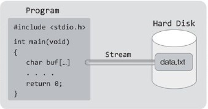
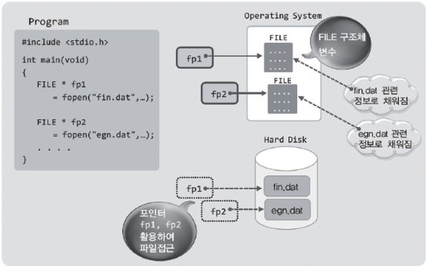
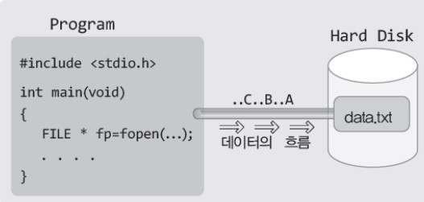
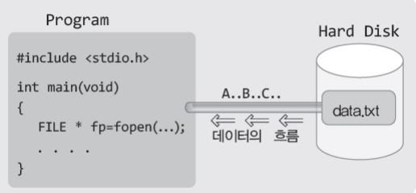

# 파일 입출력


## 목차

- [파일과 스트림(Stream), 그리고 기본적인 파일의 입출력](#파일과-스트림-stream---그리고-기본적인-파일의-입출력)
- [파일의 개방 모드(Mode)](#파일의-개방-모드-mode-)
- [파일 입출력 함수의 기본](#파일-입출력-함수의-기본)
- [텍스트 데이터와 바이너리 데이터를 동시에 입출력 하기](#텍스트-데이터와-바이너리-데이터를-동시에-입출력-하기)


## 파일과 스트림(Stream), 그리고 기본적인 파일의 입출력

이번 챕터에서 공부할 내용은 파일이다. 그런데 파일은 운영체제에 의해서 관리가 되기 때문에 운영체제와 파일의 관계를 이해하는 데서부터 시작할 필요가 있다.


> 저기 저 파일에 저장되어 있는 데이터를 읽고 싶어요.

프로그램상에서 파일에 저장되어 있는 데이터를 참조하길 원한다고(읽기 원한다고) 가정해 보자.  
이 때 제일먼저 해야 할 일은 무엇일까? 그것은 우리가 구현한 프로그램과 참조할 데이터가 저장되어 있는 파일 사이에 데이터가 이동할 수 있는 다리를 놓는 일이다.  
이러한 데이터 이동의 경로가 되는 다리를 가리켜 '스트림(stream)'이라 하는데, 스트림에 대해서는 앞서 Chapter 21에서 이미 설명한바 있다.  
즉 프로그램과 파일 사이에 스트림을 형성해야 데이터를 주고 받을 수 있다.



앞선 챕터에서도 언급했지만, 스트림이라는 것은 운영체제에 의해서 형성되는 소프트웨어적인 상태를 의미하는 것일 뿐, 실제로 위 그림과 같은 형태의 다리가 놓여지는 것은 아니다.  
따라서 프로그램과 파일 사이에 스트림이 형성되었다고 하면 다음과 같이 이해하기 바란다.

__파일로부터 데이터를 읽어 들일(파일에 데이터를 쓸) 기본적인 준비가 완료되었구나__

그런데 파일은 운영체제에 의해서 그 구조가 결정되고 관리되는 대상이기 때문에, 파일 뿐만 아니라 스트림의 형성도 운영체제의 몫임을 기억해야 한다.


> fopen 함수호출을 통한 파일과의 스트림 형성과 FILE 구조체

다음은 스트림을 형성할 때 호출하는 함수이다. 이 함수의 호출을 통해서 프로그램상에서 파일과의 스트림을 형성할 수 있다.

```c
#include <stdio.h>

FILE * fopen(const char * filename, const char * mode);
// 성공 시 해당 파일의 FILE 구조체 변수의 주소 값, 실패 시 NULL 포인터 반환
```

위 함수의 첫 번째 인자로는 스트림을 형성할 파일의 이름을, 두 번째 인자로는 형성할 스트림의 종류에 대한 정보를 문자열의 형태로 전달한다.  
그러면 이 함수는 해당 파일과의 스트림을 형성하고 스트림 정보를 FILE 구조체 변수에 담아서 그 변수의 주소 값을 반환한다.  
간단하게나마 fopen 함수에 대해서 소개를 했는데 많이 부족한 것이 사실이다. 그러나 이제부터 하나씩 알아가면 된다. 그럼 fopen 함수의 반환형을 다시 보자.  
FILE이라는 이름의 기본 자료형이 존재하지 않으니 이는 분명 구조체의 이름이다. 그렇다면 이 구조체는 어떻게 정의되어 있으며 무엇에 사용되는 것일까?  
사실 FILE 구조체가 어떻게 정의되어 있는지를 알 필요는 없다. FILE 구조체 변수의 맴버에 직접 접근 할 일이 없기 때문이다.  
위 함수가 반환하는 FILE 구조체의 포인터는 파일을 가리키기 위한 용도로 사용된다. 즉 이 포인터를 이용해서 파일에 데이터를 저장하거나 파일에 저장된 데이터를 읽게 된다. 따라서 FILE 구조체가 어떻게 정의되어 있는지를 알 필요는 없다.



위 그림은 프로그램 상에서 fopen 함수를 호출했을 때 일어나는 일들을 정리해 놓은 것이다. 위 그림에서 주목할 부분은 다음 세 가지이다.

- fopen 함수가 호출되면 FILE 구조체 변수가 생성된다.
- 생성된 FILE 구조체 변수에는 파일에 대한 정보가 담긴다.
- FILE 구조체의 포인터는 사실상 파일을 가리키는 '지시자'의 역할을 한다.

일단은 이 정도만 이해를 하자. 어차피 위의 그림은 fopen 함수를 호출하는 예제를 작성해봐야 완벽히 이해할 수 있다.


> 입력 스트림과 출력 스트림의 생성

스트림은 '한 방향으로 흐르는 데이터의 흐름'을 의미한다. 때문에 스트림은 데이터를 파일로부터 읽어 들이기 위한 '입력 스트림'과 데이터를 파일에 쓰기 위한 '출력 스트림'으로 구분된다.  
그렇다면 스트림의 형성을 위한 `fopen` 함수의 호출방법을 설명하겠다. `fopen` 함수를 호출할 때에는 다음 두 가지가 인자로 전달되어야 한다.

- 첫 번째 전달인자	        	스트림을 형성할 파일의 이름
- 두 번째 전달인자                형성하고자 하는 스트림의 종류

먼저 출력 스트림 형성을 요청하는 `fopen` 함수의 호출문을 보이겠다.

```c
FILE * fp = fopen("data.txt", "wt");			// 출력 스트림의 형성
```

이것이 의미하는 바는 다음과 같다.

__파일 data.txt와 스트림을 형성하되 wt 모드로 스트림을 형성해라__

위의 문장에서 말하는 'wt 모드의 스트림'은 '텍스트 데이터를 쓰기 위한 출력 스트림'을 뜻하는데, 이에 대해서는 뒤에 설명하겠다. 우선은 다음의 유형으로 출력 스트림이 형성된다는 사실에만 주목을 하자.



위의 그림에서 보이는 스트림은 출력 스트림이기 때문에 파일에 데이터를 쓸 수는 있어도 읽지는 못한다.  
만약에 파일로부터 데이터를 읽기 원한다면 다음의 문장을 통해서 별도로 입력 스트림을 형성해야 한다.

```c
FILE * fp = fopen("data.txt", "rt");			// 입력 스트림의 형성
```

이것이 의미하는 바는 다음과 같다.

__파일 data.txt와 스트림을 형성하되 rt 모드로 스트림을 형성해라__

위의 문장에서 말하는 'rt 모드의 스트림'은 '텍스트 데이터를 읽기 위한 입력 스트림'을 뜻하는데, 이 역시도 뒤에 설명하겠다. 일단은 입력 스트림이 형성된다는 사실에만 주목을 하자.



참고로 `fopen` 함수의 호출을 통해서 파일과의 스트림이 형성되었을 때 '파일이 개방(오픈)되었다'라고 표현하는 것이 일반적이다.


> 파일에 데이터를 써봅시다.

아직 `fopen` 함수의 두 번째 전달인자에 대해서는 설명하지 않았지만 "rt"를 전달함으로써 텍스트 데이터 입력용 스트림이, "wt"를 전달함으로써 텍스트 데이터 출력용 스트림이 형성된다는 사실 정도는 확인을 하였다.  
따라서 이번에는 실제로 스트림을 형성해서 파일에 데이터를 써보고자 한다. 그리고 이를 위해서 `fputc` 함수를 다음과 같이 호출할 것이다.

```c
fputc('A', fp);
```

파일대상의 `fputc` 함수에 대해서는 이후에 다시 설명을 하니, 여기서는 실제로 파일에 데이터가 저장되는지를 확인하는 도구로만 사용을 하자.  

FirstFileWrite.c

```c
#include <stdio.h>

int main(void)
{
    FILE * fp = fopen("data.txt", "wt");
    if(fp == NULL){
        puts("파일오픈 실패!");
        return -1;				// 비정상적 종료를 의미하기 위해서 -1을 반환
    }
    
    fputc('A', fp);
    fputc('B', fp);
    fputc('C', fp);
    fclose(fp);				// 스트림의 종료
    return 0;
}
```


위 예제 5행에서는 파일 data.txt와의 출력 스트림을 형성하고 있다. 이렇듯 출력 스트림을 형성하는 경우에는 해당 파일이 생성된다. 따라서 파일 data.txt가 생성됨을 확인할 수 있다.  
그런데 실행방법에 따라서, 그리고 실행환경 및 설정에 따라서 파일이 생성되는 위치는 달라진다.  
만약 이러한 숨바꼭질이 싫다면, 경로를 포함해서 다음과 같이 파일의 이름을 지정해도 된다.

```c
FILE * fp = fopen("C:\\Project\\data.txt", "wt");
```

물론 위와 같이 파일의 경로를 지정하려면 Project라는 디렉터리가 생성되어 있어야 한다. 그러면 해당 디렉터리에서 파일 data.txt가 생성됨을 확인할 수 있다.  
이렇게 해서 스트림이 형성되면, 이제부터 fp는 파일 data.txt를 지칭하는 포인터가 된다.  
따라서 다음의 문장이 실행되면,

```c
fputs('A', fp);
```

fp가 지칭하는 파일 data.txt에 문자 A가 저장된다. 이제 `fopen` 함수가 반환하는 FILE 구조체 포인터의 용도를 이해할 수 있지 않겠는가?  
이렇게 해서 문자 A, B, C를 저장한 다음에 마지막으로 14행의 `fclose` 함수가 호출되면 데이터는 안정적으로 저장이 되고, data.txt와 연결되었던 출력 스트림은 소멸이 된다.


> 스트림의 소멸을 요청하는 fclose 함수

위 예제에서 호출한 `fclose` 함수에 대해서 자세히 살펴보자.  
간단히 설명하면 `fclose` 함수는 `fopen` 함수의 반대 기능을 제공한다. `fopen` 함수가 스트림을 형성하는 함수라면, `fclose` 함수는 스트림을 해제하는 함수이다.  
다시 말해서 `fopen` 함수가 파일을 개방하는 함수라면, `fclose` 함수는 파일을 닫는 함수이다.

```c
#include <stdio.h>

int fclose(FILE * stream);
	// 성공 시 O, 실패 시 EOF를 반환
```

그렇다면 이렇게 fclose 함수의 호출을 통해서 개방되었던 파일을 닫아줘야 하는 이유는 무엇일까?  
여기에는 다음 두 가지 이유가 있다.

- 운영체제가 할당한 자원의 반환
- 버퍼링 되었던 데이터의 출력

함수의 호출을 통해서 스트림의 형성을 요청하는 것은 우리지만, 실제로 스트림을 형성하는 주체는 운영체제이다.  
그리고 운영체제는 스트림의 형성을 위해서 시스템의 자원(주로 메모리)을 할당한다. 그런데 이 자원은 파일을 닫아주지 않으면 할당된 채로 남아있게 되어, 그만큼의 자원손실을 초래하기 때문에 파일의 사용이 끝나는 즉시 `fclose` 함수를 호출해서 자원을 반환해줄 필요가 있다.  
그럼 이제 `fclose` 함수를 호출해야 하는 두 번째 이유를 알아보자. 앞에서 얘기한, 콘솔 스트림의 중간에 존재하는 입력버퍼와 출력버퍼를 기억하는가? 이와 마찬가지로 파일 스트림의 경우에도 중간에 입력버퍼와 출력버퍼가 존재한다.


위 그림에서 보이듯이 운영체제는 프로그램과 파일 사이에 입출력 버퍼를 뒤서 성능의 향상을 도모하고 있다.  
때문에 `fputc`와 같은 함수의 호출로 데이터를 파일로 전송한다고 해서 파일에 바로 저장 되는 것이 아니라, 일단은 출력버퍼에 저장되었다가 운영체제가 정해놓은 버퍼링 방식에 따라서 뒤늦게 파일에 저장이 된다.  
그런데 이러한 버퍼링 방식이 지니는 문제점이 하나 있다. 예를 들어서 문자 A와 B가 출력버퍼에 존재하는 상태에서(파일에 저장되기 직전의 상태에서) 컴퓨터의 전원이 꺼졌다고 가정해 보자.  
문자 A와 B는 파일에 저장이 되었을까? 저장되지 않는다. 그러나 `fclose` 함수의 호출을 통해서 파일을 닫아주면 출력버퍼에 저장되어 있던 데이터가 파일로 이동하면서 출력버퍼는 비워지게 된다.  
물론 그 이후에는 컴퓨터의 전원이 꺼져도 파일에 저장된 데이터는 소멸되지 않는다. 때문에 사용이 끝난 파일은 곧바로 `fclose` 함수를 호출해 주는 것이 좋다.


>4-1에서 호출한 적 있는 fflush 함수

버퍼링 얘기가 나왔으니 4-1에서 소개한 `fflush` 함수에 대해서도 정리를 하자. 스트림을 종료하지 않고 버퍼만 비우고 싶을 때에는 다음 `fflush` 함수를 호출하면 된다.

```c
#include <stdio.h>

int fflush(FILE * stream);
	// 함수호출 성공 시 O, 실패 시 EOF 반환
```

참고로, 4-1에서 입출력 버퍼를 비우는 것에 관련해서 다음 사실을 설명한바 있다.

- 출력버퍼를 비운다는 것은 출력버퍼에 저장된 데이터를 목적지로 전송한다는 의미
- 입력버퍼를 비운다는 것은 입력버퍼에 저장된 데이터를 소멸시킨다는 의미
- fflush 함수는 출력버퍼를 비우는 함수이다.
- fflush 함수는 입력버퍼를 대상으로 호출할 수 없다.

그리고 위의 내용은 파일 스트림에도 그대로 적용이 된다. 즉 다음과 같이 파일의 출력버퍼를 비울 수 있다. 그러면 출력버퍼에 저장된 데이터가 실제로 파일에 저장된다.

```c
int main(void)
{
    FILE * fp = fopen("data.txt", "wt");		// 출력 스트림 형성
    ....
    flush(fp);		// 출력 버퍼를 비우라는 요청!
    ....
}
```

이렇듯 `fflush` 함수는 출력버퍼를 위한 함수이다. 따라서 다음과 같은 의문을 가질 수 있다.

__그럼 파일 스트림의 입력버퍼는 어떻게 비우는가?__

그런데 파일 스트림의 입력버퍼를 비우는 함수는 필요가 없다. 파일에 저장된 데이터는 원할 때 언제든지 읽을 수 있을 뿐만 아니라(읽혀진 데이터는 입력버퍼에서 지워진다.),  
파일대상의 입력버퍼를 비워야만 하는 상황이라는 것이 특별히 존재하지 않기 때문이다.


> 파일로부터 데이터를 읽어 봅시다.

이번에는 예제 FirstFileWrite.c의 실행을 통해서 만든 파일 data.txt를 열어서 그 안에 저장된 문자를 읽어들이는 프로그램을 작성해 볼 텐데,  
이를 위해서 fgetc 함수를 다음의 형태로 호출할 것이다.

```c
int ch = fgetc(fp);
```

`fgetc` 함수는 파일에 저장된 문자 하나를 반환하는 함수로서 자세한 설명은 이후에 다시 진행하겠으니,  
여기서는 위의 함수호출로 인하여 FILE 구조체의 포인터 fp가 지칭하는 파일에 저장된 문자 하나가 반환되어 변수 ch에 저장된다는 사실만을 기억하고 다음 예제를 살펴보자.


FirstFileRead.c

```c
#include <stdio.h>

int main(void)
{
    int ch, i;
    FILE * fp = fopen("data.txt", "rt");
    if(fp==NULL){
        puts("파일오픈 실패!");
        return -1;
    }
    
    for(i=0; i<3; i++)
    {
        ch = fgetc(fp);
        printf("%c \n", ch);
    }
    fclose(fp);
    return 0;
}
```


실행 결과

```
A
B
C
```

예제의 실행환경 및 설정 그리고 실행방법을 달리하지 않는다면, `fopen` 함수가 파일을 생성하는 위치와 찾는 위치는 동일하며 또 달라지지 않는다.  
따라서 앞서 보인 예제에서 생성한 파일을 옮기지 않았다면 6행의 `fopen` 함수호출을 통해서 문제없이 파일을 찾을 수 있다.


## 파일의 개방 모드(Mode)

