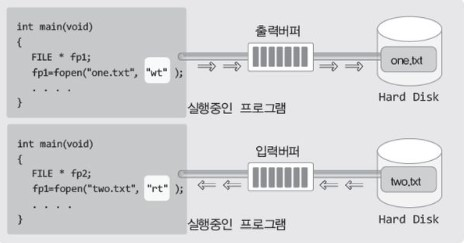

# 파일 입출력


## 목차

- [파일과 스트림(Stream), 그리고 기본적인 파일의 입출력](#파일과-스트림-stream---그리고-기본적인-파일의-입출력)
- [파일의 개방 모드(Mode)](#파일의-개방-모드-mode-)
- [파일 입출력 함수의 기본](#파일-입출력-함수의-기본)
- [텍스트 데이터와 바이너리 데이터를 동시에 입출력 하기](#텍스트-데이터와-바이너리-데이터를-동시에-입출력-하기)


## 파일과 스트림(Stream), 그리고 기본적인 파일의 입출력

이번 챕터에서 공부할 내용은 파일이다. 그런데 파일은 운영체제에 의해서 관리가 되기 때문에 운영체제와 파일의 관계를 이해하는 데서부터 시작할 필요가 있다.


> 저기 저 파일에 저장되어 있는 데이터를 읽고 싶어요.

프로그램상에서 파일에 저장되어 있는 데이터를 참조하길 원한다고(읽기 원한다고) 가정해 보자.  
이 때 제일먼저 해야 할 일은 무엇일까? 그것은 우리가 구현한 프로그램과 참조할 데이터가 저장되어 있는 파일 사이에 데이터가 이동할 수 있는 다리를 놓는 일이다.  
이러한 데이터 이동의 경로가 되는 다리를 가리켜 '스트림(stream)'이라 하는데, 스트림에 대해서는 앞서 Chapter 21에서 이미 설명한바 있다.  
즉 프로그램과 파일 사이에 스트림을 형성해야 데이터를 주고 받을 수 있다.


앞선 챕터에서도 언급했지만, 스트림이라는 것은 운영체제에 의해서 형성되는 소프트웨어적인 상태를 의미하는 것일 뿐, 실제로 위 그림과 같은 형태의 다리가 놓여지는 것은 아니다.  
따라서 프로그램과 파일 사이에 스트림이 형성되었다고 하면 다음과 같이 이해하기 바란다.

__파일로부터 데이터를 읽어 들일(파일에 데이터를 쓸) 기본적인 준비가 완료되었구나__

그런데 파일은 운영체제에 의해서 그 구조가 결정되고 관리되는 대상이기 때문에, 파일 뿐만 아니라 스트림의 형성도 운영체제의 몫임을 기억해야 한다.


> fopen 함수호출을 통한 파일과의 스트림 형성과 FILE 구조체

다음은 스트림을 형성할 때 호출하는 함수이다. 이 함수의 호출을 통해서 프로그램상에서 파일과의 스트림을 형성할 수 있다.

```c
#include <stdio.h>

FILE * fopen(const char * filename, const char * mode);
// 성공 시 해당 파일의 FILE 구조체 변수의 주소 값, 실패 시 NULL 포인터 반환
```

위 함수의 첫 번째 인자로는 스트림을 형성할 파일의 이름을, 두 번째 인자로는 형성할 스트림의 종류에 대한 정보를 문자열의 형태로 전달한다.  
그러면 이 함수는 해당 파일과의 스트림을 형성하고 스트림 정보를 FILE 구조체 변수에 담아서 그 변수의 주소 값을 반환한다.  
간단하게나마 fopen 함수에 대해서 소개를 했는데 많이 부족한 것이 사실이다. 그러나 이제부터 하나씩 알아가면 된다. 그럼 fopen 함수의 반환형을 다시 보자.  
FILE이라는 이름의 기본 자료형이 존재하지 않으니 이는 분명 구조체의 이름이다. 그렇다면 이 구조체는 어떻게 정의되어 있으며 무엇에 사용되는 것일까?  
사실 FILE 구조체가 어떻게 정의되어 있는지를 알 필요는 없다. FILE 구조체 변수의 맴버에 직접 접근 할 일이 없기 때문이다.  
위 함수가 반환하는 FILE 구조체의 포인터는 파일을 가리키기 위한 용도로 사용된다. 즉 이 포인터를 이용해서 파일에 데이터를 저장하거나 파일에 저장된 데이터를 읽게 된다. 따라서 FILE 구조체가 어떻게 정의되어 있는지를 알 필요는 없다.


위 그림은 프로그램 상에서 fopen 함수를 호출했을 때 일어나는 일들을 정리해 놓은 것이다. 위 그림에서 주목할 부분은 다음 세 가지이다.

- fopen 함수가 호출되면 FILE 구조체 변수가 생성된다.
- 생성된 FILE 구조체 변수에는 파일에 대한 정보가 담긴다.
- FILE 구조체의 포인터는 사실상 파일을 가리키는 '지시자'의 역할을 한다.

일단은 이 정도만 이해를 하자. 어차피 위의 그림은 fopen 함수를 호출하는 예제를 작성해봐야 완벽히 이해할 수 있다.


> 입력 스트림과 출력 스트림의 생성

스트림은 '한 방향으로 흐르는 데이터의 흐름'을 의미한다. 때문에 스트림은 데이터를 파일로부터 읽어 들이기 위한 '입력 스트림'과 데이터를 파일에 쓰기 위한 '출력 스트림'으로 구분된다.  
그렇다면 스트림의 형성을 위한 `fopen` 함수의 호출방법을 설명하겠다. `fopen` 함수를 호출할 때에는 다음 두 가지가 인자로 전달되어야 한다.

- 첫 번째 전달인자	        	스트림을 형성할 파일의 이름
- 두 번째 전달인자                형성하고자 하는 스트림의 종류

먼저 출력 스트림 형성을 요청하는 `fopen` 함수의 호출문을 보이겠다.

```c
FILE * fp = fopen("data.txt", "wt");			// 출력 스트림의 형성
```

이것이 의미하는 바는 다음과 같다.

__파일 data.txt와 스트림을 형성하되 wt 모드로 스트림을 형성해라__

위의 문장에서 말하는 'wt 모드의 스트림'은 '텍스트 데이터를 쓰기 위한 출력 스트림'을 뜻하는데, 이에 대해서는 뒤에 설명하겠다. 우선은 다음의 유형으로 출력 스트림이 형성된다는 사실에만 주목을 하자.


위의 그림에서 보이는 스트림은 출력 스트림이기 때문에 파일에 데이터를 쓸 수는 있어도 읽지는 못한다.  
만약에 파일로부터 데이터를 읽기 원한다면 다음의 문장을 통해서 별도로 입력 스트림을 형성해야 한다.

```c
FILE * fp = fopen("data.txt", "rt");			// 입력 스트림의 형성
```

이것이 의미하는 바는 다음과 같다.

__파일 data.txt와 스트림을 형성하되 rt 모드로 스트림을 형성해라__

위의 문장에서 말하는 'rt 모드의 스트림'은 '텍스트 데이터를 읽기 위한 입력 스트림'을 뜻하는데, 이 역시도 뒤에 설명하겠다. 일단은 입력 스트림이 형성된다는 사실에만 주목을 하자.


참고로 `fopen` 함수의 호출을 통해서 파일과의 스트림이 형성되었을 때 '파일이 개방(오픈)되었다'라고 표현하는 것이 일반적이다.


> 파일에 데이터를 써봅시다.

아직 `fopen` 함수의 두 번째 전달인자에 대해서는 설명하지 않았지만 "rt"를 전달함으로써 텍스트 데이터 입력용 스트림이, "wt"를 전달함으로써 텍스트 데이터 출력용 스트림이 형성된다는 사실 정도는 확인을 하였다.  
따라서 이번에는 실제로 스트림을 형성해서 파일에 데이터를 써보고자 한다. 그리고 이를 위해서 `fputc` 함수를 다음과 같이 호출할 것이다.

```c
fputc('A', fp);
```

파일대상의 `fputc` 함수에 대해서는 이후에 다시 설명을 하니, 여기서는 실제로 파일에 데이터가 저장되는지를 확인하는 도구로만 사용을 하자.  

FirstFileWrite.c

```c
#include <stdio.h>

int main(void)
{
    FILE * fp = fopen("data.txt", "wt");
    if(fp == NULL){
        puts("파일오픈 실패!");
        return -1;				// 비정상적 종료를 의미하기 위해서 -1을 반환
    }
    
    fputc('A', fp);
    fputc('B', fp);
    fputc('C', fp);
    fclose(fp);				// 스트림의 종료
    return 0;
}
```


위 예제 5행에서는 파일 data.txt와의 출력 스트림을 형성하고 있다. 이렇듯 출력 스트림을 형성하는 경우에는 해당 파일이 생성된다. 따라서 파일 data.txt가 생성됨을 확인할 수 있다.  
그런데 실행방법에 따라서, 그리고 실행환경 및 설정에 따라서 파일이 생성되는 위치는 달라진다.  
만약 이러한 숨바꼭질이 싫다면, 경로를 포함해서 다음과 같이 파일의 이름을 지정해도 된다.

```c
FILE * fp = fopen("C:\\Project\\data.txt", "wt");
```

물론 위와 같이 파일의 경로를 지정하려면 Project라는 디렉터리가 생성되어 있어야 한다. 그러면 해당 디렉터리에서 파일 data.txt가 생성됨을 확인할 수 있다.  
이렇게 해서 스트림이 형성되면, 이제부터 fp는 파일 data.txt를 지칭하는 포인터가 된다.  
따라서 다음의 문장이 실행되면,

```c
fputs('A', fp);
```

fp가 지칭하는 파일 data.txt에 문자 A가 저장된다. 이제 `fopen` 함수가 반환하는 FILE 구조체 포인터의 용도를 이해할 수 있지 않겠는가?  
이렇게 해서 문자 A, B, C를 저장한 다음에 마지막으로 14행의 `fclose` 함수가 호출되면 데이터는 안정적으로 저장이 되고, data.txt와 연결되었던 출력 스트림은 소멸이 된다.


> 스트림의 소멸을 요청하는 fclose 함수

위 예제에서 호출한 `fclose` 함수에 대해서 자세히 살펴보자.  
간단히 설명하면 `fclose` 함수는 `fopen` 함수의 반대 기능을 제공한다. `fopen` 함수가 스트림을 형성하는 함수라면, `fclose` 함수는 스트림을 해제하는 함수이다.  
다시 말해서 `fopen` 함수가 파일을 개방하는 함수라면, `fclose` 함수는 파일을 닫는 함수이다.

```c
#include <stdio.h>

int fclose(FILE * stream);
	// 성공 시 O, 실패 시 EOF를 반환
```

그렇다면 이렇게 fclose 함수의 호출을 통해서 개방되었던 파일을 닫아줘야 하는 이유는 무엇일까?  
여기에는 다음 두 가지 이유가 있다.

- 운영체제가 할당한 자원의 반환
- 버퍼링 되었던 데이터의 출력

함수의 호출을 통해서 스트림의 형성을 요청하는 것은 우리지만, 실제로 스트림을 형성하는 주체는 운영체제이다.  
그리고 운영체제는 스트림의 형성을 위해서 시스템의 자원(주로 메모리)을 할당한다. 그런데 이 자원은 파일을 닫아주지 않으면 할당된 채로 남아있게 되어, 그만큼의 자원손실을 초래하기 때문에 파일의 사용이 끝나는 즉시 `fclose` 함수를 호출해서 자원을 반환해줄 필요가 있다.  
그럼 이제 `fclose` 함수를 호출해야 하는 두 번째 이유를 알아보자. 앞에서 얘기한, 콘솔 스트림의 중간에 존재하는 입력버퍼와 출력버퍼를 기억하는가? 이와 마찬가지로 파일 스트림의 경우에도 중간에 입력버퍼와 출력버퍼가 존재한다.



위 그림에서 보이듯이 운영체제는 프로그램과 파일 사이에 입출력 버퍼를 뒤서 성능의 향상을 도모하고 있다.  
때문에 `fputc`와 같은 함수의 호출로 데이터를 파일로 전송한다고 해서 파일에 바로 저장 되는 것이 아니라, 일단은 출력버퍼에 저장되었다가 운영체제가 정해놓은 버퍼링 방식에 따라서 뒤늦게 파일에 저장이 된다.  
그런데 이러한 버퍼링 방식이 지니는 문제점이 하나 있다. 예를 들어서 문자 A와 B가 출력버퍼에 존재하는 상태에서(파일에 저장되기 직전의 상태에서) 컴퓨터의 전원이 꺼졌다고 가정해 보자.  
문자 A와 B는 파일에 저장이 되었을까? 저장되지 않는다. 그러나 `fclose` 함수의 호출을 통해서 파일을 닫아주면 출력버퍼에 저장되어 있던 데이터가 파일로 이동하면서 출력버퍼는 비워지게 된다.  
물론 그 이후에는 컴퓨터의 전원이 꺼져도 파일에 저장된 데이터는 소멸되지 않는다. 때문에 사용이 끝난 파일은 곧바로 `fclose` 함수를 호출해 주는 것이 좋다.


>4-1에서 호출한 적 있는 fflush 함수

버퍼링 얘기가 나왔으니 4-1에서 소개한 `fflush` 함수에 대해서도 정리를 하자. 스트림을 종료하지 않고 버퍼만 비우고 싶을 때에는 다음 `fflush` 함수를 호출하면 된다.

```c
#include <stdio.h>

int fflush(FILE * stream);
	// 함수호출 성공 시 O, 실패 시 EOF 반환
```

참고로, 4-1에서 입출력 버퍼를 비우는 것에 관련해서 다음 사실을 설명한바 있다.

- 출력버퍼를 비운다는 것은 출력버퍼에 저장된 데이터를 목적지로 전송한다는 의미
- 입력버퍼를 비운다는 것은 입력버퍼에 저장된 데이터를 소멸시킨다는 의미
- fflush 함수는 출력버퍼를 비우는 함수이다.
- fflush 함수는 입력버퍼를 대상으로 호출할 수 없다.

그리고 위의 내용은 파일 스트림에도 그대로 적용이 된다. 즉 다음과 같이 파일의 출력버퍼를 비울 수 있다. 그러면 출력버퍼에 저장된 데이터가 실제로 파일에 저장된다.

```c
int main(void)
{
    FILE * fp = fopen("data.txt", "wt");		// 출력 스트림 형성
    ....
    flush(fp);		// 출력 버퍼를 비우라는 요청!
    ....
}
```

이렇듯 `fflush` 함수는 출력버퍼를 위한 함수이다. 따라서 다음과 같은 의문을 가질 수 있다.

__그럼 파일 스트림의 입력버퍼는 어떻게 비우는가?__

그런데 파일 스트림의 입력버퍼를 비우는 함수는 필요가 없다. 파일에 저장된 데이터는 원할 때 언제든지 읽을 수 있을 뿐만 아니라(읽혀진 데이터는 입력버퍼에서 지워진다.),  
파일대상의 입력버퍼를 비워야만 하는 상황이라는 것이 특별히 존재하지 않기 때문이다.


> 파일로부터 데이터를 읽어 봅시다.

이번에는 예제 FirstFileWrite.c의 실행을 통해서 만든 파일 data.txt를 열어서 그 안에 저장된 문자를 읽어들이는 프로그램을 작성해 볼 텐데,  
이를 위해서 fgetc 함수를 다음의 형태로 호출할 것이다.

```c
int ch = fgetc(fp);
```

`fgetc` 함수는 파일에 저장된 문자 하나를 반환하는 함수로서 자세한 설명은 이후에 다시 진행하겠으니,  
여기서는 위의 함수호출로 인하여 FILE 구조체의 포인터 fp가 지칭하는 파일에 저장된 문자 하나가 반환되어 변수 ch에 저장된다는 사실만을 기억하고 다음 예제를 살펴보자.


FirstFileRead.c

```c
#include <stdio.h>

int main(void)
{
    int ch, i;
    FILE * fp = fopen("data.txt", "rt");
    if(fp==NULL){
        puts("파일오픈 실패!");
        return -1;
    }
    
    for(i=0; i<3; i++)
    {
        ch = fgetc(fp);
        printf("%c \n", ch);
    }
    fclose(fp);
    return 0;
}
```


실행 결과

```
A
B
C
```

예제의 실행환경 및 설정 그리고 실행방법을 달리하지 않는다면, `fopen` 함수가 파일을 생성하는 위치와 찾는 위치는 동일하며 또 달라지지 않는다.  
따라서 앞서 보인 예제에서 생성한 파일을 옮기지 않았다면 6행의 `fopen` 함수호출을 통해서 문제없이 파일을 찾을 수 있다.


## 파일의 개방 모드(Mode)

앞선 예제에서는 `fopen` 함수의 두 번째 인자로 "wt"와 "rt"를 전달하여 스트림을 형성하였다. 하지만 형성할 수 있는 스트림의 종류는 훨씬 더 다양한데, 기본적으로 다음 두 가지 기준을 통해서 스트림을 구분하게 된다.

- 기준1		읽기 위한 스트림이냐? 쓰기 위한 스트림이냐?
- 기준2        텍스트 데이터를 위한 스트림이냐? 바이너리 데이터를 위한 스트림이냐?


> 스트림을 구분하는 기준1: 읽기 위한 스트림? 쓰기 위한 스트림?

스트림을 구분하는 기준은 두 가지인데, 이 중에서 데이터의 이동방향을 기준으로 다음과 같이 네 가지로 구분할 수 있다.

- 데이터 READ 스트림					읽기만 가능
- 데이터 WRITE 스트림                  쓰기만 가능
- 데이터 APPEND 스트림              쓰되 덧붙여 쓰기만 가능
- 데이터 READ/WRITE 스트림       읽기, 쓰기 모두 가능

그러나 C 언어는 이를 바탕으로 총 6가지로 스트림을 세분화한다. 그리고 이 6가지는 다음과 같다.


| 모드(mode) |        스트림의 성격         | 파일이 없으면 |
| :--------: | :--------------------------: | :-----------: |
|     r      |          읽기 가능           |     에러      |
|     w      |          쓰기 가능           |     생성      |
|     a      | 파일의 끝에 덧붙여 쓰기 가능 |     생성      |
|     r+     |        읽기/쓰기 가능        |     에러      |
|     w+     |        읽기/쓰기 가능        |     생성      |
|     a+     |    읽기/덧붙여 쓰기 가능     |     생성      |


위 표를 참조하여 필요로 하는 스트림의 특성과 일치하는 '파일의 개방 모드(mode)'를 선택하면 된다. 그리고 모드의 이름이 `fopen` 함수의 두 번째 인자가 된다.  
그런데 다음 두 가지 사실을 기억해 놓으면 선택이 한결 수월하다.

- 모드의 +는 읽기, 쓰기가 모두 가능한 스트림의 형성을 의미한다.
- 모드의 a는 쓰기가 가능한 스트림을 형성하는데, 여기서 말하는 쓰기는 덧붙이기이다.

__*파일의 개방 모드 중 r+, w+, a+는 읽기와 동시에 쓰기가 간으하므로 더 좋은 모드라고 생각할 수 있다.  __
__그러나 이러한 모드를 기반으로 작업하는 경우에는 읽기에서 쓰기, 그리고 쓰기에서 읽기로 작업을 변경할 때마다 메모리 버퍼를 비워줘야 하는 등의 불편함과 더불어 잘못된 사용의 위험성도 따른다.  
그래서 r, w, a 중에서 하나를 선택하여 스트림을 형성하는 것이 좋으며, 이것이 보다 일반적인 선택이다.__


> 텍스트 파일과 바이너리 파일

이어서 스트림을 구분하는 두 번째 기준에 대한 설명을 시작하겠다. 그리고 이를 위해서 파일에 담을 수 있는 데이터들의 유형을 나열해 보았다.

- 개인이 소유하는 도서의 목록                                문자 데이터
- 슈파마켓의 물품 가격                                            문자 데이터
- 제임스 캐머런 감독의 타이타닉 영상파일           바이너리 데이터
- 소녀시대의 히트곡 음원파일                                바이너리 데이터

정리하면, 사람이 인식할 수 있는 문자를 담고 있는 파일을 가리켜 '텍스트 파일(text file)'이라 하며, 그 이외에 컴퓨터가 인식할 수 있는 데이터를 담고 있는 파일을 가리켜 '바이너리 파일(binary file)'이라 한다.  
그렇다면 데이터의 입출력을 위해서 스트림을 형성할 때 이와 관련해서 특별히 신경 쓸 부분은 무엇일까? 그것은 바로 '문장의 끝을 의미하는 개행의 표현방식'이다.


> 개행이 \n 아니라고요?

개행은 일반적인 문자 데이터와 성격이 조금 다르다. 개행은 줄이 바뀌었다는 일종의 현상이지 그 자체가 하나의 데이터로 존재하는 대상은 아니기 때문이다.  
예를 들어서 누구나 한 장의 흰 종이에 문자 A 하나만을 표시할 수는 있다. 그러나 그 누구도 아무런 약속 없이 흰 종이에 개행 하나만을 표시할 수는 없다.  
그래서 C언어에서는 개행을 `\n`으로 표현하도록 약속하였다. 그런데 중요한 사실은, 이는 모든 컴퓨터 환경에서의 약속이 아닌 C언어만의 약속이라는 점이다.

__C언어에서는 개행은 \n으로 표시합니다. 그런데 이는 C언어만의 약속입니다.__

그렇다면 다른 환경에서는 개행을 어떻게 표시할까? 개행에 대한 몇몇 약속을 소개하면 다음과 같다.

- MS-DOS(Windows)의 파일 내 개행				\r\n
- MAC(Mackintosh)의 파일 내 개행                  \r
- Unix 계열의 파일 내 개행                                \n

따라서 Windows 기반의 편집기는 파일에 \r과 \n이 나란히 등장할 때 개행으로 인식을 하고, 매킨토시 기반의 편집기는 파일에 \r이 등장할 때 개행으로 인식을 한다.(X이후의 맥은 \n)  
이렇듯 개행의 표현은 운영체제마다 차이가 있기 때문에 개행 문자가 포함되는 텍스트 데이터의 저장에는 주의가 필요하다.  
C언어에서 개행을 의미하는 문자 \n을 그대로 파일에 저장하고, 이 파일을 Windows나 Mac의 편집기로 열어보면 \n이 개행으로 표시되지 않음을 확인할 수 있다.  
물론 Unix는 C언어와 마찬가지로 \n을 개행으로 인식하므로, Unix 계열의 편집기에서는 개행으로 확인이 된다. 그렇다면 개행의 표시방법이 C언어와 다른 운영체제에서는 개행 정보를 파일에 어떻게 저장해야 할까?  
이를 위해서는 다음 그림에서 보이는 형태의 변환이 필요하다.


위의 그림에서 보이는 바와 같이 C 프로그램의 실행과정에서 `\n`이 Windows 파일에 저장될 때는 `\r\n` 으로, 그리고 Mac의 파일에 저장될 때에는 `\r`로 저장되어야 해당 운영체제에서 개행으로 인식이 된다.  
그런데 막상 이러한 형태의 변환을 직접 하려니 귀찮다는 생각이 들지 않을 수 없다. 그렇다면 파일을 텍스트 모드로 개방하면 된다.


> 스트림을 구분하는 기준2: 텍스트 모드와 바이너리 모드

파일을 텍스트 모드로 개방하면 바로 위에서 말한 형태의 변환이 자동으로 이뤄진다.  
예를 들면, Windows를 기반으로는 다음 두 가지의 변환이 자동으로 이뤄진다.

__C 프로그램에서 \n을  파일에 저장하면 \r\n으로 변환되어 저장됨__

__파일에 저장된 \r\n을 C 프로그램상에서 읽으면 \n으로 변환되어 읽혀짐__

때문에 우리가 직접개행 문자의 변환을 신경 쓸 필요가 없다. 그저 텍스트 모드로 파일을 개방만하면된다.  
그리고 텍스트 모드의 파일 개방을 위해서는 `fopen` 함수의 두 번째 인자로 다음 중 하나를 전달해야 한다.

__rt, wt, at, r+t, w+t, a+t__

이는 앞서 표에서 정리한 파일 개방 모드에 텍스트 모드를 의미하는 t가 붙은 형태이다.  
반대로 바이너리 데이터를 저장하고 있는 파일의 경우에는 이러한 형태의 변환이 일어나면 안되기 때문에(아무런 변환도 일어나면 안되기 때문에) 바이너리 모드로 파일을 개방해야 한다.  
그리고 이를 위해서는 `fopen` 함수의 두 번째 인자로 다음 중 하나를 전달해야 한다.

__rb, wb, ab, r+b, w+b, a+b__

이 역시 앞선 표에서 정리한 개방 모드에 바이너리 모드를 의미하는 b가 붙은 형태이다.  
참고로 개방 모드에 t도 b도 붙여주지 않으면 파일은 텍스트 모드로 개방된다는 사실도 함께 알아두기 바란다.  
정리하면, 바이너리 모드로 파일을 개방하면 아무런 변환도 발생하지 않는다.  
그러나 텍스트 모드로 파일을 개방하면 운영체제에 따른 표현 차로 인한 변환이 발생한다.


## 파일 입출력 함수의 기본

파일의 개방 모드에 대한 정리를 끝냈으니, 개방된 파일 대상의 데이터 입력 및 출력 방법을 살펴볼 차례이다.


> 4-1에서 학습한 파일 입출력 함수들

앞서 4-1에서 다음 함수들에 대해 설명한바 있다.

```c
int fputc(int c, FILE * stream);				// 문자 출력
int fgetc(FILE * stream);						// 문자 입력
int fputs(const char * s, FILE * stream);		// 문자열 출력
char * fgets(char * s, int n, FILE * stream);	// 문자열 입력
```

당시에는 위 함수들의 두 번째 또는 세 번째 매개변수 stream에 표준 입출력을 의미하는 `stdin` 이나 `stdout` 을 인자로 전달함으로써 키보드와 모니터를 대상으로 입출력을 진행하였다.  
그러나 매개변수의 형이 의미하듯이 매개변수 stream에 FILE 구조체의 포인터를 인자로 전달하여 파일대상의 입출력을 진행할 수 있다.  
당시에 위의 함수들이 파일과 관련 있음을 수 차례 언급했음을 기억하자. 그럼 예제를 통해서 위의 함수들을 기반으로 파일 입출력을 진행해 보겠다. 먼저 파일을 생성해서 문자와 문자열을 저장해보자.


TextDataFileWrite.c

```c
#include <stdio.h>

int main(void)
{
    FILE * fp = fopen("simple.txt", "wt");
    if(fp == NULL) {
        puts("파일오픈 실패!");
        return -1;
    }
    
    fputc('A', fp);
    fputc('B', fp);
    fputs("My name is Hong \n", fp);
    fputs("Your name is Yoon \n", fp);
    fclose(fp);
    return 0;
}
```

위 예제의 13, 14행에서는 문자열을 출력하고 있으며, 그 문자열에는 개행문자도 포함되어 있다. 따라서 5행에서 보이듯이 반드시 텍스트 모드로 파일을 개방해야 한다.  
그럼 이어서 위 예제의 실행을 통해서 생성된 파일에 저장된 데이터를 읽어보겠다.


TextDataFileRead.c

```c
#include <stdio.h>

int main(void)
{
	char str[30];
    int ch;
    FILE * fp = fopen("simple.txt", "rt");
    if(fp == NULL) {
		puts("파일오픈 실패!");
        return -1;
    }
    
    ch = fgetc(fp);
    printf("%c \n", ch);
    ch = fgetc(fp);
    pritnf("%c \n", ch);
    
    fgets(str, sizeof(str), fp);
    printf("%s, str");
    fgets(str, sizeof(str), fp);
    printf("%s", str);
    
    fclose(fp);
    return 0;
}
```


실행 결과

```
A
B
My name is Hong
Your name is Yoon
```

위의 두 예제를 통해서 주목할 사실이 하나 더 있다. 그것은 예제 TextDataFileWrite.c에서 출력한 문자열의 형태가 다음과 같다는 것이다. (문자열의 끝에 `\n`이 존재).

```
"My name is Hong \n"
"Your name is Yoon \n"
```

문자열이 파일에 저장될 때에는 문자열의 끝을 의미하는 널 문자는 저장되지 않는다. 때문에 파일에서는 개행을 기준으로 문자열을 구분한다.  
즉, 예제 TextDataFileRead.c에서는 총 두 개의 문자열을 읽어들이기 위해서 `fgets` 함수를 두 번 호출했는데, 매번 호출이 될 때마다 개행 문자를 만날 때까지 문자열을 읽어 들이게 된다.  
따라서 `fgets` 함수의 호출을 통해서 읽어 들일 문자열의 끝에는 반드시 `\n` 문자가 존재해야 한다.


> feof 함수 기반의 파일복사 프로그램

때로는 파일의 마지막에 저장된 데이터까지 모두 읽어들여야 하는 상황이 존재한다. 그리고 이를 위해서는 파일의 끝을 확인하는 방법이 필요한데, 다음 함수가 이러한 목적으로 정의된 함수이다.

```c
#include <stdio.h>
int feof(FILE * stream);
	// 파일의 끝에 도달한 경우 0이 아닌 값 반환
```

이 함수는 인자로 전달된 FILE 구조체의 포인터를 대상으로, 더 이상 읽어 들일 데이터가 존재하지 않으면(파일의 끝까지 모두 읽어 들인 상태라면)  0이 아닌 값을 반환한다.  
따라서 다음의 파일복사 프로그램과 같이 파일의 끝을 확인해야 하는 경우에 유용하게 사용이 된다.


TextCharFIleCopy.c

```c
#include <stdio.h>

int main(void)
{
	FILE * src = fopen("src.txt", "rt");
    FILE * des = fopen("dst.txt", "wt");
    int ch;
    
    if (src == NULL || des == NULL) {
        puts("파일오픈 실패!");
        return -1;
    }
    
    while ((ch = fgetc(src)) != EOF)
        fputc(ch, des);
    
    if (feof(src) != 0)
        puts("파일복사 완료!");
    else
        puts("파일복사 실패!");
    
    fclose(src);
    fclose(des);
    return 0;
}
```

복사가 제대로 완료된다면 "파일복사 완료!"라는 문자열의 출력을 확인하게 된다.  
그럼 이어서 예제 하나를 더 보이겠다. 이 예제 역시 텍스트 파일을 복사한다. 다만 위의 예제와 달리 문자가 아닌 문자열 단위로 복사를 진행할 뿐이다.


TextStringFileCopy.c

```c
#include <stdio.h>

int main(void)
{
    FILE * src = fopen("src.txt", "rt");
    FILE * des = fopen("des.txt", "wt");
    
    if (src == NULL || des == NULL) {
        puts("파일오픈 실패!");
        return -1;
    }
    
    while (fget(str, sizeof(str), src) != NULL)
        fputs(str, des);
    
    if (feof(src) != 0)
        puts("파일복사 완료!");
    else
        puts("파일복사 실패!");
    
    fclose(src);
    fclose(des);
    return 0;
}
```

fgets 함수는 파일의 끝에 도달해서 더 이상 읽을 데이터가 존재하지 않거나 오류가 발생하는 경우에 NULL을 반환한다. 때문에 이 예제에서도 파일복사의 성공을 확인하기 위해서 feof 함수를 호출하였다.


> 바이너리 데이터의 입출력: fread, fwrite

지금까지 설명한 입출력 함수들은 텍스트 데이터의 입출력을 진행하는 함수들이었다. 반면에 이번에 설명하는 함수들은 바이너리 데이터의 입출력을 진행하는 함수들이다.  
참고로 바이너리 데이터의 입출력은 텍스트 데이터의 입출력보다 단순하기 때문에 다양한 함수를 제공하지 않고 있다.  
그럼 먼저 바이너리 데이터의 입력에 사용되는 `fread` 함수를 소개하겠다.

```c
#include <stdio.h>
size_t fread(void * buffer, size_t size, size_t count, FILE * stream);
	// 성공 시 전달 인자 count, 실패 또는 파일의 끝 도달 시 count보다 작은 값 반환
```

위 함수는 다음과 같이 호출이 된다.

```c
int buf[12];
fread((void*)buf, sizeof(int), 12, fp);		// fp는 FILE 구조체 포인터
```

그리고 위의 `fread` 함수의 호출문은 다음의 의미로 해석이 된다.

__sizeof(int) 크기의 데이터 12개를 fp로부터 읽어 들여서 배열 buf에 저장하라__

즉 `fread` 함수는 두 번째 전달인자와 세 번째 전달인자의 곱의 바이트 크기만큼 데이터를 읽어 들이는 함수이다. 따라서 위의 `fread` 함수호출을 통해서 int형 데이터 12개를 fp로부터 읽어서 배열 buf에 저장하게 된다.  
그리고 이 함수는 실제로 읽어 들인 데이터의 갯수를 반환하는데(읽어 들인 바이트 수가 아니라 갯수이다), 위 문장은 sizeof(int) 크기의 데이터를 12개 읽어 들이는 경우이니, 함수의 호출이 성공을 하고 요청한 분량의 데이터가 모두 읽혀지면 12가 반환된다.  
반면 함수의 호출이 성공을 했지만 파일의 끝에 도달을 해서 12개를 모두 읽어 들이지 못했거나 오류가 발생하는 경우에는 12보다 작은 값이 반환된다.  
그럼 이어서 바이너리 데이터의 출력에 사용되는 `fwrite` 함수를 소개하겠다.

```C
#include <stdio.h>

size_t fwrite(const void * buffer, size_t size, size_t count, FILE * stream);
	// 성공 시 전달인자 count, 실패 시 count보다 작은 값 반환
```

위 함수는 다음과 같이 호출을 한다.

```c
int buf[7] = {1, 2, 3, 4, 5, 6, 7};
fwrite((void*)buf, sizeof(int), 7, fp);
```

그리고 위의 `fwrite` 함수 호출문은 다음의 의미로 해석이 된다.

__sizeof(int) 크기의 데이터 7개를 buf로부터 읽어서 fp에 저장해라!__

그럼 지금까지 설명한 이 두 함수를 이용해서 바이너리 파일을 복사하는 프로그램을 작성해보겠다.  
참고로 이 예제는 이전에 소개한 예제들보다 조금 까다롭지만, `fread`, `fwrite` 함수를 실수 없이 사용하고 싶다면 이 예제를 완벽하게 이해해야 한다.


BinaryFileCopy.c

```c
#include <stdio.h>

int main(void)
{
    FILE * src = fopen("src.bin", "rb");
    FILE * dec = fopen("dst.bin", "wb");
    char buf[20];
    int readCnt;
    
    if(src=NULL || des==NULL) {
        puts("파일오픈 실패!");
        return -1;
    }
    
    while(1)
    {
        readCnt = fread((void*)buf, 1, sizeof(buf), src);
        
        if(readCnt<sizeof(buf))
        {
            if(feof(src)!=0)
            {
                fwrite((void*)buf, 1, readCnt, des);
                puts("파일복사 완료");
                break;
            }
            else
                puts("파일복사 실패");
            
            break;
        }
        fwrite((void*)buf, 1, sizeof(buf), des);
    }
    
    fclose(src);
    fclose(des);
    return 0;
}
```

