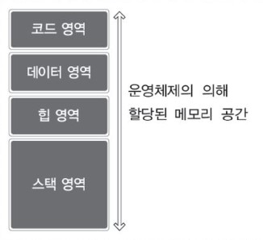
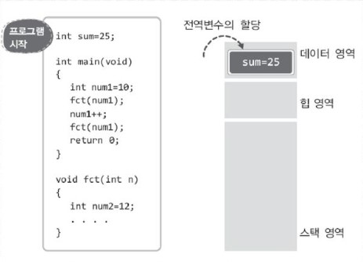
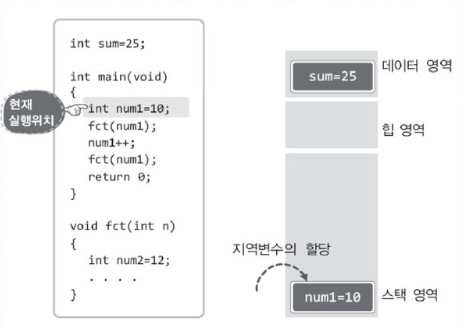
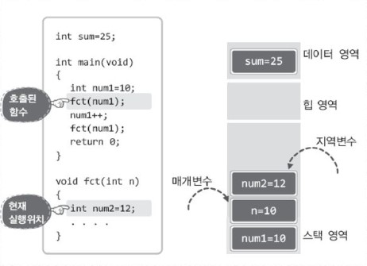
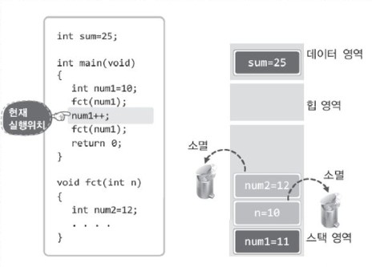
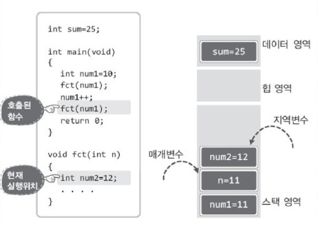
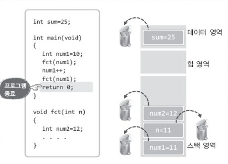

# 메모리 관리와 메모리의 동적 할당


## 목차

- C언어의 메모리 구조
- 메모리의 동적 할당


## C언어의 메모리 구조

프로그램을 실행하면 해당 프로그램의 실행을 위한 메모리 공간이 운영체제에 의해서 미리 마련이 된다. 그리고 바로 이 메모리 공간 내에서 변수가 선언되고, 문자열이 선언되는 것이다.


> 메모리의 구성

프로그램 실행 시 운영체제에 의해서 마련되는 메모리의 구조는 다음과 같이 네 개의 영역으로 구분이 된다.



이렇듯 메모리 공간을 나눠놓은 이유는 커다란 서랍장의 수납공간이 나뉘어 있는 이유와 유사하다.  
메모리 공간을 나눠서 유사한 성향의 데이터를 묶어서 저장을 하면, 관리가 용이해지고 메모리의 접근속도가 향상된다.  
서랍장의 수납공간이 나뉘어 있으면, 물건을 찾을 때 한결 수월하다. 이렇듯 메모리 공간을 나눠놓은 이유는 매우 단순하다.


> 메모리 영역별로 저장되는 데이터 유형

이어서 각 영역별 특성에 대해서 구체적으로 살펴보자.

__코드 영역(Code Area)__

코드 영역은 이름 그대로 실행할 프로그램의 코드가 저장되는 메모리 공간이다. 따라서 CPU는 코드 영역에 저장된 명령문들을 하나씩 가져가서 실행을 한다.

__데이터 영역(Data Area)__

데이터 영역에는 전역변수와 static으로 선언되는 static 변수가 할당된다. 즉, 이 영역에 할당되는 변수들은 프로그램의 시작과 동시에 메모리 공간에 할당되어 __프로그램 종료 시까지 남아있게 된다는 특징__이 있다.

__스택 영역(Stack Area)__

스택 영역에는 지역변수와 매개변수가 할당된다. 이렇듯 이 영역에 할당되는 변수들은 선언된 __함수를 빠져나가면 소멸된다는 특징__이 있다.

__힙 영역(Heap Area)__

데이터 영역에 할당되는 변수와 스택 영역에 할당되는 변수들은 생성과 소멸의 시점이 이미 결정되어 있다.  
그러나 프로그램을 구현하다 보면, 이 두 영역의 변수들과는 다른 성격의 변수가 필요하기도 하다. 그래서 C언어에서는 프로그래머가 원하는 시점에 변수를 할당하고 또 소멸하도록 지원을 하는데,  
바로 이러한 유형의 변수들이 할당되는 영역이 힙 영역이다. 이 힙 영역을 대상으로 하는 변수의 할당과 소멸에 대해서는 잠시 후에 별도로 설명하겠다.


> 프로그램의 실행에 따른 메모리의 상태 변화

그럼 프로그램의 실행과정에서 보이는 메모리 공간의 변화를 통해서 각 영역별 특징에 대해 다시 한번 정리하겠다. 단 코드 영역은 변수가 할당되는 영역이 아니니 생략을 하고 설명을 진행하겠다.  
다음 그림에서는 왼편의 코드가 실행된 직후(main 함수가 호출되기 직전)의 상황을 보이고 있다.



지금까지는 '프로그램의 시작은 main 함수의 호출에서부터이다.'라고 이야기해 왔지만, 실제로는 main 함수가 호출되기 이전에 데이터 영역이 먼저 초기화된다.  
위 그림에서 보이듯이 전역변수가, 그리고 그림에는 없지만 static 변수가 먼저 데이터 영역에 할당이 되고 나서 main 함수가 호출된다.  
이어서 main 함수가 호출되고 main 함수 내에 선언된 지역변수 num1이 스택에 할당되어 다음의 구조가 된다.



다음으로 main 함수 내에서 `fct` 함수가 호출된다. 때문에 `fct` 함수의 매개변수가 스택에 할당되고 `fct` 함수의 지역변수도 다음 그림에서 보이듯이 그 뒤를 이어서 할당이 된다.



다음으로 `fct` 함수가 반환을 하면서 `fct` 함수호출 시 할당되었던 매개변수와 지역변수가 소멸되면서 다음의 형태가 된다.  
참고로 다음 그림에서는 `fct` 함수를 빠져 나온 이후에 main 함수내에서 num1의 값이 증가한 상황까지의 결과를 보이고 있다.



이어서 다시 `fct` 함수의 호출이 진행되고, 더불어 매개변수와 지역변수가 다시 스택에 할당되어 다음의 구조가 된다.



마지막으로 `fct` 함수가 반환되고, jmain 함수의 return 문이 실행되면서 프로그램이 종료된다.  
그리고 프로그램이 종료되면, 운영체제에 의해서 할당된 메모리 공간 전체를 반환하게 되는데, 발 ㅗ그때가 전역변수가 소멸되는 시점이다.



지금까지 살펴 본 내용을 기준으로 스택 영역의 특징을 하나 더 찾아보겠다. 당므의 순서로 함수가 호출 되었다고 가정해 보자.

__main 함수의 호출 → fct1 함수의 호출 → fct2 함수의 호출__

이는 `fct1` 함수가 반환된 이후에 `fct2` 함수가 호출되었다는 뜻이 아니고, `fct1` 함수 내에서 `fct2` 함수가 호출되었다는 뜻이다. 그리고 이러한 경우 지역(매개)변수의 소멸순서는 다음과 같다.

__fct2의 지역 변수 소멸 → fct1의 지역변수 소멸 → main의 지역변수 소멸__

이렇듯 먼저 호출된 함수의 스택공간일수록 늦게 해제된다는 것을 알 수 있다. 그래서 메모리 영역의 이름이 스택이다.  
스택(Stack)은 '쌓아 올려진 더미'를 뜻한다. 이로써 메모리 구조에 대한 전반적인 이야기가 끝이 났다. 남은 것은 힙 영역이 필요한 이유와 힙 영역을 활용하는 방법을 이해하는 것이다.


## 메모리의 동적 할당

언뜻 생각해보면 전역변수와 지역변수만 있으면 충분하다는 생각이 든다. 하지만 프로그램을 구현하다보면 이 둘이 아닌 다른 유형의 변수를 필요로 하게 된다.


> 전역변수와 지역변수로 해결이 되지 않는 상황

다음 예제에는 프로그램 사용자로부터 입력 받은 문자열의 정보를 반환하는 함수가 정의되어 있다.  
우선 이 함수의 문제점을 지적해보자.


ReadStringFault1.c

```c
#include <stdio.h>

char * ReadUserName(void)
{
    char name[30];
    printf("What's your name?");
    gets(name);
    return name;		// 무엇을 반환하는가?
}

int main(void)
{
    char * name1;
    char * name2;
    name1 = ReadUserName();
    printf("name1: %s \n", name1);
    name2 = ReadUserName();
    printf("name2: %s \n", name2);
    return 0;
}
```


위 예제의 문제점은 무엇인가? 그것은 함수 내에 지역적으로 선언된 배열(변수)의 주소 값을 반환하는데 있다. 함수 내에서 프로그램 사용자로부터 문자열을 입력 받아서 그 결과를 반환하는 것은 좋다.  
문제는 그 문자열이 저장되어 있는 배열이 지역적으로 선언되었기 때문에 함수를 빠져나오면서 소멸된다는데 있다.  
그래서 실제로 실행을 해보면 정상적이지 못한 결과로 이어지는 것을 확인할 수 있다. 간혹 정상적인 결과를 보일 수도 있지만, 이는 우연이며, 결국에 가서는 문제를 일으키고 만다.  
그렇다면 이 문제를 전역변수를 이용해서 해결해보겠는가? 하지만 다음 예제에서 보이듯이 이 역시 답이 될 수 없다.


ReadStringFault2.c

```c
#include <stdio.h>
char name[30];

char * ReadUserName(void)
{
    printf("What's your name? ");
    gets(name);
    return name;
}

int main(void)
{
    char * name1;
    char * name2;
    name1 = ReadUserName();
    pritnf("name1: %s \n", name1);
    name2 = ReadUserName();
    printf("name2: %s \n", name2);
    
    printf("name1: %s \n", name1);
    printf("name2: %s \n", name2);
    return 0;
}
```


실행 결과

```
What's your name? ki hyun Jung
name1: ki hyun Jung
What's your name? Choi jun kyung
name2: Choi jun kyung
name1: Choi jun kyung
name2: Choi jun kyung
```

위의 실행결과에서 보이듯이 하나의 전역변수(전역으로 선언된 배열)을 이용하면, 이 전역변수를 덮어쓰게 되기 때문에, 함수호출을 통해서 얻게 된 이름정보가 유지되지 않는다.  
즉 프로그램 사용자에게 이름정보를 입력 받아서 이를 반환하는 함수를 정의하기에는 지역변수도 전역변수도 답이 될 수 없다.  
그렇다면 어떠한 성격의 변수가 필요한 것일까?

__함수가 매번 호출될 때마다 새롭게 할당되고 또 함수를 빠져나가도 유지가 되는 유형의 변수__

다시 말해서, 지역변수와 같이 함수가 호출될 때마다 매번 할당이 이뤄지지만, 할당이 되면 전역변수와 마찬가지로 함수를 빠져나가도 소멸되지 않는 성격의 변수가 필요하다.  
그런데 다행스럽게도 이렇듯 __생성과 소물의 시기가 지역변수나 전역변수와는 다른 유형의 변수__는 `malloc`과 `free` 라는 이름의 함수를 통해서 힙 영역에 할당하고 소멸할 수 있다.  
그럼 위 예제에서 보인 문제점의 해결은 잠시 뒤로 하고 먼저 `malloc` 과 `free` 함수에 대해서 살펴보기로 하자.


> 힙 영역의 메모리 공간 할당과 해제: malloc과 free 함수

아래에서 보이는 `malloc` 함수를 이용해서 메모리 공간을 할당하고, 또 할당된 메모리 공간은 `free` 함수의 호출을 통해서 해제한다.

```c
#include <stdlib.h>

void * malloc(size_tsize);			// 힙 영영으로의 메모리 공간 할당
void free(void * ptr);			// 힙 영역에 할당된 메모리 공간 해제
	// malloc 함수는 성공 시 할당된 메모리의 주소 값, 실패 시 NULL 반환
```

힙 영역을 흔히 '프로그래머가 관리하는 메모리 공간'이라고 한다. 이유는 `malloc` 함수호출로 할당된 메모리 공간은 프로그래머가 직접 `free` 함수의 호출을 통해서 해제하지 않으면 계속 남아있기 때문이다.  
즉 위의 두 함수는 다음과 같이 쌍을 이루어 호출하게 된다.

```c
int main(void)
{
    void * ptr1 = malloc(4);		// 4바이트가 힙 영역에 할당
    void * ptr2 = malloc(12);		// 12바이트가 힙 영역에 할당
    ....
    free(ptr1);		// ptr1이 가리키는 4바이트 메모리 공간 해제
    free(ptr2);		// ptr2가 가리키는 12바이트 메모리 공간 해제
    ....
}
```

이렇듯 `malloc` 함수는 인자로 전달된 정수 값에 해당하는 바이트 크기의 메모리 공간을 힙 영역에 할당하고, 이 메모리 공간의 주소 값을 반환한다.  
따라서 위의 코드를 실행하게 되면 ptr1은 첫 번째 `malloc` 함수호출을 통해서 할당된 메모리 공간의 첫 번째 바이트를 가리키게 되고,  
ptr2는 두 번째 `malloc` 함수호출을 통해서 할당된 메모리 공간의 첫 번째 바이트를 가리키게 된다.  
이어서 ptr1을 인자로 `free` 함수를 호출하는 시점에 ptr1이 가리키는 메모리 공간이 소멸되고, ptr2를 인자로 `free` 함수를 호출하는 시점에 ptr2가 가리키는 메모리 공간이 소멸된다.  
무엇보다도 `malloc` 함수와 `free` 함수의 호출위치 및 시점에는 제한이 없다. 따라서 원하는 시점에 할당하고 원하는 시점에 소멸이 가능하다.

__힙에 할당된 메모리 공간은 포인터 변수를 이용해서 접근하는 방법밖에 없을까?__

`malloc` 함수는 주소 값을 반환한다. 그리고 그 주소 값을 이용해서 힙에 접근을 해야 한다. 따라서 포인터를 이용해서 메모리 공간에 접근하는 수밖에 없다.  
그러니 이제 `malloc` 함수의 반환형에 관심을 두자.


> malloc 함수의 반환형이 void형 포인터인 이유와 힙 영역으로의 접근

3-4에서 우리는 주소 값을 담는 바구니에 지나지 않는 void형 포인터에 대해서 공부한바 있다. 그런데 `malloc` 함수의 반환형은 void형 포인터이다. 
따라서 `malloc` 함수의 반환 값에 아무런 가공도 가하지 않으면, 이를 이용해서는 할당된 메모리 공간에 접근이 불가능하다.

```c
void * ptr = malloc(sizeof(int));		// int형 변수 크기의 메모리 공간 할당
*ptr = 20;					// ptr이 void형 포인터이므로 컴파일 에러
```

그럼에도 불구하고 `malloc` 함수의 반환형이 void형 포인터인 이유는 무엇일까?  
우리는 다음과 같이 문장을 구성하고선 `malloc` 함수에게 충분한 정보를 전달했다고 생각할 수 있다.

```c
void * ptr1 = malloc(sizeof(int));				// int형 변수 크기의 메모리 공간 할당
void * ptr2 = malloc(sizeof(double));				// double형 변수 크기의 메모리 공간 할당
void * ptr3 = malloc(sizeof(int)*7);				// 길이가 7인 int형 배열로 사용할 공간 마련
void * ptr4 = malloc(sizeof(double)*9);				// 길이가 9인 double형 배열로 사용할 공간 마련
```

하지만 sizeof 연산과 곱셈연산 이후에 정작 `malloc` 함수에게 전달되는 인자는 다음과 같을 뿐이다.

```c
void * ptr1 = malloc(4);
void * ptr1 = malloc(8);
void * ptr1 = malloc(28);
void * ptr1 = malloc(72);
```

때문에 `malloc` 함수는 우리에게 다음과 같이 이야기 한다.

__저는 원하시는 크기만큼 메모리 공간을 할당하고 그 메모리의 주소 값을 반환하겠습니다. 그러니 어떻게 사용할지는 포인터 형의 반환을 통해서 직접 결정하세요__

따라서 다음과 같이 void형으로 반환되는 주소 값을 적절히 형 변환해서 할당된 메모리 공간에 접근해야 한다.

```c
int * ptr1 = (int *)malloc(sizeof(int));
double * ptr2 = (double *)malloc(sizeof(double));
int * ptr3 = (int *)malloc(sizeof(int)*7);
double * ptr4 = (double *)malloc(sizeof(double)*9);
```

그럼 지금까지 설명한 내용을 바탕으로 힙 영역에 int형 변수와 int형 배열을 각각 하나씩 선언해서 접근하고 또 해제해 보겠다.


DynamicMemoryAllocation.c

```c
#include <stdio.h>
#include <stdlib.h>

int main(void)
{
	int * ptr1 = (int *)malloc(sizeof(int));
    int * ptr2 = (int *)malloc(sizeof(int)*7);
    int i;
    
    *ptr1 = 20;
    for(i=0 ; i<7 ; i++)
        ptr2[i] = i+1;
    
    printf("%d \n", *ptr1);
    for(i=0 ; i<7; i++)
        printf("%d ", ptr2[i]);
    
    free(ptr1);
    free(ptr2);
    return 0;
}
```


실행 결과

```
20
1 2 3 4 5 6 7
```


참고로 `malloc` 함수는 메모리 공간의 할당에 실패할 경우 NULL을 반환한다. 따라서 메모리 할당의 성공여부를 확인하고자 한다면 다음과 같이 코드를 작성해야 한다.

```C
int * ptr = (int *)malloc(sizeof(int));
if(ptr = NULL)
{
	// 메모리 할당 실패에 따른 오류의 처리
}
```

그리고 `malloc` 함수의 호출을 통한 메모리 공간의 할당을 가리켜 '동적 할당(dynamic allocation)'이라 한다.  
이유는 할당되는 메모리의 크기를 컴파일러가 결정하지 않고, 프로그램의 실행 중간에 호출되는 `malloc` 함수가 결정하기 때문이다.


> free 함수를 호출하지 않으면 프로그램 종료 후에도 메모리가 남게 되나요?

예제 DynamicMemoryAllocation.c를 보면 다음과 같은 의문이 든다.

__프로그램 종료 직전이라도 free 함수를 호출하는걸 보니, 프로그램이 종료되어도 malloc으로 할당된 메모리 공간은 남아있게 되나요?__

과연 그럴까? 만약 그렇다면 `free` 함수를 호출하지 않는 예제를 계속해서 실행하면, 메모리 공간의 부족으로 운영체제의 실행에 문제가 발생할 것이다.  
하지만 그러한 일은 결코 일어나지 않는다. 프로그램 실행 시 할당된 모든 메모리 공간은 프로그램이 종료되면 운영체제에 의해서 전부 해제가 되기 때문이다.  
앞서 보인 예제의 상황만 놓고 보면 `free` 함수의 호출이 불필요하다고 말할 수 있다. 그러나 여러분이 앞으로 구현하게 될 프로그램은 지금 우리가 구현하는 프로그램들처럼 간단히 실행되고 종료되는 프로그램이 아니다.  
따라서 앞서 보인 예제와 같은 상황은 말 그대로 예제에서나 볼 수 있는 상황일 뿐, 실제 프로그램 구현에서는 반드시 `free` 함수를 호출해야 한다. 따라서 습관적으로라도 `malloc` 함수의 호출 횟수 만큼 `free` 함수를 호출하는 것이 좋다.


> 문자열을 반환하는 함수를 정의하는 문제의 해결

이제 `malloc` 함수와 `free` 함수의 사용법도 알았으니, 이를 바탕으로 앞서 보인 다음 두 예제가 해결하지 못했던 부분을 해결해보자.

- 예제 ReadStringFault1.c
- 예제 ReadStringFault2.c

당시에 문제의 해결을 위해서 필요로 했던 것은 다음과 같다.

__함수가 호출될 때마다 문자열 저장을 위한 메모리 공간의 할당이 가능해야 하고, 이 메모리 공간은 함수를 빠져나가도 소멸되지 않고 존재해야 한다.__

지금와서 보니 `malloc` 함수와 `free` 함수의 호출을 통해서 해결해야 한다는 생각이 들지 않는가? 아래 예제를 보자.


ReadStringRight.c

```c
#include <stdio.h>
#include <stdlib.h>

char * ReadUserName(void)
{
    char * name = (char *)malloc(sizeof(char)*30);
    printf("What's Your name? ");
    gets(name);
    return name;
}

int main(void)
{
    char * name1;
    char * name2;
    name1 = ReadUserName();
    pritnf("name1: %s \n", name1);
    name2 = ReadUserName();
    printf("name2: %s \n", name2);
    
    printf("again name1: %s \n", name1);
    printf("again name2: %s \n", name2);
    free(name1);
    free(name2);
    return 0;
}
```


실행 결과

```
What's Your name? Jung Ki Hyun
name1: Jung Ki Hyun
What's Your name? Hong gil dong
name2: Hong gil dong
again name1: Jung Ki Hyun
again anme2: Hong gil dong
```

이렇듯 `malloc` 함수와 `free` 함수를 이용하면 메모리 공간의 할당과 소멸의 시점을 프로그래머가 직접 결정할 수 있다. 때문에 전역변수나 지역변수가 감당하지 못하는 일들을 감당할 수 있다.


> malloc 함수의 사촌 뻘 되는 calloc 함수

힙 영역에 메모리 공간을 할당하는 함수로 `calloc`이라는 함수가 다음과 같이 추가로 정의되어 있다.  
아래의 함수와 `malloc` 함수의 유일한 차이점은 메모리 공간의 할당을 위한 인자의 전달방식에 있다.

```c
#include <stdlib.h>
void * calloc(size_t elt_count, size_t elt_size);
	// 성공 시 할당된 메모리의 주소 값, 실패 시 NULL 반환
```

위의 함수 원형에서 보여주듯이 `malloc` 함수와 달리 `calloc` 함수는 두 개의 숫자를 인자로 전달받는다. 반면 앞서 보인 `malloc` 함수의 전달인자는 하나였다.  
즉 `malloc` 함수의 호출방식은 다음과 같았다.

__총 120바이트를 힙 영역에 할당해주세요.__

반면 `calloc` 함수의 첫 번째 전달인자로는 할당할 블록의 갯수 정보가 전달되고, 두 번째 전달인자로는 블록 하나당 바이트 크기의 정보가 전달된다.  
즉 `calloc` 함수의 호출방식은 다음과 같다.

__4바이트 크기의 블록(elt_size) 30개를(elt_count) 힙 영역에 할당해 주세요.__

120바이트를 할당해 달라는 것과, 4바이트 크기의 블록 30개를 할당해 달라는 것은 결과적으로 완전히 동일하다. 다시 말해서 `calloc` 함수는 `malloc` 함수와 인자를 전달하는 방식에서 차이를 보인다.  
그런데 이것 말고도 한가지 차이점이 더 있다. `malloc` 함수는 할당된 메모리 공간을 별도의 값으로 초기화하지 않는다. 따라서 할당된 메모리 공간이 쓰레기 값으로 채워지지만 `calloc` 함수는 할당된 메모리 공간의 모든 비트를 0으로 초기화시킨다.  
바로 이러한 특성 때문에 `calloc` 함수가 대신 사용되는 경우도 많다. 그리고 `calloc` 함수의 호출로 할당된 메모리 공간을 해제할 때에도 `malloc` 함수와 마찬가지로 `free` 함수를 사용하면 된다.


> 힙에 할당된 메모리 공간 확장 시 호출하는 realloc 함수

한번 할당된 메모리 공간은 그 크기를 확장할 수 없다. 이는 모든 영역의 메모리 공간에 해당하는 말이다. 이미 할당되어버린 배열의 길이를 늘릴 수 있는가?  
어느 영역에 선언을 하건 간에 이러한 일은 불가능하다. 하지만 그 영역이 힙이라면, 그리고 `realloc` 함수를 사용한다면 이러한 일이 가능해진다.

```c
#include <stdlib.h>
void * realloc(void * ptr, size_t size);
	// 성공 시 새로 할당된 메모리의 주소 값, 실패 시 NULL 반환
```

이 함수의 첫 번째 전달인자로, 확장하고자 하는 힙 메모리의 시작 주소 값을 전달한다. 그리고 두 번째 전달인자로는 확장하고자 하는 메모리의 전체 크기를 전달한다.  
즉 매개변수 ptr과 size를 이용해서 다음과 같은 요구를 할 때 호출하는 것이 `realloc` 함수이다.

__ptr이 가리키는 메모리의 크기를 size 크기로 조절해줘(늘려줘)__

그리고 함수호출의 성공 시에는 새로 할당된 메모리의 주소 값이 반환되고, 실패 시에는 NULL이 반환된다. 즉 위의 함수는 다음의 형태로 호출이 된다.

```C
int main(void)
{
    int * arr = (int *)malloc(sizeof(int)*3);		// 길이가 3인 int형 배열 할당
    ....
    arr = (int *)realloc(arr, sizeof(int)*5);		// 길이가 5인 int형 배열로 확장
    ....
}
```

위 코드의 실행결과는 반환 값을 기준으로 다음과 같이 두 가지로 구분이 된다.

- `malloc` 함수가 반환한 주소 값과 `realloc` 함수가 반환한 주소 값이 같은  경우
- `malloc` 함수가 반환한 주소 값과 `realloc` 함수가 반환한 주소 값이 같지 않은 경우

전자는 기존에 할당된 메모리 공간의 뒤를 이어서, 확장할 영역이 넉넉한 경우에 발생한다. 하지만 넉넉하지 않은 경우에는 힙의 다른 위치에, 새로이 요구하는 크기의 메모리 공간을 별도로 할당해서 이전 배열에 저장된 값을 복사하기도 한다.  
그리고 이러한 경우에는 후자의 경우와 같이 `malloc` 함수와 `realloc` 함수의 반환 값이 같지 않다.


문제 1

프로그램 사용자로부터 문자열을 입력 받아서 입력 받은 문자열의 단어를 역으로 출력하는 프로그램을 작성해보자.  
예를 들어서 "I am a boy"가 입력되면, 다음의 출력을 보여야 한다.  
"boy a am I"

단 문자열의 입력에 앞서 프로그램 사용자가 입력할 문자열의 최대길이 정보를 먼저 입력 받기로 하자. 그리고 그 길이만큼 메모리 공간을 동적으로 할당해서 문자열을 입력 받기로 하자.  
참고로 이 문제에서는 메모리의 동적 할당 이외에 문자열의 단어를 역으로 출력하라는 비교적 어려운 주제를 여러분에게 제시하고 있다. 이 문제를 해결하는 방법은 여러 가지이다.  
따라서 여유를 가지고 여러분 나름의 방법을 찾아서 구현해보기 바란다.


[답안]


문제 2

프로그램 사용자로부터 정수를 입력 받는다. -1이 입력될때까지 계속해서 입력 받아서, 프로그램 종료직전에 입력 받은 정수 전부를 순서대로 출력하는 프로그램을 작성해 보자.  
그런데 이 문제의 핵심은 프로그램 사용자가 몇 개의 정수를 입력할지 모른다는데 있다. 그래서 이 문제의 해결을 위해서 힙 영역을 사용하기로 하겠다.  
일단은 길이가 5인 int형 배열을 힙에 할당하자. 그리고 배열이 꽉 찰 때마다 길이를 3씩 늘리기로 하자. 이 때 앞서 소개한 `realloc` 함수를 이용하면 상대적으로 쉽게 배열의 길이를 늘릴 수 있다.


[답안]
