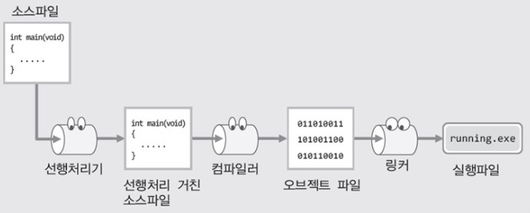
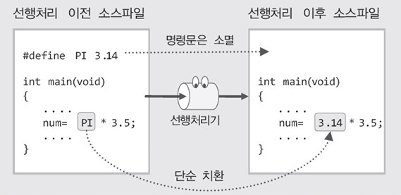
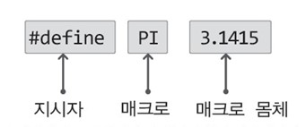

# 매크로와 선행처리기(Preprocessor)

1-1에서는 실행파일이 컴파일과 링크의 과정을 거쳐서 만들어지는 것으로 설명하였다. 그러나 실제로는 컴파일 이전에 '선행처리'라는 과정을 거치게 된다.  
다만 이를 컴파일 과정에 포함시켜서 이야기 하는 것이 보통이기 때문에 1-1에서는 이를 별도로 구분하지 않았다.  
그러나 이번 챕터에서는 선행처리가 이야기의 핵심이기 때문에 이를 별도로 구분해서 언급하고자 한다.


## 목차

- 선행처리기와 매크로
- 대표적인 선행처리 명령문
- 조건부 컴파일(Conditional Compilation)을 위한 매크로
- 매개변수의 결합과 문자열화


## 선행처리기와 매크로

> 선행처리는 컴파일 이전의 처리를 의미합니다.

다음 그림에서 보이듯이 선행처리는 선행처리기에 의해서, 컴파일은 컴파일러에 의해서, 그리고 링크는 링커에 의해서 진행이 된다.  
그런데 이 그림에서는 컴파일 이전에 선행처리의 과정을 거친다는 점에 주목을 해야 한다.



위의 그림에서 보이듯이, 컴파일 과정을 거치게 되면 바이너리 데이터로 이루어진 오브젝트 파일이 생성된다.  
그렇다면 컴파일 이전에 진행되는 선행처리의 과정을 거치게 되면 어떠한 데이터로 채워진 파일이 생성될까?  
선행처리의 과정을 거쳐서 생성되는 파일도 그냥 소스파일일 뿐이다. 왜냐하면 소스파일의 형태가 그대로 유지되기 때문이다.  
선행처리기가 하는 일은 지극히 단순하다. 여러분이 삽입해 놓은 선행처리 명령문대로 소스코드의 일부를 수정할 뿐인데, 여기서 말하는 수정이란, 단순 치환(substitution)의 형태를 띠는 경우가 대부분이다.  
예를 들어보면, 다음은 가장 간단한 선행처리 명령문이다.

```c
#define PI 3.14
```

이처럼 선행처리 명령문은 # 문자로 시작을 하며, 컴파일러가 아닌 선행처리기에 의해서 처리되는 문장이기 때문에 명령문의 끝에 세미콜론을 붙이지 않는다.  
그리고 이렇게 구성이 된 명령문은 선행처리기에게 다음과 같은 메시지를 전달한다.

__PI를 만나면 인정사정 볼 것 없이 3.14로 치환하여라__

따라서 위의 명령문이 삽입되어 있는 소스파일은 선행처리의 과정에서 다음과 같은 방식으로 변환이 된다.



참고로 여기서 말하는 '선행처리'란, 컴파일 이전의 처리를 의미한다.  
따라서 소스파일은 컴파일러에 의해서 컴파일 되기 이전에, 선행처리기에 의해서 선행처리의 과정을 거치게 된다고 이야기한다.


## 대표적인 선행처리 명령문


> #define: Object-like macro

앞서 정의한 #define 명령문을 다시 한번 관찰해보자.



위 그림에서 보이듯이 선행처리 명령문은 기본적으로 세 부분으로 나뉘는데, 제일 먼저 등장하는 #define을 가리켜 '지시자'라 한다.  
선행처리기가 이 부분을 보고 프로그래머가 지시하는 바를 파악하기 때문에 지시자라 하는 것이다.  
그리고 앞서 설명해씃이 #define 지시자는 선행처리기에게 다음과 같은 내용을 지시한다.

__이어서 등장하는 매크로를 마지막에 등장하는 매크로 몸체로 치환하라__

위의 그림에서 보이듯이, #define 지시자 뒤에 등장하는 것을 가리켜 '매크로'라 하고, 그 뒤에 등장하는 것을 가리켜 '매크로 몸체(또는 대체 리스트)'라 한다.  
따라서 위의 선행처리 명령문은 다음의 내용을 선행처리기에게 지시한다.

__매크로 PI를 매크로 몸체 3.1415로 전부 치환하라.__

결과적으로 PI라는 이름의 매크로는 그 자체로 상수 3.1415가 된 셈이다. 참고로 PI와 같은 매크로를 가리켜 '오브젝트와 유사한 매크로(object-like macro)'또는 그냥 간단히 '매크로 상수'라 한다.  
그럼 다음 예제를 통해서 매크로 상수가 적용된 예와 그 결과를 확인해보자.


MacroConst.c

```c
#include <stdio.h>

#define NAME	"홍길동"
#define AGE		24
#define PRINT_ADDR	puts("주소: 경기도 고양시\n");

int main(void)
{
    printf("이름: %s \n" NAME);
    printf("나이: %d \n", AGE);
    PRINT_ADDR;
    return 0;
}
```


실행 결과

```
이름: 홍길동
나이: 24
주소: 경기도 고양시
```


참고로 위 예제에서 보이는 매크로처럼 매크로의 이름은 대문자로 정의하는 것이 일반적이다.  
대문자로 정의함으로써 이 식별자가 매크로라는 사실을 부각시킬수 있기 때문이다.


> define: Function-like macro

매크로는 매개변수가 존재하는 형태로도 정의할 수 있다.  
그리고 이렇게 매개변수가 존재하는 매크로는 그 동작방식이 마치 함수와 유사하여 '함수와 유사한 매크로(function-like macro)'라 하는데, 줄여서 간단히 '매크로 함수'라 부르기도 한다.  
다음은 매크로 함수의 예이다.

```
#define SQUARE(X) X*X
```

#define으로 시작을 하는 것은 매크로 상수의 정의와 동일하다. 그러나 매크로에 괄호가 등장함으로 인해서 아래 그림에서 보이는 바와 같이 해석이 된다.  
여기서 괄호 안에 존재하는 X는(X라는 이름이 중요한 것이 아니라, 괄호 안에 존재한다는 사실이 중요하다. X라는 이름은 바꿔도 된다.) 정해지지 않은 임의의 값(또는 문장)을 의미한다.


그리고 위 그림에서 정의한 매크로를 접한 선행처리기는 SQUARE(X)와 동일한 패턴을 만나면, 무조건 X*X로 치환해버린다.  
예를 들어서 위의 매크로 정의 이후에 다음과 같은 문장을 접했다고 가정해보자.

```
SQUARE(123);
SQUARE(NUM);
```

그러면 선행처리 후에는 다음과 같이 변경이 된다.

```
123*123;
NUM*NUM;
```

이러한 변환의 결과가 마치 함수의 호출과 유사하지 않은가? 참고로 이렇게 선행처리기에 의해서 변환되는 과정 자체를 가리켜 '매크로 확장(macro expanstion)'이라 한다.  
그럼 예제를 통해서 매크로 확장의 결과를 확인해 보겠다.


MacroFunction.c

```c
#include <stdio.h>
#define SQUARE(X) X*X

int main(void)
{
    int num = 20;
    
    /* 정상적 결과 출력 */
    printf("Square of num: %d \n", SQUARE(num));
    printf("Square of -5: %d \n", SQUARE(-5));
    printf("Square of 2.5: %g \n", SQUARE(2.5));
    
    /* 비정상적 결과 출력 */
    printf("Sqaure of 3+2: %d \n", SQUARE(3+2));
    return 0;
}
```


실행 결과

```
Sqaure of num: 400
Sqaure of -5: 25
Sqaure of 2.5: 6.25
Sqaure of 3+2: 11
```


> 잘못된 매크로 정의

앞서 보인 예제의 2행에 정의된 매크로에 어떠한 문제가 있는지 살펴보겠다. 이 예제 14행에는 다음 문장이 있다.

```c
SQUARE(3+2)
```

이를 함수의 관점에서 본다면 3과 2의 합인 5를 SQUARE 함수의 인자로 전달하는 것으로 생각하는 것이 당연하다. 즉 25가 반환되어야 한다. 그러나 출력결과는 11이다. 무엇이 문제일까?  
먼저 연산을 하고, 그 연산결과를 가지고 함수를 호출하게끔 돕는 것은 컴파일러이지 선행처리기가 아니다. 그런데 매크로는 선행처리기에 의해서 처리가 된다.  
때문에 위의 문장은 단순히 다음과 같이 치환될뿐이다.

```C
3+2*3+2
```

따라서 결과로 11이 출력되는 것은 아주 당연한 일이다. 그렇다면 해결책은 무엇인가?  
위 예제 14행의 SQUARE를 다음과 같이 구성하면 된다.

```c
SQUARE((3+2))
```

그러면 다음과 같이 치환이 되어 문제는 해결된다.

```c
(3+2)*(3+2)
```

그러나 이는 함수를 호출하는(매크로인 SQUARE를 그냥 함수라 하자) 사람에게 주의를 요하는 형태이기 때문에 안정적이지 못하다.  
안정적인 형태가 되려면, 위 예제 14행의 실행결과로 25가 출력되어야 한다. 그래야 보다 함수답기 때문이다.


> 매크로 몸체에 괄호를 여러번 치자

예제 MacroFuntion.c의  매크로를 다음과 같이 정의하면, 14행에는 정상적인 값의 출력을 기대할 수 있다.

```c
#define SQUARE(X) (X)*(X)
```

14행 SQUARE 매크로가 다음과 같이 치환되기 때문이다.

```c
(3+2)*(3+2)
```

그러나 여전히 문제는 남아있다. 다음 문장을 예로 들겠다.

```c
int num = 120 / SQUARE(2);
```

SQUARE(2)는 4이므로 변수 num이 30으로 초기화될 것을 기대할 수 있다. 그런데 실제로 초기화되는 값은 120이다. 왜냐하면 다음과 같이 치환되어 나눗셈이 먼저 진행되기 때문이다.

```c
int num = 120 (2) * (2)
```

따라서 이런 저런 문제를 모두 해결하기 위해서는 다음과 같은 형태로 매크로 함수를 정의해야 한다.  

```c
#define SQUARE (X) ((X) * (X))
```

이제 변수 num은 다음 식에 의해서 30으로 초기화된다.

```c
int num = 120 / ( (2) * (2) );
```

이처럼 매크로 함수를 정의할 때에는 매크로의 몸체부분을 구성하는 X와 같은 전달인자 하나하나에 괄호를 해야 함은 물론이고, 반드시 전체를 괄호로 한번 더 묶어줘야 한다는 사실을 기억하자.


> 매크로를 두 줄에 걸쳐서 정의하려면 어떻게 해야할까?

정의하는 매크로의 길이가 길어지는 경우에는 가독성을 높이기 위해서 두 줄에 걸쳐서 매크로를 정의하기도 한다.  
그런데 다음과 같이 임의로 줄을 변경하면 에러가 발생한다. 기본적으로 매크로는 한 줄에 정의하는 것이 원칙이기 때문이다.

```c
#define SQUARE(X)
		((X)*(X))
```

따라서 매크로를 두 줄 이상에 걸쳐서 정의할 때에는 다음과 같이 \ 문자를 활용해서 줄이 바뀌었음을 명시해야 한다.

```c
#define SQUARE(X)	\
		((X)*(X))
```


> 매크로 정의 시, 먼저 정의된 매크로도 사용이 가능하다.

먼저 정의된 매크로는 뒤에서 매크로를 정의할 때 사용 가능하다.  
다음 예제를 통해서 이를 간단히 살펴보자. 더불어서 매개변수가 두 개 이상인 경우의 매크로 함수를 예제에서 제시하겠다.


MacroUseMacro.c

```c
#include <stdio.h>
#define PI 3.14
#define PRODUCT(X,Y) ((X),(Y))
#define CIRCLE_AREA(R) (PRODUCT((R), (R))*PI)

int main(void)
{
    double rad = 2.1;
    printf("반지름 %g인 원의 넓이: %g \n", rad, CIRCLE_AREA(rad));
    return 0;
}
```


실행 결과

```
반지름 2.1인 원의 넓이: 13.8474
```


위 예제의 4행에서는 2행과 3행에서 정의한 매크로를 이용해서 매크로 함수를 정의하고 있다.  
이렇듯 먼저 정의된 매크로는 새로운 매크로를 정의하는데 사용이 가능하다.  

> 매크로 함수의 장점

매크로 함수를 정의하는 것은 일반 함수를 정의하는 것보다 복잡하다. 
그리고  정의하고자 하는 함수의 크기가 크면, 매크로를 정의하는 것 자체가 불가능할 수도 있다.  
그럼에도 불구하고 함수를 매크로로 정의하는 이유는 무엇일까? 이에 대한 이해를 위해서 매크로 함수의 장점과 단점을 살펴보겠다.  
다음은 함수를 매크로로 정의할 때 얻게 되는 장점들이다.

- 매크로 함수는 일반 함수에 비해 실행속도가 빠르다.
- 자료형에 따라서 별도로 함수를 정의하지 않아도 된다.

그럼 이 중에서 실행속도가 빠른 이유부터 살펴보자. 여러분도 알다시피 함수가 호출되면, 다음 사항들이 동반된다.

- 호출된 함수를 위한 스택 메모리의 할당
- 실행위치의 이동과 매개변수로의 인자 전달
- return 문에 의한 값의 반환

따라서 함수의 빈번한 호출은 실행속도의 저하로 이어진다.  
반면 매크로 함수는 선행처리기에 의해서 매크로 함수의 몸체부분이 매크로 함수의 호출 문장을 대신하기 때문에, 위에서 언급한 사항들을 동반하지 않는다. 따라서 실행속도상의 이점이 있다.  
이제 매크로 함수의 두 번째 장점에 대해서 이야기할 차례이다. 그런데 별도로 설명할 필요가 없을 것 같다.  
이미 예제 MacroFunction.c를 통해서 두 번째 장점을 경험하지 않았는가? 이 예제에서 정의한 매크로 함수 SQUARE를 보면, 전달인자의 자료형에 상관없이 제대로 치환됨을 알 수 있다.  
이 모두가 매크로 함수의 호출문장이 매크로 함수의 몸체부분으로 단순히 치환되기 때문에 가능한 일이다.


> 매크로 함수의 단점

바로 위에서 매크로 함수의 장점을 설명하였는데, 이에 못지않은 단점도 존재한다. 다음은 함수를 매크로로 정의할 때 고려해야 할 단점들이다.

- 정의하기가 정말로 까다롭다.
- 디버깅하기가 쉽지 않다.

우선 함수를 하나 제공하겠으니, 첫 번째 단점을 직접 느낄 수 있도록 이 함수를 매크로의 형태로 정의해 보기 바란다.  
참고로 이 함수는 두 값의 차를 계산하는데, 반환되는 값은 두 값의 차에 대한 절댓값이다.

```c
int DiffABS(int a, int b)
{
	if(a>b)
        return a-b;
    else
        return b-a;
}
```

구현해 보았는가? if~else의 형태를 그대로 유지하고자 했다면 그 과정이 분명 부담스러웠을 것이다. 그리고 사고를 조금 달리해서 조건 연산자를 떠올렸다면 다음과 같이 상대적으로 조금 쉽게 정의가 가능했을 것이다.

```c
#define	DIFF_ABS(X, Y)	((X)>(Y) ? (X)-(Y) : (Y)-(X))
```

어찌되었거나 부담스러운 작업이다. 괄호를 쳐주는 부분도 부담스럽다. 그럼 이번에는 두 번째 단점에 대해서 이야기해 보자.


MacroFunctionWeakness.c

```c
#include <stdio.h>
#define DIFF_ABS(X, Y)	( (x)>(y) ? (x)-(y) : (y) - (x))

int main(void)
{
    printf("두 값의 차: %d \n", DIFF_ABS(5, 7));
    printf("두 값의 차: %g \n", DIFF_ABS(1.8, -1.4));
    return 0;
}
```

위 예제가 지니고 있는 문제점이 무엇인지 보이는가? 일단 컴파일을 하면 다음과 같은 내용의 에러 메시지가 출력된다.

__6행에서 사용한 x는 선언된 적이 없다.__

__6행에서 사용한 y는 선언된 적이 없다.__

분명히 6행에는 x와 y가 존재하지 않는다. 그런데 왜 컴파일러는 6행에 있는 x와 y에 문제가 있다고 하는 것일까? 이유는 매크로에 있다.  
위 예제 2행에 정의된 매크로에서는 대문자 X와 Y가 사용되었는데, 매크로 몸체부분에서는 소문자 x와 y가 사용되었다. 따라서 6행과 7행은 선행처리 이후에 다음과 같이 각각 변경된다.

```c
printf("두 값의 차: %d \n", ( (x)>(y) ? (x)-(y) : (y)-(x)));
printf("두 값의 차: %g \n", ( (x)>(y) ? (x)-(y) : (y)-(x)));
```

5와 7, 그리고 1.8과 -1.4로 채워져야 할 부분이 그냥 x와 y로 남겨져 있다. 때문에 컴파일러는 x와 y가 선언된 적 없는 식별자라고 에러 메시지를 출력하는 것이다.  
이처럼 매크로를 잘못 정의할 경우, 에러 메시지는 선행처리 이전의 소스파일을 기준으로 출력되지 않고, 선행처리 이후의 소스파일을 기준으로 출력이 된다.  
따라서 일반적인 에러 메시지보다 이해하기 힘들다는 단점이 있다.


> 그래서 이러한 함수들을 매크로로 정의하지요

바로 앞에서 설명한 매크로 함수의 장점과 단점을 종합해보면, 다음의 특성을 지니는 함수들을 매크로의 형태로 정의하는 것이 옳다는 결론이 나온다.

- 작은 크기의 함수
- 출의 빈도수가 높은 함수

우선 함수의 크기가 작아야 매크로의 형태로 정의하기가 편하고 에러의 발생 확률이 낮아서 디버깅에 대한 염려를 덜 수 있다.  
그리고 호출의 빈도수가 높아야 매크로 함수가 가져다 주는 성능 향상의 이점도 최대한 누릴 수 있다.


## 조건부 컴파일(Conditional Compilation)을 위한 매크로


