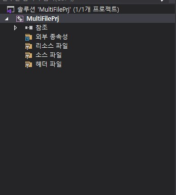
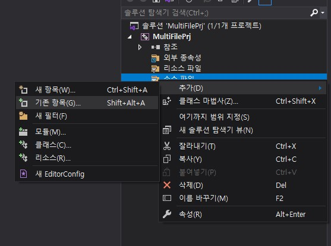
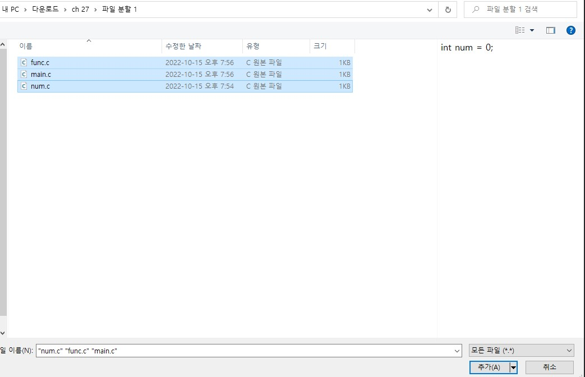
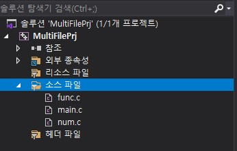
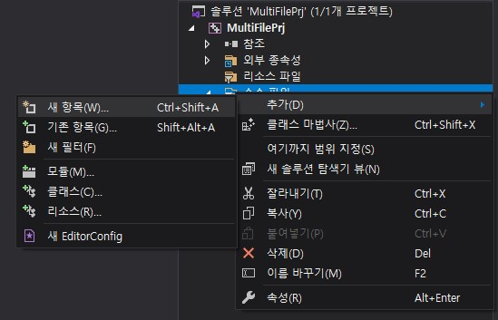
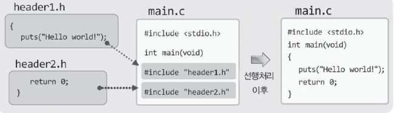
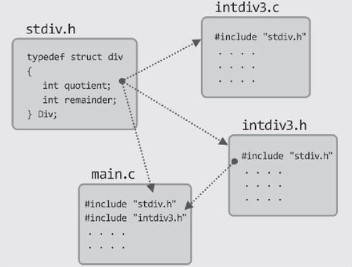

# 파일의 분할과 헤더파일의 디자인


## 목차

- [파일의 분할](#파일의-분할)
- [둘 이상의 파일을 컴파일하는 방법과 static에 대한 고찰](#둘-이상의-파일을-컴파일하는-방법과-static에-대한-고찰)
- [헤더파일의 디자인과 활용](#헤더파일의-디자인과-활용)


## 파일의 분할

> 파일을 그냥 나눠도 될까?

두 개의 서랍장이 있다. 하나는 수납공간이 통으로 된 서랍장이고, 다른 하나는 크고 작은 여러 개의 공간으로 수납공간이 나눠진 서랍장이다. 어떠한 수납장이 물건 관리가 용이할까?  
공간이 여러 개이면 물건을 용도 및 특성 별로 나눠서 저장할 수 있고, 그러면 물건도 쉽게 찾을 수 있으니, 당연히 여러 개의 공간으로 나눠진 서랍장이 물건관리가 용이하다.  
그런데 파일을 나누는 이유도 이와 별반 차이가 없다. 파일을 나눠서 각각의 파일에, 용도 및 특성 별로 함수와 변수를 나눠서 저장하면 소스코드의 관리가 용이해진다.  
그럼 파일을 나누는 방법에 대한 고민을 시작해보자. 그리고 이를 위해서 먼저 다음 프로그램을 대상으로 파일을 나눠보기로 하겠다.


SimpleOneFile.c

```c
#include <stdio.h>
int num = 0;

void Increment(void)
{
	num++;
}

int GetNum(void)
{
    return num;
}

int main(void)
{
    printf("num: %d \n", GetNum());
    Increment();
    printf("num: %d \n", GetNum());
    Increment();
    printf("num: %d \n", GetNum());
    return 0;
}
```


실행 결과

```
num: 0
num: 1
num: 2
```


이 파일을 다음과 같이 총 세 개의 파일로 나눠서 저장한다고 가정해 보자. 컴파일이 제대로 되겠는가?  
단 헤더파일 선언은 각각의 파일에 적절히 이뤄졌다고 가정하겠으니 이 부분을 문제시 삼지는 말자.


안타깝게도 위의 그림과 같은 형태로 파일을 나누면 컴파일 시 에러가 발생하는데(컴파일 방법은 잠시 후에 설명), 에러의 발생 이유는 컴파일러의 다음과 같은 특성 때문이다.

__컴파일러는 파일 단위로 컴파일을 진행합니다.__

쉽게 말해서 컴파일러는 다른 파일의 정보를 참조하여 컴파일을 진행하지 않는다. 때문에 위 그림의 파일 func.c를 컴파일 하면 다음과 같은 내용의 불평을 한다.

__변수 num이 도대체 어디에 선언된거야__

그리고 main.c를 컴파일 하면서도 다음과 같은 내용의 불평을 한다.

__Increment 함수는 정의된 적이 없잖아__

물론 우리는 변수 num이 num.c에 선언되어 있고, Increment 함수가 func.c에 정의되어 있다는 것을 안다.  
그러나 컴파일러는 이를 인식하지 못한다. 앞서 컴파일 했더라도 인식하지 못한다. 컴파일러는 func.c 안에서만 변수 num의 선언을 찾고, main.c 안에서만 Increment 함수의 정의를 찾다가 에러 메시지를 출력할 뿐이다.


> 외부에 선언 및 정의되었다고 컴파일러에게 알려줘야 합니다.

위 그림의 형태로 파일을 분할해서 컴파일 하기 위해서는 컴파일러에게 다음과 같은 내용의 메시지를 전달해야 한다.

__num은 외부 파일에 int형으로 선언된 변수야__

__Increment는 반환형과 매개변수의 형이 void인 함수인데, 외부 파일에 정의되어 있어__

이 중에서 첫 번째 메시지는 func.c를 컴파일 할 때 필요하다. 따라서 func.c에는 다음의 선언이 삽입 되어야 하는데, 여기서 extern은 int형 변수 num이 외부에 선언되었음을 컴파일러에게 알릴 때 사용되는 키워드이다.

```c
extern int num;		// int형 변수 num이 외부에 선언되어 있다.
```

즉 위의 선언은 변수 num을 할당하는 선언이 아니다. num의 자료형이 무엇이고, 어디에 선언되어 있는지를 컴파일러에게 알려주는 메시지일 뿐이다.  
그리고 두 번째 메시지는 main.c에 필요하다. 따라서 main.c에는 다음의 선언이 삽입되어야 한다.

```c
extern void Increment(void);		// void Increment(void) 함수가 외부에 정의되어 있다.
```

참고로 함수가 외부에 정의되어 있음을 알릴 때에는 extern 선언을 생략할 수 있다. 즉 다음과 같이 선언해도 동일한 메시지가 컴파일러에게 전달된다.

```c
void Increment(void);
```

이제 위 그림에서 보여주는 문제점의 해결을 위해서 소스코드가 다음과 같이 정정되어야 함을 알 수 있을 것이다.


참고로 컴파일러에게는 extern 선언을 통해서 함수 또는 변수가 외부에 선언 및 정의되어 있다는 사실만 알리면 된다. 구체적으로 어느 파일에 선언 및 정의되어있는지 까지는 알리지 않아도 된다.


> 다른 파일에서 접근을 못하게 하고 싶다면 static!

이미 오래 전에 'static 지역변수'에 대해서 설명을 했는데, 이를 이어서 'static 전역변수'에 대해 설명하고자 한다.  전역변수의 static 선언은 다음의 의미를 담고 있다.

__이 변수는 외부 파일에서의 접근을 허용하지 않는다.__

이를 다소 전문적으로 표현하면 다음과 같다.

__이 변수의 접근범위는 파일 내부로 제한한다.__

따라서 위 그림의 num.c에 선언된 변수 num을 다음과 같이 선언하면 func.c에서는 변수 num에 접근할 수가 없어서 컴파일 오류가 발생한다.

```c
static int num = 0;
```

이처럼 static 전역변수는 접근의 범위를 파일의 내부로 제한하는 경우에 사용된다.


## 둘 이상의 파일을 컴파일 하는 방법과 static에 대한 고찰

> 파일부터 정리하고 시작합시다!


실행을 위해서 위 그림과 같은 형태로 파일을 나누자. 물론 이를 위해서는 다음과 같이 총 세 개의 파일을 만들어서,   
위 그림의 형태대로 코드를 삽입해야 한다.

```c
num.c	func.c	main.c
```

그리고 추가로 printf 함수의 호출문이 존재하는 main.c에는 다음 문장을 삽입해야 한다.

```c
#include <stdio.h>
```

이 때 이들 파일을 생성하고 프로젝트에 추가하는 방법에는 다음과 같이 두 가지가 있다.

- 첫 번째 방법: 파일을 먼저 생성해서 코드를 삽입한 다음에 프로젝트에 추가한다.
- 두 번째 방법: 프로젝트에 파일을 추가한 다음에 코드를 삽입한다.

첫 번째 방법에서는 파일을 먼저 생성해서 코드를 삽입한다고 했는데, 이 때 메모장을 포함한 어떠한 편집기를 사용해도 된다. 하지만 이는 일반적으로 컴파일 할 파일이 이미 존재하는 경우에 사용하는 방법이다.  
반면 두 번째 방법은 새로운 파일을 추가해서 코드를 직접 입력하는 경우에 사용하는 방법이다.


> 첫 번째 방법: 이미 만들어진 파일을 프로젝트에 추가하는 방법

먼저, 주어진(만들어진) 소스파일을 이용해서 컴파일하는 방법을 소개하겠다.  
일단 다음과 같이 컴파일을 위한 프로젝트를 생성하자. 지금까지 여러분이 만들어오던 프로젝트와 동일한 형태의 프로젝트를 생성하면 된다.



이제 파일을 추가할 차례인데, 파일 탐색기를 열어서 추가할 파일을 끌어다 놓는 형태로 간단히 추가할 수 있다.  
하지만 일반적인 방식은 솔루션 탐색기의 '소스 파일' 위에서 마우스 오른쪽 버튼을 누르는 방식이다. 다음 그림처럼 말이다.



위 그림에서 보이듯이 '기존 항목'을 선택하면, 다음과 같이 프로젝트에 추가할 파일을 선택할 수 있는 창을 보게 된다.



위 그림에서 보이듯이 마우스를 이용해서 한번에 둘 이상의 파일을 추가 대상으로 선택할 수 있다. 이렇게 해서 추가가 완료되면 솔루션 탐색기에는 다음과 같이 추가된 파일이 표시된다.



이로써 소스파일의 추가 과정이 모두 끝났다. 이제 종전과 동일한 방식으로 컴파일 및 실행을 하여 결과를 확인할 수 있다.  
참고로 추가할 파일이 잠시 후에 살펴볼 헤더파일이라면 솔루션 탐색기에서 '소스 파일'이 아닌, '헤더 파일'의 위에서 마우스의 오른쪽 버튼을 클릭 후 위 과정을 반복하면 된다.


> 두 번째 방법: 프로젝트에 파일을 추가한 다음에 코드를 삽입하여 컴파일하는 방법

사실 프로젝트에 새로운 파일을 추가한 다음에 소스코드를 삽입하는 방법은 이미 여러분이 사용해 오던 방식이다.  
이 방식을 사용하려면 다음 그림에서 보이듯이 앞에 그림에서 선택한 '기존 항목'이 아닌 '새 항목'을 선택하면 된다.



그리고 이후의 과정은 여러분이 지금까지 해오던 파일의 추가 방법과 동일하므로 생략을 하겠다.


> 함수에도 static 선언을 할 수 있습니다.

전역변수에 static 선언을 할 수 있듯이 함수에도 static 선언을 할 수 있다. 그리고 그 의미는 static 전역변수와 마찬가지로 파일 내에서만 접근이 가능하도록 함수를 제한하는 것이다.

```c
static void MinCnt(void)			// 외부 파이ㅏㄹ에서 호출 불가능한 함수
{
	cht--;
}
```

함수가 위와 같이 정의되면, extern 선언을 하더라도 다른 파일에서는 접근이 불가능하다. 그리고 이는 코드의 안전성을 높이는 역할을 하는 만큼(파일의 외부에서 원치 않게 호출되는 것을 막을 수 있다.),  
파일 내에서만 호출하기 위해서 정의된 함수라면 이렇듯 static 선언을 추가하여 코드에 안전성을 부여하는 것이 좋다.


## 헤더파일의 디자인과 활용

> #include 지시자의 의미를 알면 헤더파일을 완전히 이해할 수 있습니다.

면저 #include 지시자의 의미를 이해하자. 그러면 헤더파일을 이해할 수 있을 뿐만 아니라, 헤더파일에 무엇을 담아야 할지도 알 수 있게 되니 말이다.  
이를 위해서 다음 예제를 제시하겠다. 이 예제는 #include 지시자의 이해를 목적으로 작성되었다.  
참고로 헤더파일을 추가하는 방법은 앞서 설명한 소스파일의 추가 방법과 유사하니 별도로 설명하지 않겠다.(단 아래의 세 파일은 모두 동일한 디렉토리에 존재해야 컴파일이 된다.)

header1.h

```c
{
    	puts("Hello world!");
```

header2.h

```c
		return 0;
}
```

main.c

```c
#include <stdio.h>

int main(void)
#include "header1.h"
#include "header2.h"
```

언뜻 보면 이것이 정상적인 프로그램인가 하는 의심이 든다. 하지만 정상적인 프로그램이 맞다.  
일단 이 프로그램의 분석을 위해서 다음 문장의 의미를 설명하겠다.(1행의 #include문과 4, 5행의 #include문의 차이점은 잠시 후에 설명한다.)  

```c
#include "header1.h"
```

이는 다음과 같은 메시지를 선행처리기에게 전달하는 것이다.

__이 문장의 위치에다가 header1.h에 저장된 내용을 가져다 놓으세요.__

유사하게 main.c의 5행에 있는 지시자는 다음의 의미를 지닌다.

__이 문장의 위치에다가 header2.h에 저장된 내용을 가져다 놓으세요.__

실제로 가져다 놓아 보면 정상적인 프로그램임을 알 수 있다.



이처럼 #include 지사자는 그 이름이 의미하듯이 파일의 내용을 단순히 포함시키는 용도로 사용된다.  
그 이상도 이하도 아닌 '포함'일 뿐이다.


> 헤더파일을 include 하는 두 가지 방법

앞에 그림에서도 보였듯이 헤더파일을 포함하는 방식에는 두 가지가 있다. 그 중 하나는 다음과 같다.

```c
#include <헤더파일 이름>		// 이를 첫 번째 방식이라 하자!
```

그리고 다른 하나는 다음과 같다.

```c
#include "헤더파일 이름"		// 이를 두 번째 방식이라 하자!
```

이 둘의 유일한 차이점은 포함시킬 헤더파일의 기본 경로인데, 첫 번째 방식을 사용하면 표준 헤더파일(C의 표준에서 정의하고 있는, 기본적으로 제공되는 헤더파일)이 저장되어 있는 디렉터리에서 파일을 찾게 된다.  
때문에 이 방식은 stdio.h, stdlib.h, string.h와 같은 표준 헤더파일을 포함시킬 경우에 사용된다.  
반면 두 번째 방식을 사용하면, 이 문장을 포함하는 소스파일이 저장된 디렉터리에서 헤더파일을 찾는다.  
때문에 프로그래머가 정의하는 헤더파일을 포함시킬 때 사용하는 방식이다. 그리고 이 방식을 사용하면 다음과 같이 헤더파일의 이름뿐만 아니라, 드라이브 명과 디렉터리 경로를 포함하는 '절대경로(완전경로)'를 명시해서 헤더파일을 지정할 수 있다.

```c
#include "C:\CPOWER\MYProject\header.h"		// Windows 상에서의 절대경로 지정
#include "\CPOWER\MYProject\header.h"		// Linux 상에서의 절대경로 지정
```

절대경로를 이용하면 헤더파일의 위치를 완벽히 알려줄 수 있다.  
하지만 프로그램 개발에서는 특별한 이유가 없으면 절대경로를 사용하지 않는다. 왜냐하면 절대경로를 지정해서 헤더파일을 선언하면 다른 컴퓨터에서 컴파일 하는 일이 매우 번거로워진다.  
그래서 #include 문에서는 절대경로를 사용하지 않는다. 대신 이어서 설명하는 상대경로를 사용한다.


> 상대경로의 지정 방법

상대경로는 말 그대로 상대적인 경로이다. 즉 실행하는 컴퓨터의 환경에 따라서 경로가 바뀌기 때문에 '상대경로'라 하는 것이다.  
예를 들어서 헤더파일을 다음과 같이 포함시켰다고 가정해보자(참고로 이것도 상대경로 지정방식이다).

```c
#include "header.h"
```

여러분은 이 문장의 헤더파일 검색경로를 알 수 없다. 왜냐하면 상대적이기 때문이다.  
이 문장을 포함하는 소스파일이 C:\AAA에 저장되어 있다면, 이 문장의 헤더파일 검색경로도 C:\AAA가 된다.  
반면 이 문장을 포함하는 소스파일이 C:\AAA\BBB에 저장되어 있다면, 이 문장의 헤더파일 검색경로 역시 C:\AAA\BBB가 된다.  
그리고 상대경로는 다음과 같은 형태로도 지정이 가능하다(때문에 상대경로가 절대경로보다 훨씬 유용하다).

```c
#include "Release\header0.h"
#include "..\CProg\header1.h"
#include "..\..\MyHeader\header2.h"
```

첫 번째 행은 다음의 의미로 해석이 된다.

__소스파일이 있는 디렉터리의 하위 디렉터리인 Release 디렉터리에 존재하는 header0.h를 포함하라__

그리고 두 번째 행은 다음과 같이 해석이 된다. 점 두 개인 ..가 한 단계 상위 디렉터리를 의미하기 때문이다.

__한 단계 상위 디렉터리의 하위 디렉터리인 MyHeader에 존재하는 header1.h를 포함하라__

유사하게 세 번째 행은 다음과 같은 의미로 해석된다.

__두 단계 상위 디렉터리의 하위 디렉터리인 MyHeader에 존재하는 header2.h를 포함하라__

이렇듯 상대경로를 기반으로 헤더파일을 선언하면, 드라이브 명이나 디렉터리 위치에 덜 영향을 받는다.  
때문에 실제로는 상대경로를 기반으로 헤더파일이 선언되며, 그렇기 때문에 여러분도 상대경로를 이용하는 습관을 들여야 한다.


> 헤더파일에 무엇을 담으면 좋겠습니까?

그렇다면 헤더파일에는 무엇을 담으면 좋겠는가? 사실 이에 대한 힌트는 앞서 예제를 통해서 충분히 제시되었다.  
기본적으로 헤더파일에는 다음과 같은 유형의 선언을 담게 된다.

```c
extern int num;
extern int GetNum(void);		// extern 생략가능
```

외부에 선언된 변수에 접근하거나 외부에 정의된 함수를 호출하기 위한 선언들인데, 이들은 둘 이상의 소스파일로 이뤄진 프로그램에서 당연히 삽입될 수 밖에 없는 유형의 선언들이다.  
그런데 필요할 때마다 매번 삽입하는 것은 번거로운 일이다. 따라서 이들 선언을 헤더파일에 모아두고 필요할 때마다 헤더파일을 포함시키는 방법을 선택한다.  
이와 관련해서 다음 예제를 보자. 참고로 이 예제는 총 7개의 파일로 이뤄져 있다.


basicArith.h

```c
#define PI 3.1415
double Add(double num1, double num2);
double Min(double num1, double num2);
double Mul(double num1, double num2);
double Div(double num1, double num2);
```


basicArith.c

```c
double Add(double num1, double num2)
{
    return num1+num2;
}

double Min(double num1, double num2)
{
    return num1-num2;
}

double Mul(double num1, double num2)
{
    return num1*num2;
}

double Div(double num1, double num2)
{
    return num1/num2;
}
```


basicArith.c에는 사칙연산의 기능을 제공하는 함수들이 정의되어 있다. 그리고 이 함수들의 선언을 basicArith.h에 모아두었으므로, basicArith.c에 정의된 함수의 호출을 위해서는 헤더파일 basicArith.h를 포함시켜야 한다.

그리고'__매크로의 명령문도 파일 단위로만 유효__'하기 때문에(선행처리기도 파일 단위로 선행처리를 한다) 매크로 PI에 대한 정의가 헤더파일 BasicArith.h에 삽입되었다.  
때문에 매크로 PI를 필요로 하는 소스 파일은 헤더파일 basicArith.h를 포함시키기만 하면 된다.


areaArith.h

```c
double TriangleArea(double base, double height);
double CircleArea(double rad);
```


areaArith.c

```c
#include "basicArith.h"

double TriangleArea(double base, double height)
{
    return Div(Mul(base, height), 2);
}

double CircleArea(double rad)
{
    return Mul(Mul(rad, rad), PI);
}
```


areaArith.c에는 면적을 구하는 함수들이 정의되어 있다. 그런데 이 함수들은 basicArith.c에 정의된 함수를 호출하기 때문에 헤더파일 basicArith.h를 포함시켜야 한다.


roundArith.h

```c
double RectangleRound(double base, double height);
double SquareRound(double side);
```


roundArith.c

```c
#include "basicArith.h"

double RectangleRound(double base, double height)
{
    return Mul(Add(base, height), 2);
}

double SquareRound(double side)
{
    return Mul(side, 4)
}
```


roundArith.c에는 둘레를 구하는 함수들이 정의되어 있다. 이 함수들 역시 basicArith.c에 정의된 함수를 호출하기 때문에 헤더파일 basicArith.h를 포함시켜야 한다.


잠시 여기서 헤더파일의 유용함을 관찰해보자. 만약에 헤더파일 basicArith.h가 존재하지 않았다면, 소스파일 areaArith.c와 roundArith.c에서 호출하고 있는 함수의 선언을 각각의 소스파일에 추가해야만 한다.  
즉 번거로운 과정을 거쳐야만 하는 것이다. 그러나 헤더파일을 만들었기 때문에 한 줄의 #include문으로 모든 것이 해결되었다. 이것이 바로 헤더파일의 유용함이다.  
이제 위의 파일들을 테스트하기 위한 main 함수를 소개하겠다.


main.c

```c
#include <stdio.h>
#include "areaArith.h"
#include "roundArith.h"

int main(void)
{
    printf("삼각형 넓이(밑변 4, 높이 2): %g \n", TriangleArea(4, 2));
    printf("원 넓이(반지름 3): %g \n", CircleArea(3));
    
    printf("직사각형 둘레(밑변 2.5, 높이 5.2): %g \n", RectangleRound(2.5, 5.2));
    printf("정사각형 둘레(변의 길이 3): %g \n", SquareRound(3));
    return 0;
}
```


실행 결과

```
삼각형 넓이(밑변 4, 높이 2): 4
원 넓이(반지름 3): 28.2735
직사각형 둘레(밑변 2.5, 높이 5.2): 15.4
정사각형 둘레(변의 길이 3): 12
```


헤더파일의 유용함은 main.c에서도 확인할 수 있다. areaArith.h와 roundArith.h를 만들지 않았다면 2행과 3행을 대신해서 여러 줄의 함수선언이 추가되어야 한다.  
이 경우에는 예제가 간단하여 네 줄로 끝나지만, 실제 프로그램 개발에서는 네 줄로 끝나지 않을 것이다.


> 구조체의 정의는 어디에 둘까요? 그런데 중복은 안됩니다.

이전에 구조체를 설명할 때도 간단히 언급했듯이 구조체는 프로그램 개발에서 빠질 수 없는 중요한 요소이다.  
그렇다면 구조체의 선언(typedef 선언) 및 정의는 어디에 두는 것이 정답일까? 소스파일일까 아니면 헤더파일일까? 두 개의 파일로 이뤄진 다음 예제를 참조하여 이 부분에 대한 답을 대략적으로나마 내려보자.


intdiv.c

```c
typedef struct div
{
    int quotient;		// 몫
    int remainder;		// 나머지
} Div;

Div IntDiv(int num1, int num2)
{
    Div dval;
    dval.quotient=num1/num2;
    dval.remainder=num1%num2;
    return dval;
}
```


main.c

```c
#include <stdio.h>

typedef struct div
{
    int quotient;		// 몫
    int remainder;		// 나머지
} Div;

extern Div IntDiv(int num1, int num2);

int main(void)
{
	Div val=IntDiv(5, 2);
    printf("몫: %d \n",   val.quotient);
    printf("나머지: %d \n", val.remainder);
    return 0;
}
```


실행 결과

```
몫: 2
나머지: 1
```


위의 예제를 분석하면 구조체 Div의 선언 및 정의가 두 번씩이나 이루어진것을 알 수 있다.  
처음엔 상당히 이상하게 보이지만 앞서 설명한 다음 사실을 기억하면 전혀 이상하게 느껴지지 않을 것이다.

__컴파일러는 파일 단위로 컴파일을 진행합니다.__

컴파일러는 다른 파일의 정보를 참조하여 컴파일을 진행하지 않는다고 하였다. 때문에 구조체 Div에 대한 선언 및 정의는 Div를 필요로 하는 모든 파일에 존재해야 한다.  
그러나 우리는 헤더파일을 만들어서 Div의 선언 및 정의가 프로그램 내에서 하나만 존재하도록 개선시킬 수 있다.  
아니 반드시 개선시켜야 한다(다음 예제와 같은 구조로 말이다). 동일한 구조체의 정의가 두 군데 이상 존재하면 구조체의 수정 및 확장에 불편함이 따르기 때문이다.


stdiv.h

```c
typedef struct div
{
    int quotient;		// 몫
    int remainder;		// 나머지
} Div;
```


intdiv2.c

```c
#include "stdiv.h"

Div IntDiv(int num1, int num2)
{
    Div dval;
    dval.quotient=num1/num2;
    dval.remainder=num1%num2;
    return dval;
}
```


main.c

```c
#include <stdio.h>
#include "stdiv.h"

extern Div IntDiv(int num1, int num2);

int main(void)
{
    Div val = IntDiv(5, 2);
    printf("몫: %d \n", val.quotient);
    printf("나머지: %d \n", val.remainder);
    return 0;
}
```


위 예제에서 보이듯이 구조체의 선언 및 정의는 헤더파일에 삽입하는 것이 좋다. 그러나 하나의 소스파일 내에서만 사용이 되는 구조체라면 소스파일에 정의하는 것도 괜찮다.


> 헤더파일의 중복삽입 문제

일단 구조체의 선언 및 정의는 헤더파일에 삽입하는 것이 좋다는 결론이 내려졌다. 그런데 이는 자칫 컴파일 에러의 원인으로 이어질 수 있어서 주의를 해야 한다.  
총 네 개의 파일로 이뤄진 다음 예제를 통해서 이 부분을 언급할 텐데, 이 예제는 앞서 소개한 예제를(stdiv.h, intdiv2.c로 이뤄진 예제) 조금 변경 시킨 것이다.


stdiv.h

```c
typedef struct div
{
    int quotient;	// 몫
    int remainder;	// 남저ㅣ
} Div;
```


intdiv3.c

```c
#include "stdiv.h"

Div IntDiv(int num1, int num2)
{
    Div dval;
    dval.quotient=num1/num2;
    dval.remainder=num1%num2;
    return dval;
}
```


위 소스파일에서는 헤더파일 stdiv.h를 포함하고 있다. IntDiv 함수에서 구조체 Div의 변수를 선언하니 이는 당연한 것이다.


intdiv3.h

```c
#include "stdiv.h"
Div IntDiv(int num1, int num2);
```


위의 헤더파일은 소스파일 intdiv3.c에서 정의한 함수의 선언을 담고 있다.그런데 함수의 선언에서 구조체 Div가  
반환형으로 선언되어 있기 때문에 헤더파일 stdiv.h를 포함해야 한다.


main.c

```c
#include <stdio.h>
#include "stdiv.h"
#include "intdiv3.h"

int main(void)
{
    Div val = IntDiv(5, 2);
    printf("몫: %d \n", val.quotient);
    printf("나머지: %d \n", val.remainder);
    return 0;
}
```


위 main.c의 3행에서는 intdiv3.h를 포함하고 있다. 7행에서 IntDiv 함수를 호출하기 때문이다. 그리고 2행에서는 stdiv.h를 포함하고 있다. 7행에서 Div형 변수를 선언하고 있기 때문이다.  
이렇듯 이 예제는 파일을 하나씩만 놓고 보면 문제될 것이 없어 보인다. 그러나 이들을 묶어놓고 보면 문제가 발생한다.  
다음 그림에서는 이 에제의 헤더파일 포함관계를 보여주고 있다. 이 그림을 통해서 문제가 무엇인지 찾아보기 바란다.



위 그림을 통해서 main.c가 포함하는 헤더파일의 종류와 수를 관찰해 보자. 일단 다음 문장에 의해서 stdiv.h를 한번 포함한다.

```c
#include "stdiv.h"
```

그리고 다음 문장에 의해서 stdiv.h를 한번 더 포함한다. 왜냐하면 헤더파일 intdiv3.h가 stdiv.h를 포함하고 있기 때문이다.

```c
#include "intdiv3.h"
```

결과적으로 main.c에서는 __구조체 Div가 두 번 정의된 형태가 되어 컴파일 에러가 발생__한다. 그렇다면 이 문제를 어떻게 해결해야 할까?  
가장 간단한 방법은 main.c에서 stdiv.h를 포함하는 #include문을 삭제하는 것이다. 어차피 헤더파일 intdiv3.h를 통해서 stdiv.h를 포함하게 되니 삭제를 해도 문제되지 않는다.  
그러나 이는 이 상황에서의 해결책일 뿐 일반적인 해결책은 되지 못한다.  
프로그램에 복잡해질수록 소스파일과 헤더파일은 많아지고, 더불어 헤더파일의 포함관계도 복잡해진다. 때문에 헤더파일을 한번만 포함시키도록 주의해서 프로그래밍을 하는 것은 매우 거슬리는 일이 되어버린다.  
따라서 보다 근본적인 대책이 필요하다. 헤더파일의 중복삽입을 고민하지 않아도 되는 아주 근본적인 대책 말이다.


> 헤더파일을 중복해서 삽입하면 문제가 되나요?

헤더파일의 중복삽입 자체는 문제가 되지 않는다. 특히 다음과 같은 유형의 선언은 두 번 이상 삽입이 되어도 컴파일 오류가 발생하지 않는다.  
왜냐하면 이는 컴파일러에게 전달하는 메시지에 지나지 않기 때문이다.

```c
extern int num;
void Increment(void);
```

컴팡리러에게 메시지를 두 번 이상 전달한다고 해서 문제가 되지는 않는다. 그리고 이러한 유형의 선언은 실행파일의 크기와도 상관이 없다(컴파일러가 컴파일을 할 수 있도록 도움을 줄 뿐이므로).  
하지만 구조체의 정의는 이야기가 다르다. 이는 컴파일을 하는데 도움을 주는 정보가 아닌, 실행파일의 내용에 직접적인 연관이 있는 정보이다. 구조체를 어떻게 정의하느냐에 따라서 실행파일의 크기뿐만 아니라 실행파일의 내용도 달라지지 않겠는가?  
따라서 이러한 형태의 정의는 두 번 이상 중복될 수 없다.


> 조건부 컴파일을 활용한 중복삽입 문제의 해결

헤더파일의 중복삽입에 대한 해결책은 4-3에서 학습한 '조건부 컴파일을 위한 매크로'에서 찾을 수 있다.  
총 네 개의 파일로 이뤄진 다음 예제는 헤더파일의 중복삽입에 대한 해결책을 보여준다.


stdiv2.h

```c
#ifndef __STDIV2_H__
#define __STDIV2_H__

typedef struct div
{
    int quotient;		// 몫
    int remainder;		// 나머지
} Div;

#endif
```


위의 파일에 앞서 중복삽입으로 인해 문제가 되었던 헤더파일이다. 그런데 이 파일의 1, 2행 그리고 10행을 통해서 4~8행의 중복삽입을 막고 있다.  
이 파일을 처음 포함하는 소스파일은 `__STDIV2_H__`라는 이름의 매크로가 정의되지 않은 상태이므로 2~8행까지를 포함하게 된다. 때문에 2행에 의해서 매크로 `__STDIV2_H__`가 정의되고 이어서 4~8행에 의해서 구조체 Div가 정의된다.  
그리고 이후에 이 파일을 다시 포함하는 경우에는 매크로 `__STDIV2_H__`가 정의된 상태이므로 1행과 10행에 의해서 그 사이에 있는 모든 내용이 포함되지 않는다.  
결국 구조체 Div는 소스파일당 하나씩만 정의가 된다.


intdiv4.h

```c
#ifndef __INTDIV4_H__
#define __INTDIV4_H__

#include "stdiv2.h"
Div IntDiv(int num1, int num2);

#endif
```


위의 파일은 중복삽입으로 인한 문제를 일으켰던 헤더파일은 아니다. 하지만 헤더파일에 존재하는 내용은 이렇듯 #ifndef~#endif를 이용해서 중복삽입의 문제를 미연에 방지하는 것이 좋다.


intdiv4.c

```c
#include "stdiv2.h"

Div IntDiv(int num1, int num2)
{
    Div dval;
    dval.quotient = num1 / num2;
    dval.mainder = num1 % num2;
    return dval;
}
```


main.c

```c
#include <stdio.h>
#include "stdiv2.h"
#include "intdiv4.h"

int main(void)
{
    Div val = IntDiv(5, 2);
    printf("몫: %d \n", val.quotient);
    printf("나머지: %d \n", val.remainder);
    return 0;
}
```


위의 main.c에서는 2행과 3행에 의해서 stdiv.2.h를 두 번 포함하려 든다. 하지만 stdiv2.h에 삽입된 매크로 지시자 #ifdef~#endif에 의해서 중복삽입으로 인한 문제는 발생하지 않는다.  
이로써 헤더파일을 디자인하고 파일을 분할하여 프로그램을 작성하는데 필요한 이론적인 설명을 다하였다.
