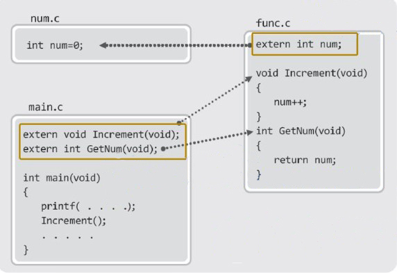

# 파일의 분할과 헤더파일의 디자인


## 목차

- [파일의 분할](#파일의-분할)
- [둘 이상의 파일을 컴파일하는 방법과 static에 대한 고찰](#둘-이상의-파일을-컴파일하는-방법과-static에-대한-고찰)
- [헤더파일의 디자인과 활용](#헤더파일의-디자인과-활용)


## 파일의 분할

> 파일을 그냥 나눠도 될까?

두 개의 서랍장이 있다. 하나는 수납공간이 통으로 된 서랍장이고, 다른 하나는 크고 작은 여러 개의 공간으로 수납공간이 나눠진 서랍장이다. 어떠한 수납장이 물건 관리가 용이할까?  
공간이 여러 개이면 물건을 용도 및 특성 별로 나눠서 저장할 수 있고, 그러면 물건도 쉽게 찾을 수 있으니, 당연히 여러 개의 공간으로 나눠진 서랍장이 물건관리가 용이하다.  
그런데 파일을 나누는 이유도 이와 별반 차이가 없다. 파일을 나눠서 각각의 파일에, 용도 및 특성 별로 함수와 변수를 나눠서 저장하면 소스코드의 관리가 용이해진다.  
그럼 파일을 나누는 방법에 대한 고민을 시작해보자. 그리고 이를 위해서 먼저 다음 프로그램을 대상으로 파일을 나눠보기로 하겠다.


SimpleOneFile.c

```c
#include <stdio.h>
int num = 0;

void Increment(void)
{
	num++;
}

int GetNum(void)
{
    return num;
}

int main(void)
{
    printf("num: %d \n", GetNum());
    Increment();
    printf("num: %d \n", GetNum());
    Increment();
    printf("num: %d \n", GetNum());
    return 0;
}
```


실행 결과

```
num: 0
num: 1
num: 2
```


이 파일을 다음과 같이 총 세 개의 파일로 나눠서 저장한다고 가정해 보자. 컴파일이 제대로 되겠는가?  
단 헤더파일 선언은 각각의 파일에 적절히 이뤄졌다고 가정하겠으니 이 부분을 문제시 삼지는 말자.


안타깝게도 위의 그림과 같은 형태로 파일을 나누면 컴파일 시 에러가 발생하는데(컴파일 방법은 잠시 후에 설명), 에러의 발생 이유는 컴파일러의 다음과 같은 특성 때문이다.

__컴파일러는 파일 단위로 컴파일을 진행합니다.__

쉽게 말해서 컴파일러는 다른 파일의 정보를 참조하여 컴파일을 진행하지 않는다. 때문에 위 그림의 파일 func.c를 컴파일 하면 다음과 같은 내용의 불평을 한다.

__변수 num이 도대체 어디에 선언된거야__

그리고 main.c를 컴파일 하면서도 다음과 같은 내용의 불평을 한다.

__Increment 함수는 정의된 적이 없잖아__

물론 우리는 변수 num이 num.c에 선언되어 있고, Increment 함수가 func.c에 정의되어 있다는 것을 안다.  
그러나 컴파일러는 이를 인식하지 못한다. 앞서 컴파일 했더라도 인식하지 못한다. 컴파일러는 func.c 안에서만 변수 num의 선언을 찾고, main.c 안에서만 Increment 함수의 정의를 찾다가 에러 메시지를 출력할 뿐이다.


> 외부에 선언 및 정의되었다고 컴파일러에게 알려줘야 합니다.

위 그림의 형태로 파일을 분할해서 컴파일 하기 위해서는 컴파일러에게 다음과 같은 내용의 메시지를 전달해야 한다.

__num은 외부 파일에 int형으로 선언된 변수야__

__Increment는 반환형과 매개변수의 형이 void인 함수인데, 외부 파일에 정의되어 있어__

이 중에서 첫 번째 메시지는 func.c를 컴파일 할 때 필요하다. 따라서 func.c에는 다음의 선언이 삽입 되어야 하는데, 여기서 extern은 int형 변수 num이 외부에 선언되었음을 컴파일러에게 알릴 때 사용되는 키워드이다.

```c
extern int num;		// int형 변수 num이 외부에 선언되어 있다.
```

즉 위의 선언은 변수 num을 할당하는 선언이 아니다. num의 자료형이 무엇이고, 어디에 선언되어 있는지를 컴파일러에게 알려주는 메시지일 뿐이다.  
그리고 두 번째 메시지는 main.c에 필요하다. 따라서 main.c에는 다음의 선언이 삽입되어야 한다.

```c
extern void Increment(void);		// void Increment(void) 함수가 외부에 정의되어 있다.
```

참고로 함수가 외부에 정의되어 있음을 알릴 때에는 extern 선언을 생략할 수 있다. 즉 다음과 같이 선언해도 동일한 메시지가 컴파일러에게 전달된다.

```c
void Increment(void);
```

이제 위 그림에서 보여주는 문제점의 해결을 위해서 소스코드가 다음과 같이 정정되어야 함을 알 수 있을 것이다.



참고로 컴파일러에게는 extern 선언을 통해서 함수 또는 변수가 외부에 선언 및 정의되어 있다는 사실만 알리면 된다. 구체적으로 어느 파일에 선언 및 정의되어있는지 까지는 알리지 않아도 된다.


> 다른 파일에서 접근을 못하게 하고 싶다면 static!

이미 오래 전에 'static 지역변수'에 대해서 설명을 했는데, 이를 이어서 'static 전역변수'에 대해 설명하고자 한다.  전역변수의 static 선언은 다음의 의미를 담고 있다.

__이 변수는 외부 파일에서의 접근을 허용하지 않는다.__

이를 다소 전문적으로 표현하면 다음과 같다.

__이 변수의 접근범위는 파일 내부로 제한한다.__

따라서 위 그림의 num.c에 선언된 변수 num을 다음과 같이 선언하면 func.c에서는 변수 num에 접근할 수가 없어서 컴파일 오류가 발생한다.

```c
static int num = 0;
```

이처럼 static 전역변수는 접근의 범위를 파일의 내부로 제한하는 경우에 사용된다.


## 둘 이상의 파일을 컴파일 하는 방법과 static에 대한 고찰

> 파일부터 정리하고 시작합시다!


실행을 위해서 위 그림과 같은 형태로 파일을 나누자. 물론 이를 위해서는 다음과 같이 총 세 개의 파일을 만들어서,   
위 그림의 형태대로 코드를 삽입해야 한다.

```c
num.c	func.c	main.c
```

그리고 추가로 printf 함수의 호출문이 존재하는 main.c에는 다음 문장을 삽입해야 한다.

```c
#include <stdio.h>
```

이 때 이들 파일을 생성하고 프로젝트에 추가하는 방법에는 다음과 같이 두 가지가 있다.

- 첫 번째 방법: 파일을 먼저 생성해서 코드를 삽입한 다음에 프로젝트에 추가한다.
- 두 번째 방법: 프로젝트에 파일을 추가한 다음에 코드를 삽입한다.

첫 번째 방법에서는 파일을 먼저 생성해서 코드를 삽입한다고 했는데, 이 때 메모장을 포함한 어떠한 편집기를 사용해도 된다. 하지만 이는 일반적으로 컴파일 할 파일이 이미 존재하는 경우에 사용하는 방법이다.  
반면 두 번째 방법은 새로운 파일을 추가해서 코드를 직접 입력하는 경우에 사용하는 방법이다.


> 첫 번째 방법: 이미 만들어진 파일을 프로젝트에 추가하는 방법
