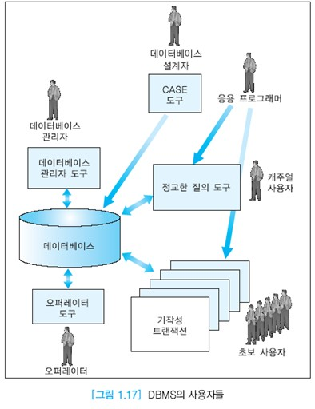

# DBMS 사용자

## 목차

- [데이터베이스 관리자](#데이터베이스-관리자)
- 응용 프로그래머
- 최종 사용자
- 데이터베이스 설계자
- 오퍼레이터

## 데이터베이스 관리자

DBA : Database Administrator

데이터베이스 관리자는 조직의 여러 부분의 상이한 요구를 만족시키기 위해서 일관성 있는 데이터베이스 스키마를 생성하고 유지하는 사람(팀)을 말한다.

데이터베이스 관리자는 데이터베이스를 생성하기 위해서 다양한 사용자들의 요구사항을 분석하고 평가해야 하며 이 결과에 따라 논리적인 구조(데이터베이스 스키마)를 결정하게 된다.

논리적인 구조 위에서 여러 사용자들의 요구에 맞는 뷰들을 정의한다.

데이터베이스 관리자는 조직의 정보 자원과 필요성을 잘 이해하고 있어야 한다.

데이터베이스 관리자의 역할은 관리적인 역할부터 기술적인 역할까지 다양하다.

대규모 데이터베이스에서는 다수의 사람으로 이루어진 팀이 데이터베이스 관리자 역할을 수행한다.

데이터베이스 관리자는 데이터 정의어의 주요 사용자이다.

주요 DBMS들은 데이터베이스 관리자가 사용할 수 있는 데이터베이스 관리 도구들을 지원한다.

데이터베이스 관리자는 이런 관리 도구들을 사용하여 아래와 같은 업무를 수행한다.

:
