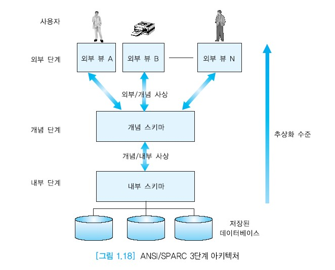
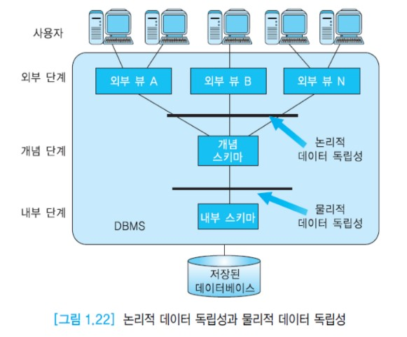

# ANSI/SPARC 아키텍처와 데이터 독립성

## 목차

- [ANSI/SPARC 아키텍처](#ansi/sparc-아키텍처)
  - [외부 단계](#외부-단계)
  - [개념 단계](#개념-단계)
  - [내부 단계](#내부-단계)

- 데이터 독립성

## ANSI/SPARC 아키텍처

DBMS의 주요 목적은 사용자에게 추상적인 뷰를 제공하는 것이다.

이말인즉슨, 데이터가 어떻게 저장되고 유지되는가에 관한 상세한 사항을 숨기는 것이다.

현재 대부분의 상용 DBMS 구현에서 사용되는 일반적인 아키텍처는 1978년에 제안된

__ANSI/SPARC 아키텍처__이다.

ANSI/SPARC 아키텍처의 3단계는 물리적, 개념적, 외부 단계로 이루어진다.

- 외부 단계 : 각 사용자의 뷰
- 개념 단계 : 사용자 공동체의 뷰
- 내부 단계 : 물리적 또는 저장 뷰

3단계 데이터베이스 아키텍처는 프로그램-데이터 독립성, 데이터에 대한 다수의 뷰를 제공하는 DBMS의 특성을 지원한다.

3단계 아키텍처의 주요 목적은 데이터베이스에 대한 사용자의 관점과 데이터베이스가 실제로 표현되는 방식을 분리하는 것이다.

이는 아래와 같은 이유로 인해 바람직하다.

- 독립적인 사용자 맞춤형 뷰를 제공한다.

  각 사용자는 동일한 데이터를 서로 다른 맞춤형 뷰를 가지면서 접근할 수 있어야 하며 이는 서로 독립적이어야 한다. 즉 한 사용자의 뷰의 변화는 다른 사용자의 뷰에 영향을 미치지 않아야 한다.

- 사용자를 위해서 상세한 물리적인 저장을 숨겨야 한다.

  사용자는 물리적인 데이터베이스 저장의 상세한 내용을 다룰 필요가 없어야 한다. 사용자들은 데이터 자체만 다루도록 허용되어야 한다.

- 데이터베이스 관리자는 사용자들의 뷰에 영향을 미치지 않으면서 데이터베이스 저장 구조를 변경할 수 있어야 한다.

  때때로 한 조직의 데이터베이스의 구조를 바꿔야 하는 중요한 이유가 생길 수있다.

- 데이터베이스의 내부 구조는 저장의 물리적인 측면이 바뀌어도 영향을 받지 않아야 한다.

  새로운 디스크에 데이터베이스가 저장될 수 있다.

- 데이터베이스 관리자는 사용자들에게 영향을 미치지 않으면서 데이터베이스의 개념적 구조 또는 전역적인 구조를 바꿀 수 있어야 한다.

  요구되는 각 사용자의 뷰를 여전히 유지하면서 이런 작업이 가능해야 한다.

위 그림은 ANSI/SPARC 3단계 아키텍처를 보여준다.

제일 위의 단계는 사용자와 가장 가까운 외부 단계이고 가운데에 위치한 단계가 개념 단계이고,

그 아래 단계는 물리적 저장 장치와 가까운 내부 단계이다.

내부 단계에서 외부 단계로 올라갈수록 추상화 수준이 높아진다.

일반적으로 데이터베이스 관리자만 세 개의 단계 모두를 접근한다.

### 외부 단계

외부 단계는 데이터베이스의 각 사용자가 갖는 뷰이다.

외부 단계는 각 사용자가 어떻게 데이터를 보는가를 기술한다.

여러 부류의 사용자를 위해 동일한 개념 단계로부터 다수의 서로 다른 뷰가 제공될 수 있다.

외부 단계들은 동일한 데이터에 대한 서로 다른 표현들을 제공할 수 있다.

### 개념 단계

개념 단계는 조직체의 정보 모델로서, 물리적인 구현은 고려하지 않으면서 조직체 전체에 관한 스키마를 포함한다.

개념 단계는 데이터베이스에 어떤 데이터가 저장되어 있으며, 데이터 간에는 어떤 관계가 존재하고, 어떤 무결성 제약조건들이 명시되어 있는가를 기술한다.

다시 말하면 개념 단계는 전체 데이터베이스의 논리적인 구조를 기술한다.

개념 단계는 데이터베이스에 대한 사용자 공동체의 뷰를 나타낸다.

데이터베이스마다 오직 한 개의 개념 스키마가 존재한다.

개념 단계는 저장 구조와 독립적이다.

관계 데이터 모델에서 개념 스키마는 테이블들의 집합으로 표현된다.

### 내부 단계

내부 단계는 실제의 물리적인 데이터 구조에 관한 스키마이다.

데이터베이스에 어떤 데이터가 어떻게 저장되어 있는가를 기술한다.

내부 단계에서는 인덱스, 해싱 등과 같은 접근 경로, 데이터 압축 등을 기술한다.

이 단계에서는 효율성을 가장 중요하게 고려하며 효율적인 데이터베이스를 제공하기 위한 데이터 구조가 선택된다.

데이터베이스마다 한 개의 내부 스키마가 존재한다.

데이터베이슨의 개념 스키마에는 영향을 미치지 않으면서 성능을 향상시키기 위해 내부 스키마를 변경하는 것이 바람직할 수 있다.

내부 단계에서 물리적인 저장 장치를 직접적으로 다루지는 않는다.

그 대신에 내부 단계에서는 물리적인 장치가 물리적인 페이지들의 모임으로 이루어진다고 가정하고 논리적인 페이지들의 관점에서 공간을 할당한다.

내부 단계 아래는 물리적 단계이다. 물리적 단계는 DBMS의 지시에 따라 운영 체제가 관리한다.

물리적 단계는 디스크 같은 저장 장치에 데이터를 물리적으로 저장하는 기법을 다룬다.

## 데이터 독립성

ANSI/SPARC 아키텍처의 주요 목적은 __데이터 독립성__을 제공하는 것이다.

데이터 독립성은 상위 단계의 스키마 정의에 영향을 주지 않으면서 어떤 단계의 스키마 정의를 변경할 수 있음을 의미한다.

데이터 독립성은 __논리적 데이터 독립성__과 __물리적 데이터 독립성__으로 구분할 수 있다.

위 그림은 ANSI/SPARC 아키텍처에서 논리적 데이터 독립성과 물리적 데이터 독립성이 적용되는 위치를 보여준다.

### 논리적 데이터 독립성

논리적 데이터 독립성은 개념 스키마의 변화로부터 외부 스키마가 영향을 받지 않음을 의미한다.

기존의 외부 스키마에 영향을 미치지 않고, 응용 프로글매을 다시 작성할 필요 없이 개념 스키마에 대한 변화가 가능해야 한다.

### 물리적 데이터 독립성

물리적 데이터 독립성은 내부 스키마의 변화가 개념 스키마에 영향을 미치지 않으며, 따라서 외부 스키마(또는 응용 프로그램)에도 영향을 미치지 않음을 의미한다.

내부 스키마의 변화의 예로는 화일의 저장 구조를 바꾸거나 인덱스를 생성하거나 삭제하는 등의 작업이 있다.

위와 같은 작업들은 성능 향상을 위해 때때로 필요하다.

물리적인 데이터 독립성이 제공되면 응용 프로그램들은 데이터가 어떻게 물리적인 구조를 갖고 저장었는가를 신경 쓸 필요가 없다.

구현에 관한 상세한 사항과 최적화는 DBMS에게 맡기면 된다. 이것이 오늘날 관계 DBMS가 성공을 거둔 가장 중요한 이유 중의 하나이다.

