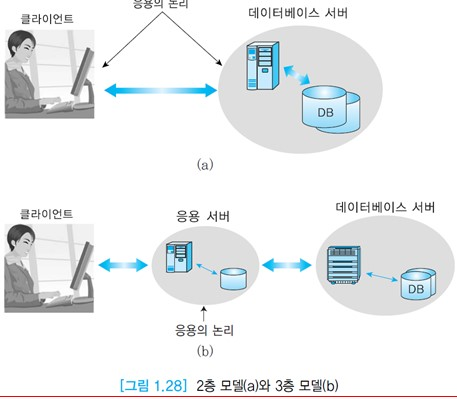

# 데이터베이스 시스템 아키텍처

소프트웨어 시스템은 일반적으로 아키텍처를 갖는다.

DBMS는 다수의 모듈로 이루어진 복잡한 소프트웨어이다.

데이터베이스 관리자가 데이터 정의어를 사용하여 테이블 생성을 요청하면 __데이터 정의어 컴파일러(DDL compiler)__가 이를 번역하여, 테이블이 화일 형태로 데이터베이스에 만들어지고, 이 테이블에 대한 명세가 시스템 카탈로그에 저장된다.

최종 사용자나 응용 프로그래머가 데이터 조작어를 사용하여 데이터베이스를 접근하려 하면
DBMS의 질의 처리기를 통해서 기계어 코드로 번역되고,
DBMS의 __런타임 데이터베이스 관리기__에 의해 데이터베이스가 접근된다.

이 과정에서, 사용자가 원하는 테이블이 데이터베이스에 존재하는가, 데이터 조작어를 입력한 사용자가 해당 테이블을 접근할 수 있는 권한이 있는가, 테이블에 어떤 접근 경로들이 존재하는가 등을 시스템 카탈로그를 접근하여 확인한다.

__동시성 제어__와 __회복 모듈__을 합쳐서 __트랜잭션 관리__ 모듈이라고 부르는데
__동시성 제어__는 여러 사용자가 공용 데이터베이스를 접근할 때 생길 수 있는 데이터 불일치를 해결한다.
__회복 모듈__은 데이터베이스를 접근하는 도중에 시스템이 다운되면, 다운되기 직전의 일관된 데이터베이스 상태를 복구하기 위해서 사용된다.

위 그림에는 표현되지 않았지만 __데이터베이스 API__도 데이터베이스 시스템에 포함된다.

API는 공통적으로 사용되는 데이터베이스 접근 유형을 위한 라이브러리 함수들로 각 제품마다 고유한 데이터베이스 API가 있지만 이런 API는 다른 제품에선 동작하지 않는다.

중요한 API 표준은 __ODBC(Open Database Connectivity)__ 와 __JDBC(Java Database Connectivity)__ 이다.

어떤 API를 사용하던 목적은 데이터베이스에 대한 접근을 간단하게 하며 데이터베이스 간의 차이점을 숨기는 것이다.

__ODBC__ 는 MS사가 주도하여 개발한 데이터베이스 드라이버로 사실상 산업계의 표준이 되었으며 윈도우 운영체제에서 사용된다.

__JDBC__ 는 자바를 위한 드라이버로 자바가 운영되는 모든 플랫폼에서 지원된다. JDBC는 자바로 작성된 클래스와 인터페이스들의 집합으로 이루어진다.

일반적으로 __ODBC__는 응용들 간에 사용되고, __JDBC__는 자바 프로그래머가 관계 데이터베이스에 접근할 때 사용된다.
__ODBC__로 접근할수 있는 데이터베이스들을 작은 bridge 프로그램을 사용하여 __JDBC__ 인터페이스에서 접근할 수 있다.

다른 데이터베이스를 접근하기 위해서 __ODBC__ 를 사용하려면 사용자는 __ODBC__ 소프트웨어, 접근하려면 각 데이터베이스에 대한 별도의 모듈(드라이버)이 필요하다.
드라이버는 DBMS의 운영 체제와 네트워크 프로토콜의 차이점을 가려준다.

표준 데이터베이스 API를 지원하는 DBMS 간에는 서로 상대방의 데이터베이스를 접근할 수 있다.

예를 들어, 오라클과 MS SQL Server의 내부는 다르지만 아래 그림처럼 오라클에서 __ODBC__ 를 통해 MS SQL Server 데이터베이스를 접근할 수 있다.
__ODBC__는 SQL 요청을 받아서 각 데이터베이스 시스템이 인식할 수 있는 요청으로 변환한다.

데이터베이스 시스템을 운영하는데 연관된 사이트들의 수와 이 사이트들의 역할에 따라 데이터베이스 시스템의 아키텍처를 몇 가지 유형으로 구분할 수 있다.

### 중앙 집중식 데이터베이스 시스템

데이터베이스 시스템이 하나의 컴퓨터 시스템에서 운영된다.

데이터베이스 접근과 관련하여 다른 컴퓨터 시스템과 상호 작용하지 않는다.

중앙의 컴퓨터에 저장된 데이터베이스를 여러 단말기에서 접근하는 구조이다.

### 분산 데이터베이스 시스템

네트워크로 연결된 여러 사이트에 데이터베이스 자체가 분산되어 있으며,
데이터베이스 시스템도 여러 컴퓨터 시스템에서 운영된다.

사용자는 다른 사이트에 저장된 데이터베이스에도 접근할 수 있다.

사용자에게 데이터베이스가 분산되지 않은 것처럼 느끼게 만드는 것이 필요하다.

각 컴퓨터마다 분산DBMS가 운영되고 상요자는 지역 데이터베이스뿐만 아니라 원격 데이터베이스도 접근할 수 있다.

### 클라이언트-서버 데이터베이스 시스템

중앙 집중식 데이터베이스 시스템에서는 자체 처리 능력이 없는 단말기를 통해 중앙의 데이터베이스를 접근하지만 클라이언트-서버 데이터베이스 시스템에서는 PC 또는 워크스테이션처럼 자체 컴퓨팅 능력을 가진 클라이언트를 통해 데이터베이스 서버를 접근한다.

분산 데이터베이스 시스템과 달리 클라이언트-서버 데이터베이스 시스템에서는 데이터베이스가 하나의 데이터베이스 서버에 저장되어 있다.

클라이언트-서버 데이터베이스 시스템에서는 데이터베이스 시스템의 기능이 서버와 클라이언트에 분산된다.
서버는 데이터베이스를 저장하고 DBMS를 운영하면서 여러 클라이언트에서 온 질의를 최적화하고, 권한 검사를 수행하고, 동시성 제어와 회복 기능을 수행하고, 데이터베이스의 무결성을 유지하고, 데이터베이스 접근을 관리한다.
클라이언트는 사용자 인터페이스를 관리하고 응용들을 수행한다.
클라이언트와 서버 사이의 인터페이스는 SQL이나 API를 이용한다.

클라이언트-서버 아키텍처는 클라이언트와 데이터베이스 서버가 직접 연결되는 __2층 모델__(2-tier model)과
클라이언트와 데이터베이스 서버 사이에 __응용 서버__(application server)가 추가된 __3층 모델__(3tier model)로 구분한다.

2층 모델에서는 응용의 논리가 클라이언트와 서버에 흩어져 있으며,
3층 모델에서는 응용의 논리가 응용 서버에만 포함되어 있다.
2층 모델에 비해서 3층 모델이 갖는 장점은 서비스 요청과 응답이 클라이언트와 응용 서버 간에만 전송되기 때문에 성능이 향상된다.
또한 응용 소프트웨어를 다수의 클라이언트 대신에 소수의 응용 서버에 설치하게 되므로 구현 및 유지보수가 용이하는 것이다.

3층 모델에서 클라이언트는 프레젠테이션 기능을 수행하고, GUI를 관리하고, 네트워크 접근을 제공하는 통신 소프트웨어를 실행한다.
응용 서버는 비즈니스와 데이터 논리를 처리한다.
데이터베이스 서버는 데이터베이스를 관리한다.
3층 모델을 ANSI/SPARC의 3단계 아키텍처와 혼동하면 안된다.

예를 들어, 3층 모델을 따라 구현된 항공기 예약 시스템에서 클라이언트는 사용자 로그인을 수행하고, 사람이 알아보기 쉬운 형식으로 결과를 디스플레이한다.
응용 서버는 새로운 예약을 처리하고, 기존 예약을 취소하고, 새로운 항공편을 추가하는 등의 논리를 수행한다.
데이터베이스 서버는 항공편 정보(예약 좌석 수, 총 좌석 수, 빈 좌석 수 등), 예약자 정보 등을 관리한다.

클라이언트-서버 데이터베이스 시스템의 장점은 기존의 데이터베이스를 보다 넓은 지역에서 접근할 수 있고, 성능이 향상되며, 하드웨어 비용이 절감된다는 것이다.
또한 다양한 컴퓨터 시스템을 사용할 수 있다.
예를 들어, 클라이언트는 PC에서 윈도우 운영 체제를 사용하고, 서버는 워크스테이션이나 메인프레임에서 UNIX 운영 체제를 사용할 수 있다.
보안이 다소 취약할 수 있다는 것은 클라이언트-서버 데이터베이스 시스템의 단점이다.

