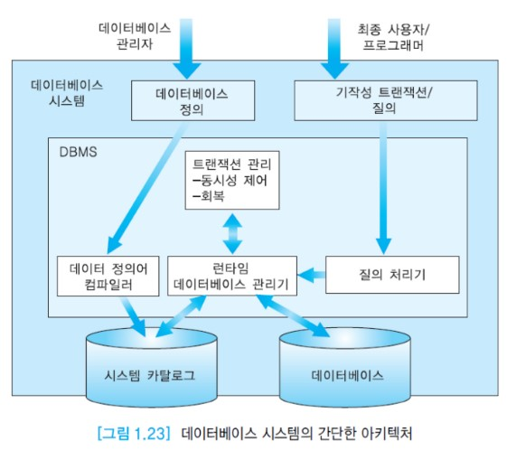
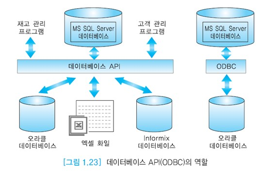

# 데이터베이스 시스템 아키텍처

소프트웨어 시스템은 일반적으로 아키텍처를 갖는다.

DBMS는 다수의 모듈로 이루어진 복잡한 소프트웨어이다.

데이터베이스 관리자가 데이터 정의어를 사용하여 테이블 생성을 요청하면 __데이터 정의어 컴파일러(DDL compiler)__가 이를 번역하여, 테이블이 화일 형태로 데이터베이스에 만들어지고, 이 테이블에 대한 명세가 시스템 카탈로그에 저장된다.

최종 사용자나 응용 프로그래머가 데이터 조작어를 사용하여 데이터베이스를 접근하려 하면
DBMS의 질의 처리기를 통해서 기계어 코드로 번역되고,
DBMS의 __런타임 데이터베이스 관리기__에 의해 데이터베이스가 접근된다.

이 과정에서, 사용자가 원하는 테이블이 데이터베이스에 존재하는가, 데이터 조작어를 입력한 사용자가 해당 테이블을 접근할 수 있는 권한이 있는가, 테이블에 어떤 접근 경로들이 존재하는가 등을 시스템 카탈로그를 접근하여 확인한다.

__동시성 제어__와 __회복 모듈__을 합쳐서 __트랜잭션 관리__ 모듈이라고 부르는데
__동시성 제어__는 여러 사용자가 공용 데이터베이스를 접근할 때 생길 수 있는 데이터 불일치를 해결한다.
__회복 모듈__은 데이터베이스를 접근하는 도중에 시스템이 다운되면, 다운되기 직전의 일관된 데이터베이스 상태를 복구하기 위해서 사용된다.

위 그림에는 표현되지 않았지만 __데이터베이스 API__도 데이터베이스 시스템에 포함된다.

API는 공통적으로 사용되는 데이터베이스 접근 유형을 위한 라이브러리 함수들로 각 제품마다 고유한 데이터베이스 API가 있지만 이런 API는 다른 제품에선 동작하지 않는다.

중요한 API 표준은 __ODBC(Open Database Connectivity)__ 와 __JDBC(Java Database Connectivity)__ 이다.

어떤 API를 사용하던 목적은 데이터베이스에 대한 접근을 간단하게 하며 데이터베이스 간의 차이점을 숨기는 것이다.

__ODBC__ 는 MS사가 주도하여 개발한 데이터베이스 드라이버로 사실상 산업계의 표준이 되었으며 윈도우 운영체제에서 사용된다.

__JDBC__ 는 자바를 위한 드라이버로 자바가 운영되는 모든 플랫폼에서 지원된다. JDBC는 자바로 작성된 클래스와 인터페이스들의 집합으로 이루어진다.

일반적으로 __ODBC__는 응용들 간에 사용되고, __JDBC__는 자바 프로그래머가 관계 데이터베이스에 접근할 때 사용된다.
__ODBC__로 접근할수 있는 데이터베이스들을 작은 bridge 프로그램을 사용하여 __JDBC__ 인터페이스에서 접근할 수 있다.

다른 데이터베이스를 접근하기 위해서 __ODBC__ 를 사용하려면 사용자는 __ODBC__ 소프트웨어, 접근하려면 각 데이터베이스에 대한 별도의 모듈(드라이버)이 필요하다.
드라이버는 DBMS의 운영 체제와 네트워크 프로토콜의 차이점을 가려준다.

표준 데이터베이스 API를 지원하는 DBMS 간에는 서로 상대방의 데이터베이스를 접근할 수 있다.

예를 들어, 오라클과 MS SQL Server의 내부는 다르지만 아래 그림처럼 오라클에서 __ODBC__ 를 통해 MS SQL Server 데이터베이스를 접근할 수 있다.
__ODBC__는 SQL 요청을 받아서 각 데이터베이스 시스템이 인식할 수 있는 요청으로 변환한다.

데이터베이스 시스템을 운영하는데 연관된 사이트들의 수와 이 사이트들의 역할에 따라 데이터베이스 시스템의 아키텍처를 몇 가지 유형으로 구분할 수 있다.

### 중앙 집중식 데이터베이스 시스템

### 분산 데이터베이스 시스템

### 클라이언트-서버 데이터베이스 시스템
