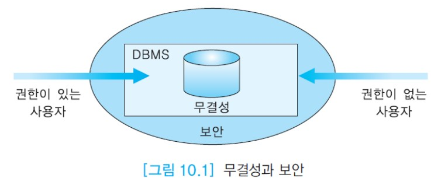

# 데이터베이스 보안

데이터베이스는 기업의 중요한 무형의 자산이다. 방대하고 복잡한 데이터베이스를 구축하는 데는 엄청난 비용이 든다.  
또한 데이터베이스를 관리하기 위해서 하드웨어와 DBMS와 같은 소프트웨어를 구입하는 데 많은 비용을 지불한다.  
만일 은행에서 관리하는 고객 데이터베이스에서 잔고가 손실된다면 부작용이 엄청나다. 따라서 데이터베이스는 어떤 유형의 위협에서도 반드시 보호해야 한다.  
일반적으로 세 가지 유형의 보안이 필요하다.

- 물리적 보호 : 화재, 홍수 지진 등과 같은 자연 재해, 도둑, 컴퓨터 시스템에 대한 우연한 손상, 데이터에 손상을 주는 기타 유형의 위험으로부터 데이터베이스를 보호하는 것을 의미한다.
- 권한 보호 : 권한을 가진 사용자만 특정한 접근 모드로 데이터베이스를 접근할 수 있도록 보호한다.  
  예를 들어, 어떤 사용자는 릴레이션을 읽기만 할 수 있는 반면에 어떤 사용자는 릴레이션을 갱신할 수 있다.  
  이는 데이터베이스의 비밀성과 정확성을 유지하기 위해 필요하다. 접근 제어는 DBMS 내에서 여러 수준으로 적용할 수 있다.  
  데이터베이스를 사용할 수 있는 사용자마다 계정과 비밀번호를 부여하고 데이터베이스의 특정 부분에 대한 특정 작업을 사용자마다 허용 할 수 있다.
- 운영 보호 : 데이터베이스의 무결성에 대한 사용자 실수의 영향을 최소화하거나 제거하는 조치를 말한다.  
  예를 들어, 나이 애트리뷰트에 324가 입력되든가, 이름 애트리뷰트에 숫자가 입력되는가 하는 것을 방지한다.  
  이런 조치는 무결성 제약조건들을 정의함으로써 달성할 수 있다. 일반적으로 무결성 제약조건은 데이터베이스 관리자 또는 릴레이션을 생성한 사용자가 릴레이션 스키마에 명시한다.

2장에서 설명한 무결성과 데이터베이스 보안의 차이점은 무결성은 권한이 있는 사용자로부터 데이터베이스를 보호하는 것이고,  
보안은 권한이 없는 사용자로부터 데이터베이스를 보호하는 것이다. 아래 그림은 무결성과 보안의 차이점을 보여준다.

보안 계획은 어떤 사용자가 어떤 데이터를 볼 수 있는가, 데이터베이스에서 어떤 작업을 수행할 수 있는가를 정의한다.  
보안 계획을 수립하려면 보안을 통해 제어해야 할 데이터베이스 내의 모든 항목과 작업들을 열거하고, 조직체 내의 개인과 그룹들을 열거하고,  
두 리스트를 상호 참조하여 데이터베이스 내에서 어떤 사용자가 어떤 데이터 집합에 대해서 어떤 작업을 수행할 수 있는가를 지정한다.

DBMS가 데이터베이스 보안과 관련하여 제공해야 하는 두 가지 기능이 있다.

- 데이터베이스 시스템에 대한 접근을 통제할 수 있는 기능을 제공해야 한다. 이를 __접근 제어(access control)__ 라 하며,  
  DBMS는 로그인 과정을 통제하기 위하여 사용자 계정과 암호를 관리한다.
- DBMS는 특정 사용자 또는 사용자들의 그룹이 지정된 데이터베이스 영역만 접근할 수 있고 그 외의 영역은 접근할 수 없도록 통제하는 기능을 제공해야 한다.  
  DBMS는 이런 목적을 위해서 보안 및 권한 관리 모듈을 가지고 있다.

데이터베이스 보안 기법은 일반적으로 두 가지 유형으로 구분한다.  
__임의 보안 기법(discretionary security mechanism)__ 은 사용자들에게 특정 릴레이션, 투플 또는 애트리뷰트를  
지정한 모드(예를 들어, 읽기, 삽입, 삭제, 수정)로 접근할 수 있는 권한을 부여한다. 대부분의 상용 관계 DBMS에서 사용되는 기법이다.  
__강제 보안 기법(mandatory security mechanism)__ 은 데이터와 사용자들을 다양한 보안 등급(1급 비밀, 2급 비밀, 3급 비밀, 일반 정보 등)으로 분류하고  
해당 조직에 적합한 보안 정책을 적용하여 다단계 보안을 시행하기 위해 사용된다. 아직 대부분의 상용 관계 DBMS는 이런 보안 기법을 제공하지 않는다.

임의 보안 기법은 객체(릴레이션과 뷰)에 대한 권한을 기반으로 사용자에게 권한을 허가하고(grant) 취소하는(revoke) 기법이다.  
릴레이션이나 뷰의 생성자는 자동적으로 그것에 대한 모든 권한을 갖는다.  
DBMS는 시스템 카탈로그에 누가 권한을 허가받았고 권한을 취소당했는가를 유지하며, 데이터베이스를 접근할 시점에 필요한 권한을 보유한 사용자만이 객체를 접근할 수 있도록 한다.

데이터베이스 관리자는 데이터베이스 시스템 전체에 대한 보안을 관리하며 이를 위한 모든 권한을 소유한다.  
데이터베이스 보안을 위해 데이터베이스 관리자가 수행하는 작업에는 사용자 또는 사용자들의 그룹에 대한 새로운 계정과 암호의 생성, 권한 부여와 취소, 특정 계정에 대한 특정 권한의 부여와 취소 등이 있다.  
또한 각 로그인 세션 동안 사용자가 데이터베이스에 가한 모든 연산들을 기록할 수 있다. 권한이 없는 사용자가 데이터베이스를 갱신했다는 의심이 들면 데이터베이스 감사를 실시한다.  
데이터베이스 감사는 특정 기간 동안 데이터베이스에서 수행된 모든 연산들을 검사하기 위해서 시스템 로그를 조사하는 것이다.
