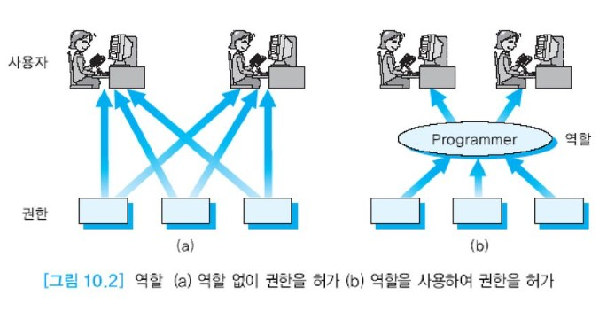

# 권한 관리

데이터베이스 시스템에서는 화일 시스템에 비해서 훨씬 세밀한 수준으로 권한을 허가하거나 취소할 수 있다.


## 목차

- [권한 허가](#권한-허가)
- [권한 취소](#권한-취소)
- [역할(role)](#역할-role-)


## 권한 허가

서로 다른 객체들에 대해서 다양한 권한들이 존재한다. 객체의 생성자(소유자)는 객체에 대한 모든 권한을 갖는다.  
예를 들어, 릴레이션을 소유한 사용자는 데이터를 보거나, 추가하거나, 삭제할 수 있으며 릴레이션 정의를 변경할 수 있다.  
어떤 릴레이션이나 뷰도 처음에는 그것을 생성한 사용자만이 접근할 수 있다. 생성자는 자신이 소유한 임의의 객체에 대한 특정 권한을 GRANT문을 사용하여 다른 사용자나 역할에게 허가할 수 있다.  
보안이 중요한 환경에서는 객체들에 대한 권한을 허가할 때 특히 주의해야 한다.

```sql
GRANT문의 형식

GRANT		권한[(애트리뷰트들의 리스트)]
ON		    객체
TO          {사용자|역할|PUBLIC}
[WITH GRANT OPTION];
```

릴레이션 및 뷰에 대한 권한을 허가할 수 있는 사용자는 GRANT절에 SELECT, INSERT, DELETE, UPDATE, REFERENCES 중 한 개 이상의 권한을 포함할 수 있다.  
애트리뷰트 리스트는 SELECT, UPDATE와 함께 지정할 수 있다. 애트리뷰트들의 리스트를 생략하면 권한이 릴레이션과 뷰에 있는 모든 애트리뷰트에 적용된다.  
SELECT문에서 애트리뷰트들을 접근하려면 해당 애트리뷰트에 대한 SELECT 권한이 필요하다.  
UPDATE문을 사용하여 애트리뷰트를 수정하려면 그 애트리뷰트에 대한 UPDATE 권한이 필요하다.  
릴레이션을 참조하는 외래 키 제약 조건을 만들려면 해당 릴레이션에 대해 REFERENCES 권한이 필요하다.  
REFERENCES 권한은 다른 릴레이션의 소유자가 지금 권한을 허가하려는 릴레이션의 애트리뷰트를 자기 릴레이션의 외래 키 제약 조건에 포함시킬 수 있게 한다.

만일 어떤 사용자가 WITH GRANT OPTION과 함께 권한을 허가받았으면 사용자도 WITH GRANT OPTION과 함께 또는 WITH GRANT OPTION 없이 그 권한을 다른 사용자에게 허가할 수 있다.  
WITH GRANT OPTION과 함께 권한을 부여받은 사용자는 이 권한을 다른 사용자에게 부여할 수 있으므로 이 권한을 갖는 사용자들이 긴 체인 형식으로 늘어날 수 있다.  
그러나 동일한 권한을 부여받은 사용자가 순환 형식으로 존재할 수는 없다.

기본 릴레이션의 소유자가 다른 사용자들이 릴레이션에 직접 접근하지 못하게 하려는 경우에는 릴레이션 자체에 대한 권한은 허가하지 않고,  
릴레이션을 참조하는 뷰를 정의한 후 이 뷰에 대해 권한을 부여할 수 있다.  
예를 들어, KIM이 EMPLOYEE 릴레이션 위에 EMP_DNO3이라는 뷰를 만들면 이 뷰를 소유하게 된다.  
KIM이 LEE에게 EMP_DNO3 에 대한 SELECT 권한을 허가하면 LEE 가 EMPLOYEE 에 대한 SELECT 권한을 갖고 있지 않아도 LEE가 이 뷰를 접근할 수 있다.  
만일 뷰의 생성자가 뷰의 기반이 되는 기본 릴레이션에 대한 SELECT 권한을 취소당하면 뷰가 제거된다.

```sql
예1 : WITH GRANT OPTION 없이 SELECT 권한 허가

사용자 KIM이 자신이 소유한 EMPLOYEE 릴레이션에 대한 SELECT 권한을 사용자 LEE에게 허가한다.

GRANT   	SELECT
ON      	EMPLOYEE
TO      	LEE;

LEE는 WITH GRANT OPTION 없이 SELECT 권한을 허가 받았기 때문에 다른 사용자(예,CHOI)에게 권한을 다시 허가할 수 없다.
```


```sql
예2 : WITH GRANT OPTOIN 없이 특정 애트리뷰트들을 수정할 수 있는 권한을 허가

사용자 KIM이 자신이 소유한 EMPLOYEE 릴레이션의 TITLE과 MANAGER 애트리뷰트에 대한 UPDATE 권한을 사용자 LEE에게 허가한다.

GRANT		UPDATE (TITLE, MANAGER)
ON			EMPLOYEE
TO			LEE;
```


```sql
예3 : REFERENCES 권한 허가

사용자 KIM이 자신이 소유한 EMPLOYEE 릴레이션의 기본 키 애트리뷰트인 EMPNO에 대한 REFERENCES 권한을 사용자 CHOI에게 허가한다.

GRANT		REFERENCES (EMPNO)
ON			EMPLOYEE
TO			CHOI;
```


```sql
예4 : WITH GRANT OPTION과 함께 권한 허가

사용자 KIM이 자신이 소유한 DEPARTMENT 릴레이션에 대한 SELECT와 INSERT 권한을 WITH GRANT OPTION과 함께 사용자 LEE에게 허가한다.

GRANT		SELECT, INSERT
ON			DEPARTMENT
TO			LEE
WITH GRANT OPTION;

LEE는 다시 이 권한들을 다른 사용자들에게 WITH GRANT OPTION과 함께 또는 WITH GRANT OPTION 없이 허가할 수 있다.
따라서 이렇게 권한을 허가받은 사용자들의 긴 체인이 형성될 수 있다.
```


```sql
예5 : 모든 사용자들에게 권한 허가

사용자 KIM이 자신이 생성한 EMPLOYEE 릴레이션에 대한 SELECT 권한을 모든 사용자들에게 허가한다.
PUBLIC이라고 부르는 특별한 사용자는 모든 사용자를 의미한다.

GRANT		SELECT
ON			EMPLOYEE
TO			PUBLIC;
```


만일 사용자가 권한이 없는 연산(예를 들어, DELETE 권한을 갖지 않은 릴레이션에서 투플을 삭제하려 함)을 수행하려 하면 DBMS는 그 연산을 거절한다.  
사용자는 시스템 카탈로그에서 자신이 보유한 권한들을 확인할 수 있다.

데이터베이스 관리자가 특정 시스템 권한을 사용자에게 허가하기 위해서도 GRANT문을 사용한다.

```sql
GRANT		CREATE TABLE, CREATE VIEW
TO			KIM;
```

일단 사용자가 권한을 허가받으면 사용자는 즉시 그 권한을 사용할 수 있다. 이 예에서 사용자 KIM은 릴레이션과 뷰들을 생성할 수 있는 권한을 허가 받았다.


## 권한 취소

다른 사용자에게 허가한 권한을 취소하기 위해서 REVOKE문을 사용한다.  
만일 어떤 사용자가 다른 사용자에게 허가했던 권한을 취소하면, 권한을 취소당한 사용자가 WITH GRANT OPTION을 통해서 다른 사용자에게 허가했던 권한들도 연쇄적으로 취소된다.  
취소하려는 권한을 허가했던 사람만 그 권한을 취소할 수 있다. 또한 권한을 허가했던 사람은 자신이 권한을 허가했던 사용자로부터만 권한을 취소할 수 있다.

```sql
REVOKE문의 형식

REVOKE		{권한들의 리스트 | ALL}
ON			객체
FROM		{사용자 | 역할 | PUBLIC};
```


```sql
예6 : 객체 권한을 취소

사용자 KIM이 DEPARTMENT 릴레이션에 대해 LEE에게 허가한 SELECT, INSERT 권한을 취소한다.

REVOKE		SELECT, INSERT
ON			DEPARTMENT
FROM		LEE;
```


예4에서 나오는 LEE 는 EMPLOYEE 에 대해서 SELECT 객체 권한을 WITH GRANT OPTION 과 함께 허가받았다.  
LEE 는 CHOI 에게 EMPLOYEE 에 대한 SELECT 권한을 허가했다.  KIM 이 LEE 에게 허가한 SELECT 권한을 나중에 취소하였다.  
이 취소는 CHOI에 대한 권한의 취소로 파급된다. WITH GRANT OPTION과 함께 허가받은 권한은 권한을 허가해준 사용자의 권한이 취소되면 취소된다.


## 역할(role)

여러 사용자들에 대한 권한 관리를 단순화하기 위해 역할을 사용한다.  
역할은 사용자에게 허가할 수 있는 연관된 권한들의 그룹으로서 이름을 갖는다. 이 개념은 권한들을 취소하고 유지하는 것을 용이하게 한다.  
각 사용자는 여러 역할들에 속할 수 있으며 여러 사용자들이 동일한 역할을 허가받을 수 있다.

동일한 권한들의 집합을 여러 사용자들에게 허가하는 대신에 이 권한들을 역할에게 허가하고, 역할을 각 사용자에게 허가한다.  
어떤 역할과 연관된 권한들에 변화가 생기면 그 역할을 허가받은 모든 사용자들은 자동적으로 즉시 변경된 권한들을 가지게 된다.  
권한들을 일시적으로 중지시키기 위해서 역할을 비활성화 시킬 수도 있다.

역할은 데이터베이스 내의 권한들의 관리를 쉽게 하기 위해서 설계된다.  
그림10.2(a)는 두 명의 사용자가 동일한 역할(예, 프로그래머)을 수행하는 사원으로서 세 가지 권한을 필요로 하는데, 세 가지 권한을 각 사용자에게 별도로 허가하는 것을 보여준다.  
그림 10.2(b)는 programmer라는 역할을 생성하고, 그 역할에게 세 가지 권한을 부여하고, 그 역할을 두 명의 사용자에게 허가하는 것을 보여준다.  
그림 10.2(a)에서 두 사용자가 어떤 권한을 추가로 필요로 하면 두 사용자에게 각각 그 권한을 허가해야 하지만 그림 10.2(b)에서는 programmer 역할에게 권한을 추가로 허가하기만 하면 두 사용자에게 자동적으로 그 권한이 허가된다.



역할을 부여하거나 취소한 권한은 역할의 모든 구성원들에게 적용된다.  
사원들이 어떤 업무에 참여할 때 사원들은 그 업무에 해당하는 역할의 구성원으로 추가할 수 있다. 또한 어떤 사원이 업무를 그만두게 되면 사원을 역할에서 제거할 수 있다.  
사원이 업무에 참여하거나 업무를 그만들 때마다 반복적으로 각 사용자에 대해 필요한 권한들을 허가하고, 권한들을 취소할 필요가 없다.  
역할에게 할당된 권한들이 사용자가 역할의 구성원이 될 때 자동으로 적용된다.

역할을 생성하는 방법은 DBMS마다 차이가 있다. 먼저 데이터베이스 관리자가 역할을 생성해야 한다.  
그 다음에 데이터베이스 관리자는 GRANT문을 사용하여 역할에게 권한들을 할당할 뿐만 아니라 사용자들에게 역할을 할당한다.  
오라클에서는 CREATE ROLE문을 사용하여 역할을 만드는데, 역할을 생성하려면 CRATE ROLE 시스템 권한을 보유해야 한다.

다음은 programmer 역할에게 CREATE TABLE 권한을 부여하는 예이다.

```sql
GRANT		CREATE TABLE
TO			programmer;
```

그 다음에 사용자 CHOI 에게 programmer 역할을 허가한다. 만일 사용자들이 다수의 역할을 허가받으면, 그 모든 역할들과 연관된 모든 권한들을 허가받는다.

```sql
GRANT		programmer
TO			CHOI;
```

하나의 역할은 어떤 작업을 수행하는 데 필요한 권한들을 포함하므로 역할의 이름은 일반적으로 응용의 업무(예, programmer)를 나타내도록 지정한다.  
역할을 생성하고, 할당하고, 사용자에게 허가하기 위해서 몇 가지 단계들을 거친다.

- 각 응용이나 사용자의 공통적인 업무에 대해서 역할을 생성한다.
- 그 업무를 수행하는 데 필요한 권한들을 역할에게 부여한다.
- 역할을 사용자들에게 허가한다.
