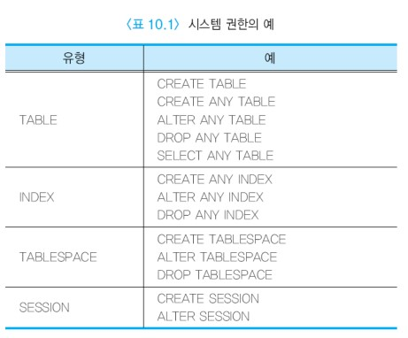
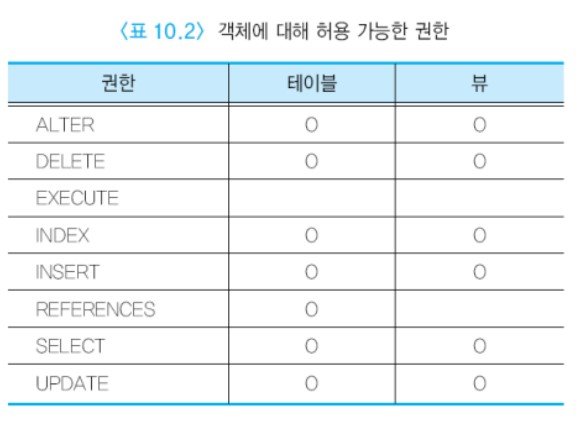
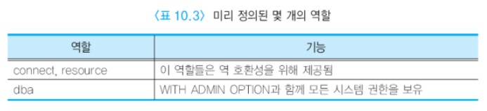

# 오라클의 보안 및 권한 관리


## 목차

- [오라클의 보안 및 권한 관리 개요](#오라클의-보안-및-권한-관리-개요)
- [오라클의 보안 및 권한 관리 실습](#오라클의-보안-및-권한-관리-실습)


## 오라클의 보안 및 권한 관리 개요

오라클 사용자는 접속하려는 데이터베이스에 계정과 암호를 가져야 한다.  
하지만 별도로 권한을 허가받지 않으면 데이터베이스에서 어떤 작업도 수행할 수 없다.  
다시 말해서 데이터베이스에 접속했다 하더라도 어떤 권한을 허가받지 않은 사용자는 테이블을 생성하거나 검색하는 등의 작업을 수행할 수 없다.  
사용자가 데이터베이스에서 수행하는 모든 작업은 SQL문이나 PL/SQL문을 통해 오라클 서버와 통신한다.  
오라클 서버가 SQL문이나 PL/SQL문을 받으면 사용자에게 데이터베이스에서 명령문을 실행할 권한이 있는지 확인한다.  
사용자에게 명령문을 실행할 권한이 없으면 오라클 서버는 사용 권한에 관한 오류를 사용자에게 반환한다.

오라클에는 __시스템 권한__과 __객체 권한__ 등 두 가지 유형의 권한이 있다. 시스템 권한은 사용자가 데이터베이스에서 특정 작업을 수행할 수 있도록 한다.  
예를 들어, 테이블을 생성하기 위해서는 CREATE TABLE 시스템 권한을 허가받아야 한다.  
오라클에는 120여 개의 시스템 권한이 있다. 권한 내의 ANY 키워드는 사용자가 임의의 스키마에서 수행할 수 있는 권한을 가졌음을 의미한다. 아래 표는 몇 개의 시스템 권한을 보여준다.



CREATE TABLE 권한은 CREATE INDEX 권한과 ANALYZE 권한을 포함한다.  
사용자가 CREATE TABLE 권한을 행사하기 위해서는 해당 테이블스페이스에 쿼터를 보유하거나 UNLIMITED TABLE SPACE를 허가받아야 한다.  
또한 CREATE TABLE 권한은 그 테이블을 제거하는 권한도 포함한다.

데이터베이스 관리자는 GRANT문을 사용하여 사용자에게 특정 시스템 권한들을 허가할 수 있다.  
WITH ADMIN OPTION을 사용하여 시스템 권한을 허가하면 권한을 받은 사용자가 다시 이 권한을 다른 사용자에게 허가할 수 있다.

```sql
GRANT CREATE SESSION TO KIM WITH ADMIN OPTION;
```

시스템 권한을 허가할 때 WITH ADMIN OPTION을 명시했든 명시하지 않았던간에 관계 없이, 시스템 권한을 취소할 때는 연쇄적인 취소가 일어나지 않는다.

객체 권한은 사용자가 특정 객체(테이블, 뷰, 프로시저 등)에 대해 특정 연산을 수행할 수 있도록 한다.  
객체의 소유자는 객체에 대한 모든 권한을 보유한다. 객체의 소유자는 자신의 객체에 대한 특정 권한을 다른 사용자나 역할에게 허가할 수 있다.  
PUBLIC 키워드를 사용하여 권한을 허가하면 모든 사용자에게 권한을 부여하게 된다. 각 객체마다 허가할 수 있는 권한들에 차이가 있다.  
아래 표는 각 객체에 대해 허가할 수 있는 권한들을 요약해서 보여주고 있다. 예를 들어, 테이블에 대해서는 EXECUTE 권한을 허가할 수 없다.



만일 사용자가 오라클 서버로부터 "table or view does jnot exist" 와 같은 에러 메시지를 받게 되면, 그런 이름을 가진 테이블이나 뷰가 존재하지 않거나  
사용자가 권한을 갖고 있지 않은 테이블이나 뷰에 대해서 연산을 수행하려 한 경우에 해당한다.

오라클에서 사용 패턴을 여러 관점에서 분석하여 각 사용 패턴에 맞게 미리 정해놓은 역할이 20여 개 있다.  
각 역할에 어떤 권한들이 있는지 살펴보고 이 역할들을 활용하면 편리하게 권한 관리를 할 수 있다.

가장 많이 사용하는 connect와 resource 역할에 대해 알아보자. 일반적으로 사용자를 생성한 후 connect와 resource 역할만 부여해도 대부분의 작업에 충분한 권한을 허가하게 된다.  
connect 역할만 있으면 자신의 테이블과 인덱스 등을 생성하지는 못한다. 오라클 데이터베이스에 로그인하고, 만일 다른 사용자의 데이터를 검색할 수 있도록 권한을 허가받았는면 이를 검색하고,  
만일 다른 사용자의 데이터를 갱신할 수 있도록 권한을 허가받았으면 이를 갱신할 수 있다.

connect 역할과 함께 resource 역할이 있으면 테이블과 인덱스를 생성하고, 자신의 객체에 대해 다른 사용자에게 권한을 허가하거나 취소할 수 있다. 아래 표는 오라클에서 미리 정의된 몇 개의 역할을 보여준다.



데이터베이스 관리자만 관리자 권한을 가진 채 데이터베이스에 접속할 수 있어야 한다.  
SYSDBA로서 데이터베이스에 연결하면 데이터베이스와 데이터베이스 내의 모든 객체들에 대해 임의의 연산을 수행할 수 있다.  
아래는 SYSOPER과 SYSDBA의 권한을 몇 개 보여준다.

> SYSOPER

STARTUP

SHUTDOWN

ALTER DATABASE OPEN

ALTER DATABASE BACKUP

> SYSDBA

WITH ADMIN OPTION과 함께 SYSOPER의 권한

CREATE DATABASE


## 오라클의 보안 및 권한 관리 실습

