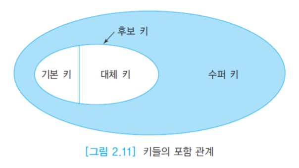

# 릴레이션의 키

## 목차

- 슈퍼키
- 후보키
- 기본키
- 대체키
- 외래키

## 슈퍼키

__슈퍼키__ : 한 릴레이션 내의 특정 투플을 고유하게 식별하는 하나의 애트리뷰트 또는 애트리뷰트들의 집합

슈퍼 키 예시 : 신용카드 회사의 고객 릴레이션에서 (신용카드번호, 주소) , (주민번호, 이름), (주민번호)
혹은 주민번호나 신용카드번호를 포함하는 어떠한 애트리뷰트들의 집합들

슈퍼 키의 문제점 : 투플들을 고유하게 식별하는 데 꼭 필요하지 않은  애트리뷰트들이 포함 될 수 있다.

## 후보키

__후보키__ : 각 투플을 고유하게 식별하는 __최소한의__ 애트리뷰트들의 모임

후보 키를 이루는 애트리뷰트들 중에서 어느 한 애트리뷰트라도 제거되면 고유하게 식별하는 능력을 상실한다.

모든 릴레이션에는 최소한 한 개 이상의 후보 키가 있으며, 최악의 경우에는 모든 애트리뷰트를 다 사용하면 후보 키가 된다.

__복합키__ : 후보 키도 두 개 이상의 애트리뷰트로 이루어질 수 있으며 이런 경우에 복합 키라고 부른다.

## 기본키

__기본키__ : 한 릴레이션에 후보 키가 두 개 있으면 데이터베이스 설계자 또는 데이터베이스 관리자가 이들 중에서 하나를 기본 키로 선정한다. 후보 키가 한 개밖에 없으면 당연히 이 후보 키가 기본키가 된다.

기본 키는 한 릴레이션 내의 모든 투플을 고유하게 식별할 수 있어야 하므로 널값이나 중복된 값을 가질 수 없다. 한 릴레이션의 기본 키를 선정할 때 추가로 고려해야할 사항은 아래와 같다.

- 애트리뷰트가 항상 고유한 값을 가질 것인가
- 애트리뷰트가 확실하게 널값을 갖지 않을 것인가
- 애트리뷰트의 값이 변경될 가능성이 높은 애트리뷰트는 기본 키로 선정하지 말 것
- 가능하면 작은 정수 값이나 짧은 문자열을 갖는 애트리뷰트
- 가능하면 복합 기본 키를 피할 것

__대리키__ : 자연스러운 기본 키를 찾을 수 없는 경우에는 레코드 번호와 같이 종종 인위적인 키 애트리뷰트를 릴레이션에 추가할 수 있다. 이런 키를 대리 키 라고 부른다.

## 대체키

__대체키__ : 기본키로 선정되지 않은 후보 키를 말한다.

