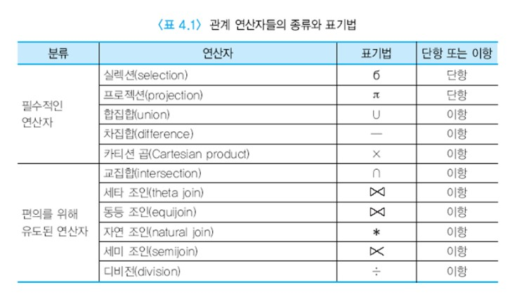
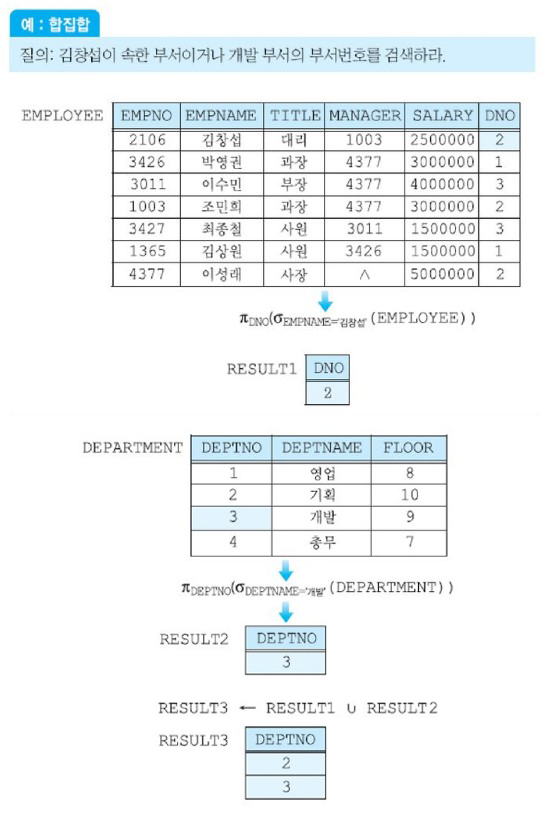
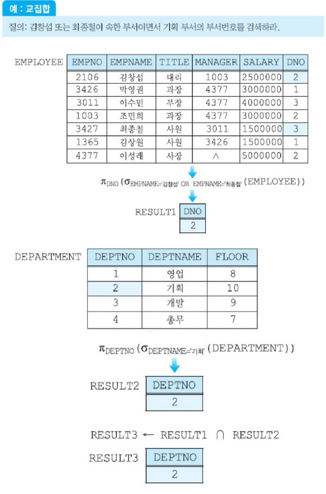
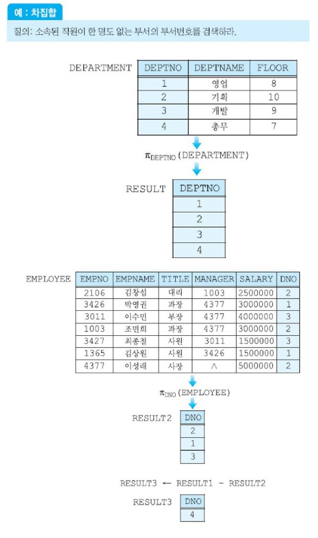
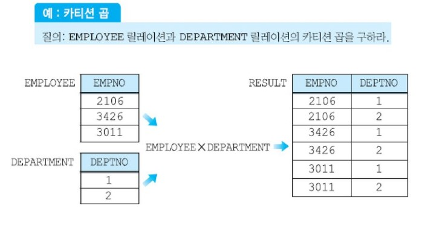

# 관계 대수

관계 대수는 관계 해석과 함께 릴레이션을 다루는 대표적인 이론적 방법이다.

관계 대수는 기존의 릴레이션들로부터 __새로운 릴레이션을 생성한다.__

관계 대수는 기본적인 연산자들의 집합으로 이루어진다.

하나의 관계 연산은 한 개 이상의 입력 릴레이션에 연산자를 적용하여 새로운 릴레이션 하나를 결과로 생성한다. 이는 산술 연산과 원리면에서 유사하다.

산술 연산에서 +, -, *, /등의 연산자들은 두 개의 수에 적용되어 하나의 수를 결과로 산출하므로 __이항 연산자__라고 부른다.
그러나 -는 또 다른 의미를 갖는다. -7과 같이 한 개의 수에 적용되어 음수로 바꾼 수를 결과로 산출하므로
__단항 연산자__라고 부른다.

관계 대수의 연산자들도 이와 유사하게 동작한다.
단일 릴레이션이나 두 개의 릴레이션을 입력으로 받아 하나의 결과 릴레이션으로 변환한다.
결과 릴레이션은 또 다른 관계 연산자의 입력으로 사용될 수 있다.

관계 대수 연산자들은 필수적인 연산자와 질의를 편리하게 표현하기 위해 추가된 연산자들로 구분할 수 있다. 추가된 연산자들은 필수적인 연산자들을 사용하여 표현 할 수 있다.




## 목차

- [실렉션 연산자](#실렉션-연산자)
- [프로젝션 연산자](#프로젝션-연산자)
- [집합 연산자](#집합-연산자)
- [조인 연산자](#조인-연산자)
- [디비전 연산자](#디비전-연산자)
- [관계 대수 질의의 예](관계-대수-질의의-예)
- [관계 대수의 한계](#관계-대수의-한계)


## 실렉션 연산자

__형식 : σ<실렉션조건> (릴레이션)__

실렉션 연산자는 한 릴레이션에서 __실렉션 조건__(selection condition)을 만족하는 투플들의 부분 집합을 생성한다.

실렉션 연산은 __주어진 조건을 만족하는 투플들만 걸러내는 연산__으로 생각할 수 있다.

실렉션 연산은 하나의 입력 릴레이션에 적용되므로 __단항 연산자__이다.

실렉션 연산의 결과로 생기는 릴레이션의 차수는 입력 릴레이션의 차수와 같다.
또한 결과 릴레이션의 카디날리티는 항상 원래 릴레이션의 카디날리티보다 작거나 같다.

실렉션 조건은 릴레이션의 애트리뷰트들에 대하여 명시된 __부울식__(Boolean expression)이다.

실렉션 조건을 __프레디키트__(predicate)라고도 한다.

실렉션 조건의 형태는 아래와 같다.

여기서 애트리뷰트는 입력 릴레이션에 속하는 애트리뷰트이고, 상수는 애트리뷰트의 도메인에 속하는 값이다.

```sql
<애트리뷰트> 비교 연산자 <상수>
<애트리뷰트> 비교 연산자 <애트리뷰트>
<조건> AND <조건>
<조건> OR <조건>
NOT <조건>
```


## 프로젝션 연산자

__형식 : π<애트리뷰트 리스트> (릴레이션)__

프로젝션 연산자는 실렉션과 달리 __한 릴레이션의 애트리뷰트들의 부분집합__을 구한다.

형식에서 <애트리뷰트 리스트>는 입력 릴레이션에 속한 애트리뷰트들이다.

프로젝션의 결과로 생성되는 릴레이션은 <애트리뷰트 리스트>에 명시된 애트리뷰트들만 가지며, 애트리뷰트 리스트에 열거된 순서와 동일하게 결과 릴레이션에 나타난다.

새로운 릴레이션의 차수는 애트리뷰트 리스트 내의 애트리뷰트 개수와 같다.

실렉션의 결과 릴레이션에는 중복 투플이 존재할 수 없지만, 프로젝션 연산 결과 릴레이션에는 중복된 투플들이 존재할 수 있다. 따라서 릴레이션의 특성을 만족하기 위해 __중복 투플들을 제거하는 과정이 필요하다.__
물론 <애트리뷰트 리스트>에 키가 포함되어 있으면 결과 릴레이션에 중복된 투플이 존재하지 않는다.


## 집합 연산자

릴레이션이 투플들의 집합이기 때문에 __기존의 집합 연산이 릴레이션에 적용된다.__

집합 연산자에는 합집합, 교집합, 차집합 연산자가 있으며, 집합 연산자의 입력으로 사용되는 두 개의 릴레이션은 __결합가능(합집합호환)__ 이어야 한다.

관계 데이터베이스 내의 임의의 두 릴레이션이 합집합 호환인 경우는 드물며, 어떤 연산의 결과로 유도된 릴레이션들이 합집합 호환인 경우가 많다.

집합 연산자는 두 개의 릴레이션을 입력으로 받아들이므로 이항 연산자이다.

두 릴레이션 R1(A1, A2, ..., An)과 R2(B1, B2, ..., Bn)이 결합가능(합집합호환)일 필요충분조건은 n=m이고, 모든 1≤i≤n에 대해 domain(Ai) = domain(Bi)이다.
다시 말해서, __두 릴레이션의 애트리뷰트 수가 같고 대응되는 애트리뷰트들의 도메인이 같다는 것__이다.


### 	○ 합집합 연산자

두 릴레이션 R과 S의 합집합 R∪S는 R 또는 S에 있거나 R과 S 모두에 속한 투플들로 이루어진 릴레이션이다.

릴레이션의 투플들의 집합이므로 결과 릴레이션에서 중복된 투플들은 제외된다.

결과 릴레이션의 차수는 R 또는 S의 차수와 같으며, 결과 릴레이션의 애트리뷰트 이름들은 R또는 S의 애트리뷰트들의 이름과 같다.




### 	○ 교집합 연산자

두 릴레이션 R과 S의 교집합 R ∩ S는 R과 S 모두에 속한 투플들로 이루어진 릴레이션이다.

결과 릴레이션의 차수는 R 또는 S의 차수와 같으며, 결과 릴레이션의 애트리뷰트 이름들은 R또는 S의 애트리뷰트들의 이름과 같다.



### ○ 차집합 연산자


두 릴레이션 R과 S의 차집합 R - S는 R에는 속하지만 S에는 속하지 않은 투플들로 이루어진 릴레이션이다.

결과 릴레이션의 차수는 R 또는 S의 차수와 같으며, 결과 릴레이션의 애트리뷰트 이름들은 R또는 S의 애트리뷰트들의 이름과 같다.




### 	○ 카티션 곱 연산자

실렉션이나 프로젝션을 사용하여 한 릴레이션으로부터 정보를 검색할 수 있지만,
한 릴레이션의 투플들을 다른 릴레이션의 투플들과 연관시키기 위해서 흔히 두 릴레이션의 투플들을 결합할 필요가 있다.

카디날리티가 i인 릴레이션 R(A1, A2, ..., An)과 카디날리티가 j인 릴레이션 S(B1, B2, ..., Bm)의 카티션 곱 R X S는
차수가 n+m이고, 카디날리티가 i*j이고, 애트리뷰트가 (A1, A2, ..., An, B1, B2, ..., Bn)이며, R과 S의 투플들의 모든 가능한 조합으로 이루어진 릴레이션이다.

카티션 곱의 결과 릴레이션의 크기가 매우 클 수 있으며, __사용자가 실제로 원하는 것은 카티션 곱의 결과 릴레이션의 일부인 경우가 대부분이므로 카티션 곱 자체는 유용한 연산자가 아니다.__
동일한 애트리뷰트가 두 릴레이션에 포함되어 있을 수 있기 때문에 결과 릴레이션에서 이런 애트리뷰트들을 구분하기 위해서 애트리뷰트 이름 앞에 릴레이션 이름을 붙인다.




### 	○ 관계 대수의 완전성

실렉션, 프로젝션, 합집합, 차집합, 카티션 곱은 관계 대수의 필수적인 연산자이다.

다른 관계 연산자들은 필수적인 관계 연산자 두 개 이상 조합하여 표현할 수 있다.

예를 들어, 조인 연산자는 카티션 곱과 실렉션을 사용하여 표현할 수 있다.
디비전 연산자는 프로젝션, 카티션 곱, 차집합을 사용하여 표현할 수 있다.

임의의 질의어가 적어도 필수적인 관계 대수 연산자들만큼의 표현력을 갖고 있으면 __관계적으로 완전(relationally complete)__하다고 말한다.


## 조인 연산자


