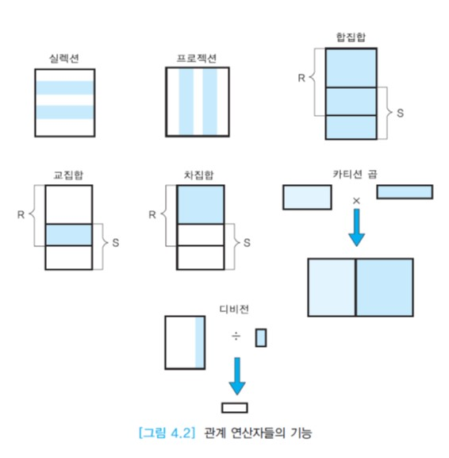

# 관계 대수

관계 대수는 관계 해석과 함께 릴레이션을 다루는 대표적인 이론적 방법이다.

관계 대수는 기존의 릴레이션들로부터 __새로운 릴레이션을 생성한다.__

관계 대수는 기본적인 연산자들의 집합으로 이루어진다.

하나의 관계 연산은 한 개 이상의 입력 릴레이션에 연산자를 적용하여 새로운 릴레이션 하나를 결과로 생성한다. 이는 산술 연산과 원리면에서 유사하다.

산술 연산에서 +, -, *, /등의 연산자들은 두 개의 수에 적용되어 하나의 수를 결과로 산출하므로 __이항 연산자__라고 부른다.
그러나 -는 또 다른 의미를 갖는다. -7과 같이 한 개의 수에 적용되어 음수로 바꾼 수를 결과로 산출하므로
__단항 연산자__라고 부른다.

관계 대수의 연산자들도 이와 유사하게 동작한다.
단일 릴레이션이나 두 개의 릴레이션을 입력으로 받아 하나의 결과 릴레이션으로 변환한다.
결과 릴레이션은 또 다른 관계 연산자의 입력으로 사용될 수 있다.

관계 대수 연산자들은 필수적인 연산자와 질의를 편리하게 표현하기 위해 추가된 연산자들로 구분할 수 있다. 추가된 연산자들은 필수적인 연산자들을 사용하여 표현 할 수 있다.

## 목차

- 실렉션 연산자
- 프로젝션 연산자
- 집합 연산자
- 조인 연산자
- 디비전 연산자
- 관계 대수 질의의 예
- 관계 대수의 한계

