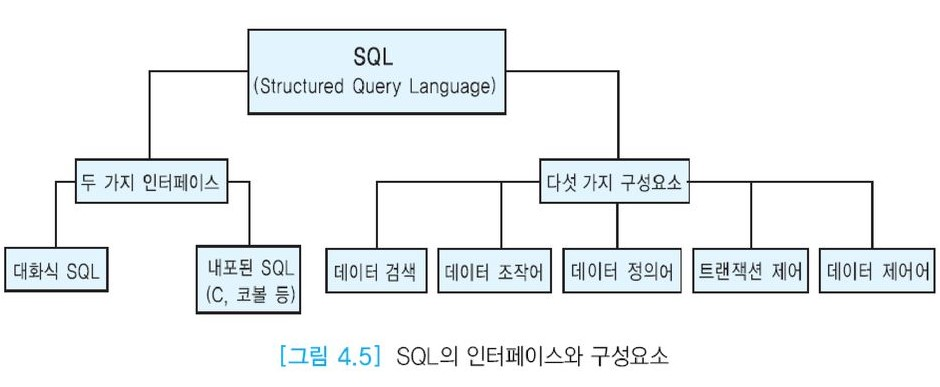

# SQL 개요

관계 데이터베이스 시스템의 표준 언어인 __SQL(Structured Query Langeuage)__ 은 현재 DBMS 시장에서 관계 DBMS가 압도적인 우위를 차지하는 데 중요한 요인의 하나이다.

"만일 어떤 DBMS가 SQL을 사용하지 않는다면 그것은 관계 DBMS가 아니다." 라는 말도 있다.

표준언어를 사용하면 직원에 대한 교육 비용이 절감되고, 생산성이 높아지고, 응용 프로그램의 이식성이 향상되고, 특정 DBMS에 대한 의존도가 줄어들고, DBMS간의 통신이 원할해진다.

SQL의 장점은 자연어에 가까운 구문을 사용하여 질의를 표현할 수 있다는 것이다.
SQL은 __비절차적 언어(선언적 언어)__이므로 사용자는 자신이 __원하는 데이터(what)__만 명시하며,
원하는 것을 __처리하는 방법(how)__은 명시할 수 없다.
이 점이 SQL이 상대적으로 배우기 쉬운 언어가 되도록 하는 중요한 요인이다.
SQL은 최종 사용자들이 쉽게 배워서 데이터베이스를 접근하는 데 사용된다.
또한 SQL은 관계 대수나 관계 해석보다 표현력이 우수하다.
그 이유는 SQL이 관계적으로 완전하고, 릴레이션을 정렬하고 중복된 투플들을 허용할 수 있기 때문이다.

### SQL

> 비절차적 언어
>
> 사용자는 자신이 무엇을 원하는지만 질의에 명시하고, DBMS는 이 질의를 효율적으로 처리하는 방법을 결정한다.
>
> 연산
>
> - 데이터베이스 구조 및 제약조건을 추가 하거나 수정하는 명령어(DDL)
>
> - 투플을 검색, 삭제, 수정하는 명령(DML)

### 관계 대수

> 절차적 언어
>
> - 관계 대수식은 관계 연산자들이 수행되는 순서를 명시한다.
> - 검색 연산만 제공

관계 DBMS는 사용자가 입력한 SQL문을 번역하여 사용자가 요구한 데이터를 찾는 데 필요한 모든 과정을 담당한다. 따라서 다른 모델의 DBMS나 화일 시스템에 비해서 관계 DBMS에서는 프로그래밍 노력이 적게 든다.

사용자가 관계 데이터베이스에 접근하기 위해 두 가지 인터페이스가 존재한다.
두 경우 모두 데이터베이스에 대한 접근은 SQL을 통해서 이루어진다.

- __대화식 SQL__ : 데이터베이스를 접근하는 최종 사용자들이 선호한다.
- __내포된 SQL__ : C, C++ 등의 고급 프로그래밍 언어(호스트 언어) 내에 SQL을 포함하여 사용하는 방식이다. 응용 프로그래머가 전문적인 데이터베이스 응용 프로그램을 개발하기 위해서 사용된다.

### 오라클의 SQL 기능들

- 데이터 검색
  데이터 베이스로부터 데이터를 검색한다. SQL의 SELECT 문이 이에 해당한다.
  일반적인 관계 데이터베이스 문헌에서는 오라클과 달리 SELECT문을 데이터 조작어의 하나로 분류한다. 사용자가 검색하는 데이터를 표현하는 방법이 다양하며, 대부분의 데이터베이스 응용에서 검색 명령들의 수행 빈도가 매우 높다.
- 데이터 조작어
  데이터 조작어는 데이터 정의어로 정의된 데이터베이스 스키마 내의 데이터를 수정하는 데 사용된다. 사용자는 데이터 조작어를 사용하여 데이터를 삽입하고, 삭제하고, 수정한다.
  대화식으로 질의를 작성하거나 SQL문을 C, C++, 코볼, 자바와 같은 고급 프로그래밍 언어에 내포시킬 수 있다. 데이터 조작어가 수행해야 하는 세 가지 기본적인 명령은 아래와 같다.
  INSERT, DELETE, UPDATE
- 데이터 정의어
  사용자는 데이터 정의어를 사용하여 릴레이션을 생성하고, 릴레이션을 제거하고, 릴레이션에 새로운 애트리뷰트를 추가하고, 릴레이션에서 애트리뷰트를 제거하고, 뷰를 생성하고, 뷰를 제거하고, 인덱스를 생성하고, 인덱스를 제거하는 등의 작업을 수행한다.
  또한 릴레이션을 생성할 때 여러가지 유형의 무결성 제약조건들을 명시할 수 있다.
  SQL의 CREATE, ALTER, DROP, RENAME 등의 데이터 정의어이다.
- 트랜젝션 제어
  사용자는 트랜젝션의 시작, 철회, 완료 등을 명시하기 위해 트랜잭션 제어를 사용한다.
  SQL의 COMMIT, ROLLBACK, SAVEPOINT 등이 이에 해당한다.
- 데이터 제어어
  릴레이션에 대한 권한을 부여하거나 취소한다.
  SQL의 GRANT와 REVOKE가 이에 해당한다.

SQL문은 키워드(예약어)와 사용자가 정의하는 단어들로 이루어진다.
키워드는 정확하게 입력해야 하며 한 개의 키워드가 두 줄에 걸쳐서 입력될 수 없다.
사용자가 정의하는 단어들은 릴레이션, 애트리뷰트, 뷰 등 여러 가지 데이터베이스 객체들의 이름을 나타내기 위해 사용된다.
키워드는 테이블이나 애트리뷰트의 이름으로 사용할 수 없다.
문자열 데이터를 제외하고 SQL문의 대부분의 구성요소는 대문자와 소문자를 구분하지 않는다.
SQL문의 각 절(SELECT, FROM, WHERE 등)을 세 줄에 입력하면 SQL문을 좀 더 읽기 쉽다.