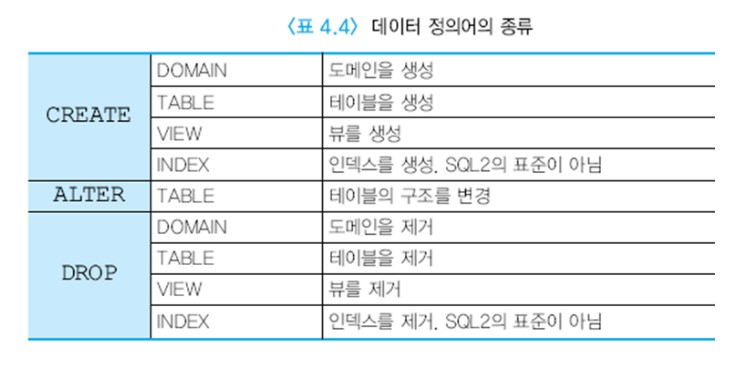
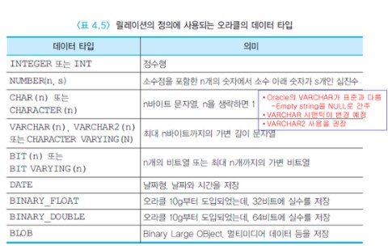

# 데이터 정의어와 무결성 제약조건


## 목차

- [데이터 정의어](#데이터-정의어)
- [제약조건](#제약조건)


## 데이터 정의어




### ○ 스키마의 생성과 제거

일반적으로 스키마는 특정 사용자의 데이터베이스 응용에 속하는 릴레이션, 도메인, 제약조건, 뷰, 권한 등을 그룹화한 것이다.

각 사용자는 권한을 허가받지 않는 한 다른 사용자의 스키마에 속한 데이터를 볼 수 없다.

__스키마는 CREATE SCHEMA문을 사용하여 생성__한다.

아래 문장은 TEST라는 계정을 가진 사용자가 TEST_DB라는 스키마를 생성한다.

```sql
CREATE SCHEMA TEST_DB AUTHORIZATION TEST;
```

여러 DBMS에서, 사용자를 생성하면 DBMS는 그 사용자에 대한 스키마를 자동적으로 할당한다.


기존의 __스키마를 제거 하려면 DROP SCHEMA문__을 사용한다.

스키마가 __비어 있지 않으면 DBMS가 DROP SCHEMA문을 거절__한다.

```sql
DROP SCHEMA TEST_DB;
```


### ○ 릴레이션 정의

SQL에서 __릴레이션을 정의하는 문은 CREATE TABLE문__이다.

```sql
CREATE TABLE DEPARTMENT
(DEPTNO	NUMBER	NOT NULL,
DEPTNAME CHAR(10),
FLOOR	NUMBER,
PRIMARY KEY(DEPTNO));

CREATE TABLE EMPLOYEE
(EMPNO	NUMBER	NOT NULL,
EMPNAME	CHAR(10),
TITLE	CHAR(10),
MANAGER	NUMBER,
SALARY	NUMBER,
DNO		NUMBER,
PRIMARY KEY(EMPNO),
FOREIGN KEY(MANAGER) REFERENCES EMPLOYEE(EMPNO),
FOREIGN KEY(DNO) REFERENCES DEPARTMENT(DEPTNO));
```

EMPLOYEE 릴레이션과 DEPARTMENT 릴레이션을 생성하는 기본적인 CREATE TABLE문은 위와 같다.

CREATE TABLE문에서 __한 릴레이션에 속하는 애트리뷰트들의 이름과 데이터 타입을 명시__한다.
애트리뷰트는 디폴트로 널값을 가질 수 있으므로 기본 키처럼 널값을 허용하지 않는 애트리뷰트에 대해서는 'NOT NULL'을 지정해야 한다.
또한 __어떤 애트리뷰트가 기본 키__이고, __어떤 애트리뷰트가 외래 키__로서 다른 릴레이션의 기본 키를 참조하는가를 __명시__한다.
CREATE TABLE문의 __수행결과로 빈 릴레이션__이 만들어진다.

릴레이션 및 애트리뷰트에 의미 있는 이름을 지정하는 것이 바람직하다.

위처럼 두 개의 릴레이션을 정의할 때 EMPLOYEE 릴레이션에서 DEPARTMENT 릴레이션의 기본 키를 외래 키로 참조하기 때문에 EMPLOYEE 릴레이션을 먼저 정의하면,
데이터베이스에 없는 DEPARTMENT 릴레이션의 기본 키를 참조하는 현상이 발생하므로 EMPLOYEE 릴레이션의 정의가 실패한다.
따라서 DEPARTMENT 릴레이션을 먼저 정의하고, 그 다음에 EMPLOYEE 릴레이션을 정의 해야 한다
또는 외래 키를 정의하는 절을 생략하고 EMPLOYEE 릴레이션과 DEPARTMENT 릴레이션을 생성한 후에 ALTER TABLE 문을 사용해서 EMPLOYEE 릴레이션에 참조 무결성 제약조건을 추가해도 된다.

위의 릴레이션 정의문에는 NUMBER와 CHAR(10)만 데이터 타입의 예로 들었지만 SQL에서 릴레이션의 정의에 다양한 데이터 타입을 사용할 수 있다.
DBMS마다 제공되는 데이터 타입에 다소 차이가 있다.

아래는 릴레이션의 정의에 사용되는 오라클의 데이터 타입들 중에서 자주 사용되는 것들을 요약한 것이다.



애트리뷰트의 데이터 타입을 결정할 때 고려해야 할 사항은 다음과 같다.

숫자인지 문자인지를 먼저 결정한다.

문자인 경우에는

​	고정 길이 또는 가변 길이

​	최대 길이

숫자인 경우에는

​	정수 또는 실수

​	최대 길이

​	소수점 아래 개수


릴레이션이 더 이상 불필요하게 되면 언제든지 __DROP TABLE문을 사용하여 릴레이션을 제거__할 수 있다.
릴레이션의 정의와 릴레이션의 투플들이 모두 삭제된다.
다른 릴레이션이나 뷰에서 참조되지 않는 릴레이션들만 제거할 수 있다.

```sql
DROP TABLE DEPARTMENT;
```

만약 DEPARTMENT 릴레이션을 제거하려면 EMPLOYEE 릴레이션에서 DEPARTMENT 릴레이션을 참조하는 외래 키 정의를 ALTER TABLE문을 사용하여 먼저 제거해야 한다.


### ○ ALTER TABLE

ALTER TABLE은 릴레이션을 만든 후에 투플들을 삽입하고 계속 사용하다가 응용의 요구사항이 변하여 기존의 릴레이션에 애트리뷰트를 추가하거나 기존의 릴레이션에서 애트리뷰트를 제거하는 것이 필요할 때 사용한다.

추가된 애트리뷰트는 릴레이션의 마지막 애트리뷰트가 된다.

릴레이션에 한 애트리뷰트를 추가할 때 디폴트 값을 명시하지 않은 경우에는 NOT NULL을 지정할 수 없다. 새로 추가되는 애트리뷰트에 대해 기존의 투플들은 널값을 갖기 때문이다.
새로 추가된 애트리뷰트에 대해서는 사용자가 일일이 갱신문을 사용하여 값을 입력해야 한다.

예를 들어, EMPLOYEE 릴레이션에 PHONE이라는 애트리뷰트를 추가하려면 아래와 같은 ALTER TABLE문을 사용해야 한다.

```sql
ALTER TABLE EMPLOYEE ADD PHONE CHAR(13);
```

이밖에도 ALTER TABLE문에서 수행할 수 있는 작업에는 테이블에 새로운 제약조건을 추가, 테이블에서 애트리뷰트 삭제, 테이블에서 제약조건을 제거, 애트리뷰트의 데이터 타입 변경, 애트리뷰트의 디폴트 값 지정, 애트리뷰트의 디폴트 값 제거 등이 있다.
일부 관계 DBMS는 애트리뷰트의 삭제를 제한한다. 또한 어떤 관계 DBMS는 애트리뷰트가 비어 있어야만 데이터 타입을 변경할 수 있도록 한다.


### ○ 인덱스 생성

CREATE INDEX문은 SQL의 표준은 아니지만 대부분의 상용 관계 DBMS가 지원한다.

CREATE INDEX문은 릴레이션의 하나 이상의 애트리뷰트에 대해 인덱스를 생성한다.

뷰에는 인덱스를 생성할 수 없다. 뷰는 뷰의 정의에 사용된 기본 릴레이션에 생성된 인덱스를 사용하게 된다.

인덱스는 검색 성능을 향상시키기 위해 사용된다.
하지만 인덱스는 저장공간을 추가로 필요로 하고 갱신 속도를 저하시킨다.

인덱스를 생성하면 디폴트는 오름차순이다.

인덱스가 정의된 투플에 변경이 생기면 DBMS가 자동적으로 인덱스에 반영한다.

```sql
CREATE INDEX EMPDNO_IDX ON EMPLOYEE(DNO);
```

이 CREATE INDEX문은 EMPLOYEE 릴레이션의 DNO 애트리뷰트에 EMPNO_IDX라는 이름의 인덱스를 만든다. 인덱스가 불필요해지면 아래와 같은 DROP INDEX문을 사용하여 인덱스를 제거한다.

```sql
DROP INDEX EMPLOYEE.EMPDNO_IDX;
```


## 제약조건


### 애트리뷰트의 제약조건

- NOT NULL

  애트리뷰트는 디폴트로 널값을 가질 수 있기 때문에 만일 어떤 애트리뷰트에 널값을 허용하지 않으려면 'NOT NULL'을 명시해야 한다. 이런 애트리뷰트에 대해 디폴트 값을 지정하지 않았으면 INSERT문에서 이 애트리뷰트에 반드시 값을 입력해야 한다. 그렇지 않으면 제약조건을 위반하는 연산이므로 거절된다.
  기본 키에는 이 제약조건을 명시하는 것을 권장한다. 반면에 투플을 삽입하는 시점에 어떤 애트리뷰트의 값을 알지 못하는 경우가 예상되면 이 애트리뷰트에 'NOT NULL'을 명시해서는 안된다.

- UNIQUE

  __동일한 애트리뷰트 값을 갖는 투플이 두 개 이상 존재하지 않도록 보장한다.__
  'NOT NULL'을 명시하지 않았다면 한 개의 투플에서는 이 애트리뷰트에 널값을 가질 수 있다.
  한 릴레이션에 UNIQUE절을 여러 개 명시할 수 있다. 오라클은 UNIQUE절이 명시된 애트리뷰트에 자동적으로 인덱스를 생성한다.

- DEFAULT

  __애트리뷰트에 널값 대신에 특정 값을 디폴트로 지정할 수 있다.__
  애트리뷰트의 이름과 애트리뷰트의 데이터 타입을 명시한 곳에는 어디서든지 DEFAULT절을 사용하여 디폴트 값을 지정할 수 있다.

- CHECK

  CHECK절에서는 __한 애트리뷰트가 가질 수 있는 값들의 범위를 지정한다.__

  ```sql
  CHECK (SALARY < 600000)
  CHECK (DNO IN (1,2,3,4,5,6))
  CHECK (MANAGER_SALARY > SALARY)
  ```

  첫번째 예시 처럼 범위를 제한하거나
  두번째 예시 처럼 1~6중 하나의 값만 가질 수 있게 하거나
  세번째 예시 처럼 서로 다른 애트리뷰트 값에 대해 CHECK 옵션을 명시하는 것도 가능하다.

### ○ 기본 키 제약조건

```sql
CREATE TABLE EMPLOYEE
(EMPNO NUMBER NOT NULL,
 .....
PRIMARY KEY (EMPNO));
```

릴레이션을 생성할 때 위와 같이 기본 키 제약조건을 명시할 수 있다.
이는 EMPLOYEE 릴레이션의 기본 키가 EMPNO 애트리뷰트라는 것을 나타낸다.
기본 키는 엔티티 무결성 제약조건에 의해 널값을 갖지 않아야 한다.
PRIMARY KEY절에 사용된 EMPNO 애트리뷰트에 대해 NOT NULL을 이미 명시하였다. 
각 릴레이션마다 최대한 한 개의 기본 키를 지정할 수 있다. 기본 키에는 자동적으로 인덱스가 생성된다.

### ○ 참조 무결성 제약조건

참조 무결성 제약조건은 CREATE TABLE문에서 릴레이션을 정의하면서 명시한다.

한 릴레이션에 들어 있는 외래 키의 개수만큼 참조 무결성 제약조건을 명시할 수 있다.

참조 무결성 제약조건은 외래 키의 무결성을 보장한다.
예를 들어, EMPLOYEE 릴레이션의 임의의 투플의 MANAGER도 이 회사 사원이어야 하기 때문에 반드시 EMPLOYEE 릴레이션의 EMPNO에 나타나야 하고,
EMPLOYEE 릴레이션에 나타나는 부서 번호는 반드시 DEPARTMENT 릴레이션의 부서번호에 존재해야 한다.
참조 무결성 제약조건에서 참조되는 애트리뷰트는 참조되는 릴레이션에서 동일한 데이터 타입을 가지면서 UNIQUE 또는 기본 키로 정의되어 있어야 한다.

참조 무결성 제약조건을 보존하기 위해, 데이터베이스가 갱신된 후에 검사를 수행해야 한다.
참조되는 릴레이션을 변경하는 삽입, 삭제, 수정 중에서 __참조 무결성 제약 조건을 위배할 수 있는 연산은 삭제와 수정 연산이다.__

참조되는 릴레이션에서 투플이 삭제될 때, 참조하는 릴레이션에서 어떻게 동작할 것인가를 명시한다.

```SQL
FOREIGN KEY (DNO) REFERENCES DEPARTMENT (DEPTNO) ON DELETE CASCADE;
```

- ON DELETE NO ACTION

  참조되는 릴레이션(DEPARTMENT)에서 어떤 투플을 삭제하려는데, 이 투플의 기본 키의 값을 참조하고 있는 투플이 EMPLOYEE 릴레이션에 존재하면 삭제 연산을 거절한다.

- ON DELETE CASCADE

  DEPARTMENT 릴레이션에서 기본 키의 값이 삭제(즉 어떤 투플이 삭제)되면 EMPLOYEE 릴레이션에서도 이 값을 참조하는 모든 투플들이 연쇄적으로 삭제된다.

- ON DELETE SET NULL

  DEPARTMENT 릴레이션에서 기본 키의 값이 삭제되면, EMPLOYEE 릴레이션에서 이 값을 참조하는 모든 투플들의 부서 번호는 널값을 갖는다.

- ON DELETE SET DEFAULT

  DEPARTMENT 릴레이션에서 기본 키의 값이 삭제되면, EMPLOYEE 릴레이션에서 이 값을 참조하는 모든 투플들의 부서 번호는 디폴트 값을 갖는다.

* 오라클에서 ON UPDATE에 대해서는 NO ACTION만 명시할 수 있다.


### ○ 무결성 제약조건의 추가 및 삭제

릴레이션이 생성된 후에도 기본 키 제약조건을 포함하여 여러 가지 제약조건들을 추가할 수 있다.

아래의 ALTER TABLE문은 STUDENT 릴레이션에 기본 키 제약조건을 추가한다. 기본 키 제약조건의 이름이 STUDENT_PK이고 기본 키는 STNO임을 나타낸다.

```sql
ALTER TABLE STUDENT ADD CONSTRAINT STUDENT_PK
	PRIMARY KEY (STNO);
```

기본 키 제약조건이 정의되면 자동적으로 활성화된다.

만일 어떤 제약 조건이 더 이상 필요하지 않게 되면 아래와 같은 명령을 사용하여 이 제약조건을 삭제 할 수 있다.

```sql
ALTER TABLE STUDENT DROP CONSTRAINT STUDENT_PK;
```

기본 키 제약조건이 삭제되면 연관된 인덱스도 함께 삭제된다.

이에 반해서 외래 키 제약조건이 삭제되면 연관된 인덱스는 삭제되지 않는다.


