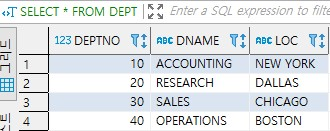
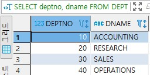
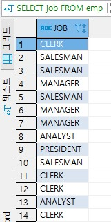
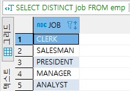
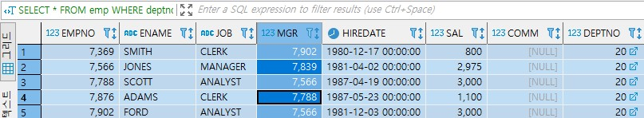
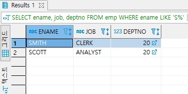
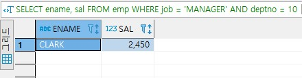
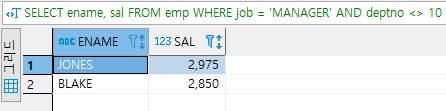

# SELECT 문

SELECT문은 관계 대수의 실렉션과 의미가 완전히 다르다.

SQL의 SELECT문은 관계 대수의 실렉션, 프로젝션, 조인, 카티션 곱 등을 결합한 것이다.

SELECT문은 관계 대수에서 가장 자주 사용된다.


## 목차

- [기본적인 SELECT문](#기본적인-SELECT문)
- [SELECT문의 다양한 사용법](#SELECT문의-다양한-사용법)
- [조인](#조인)
- [중첩 질의](#중첩-질의)


## 기본적인 SELECT문

```sql
(필수) SELECT		[DISTINCT] 애트리뷰트(들)
(필수) FROM		릴레이션(들)
(선택) [WHERE	조건
						[중첩 질의]]
(선택) [GROUP BY	애트리뷰트(들)]
(선택) [HAVING	조건]
(선택) [ORDER BY	애트리뷰트(들) [ASC|DESC]];
```


- SELECT절

  SELECT절에는 질의 결과에 포함하려는 애트리뷰트들의 리스트를 열거한다.  
  관계 대수의 프로젝션 연산에 해당한다.

  사용자가 DISTINCT절을 사용해서 명시적으로 요청했을 때만 중복을 제거한다.  
  DISTINCT는 관계 대수와 SQL간의 중요한 차이점을 나타낸다.

  SQL의 릴레이션은 디폴트로 투플들의 집합이 아니고, 투플들의 __다중집합(multiset)__ 을 허용한다.  
  다중집합을 백(bag)이라고도 부른다.

  

- FROM절

  질의에서 필요로 하는 릴레이션의 리스트를 열거한다.

  SELECT절에서 사용자가 검색하려는 애트리뷰트들을 포함하고 있는 릴레이션들뿐만 아니라  
  WHERE절의 프레디키트에 사용된 애트리뷰트들을 포함하고 있는 릴레이션들도 열거 해야 한다.

  

- WHERE절

  WHERE절은 관계 대수의 실렉션 연산의 프레디키트(실렉션 조건)에 해당한다.

  FROM절에 열거한 릴레이션에 속하는 애트리뷰트들만 사용해서 프레디키트를 표현해야 한다.

  WHERE절의 조건은 결과 릴레이션의 투플들이 만족시켜야 하는 조건이다.  
  예를 들어, WHERE SALARY > 150000은 결과 릴레이션의 투플들의 급여가 150000보다 크다는 것이다.

  WHERE절의 프레디키트는 아래와 같은 사항들을 포함한다.

  > 비교 연산자			=, <>, <, <=, >, >=
  >
  > 부울 연산자			AND, OR, NOT
  >
  > 집합 연산자			IN, NOT IN, ANY (SOME), ALL

  프레디키트는 비교 연산자와 부울 연산자 등이 결합된 복잡한 형태도 가능하다.

  만일 WHERE절을 생략하면 모든 투플들이 조건을 만족하는 것으로 간주한다.

  WHERE절은 SELECT문뿐만 아니라 UPDATE문과 DELETE문에도 사용되는데, WHERE절의 구문은 모두 동일하다.

- 중첩 질의

  중첩 질의는 다른 질의의 WHERE절에 포함된 SELECT문이다.

  

- GROUP BY절

  질의 결과에서 GROUP BY 다음에 명시된 애트리뷰트에 동일한 값을 갖는 투플들을 한 그룹으로 묶는다.

  

- HAVING절

  HAVING절은 투플들의 그룹이 만족해야 하는 조건을 나타낸다.

  

- ORDER BY절

  ORDER BY절은 결과 투플들의 정렬 순서를 지정한다.

  ORDER BY절을 생략하면 SELECT문의 결과로 검색된 투플들의 순서는 기본 키의 순서나 투플들이 검색된 순서를 따른다.


여섯 개의 절이 모두 사용된 SELECT문이 수행되는 개념적인 순서는

FROM절에 열거된 릴레이션들의 카디션 곱을 구하고,  
WHERE절의 프레디키트를 적용하여 투플들을 골라내고,  
GROUP BY절에 의해 결과 투플들을 그룹화하고,  
각 그룹에 HAVING절의 조건을 적용하여 일부 그룹을 걸러내고  
남은 각 그룹에 집단 함수를 적용하고,  
SELECT절에 열거된 애트리뷰트들만 프로젝션해서 ORDER BY절에 명시된 순서대로 정렬한다.

위 순서를 정렬하면 아래와 같다.

1. 투플들을 구하고(카디션 곱)
2. 조건들을 만족하는 투플들을 식별하고
3. 그룹들을 구하고
4. HAVING을 적용하여 일부 그룹들을 제거하고
5. 집단 함수의 값을 구하고
6. 결과 투플들을 정렬하여 사용자에게 제시한다.


## SELECT문의 다양한 사용법

- 별칭(alias)

  서로 다른 릴레이션에 동일한 이름을 가진 애트리뷰트가 속해 있을 때 애트리뷰트의 이름을 구분하는 한 가지 방법은 애트리뷰트 이름 앞에 릴레이션의 이름을 붙인다.  
  또 다른 방법은 __투플 변수(tuple variable)__ 를 사용한다.  
  SQL에서 투플 변수는 한 릴레이션에 연관된다.  
  투플 변수는 FROM절에서 릴레이션의 이름 다음에 AS(생략 가능)와 함께 명시한다.  
  투플 변수를 별칭이라고도 부른다.  
  아래와 같이 표현하면 EMPLOYEE 릴레이션을 E, DEPARTMENT 릴레이션을 D로 가리킬 수 있다. 

  ```sql
  FROM EMPLOYEE AS E, DEPARTMENT AS D
  ```

  투플 변수는 편리성과 질의의 이해도를 높이기 위해 언제든지 사용할 수 있다.

- 릴레이션의 모든 애트리뷰트나 일부 애트리뷰트들을 검색

  SELECT절에서 애트리뷰트들의 리스트 대신에 *를 사용하면 릴레이션에 속하는 모든 애트리뷰트들을 검색한다.  
  릴레이션의 모든 애트리뷰트들을 필요로 하지 않는 경우에는 일반적으로 *을 사용하지 않는 것이 좋다.  
  또한 *를 포함한 SELECT문이 응용 프로그램에 내포된 경우에 나중에 릴레이션에 애트리뷰트가 추가되면, SELECT문에서 검색되는 애트리뷰트들의 개수가 변하게 되므로 응용 프로그램을 다시 컴파일해야 한다.  
  검색하려는 애트리뷰트들을 명시적으로 열거하는 경우에는 애트리뷰트들을 콤마로 구분하고, 마지막 애트리뷰트 다음에는 콤마를 사용하지 않는다.

  ```sql
  전체 부서의 모든 애트리뷰트를 검색
  SELECT *
  FROM dept;
  ```

  

  ```sql
  모든 부서의 부서번호와 부서이름을 검색
  SELECT deptno, dname
  FROM dept;
  ```

  

  

- 상이한 값들을 검색

  SELECT문의 결과에는 디폴트로 중복된 투플들이 존재할 수 있다.  
  사용자가 DISTINCT절을 사용해서 명시적으로 요청했을 때만 중복을 제거한다.  
  DISTINCT절을 명시하면 검색된 투플들을 정렬하여 인접한 투플들의 중복 여부를 검사하고,  
  중복된 투플이 존재하면 제거한 후 사용자에게 결과를 제시한다.  
  다음의 예는 한 개의 애트리뷰트가 검색된 경우를 보여주지만 다수의 애트리뷰트들을 검색하는 경우에도 DISTINCT절을 사용할 수 있다.

  ```sql
  모든 사원들의 직급을 검색
  SELECT job
  FROM emp;
  ```

  

  ```sql
  모든 사원들의 직급을 검색
  SELECT DISTINCT job
  FROM emp;
  ```

  

  

- 특정한 투플들의 검색

  WHERE절의 프레디키트를 만족하는 투플들만 검색한다.  
  여섯 개의 비교 연산자를 프레디키트에 사용하여 애트리뷰트와 애트리뷰트 또는 상수를 비교할 수 있다.  
  프레디키트에 사용되는 숫자가 아닌 상수들은 '텍스트', '예시' 등과 같이 단일 인용기호( ')로 애워싸야 한다. 

  ```sql
  20번 부서에 근무하는 사원들에 관한 모든 정보를 검색
  SELECT *
  FROM emp
  WHERE deptno = 20;
  ```

  

  

- 문자열 비교

  LIKE 비교 연산자는 문자열의 일부에 대하여 비교 조건을 명시한다.

  LIKE 비교 연산자는 문자열 타입으로 선언된 애트리뷰트에 사용할 수 있으며 숫자 데이터 타입을 갖는 애트리뷰트에는 적용 할 수 없다.  

  wild 문자 '%'는 0개 이상의 문자열과 대치되고, wild 문자 '_'는 임의의 한 개의 문자와 대치된다.  
  영문자에 대해서는 대문자와 소문자를 구분한다.  
  wild 문자가 'A%' 또는 '%A' 처럼 문자열의 앞부분에 사용되면, 조건에 맞는 투플들을 검색하기 위해서 인덱스를 사용하지 못하고 모든 투플들을 하나씩 읽어야 하므로 수행 시간이 오래 걸릴 수 있다.  
  SQL 표준에서는 영문자에 대해서 대문자와 소문자를 구분하고 고정 길이 문자열로 선언된 애트리뷰트 내의 공백 문자들의 개수도 구분한다.   
  LIKE의 부정은 NOT LIKE 이다.  
  오라클 등에서 대문자와 소문자를 구분하지 않도록 할 수 있다.  

  ```sql
  S로 시작하는 사원들의 이름, 직급, 소속부서번호를 검색
  SELECT ename, job, deptno
  FROM emp
  WHERE ename LIKE 'S%'
  ```

  

  

- 다수의 검색 조건

  WHERE절에 여러 조건들이 논리 연산자로 결합된 프레디키트를 포함할 수 있다.  
  WHERE절에 AND, OR, NOT을 사용하여 여러 조건들로 이루어진 부울식을 표현했을 때 논리 연산자들의 우선순위는 비교연산자, NOT, AND, OR 순이다.  
  묵시적인 우선순위를 변경하려면 소괄호를 사용한다. 적절하게 괄호를 사용하면 SQL문을 좀 더 읽기 쉽고, 디버그하기도 용이해진다.

  ```sql
  직급이 매니저이면서 10번부서에서 근무하는 사원들의 이름과 급여를 검색
  SELECT ename, sal
  FROM emp
  WHERE job = 'MANAGER' AND deptno = 10;
  ```

  

  

- 부정 검색 조건

  사용자가 원하지 않는 투플들을 배제하기 위해서 부정 연산자를 사용한다.

  ```sql
  직급이 매니저이면서 10번 부서에 속하지 않은 사원들의 이름과 급여를 검색
  SELECT ename, sal
  FROM emp
  WHERE job = 'MANAGER' AND deptno <> 10;
  ```

  

  

- 범위를 사용한 검색

- 리스트를 사용한 검색

- SELECT절에서 산술 연산자(+, -, *, /) 사용

- 널값

- ORDER BY절

- 집단 함수

- 그룹화

- HAVING절

- 집합 연산


## 조인

