# SELECT 문

SELECT문은 관계 대수의 실렉션과 의미가 완전히 다르다.

SQL의 SELECT문은 관계 대수의 실렉션, 프로젝션, 조인, 카티션 곱 등을 결합한 것이다.

SELECT문은 관계 대수에서 가장 자주 사용된다.


## 목차

- [기본적인 SELECT문](#기본적인-SELECT문)
- [SELECT문의 다양한 사용법](#SELECT문의-다양한-사용법)
- [조인](#조인)
- [중첩 질의](#중첩-질의)


## 기본적인 SELECT문

```sql
(필수) SELECT		[DISTINCT] 애트리뷰트(들)
(필수) FROM		릴레이션(들)
(선택) [WHERE	조건
						[중첩 질의]]
(선택) [GROUP BY	애트리뷰트(들)]
(선택) [HAVING	조건]
(선택) [ORDER BY	애트리뷰트(들) [ASC|DESC]];
```


- SELECT절

  SELECT절에는 질의 결과에 포함하려는 애트리뷰트들의 리스트를 열거한다.  
  관계 대수의 프로젝션 연산에 해당한다.

  사용자가 DISTINCT절을 사용해서 명시적으로 요청했을 때만 중복을 제거한다.  
  DISTINCT는 관계 대수와 SQL간의 중요한 차이점을 나타낸다.

  SQL의 릴레이션은 디폴트로 투플들의 집합이 아니고, 투플들의 __다중집합(multiset)__ 을 허용한다.  
  다중집합을 백(bag)이라고도 부른다.

  

- FROM절

  질의에서 필요로 하는 릴레이션의 리스트를 열거한다.

  SELECT절에서 사용자가 검색하려는 애트리뷰트들을 포함하고 있는 릴레이션들뿐만 아니라  
  WHERE절의 프레디키트에 사용된 애트리뷰트들을 포함하고 있는 릴레이션들도 열거 해야 한다.

  

- WHERE절

  WHERE절은 관계 대수의 실렉션 연산의 프레디키트(실렉션 조건)에 해당한다.

  FROM절에 열거한 릴레이션에 속하는 애트리뷰트들만 사용해서 프레디키트를 표현해야 한다.

  WHERE절의 조건은 결과 릴레이션의 투플들이 만족시켜야 하는 조건이다.  
  예를 들어, WHERE SALARY > 150000은 결과 릴레이션의 투플들의 급여가 150000보다 크다는 것이다.

  WHERE절의 프레디키트는 아래와 같은 사항들을 포함한다.

  > 비교 연산자			=, <>, <, <=, >, >=
  >
  > 부울 연산자			AND, OR, NOT
  >
  > 집합 연산자			IN, NOT IN, ANY (SOME), ALL

  프레디키트는 비교 연산자와 부울 연산자 등이 결합된 복잡한 형태도 가능하다.

  만일 WHERE절을 생략하면 모든 투플들이 조건을 만족하는 것으로 간주한다.

  WHERE절은 SELECT문뿐만 아니라 UPDATE문과 DELETE문에도 사용되는데, WHERE절의 구문은 모두 동일하다.

- 중첩 질의

  중첩 질의는 다른 질의의 WHERE절에 포함된 SELECT문이다.

  

- GROUP BY절

  질의 결과에서 GROUP BY 다음에 명시된 애트리뷰트에 동일한 값을 갖는 투플들을 한 그룹으로 묶는다.

  

- HAVING절

  HAVING절은 투플들의 그룹이 만족해야 하는 조건을 나타낸다.

  

- ORDER BY절

  ORDER BY절은 결과 투플들의 정렬 순서를 지정한다.

  ORDER BY절을 생략하면 SELECT문의 결과로 검색된 투플들의 순서는 기본 키의 순서나 투플들이 검색된 순서를 따른다.


여섯 개의 절이 모두 사용된 SELECT문이 수행되는 개념적인 순서는

FROM절에 열거된 릴레이션들의 카디션 곱을 구하고,  
WHERE절의 프레디키트를 적용하여 투플들을 골라내고,  
GROUP BY절에 의해 결과 투플들을 그룹화하고,  
각 그룹에 HAVING절의 조건을 적용하여 일부 그룹을 걸러내고  
남은 각 그룹에 집단 함수를 적용하고,  
SELECT절에 열거된 애트리뷰트들만 프로젝션해서 ORDER BY절에 명시된 순서대로 정렬한다.

위 순서를 정렬하면 아래와 같다.

1. 투플들을 구하고(카디션 곱)
2. 조건들을 만족하는 투플들을 식별하고
3. 그룹들을 구하고
4. HAVING을 적용하여 일부 그룹들을 제거하고
5. 집단 함수의 값을 구하고
6. 결과 투플들을 정렬하여 사용자에게 제시한다.


## SELECT문의 다양한 사용법

- 별칭(alias)

  서로 다른 릴레이션에 동일한 이름을 가진 애트리뷰트가 속해 있을 때 애트리뷰트의 이름을 구분하는 한 가지 방법은 애트리뷰트 이름 앞에 릴레이션의 이름을 붙인다.  
  또 다른 방법은 __투플 변수(tuple variable)__ 를 사용한다.  
  SQL에서 투플 변수는 한 릴레이션에 연관된다.  
  투플 변수는 FROM절에서 릴레이션의 이름 다음에 AS(생략 가능)와 함께 명시한다.  
  투플 변수를 별칭이라고도 부른다.  
  아래와 같이 표현하면 EMPLOYEE 릴레이션을 E, DEPARTMENT 릴레이션을 D로 가리킬 수 있다. 

  ```sql
  FROM EMPLOYEE AS E, DEPARTMENT AS D
  ```

  투플 변수는 편리성과 질의의 이해도를 높이기 위해 언제든지 사용할 수 있다.

- 릴레이션의 모든 애트리뷰트나 일부 애트리뷰트들을 검색

  SELECT절에서 애트리뷰트들의 리스트 대신에 *를 사용하면 릴레이션에 속하는 모든 애트리뷰트들을 검색한다.  
  릴레이션의 모든 애트리뷰트들을 필요로 하지 않는 경우에는 일반적으로 *을 사용하지 않는 것이 좋다.  
  또한 *를 포함한 SELECT문이 응용 프로그램에 내포된 경우에 나중에 릴레이션에 애트리뷰트가 추가되면, SELECT문에서 검색되는 애트리뷰트들의 개수가 변하게 되므로 응용 프로그램을 다시 컴파일해야 한다.  
  검색하려는 애트리뷰트들을 명시적으로 열거하는 경우에는 애트리뷰트들을 콤마로 구분하고, 마지막 애트리뷰트 다음에는 콤마를 사용하지 않는다.

  ```sql
  전체 부서의 모든 애트리뷰트를 검색
  SELECT *
  FROM dept;
  ```

  

  ```sql
  모든 부서의 부서번호와 부서이름을 검색
  SELECT deptno, dname
  FROM dept;
  ```

  

  

- 상이한 값들을 검색

  SELECT문의 결과에는 디폴트로 중복된 투플들이 존재할 수 있다.  
  사용자가 DISTINCT절을 사용해서 명시적으로 요청했을 때만 중복을 제거한다.  
  DISTINCT절을 명시하면 검색된 투플들을 정렬하여 인접한 투플들의 중복 여부를 검사하고,  
  중복된 투플이 존재하면 제거한 후 사용자에게 결과를 제시한다.  
  다음의 예는 한 개의 애트리뷰트가 검색된 경우를 보여주지만 다수의 애트리뷰트들을 검색하는 경우에도 DISTINCT절을 사용할 수 있다.

  ```sql
  모든 사원들의 직급을 검색
  SELECT job
  FROM emp;
  ```

  

  ```sql
  모든 사원들의 직급을 검색
  SELECT DISTINCT job
  FROM emp;
  ```

  

  

- 특정한 투플들의 검색

  WHERE절의 프레디키트를 만족하는 투플들만 검색한다.  
  여섯 개의 비교 연산자를 프레디키트에 사용하여 애트리뷰트와 애트리뷰트 또는 상수를 비교할 수 있다.  
  프레디키트에 사용되는 숫자가 아닌 상수들은 '텍스트', '예시' 등과 같이 단일 인용기호( ')로 애워싸야 한다. 

  ```sql
  20번 부서에 근무하는 사원들에 관한 모든 정보를 검색
  SELECT *
  FROM emp
  WHERE deptno = 20;
  ```

  

  

- 문자열 비교

  LIKE 비교 연산자는 문자열의 일부에 대하여 비교 조건을 명시한다.

  LIKE 비교 연산자는 문자열 타입으로 선언된 애트리뷰트에 사용할 수 있으며 숫자 데이터 타입을 갖는 애트리뷰트에는 적용 할 수 없다.  

  wild 문자 '%'는 0개 이상의 문자열과 대치되고, wild 문자 '_'는 임의의 한 개의 문자와 대치된다.  
  영문자에 대해서는 대문자와 소문자를 구분한다.  
  wild 문자가 'A%' 또는 '%A' 처럼 문자열의 앞부분에 사용되면, 조건에 맞는 투플들을 검색하기 위해서 인덱스를 사용하지 못하고 모든 투플들을 하나씩 읽어야 하므로 수행 시간이 오래 걸릴 수 있다.  
  SQL 표준에서는 영문자에 대해서 대문자와 소문자를 구분하고 고정 길이 문자열로 선언된 애트리뷰트 내의 공백 문자들의 개수도 구분한다.   
  LIKE의 부정은 NOT LIKE 이다.  
  오라클 등에서 대문자와 소문자를 구분하지 않도록 할 수 있다.  

  ```sql
  S로 시작하는 사원들의 이름, 직급, 소속부서번호를 검색
  SELECT ename, job, deptno
  FROM emp
  WHERE ename LIKE 'S%'
  ```

  

  

- 다수의 검색 조건

  WHERE절에 여러 조건들이 논리 연산자로 결합된 프레디키트를 포함할 수 있다.  
  WHERE절에 AND, OR, NOT을 사용하여 여러 조건들로 이루어진 부울식을 표현했을 때 논리 연산자들의 우선순위는 비교연산자, NOT, AND, OR 순이다.  
  묵시적인 우선순위를 변경하려면 소괄호를 사용한다. 적절하게 괄호를 사용하면 SQL문을 좀 더 읽기 쉽고, 디버그하기도 용이해진다.

  ```sql
  직급이 매니저이면서 10번부서에서 근무하는 사원들의 이름과 급여를 검색
  SELECT ename, sal
  FROM emp
  WHERE job = 'MANAGER' AND deptno = 10;
  ```

  

  

- 부정 검색 조건

  사용자가 원하지 않는 투플들을 배제하기 위해서 부정 연산자를 사용한다.

  ```sql
  직급이 매니저이면서 10번 부서에 속하지 않은 사원들의 이름과 급여를 검색
  SELECT ename, sal
  FROM emp
  WHERE job = 'MANAGER' AND deptno <> 10;
  ```

  

  

- 범위를 사용한 검색

  원하는 투플들의 조건을 명시하기 위해서 WHERE절에 범위를 나타내는 연산자인 BETWEEN을 사용할 수 있다.  
  BETWEEN의 장점은 SQL문의 WHERE절을 좀 더 읽기 쉽게 만든다는 것이다.

  ```sql
  급여가 1000원 이상이고, 2000원 이하인 사원들의 이름, 직급, 급여를 검색
  SELECT ename, job, sal
  FROM emp
  WHERE sal BETWEEN 1000 AND 2000;
  
  위 질의는 아래와 동일하다.
  SELECT ename, job, sal
  FROM emp
  WHERE sal >= 1000 AND sal <= 2000;
  ```

  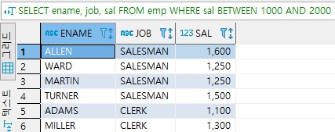

  

- 리스트를 사용한 검색

  IN은 리스트 내의 값과 비교한다. IN의 부정은 NOT IN이다.  
  아래의 WHERE절은 DNO의 값이 (1, 2, 3)에 속하는가를 검사한다.

  ```sql
  WHERE DNO IN (1, 2, 3)
  ```

  따라서 이 WHERE절은 OR를 사용하여 아래와 같이 표현할 수 있다.  
  IN을 사용하면 다수의 OR을 사용할 필요가 없다.

  ```sql
  WHERE DNO = 1 OR DNO = 2 OR DNO = 3
  ```

  ```sql
  10번 부서나 30번 부서에 소속된 사원들에 관한 모든 정보를 검색
  SELECT *
  FROM emp
  WHERE deptno IN (10, 20);
  ```

  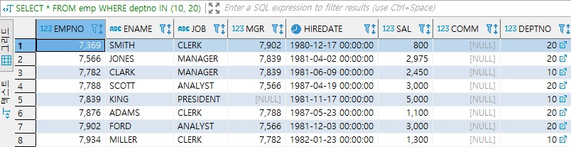

  

- SELECT절에서 산술 연산자(+, -, *, /) 사용

  SELECT절에 산술 연산자를 사용하여 수식을 표현해도 실제로 데이터베이스 내의 값이 변경되는 것은 아니다.  
  데이터베이스 내의 값이 어떻게 바뀔 것인가 파악하기 위한 목적으로 사용된다.

  ```sql
  직급이 MANAGER인 사원들에 대하여 이름과, 현재의 급여, 급여가 10%인상됐을 때의 값을 검색
  SELECT ename, sal, sal*1.1 AS newsal
  FROM emp
  WHERE job = 'MANAGER';
  ```

  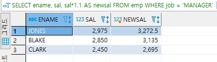

  

- 널값

  널값을 포함한 다른 값과 널값을 +, - 등을 사용하여 연산하면 결과는 널이 된다.  
  COUNT(*)를 제외한 집단 함수들은 널값을 무시한다.  
  부서번호가 널인 사원들을 검색하라는 아래의 질의는 DNO 애트리뷰트에 널값을 가진 투플이  
  EMPLOYEE 릴레이션에 하나 이상 존재하더라도 아무런 결과를 구하지 못한다.  
  즉 어떤 애트리뷰트에 들어 있는 값이 널인가 비교하기 위해서 'DNO=NULL'처럼 나타내면 안된다.  

  ```sql
  SELECT empno, empname
  FROM employee
  WHERE dno = NULL;
  ```

  아래의 비교 결과는 모두 거짓이다.

  ```sql
  NULL > 300
  NULL = 300
  NULL <> 300
  NULL = NULL
  NULL <> NULL
  ```

  애트리뷰트의 값이 널인지 비교하려면 새로운 비교 연산자인 IS NULL이나 IN NOT NULL을 사용해야 한다.  즉 앞의 질의를 아래와 같이 표현하면 원하는 결과를 구할 수 있다.

  ```sql
  SELECT empno, empname
  FROM employee
  WHERE dno IS NULL;
  ```

  애트리뷰트에 들어 있는 널값은 '알려지지 않음'을 의미하기 때문에 SQL은 세 가지 값의 논리를 사용한다.  
  true OR unknown = true  
  true AND uinknown = unknown  
  NOT unknown = unknown 임을 알 수 있다.  
  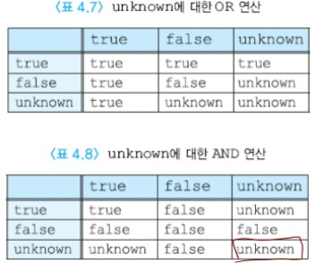

  

- ORDER BY절

  질의 결과를 오름차순이나 내림차순으로 정렬하는 경우가 흔히 있다.  
  사용자가 SELECT문에서 질의 결과의 순서를 명시하지 않으면 오라클에서는 릴레이션에 투플들이 삽입된 순서대로 사용자에게 제시된다.  
  ORDER BY절의 디폴트 정렬 순서는 오름차순(ASC)이다.  
  DESC를 지정하여 정렬 순서를 내림차순으로 지정할 수 있다.  
  널값도 정렬 과정에 표시된다.  
  널값은 오름차순에서는 가장 마지막에 나타나고, 내림차순에서는 가장 앞에 나타난다.  

  ```sql
  20번 부서에 근무하는 사원들의 급여, 직급, 이름을 검색하여 급여의 오름차순으로 정렬
  SELECT sal, job, ename
  FROM emp
  WHERE deptno = 20
  ORDER BY sal;
  ```

  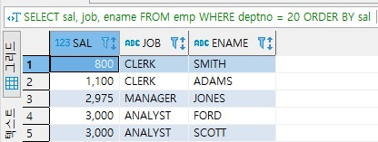

  여러 개의 애트리뷰트를 사용하여 정렬할 수도 있다.  
  아래의 SELECT문에서는 deptno 애트리뷰트에 대해 오름차순으로 정렬하고,  
  deptno 애트리뷰트의 값이 같은 투플들에 대해서는 sal 애트리뷰트에 대해 내림차순으로 정렬한다.  

  ```sql
  SELECT ...
  FROM ...
  WHERE ...
  ORDER BY deptno, sal DESC;
  ```

  

- 집단 함수

  데이터베이스에서 검색된 여러 투플들의 집단에 적용되는 함수가 집단 함수이다.  
  각 집단 함수는 한 릴레이션의 한 개의 애트리뷰트에 적용되어 단일 값을 반환한다.  
  집단 함수는 SELECT절과 HAVING절에만 나타낼 수 있다.  
  HAVING절은 투플들의 그룹에 적용되기 때문에 집단 함수를 HAVING절에 명시할 수  있다.  
  WHERE절은 각 투플에 적용되고, 투플들의 그룹에는 적용되지 않기 때문에 WHERE절에 집단 함수를 사용할 수는 없다.  
  COUNT, MIN, MAX는 숫자형 애트리뷰트와 비숫자형 애트리뷰트에 모두 적용할 수 있지만 SUM과 AVG는 숫자형 애트리뷰트에만 적용할 수 있다.  
  COUNT( * )를 제외하고는 모든 집단 함수들이 널값을 제거한 후 남아 있는 값들에 대해서 값을 구한다.  
  COUNT( * )는 널이나 중복된 값들이 나타나는 것에 상관없이 결과 릴레이션의 모든 투플들의 총 개수를 구하는 반면에 COUNT(애트리뷰트)는 해당 애트리뷰트에서 널값이 아닌 값들의 개수를 구한다.  
  만일 DISTINCT가 집단 함수 앞에 사용되면 집단 함수가 적용되기 전에 먼저 중복을 제거한다.  
  DISTINCT는 MIN과 MAX에는 아무런 영향이 없고 SUM, AVG, COUNT에는 영향을 미친다.

  ```sql
  모든 사원들의 평균 급여와 최대 급여를 검색
  SELECT AVG(sal) AS avgsal, MAX(sal) AS maxsal
  FROM emp;
  ```

  

- 그룹화

  GROUP BY절에 사용된 애트리뷰트에 동일한 값을 갖는 투플들이 각각 하나의 그룹으로 묶인다.  
  이때에 사용된 애트리뷰트를 __그룹화 애트리뷰트(grouping attribute)__ 라고 한다.  
  GROUP BY절에 사용되는애트리뷰트는 집단 함수에 사용되지 않는 애트리뷰트이어야 한다.  
  각 그룹에 대하여 결과 릴레이션에 하나의 투플이 생성된다.  
  따라서 SELECT절에는 각 그룹마다 하나의 값을 갖는 애트리뷰트, 집단 함수, 그룹화에 사용된 애트리뷰트들만 나타날 수 있다.  
  만일 SELECT절에 집단 함수가 포함되어 있고, GROUP BY절이 없는 경우에는 SELECT절에 집단 함수에서 참조되지 않는 애트리뷰트가 나타날 수 없다.  
  예를 들어, 다음 질의는 그룹화를 하지 않은 채 EMPLOYEE 릴레이션의 모든 투플에 대하여 사원번호와 모든 사원들의 평균 급여를 검색하므로 잘못된 것이다.  

  ```sql
  SELECT EMPNO, AVG(SALARY)
  FROM EMPLOYEE;
  ```

  ```sql
  모든 사원들에 대해서 사원들이 속한 부서번호별로 그룹화하고, 각 부서마다 부서번호, 평균급여, 최대 급여를 검색
  SELECT deptno, AVG(sal) AS avgsal, MAX(sal) AS maxsal
  FROM emp
  GROUP BY deptno;
  ```

  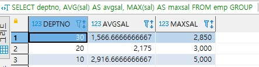

  

- HAVING절

  때로는 어떤 조건을 만족하는 그룹들에 대해서만 집단 함수를 적용할 수 있다.  
  각 그룹마다 하나의 값을 갖는 애트리뷰트를 사용하여 각 그룹이 만족해야 하는 조건을 명시한다.  
  HAVING절은 그룹화 애트리뷰트에 같은 값을 갖는 투플들의 그룹에 대한 조건을 나타내고, 이 조건을 만족하는 그룹들만 질의 결과에 나타난다.  
  HAVING절에 나타나는 애트리뷰트는 반드시 GROUP BY절에 나타나거나 집단 함수에 포함되어야 한다.  
  WHERE절과 비슷하지만 WHERE절은 투플들을 걸러내고, HAVING은 그룹들을 걸러낸다는 점이 다르다.  
  만일 HAVING절은 사용하지만 GROUP BY절을 생략하면 WHERE절을 만족하는 투플들의 집합을 하나의 그룹으로 취급한다. 이러한 경우에 HAVING절은 추가적인 WHERE절처럼 동작한다.

  ```sql
  모든 사원들에 대하여 사원들이 속한 부서번호별로 그룹화하고, 평균 급여가 1000원 이상인 부서에 대해서 부서번호, 평균 급여, 최대 급여를 검색
  SELECT deptno, AVG(sal) AS avgsal, MAX(sal) AS maxsal
  FROM emp
  GROUP BY deptno
  HAVING AVG(sal) >= 1000;
  ```

  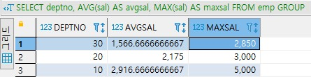

  

- 집합 연산

  집합 연산을 적용하려면 두 릴레이션이 합집합 호환성을 가져야 한다.  
  첫 번째 질의의 애트리뷰트 이름들이 결과에 나타난다.  
  UNION ALL(합집합)을 제외하고 모든 집합 연산의 결과 릴레이션에서 중복된 투플들이 자동적으로 삭제된다.

  ```sql
  SCOTT이 속한 부서이거나 RESEARCH의 부서번호를 검색
  (SELECT deptno
  FROM emp
  WHERE ename = 'SCOTT')
  UNION
  (SELECT deptno
  FROM dept
  WHERE dname = 'RESEARCH')
  ```

  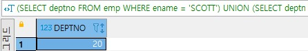

  

## 조인

조인은 두 개 이상의 릴레이션으로부터 연관된 투플들을 결합한다.  
조인의 일반적인 형식은 아래의 SELECT문과 같이 FROM절에 두 개 이상의 릴레이션이 열거되고,  
두 릴레이션에 속하는 애트리뷰트들을 비교하는 조인 조건이 WHERE절에 포함된다.  
조인 조건은 두 릴레이션 사이에 속하는 애트리뷰트 값을 비교 연산자로 연결한것이다.  
아래의 SELECT문은 두 릴레이션 R과 S로부터 릴레이션 R의 애트리뷰트 A와 릴레이션 S의 애트리뷰트 B가 주어진 비교 연산자를 만족하는 투플들의 집합을 구한다.  
흔히 R.A와 S.B는 기본 키와 외래 키의 관계를 갖는다.  

```sql
SELECT ...
FROM R, S
WHERE R.A <비교 연산자> S.B;
```

두 개의 릴레이션을 연관시키기 위해서 한 개의 조인 조건이 필요하므로,  
FROM절에 세 개의 릴레이션이 명시되었다면 먼저 두 릴레이션을 조인하기 위해서 한 개의 조인 조건이 필요하고,  
이 결과와 나머지 릴레이션을 조인하기 위해서 다시 한 개의 조인 조건이 필요하므로 두 개의 조인 조건이 필요하다.  
따라서 일반적으로 FROM절에 n개의 릴레이션을 명시했을 때는 n-1개의 조인 조건이 필요하다.  

SQL문을 읽기 쉽게 만들기 위해서 아래의 지침을 따르도록 하자.  
하나의 SQL문에서 참조하는 모든 테이브를은 FROM과 같은 라인에 열거한다.  
가능하면 테이블들의 순서를 의미 있게 정한다.  
모든 조인 조건들을 FROM절에 열거한 테이블들의 순서와 동일하게 한다.  
혼동을 피하기 위해서 조인 조건에 테이블 이름(별칭)을 붙이도록 한다.  
WHERE절에 다른 조건들보다 조인 조건들을 먼저 연거한다.

조인 조건을 생략했을 때와 조인 조건을 틀리게 표현했을 때는 카티션 곱이 생성된다.  
카티션 곱에서는 첫 번째 릴레이션의 모든 투플이 두 번째 릴레이션의 모든 투플과 결합된다.  
카티션 곱의 결과는 매우 방대하므로 카티션 곱을 구하는데 시간이 오래 걸릴 수 있다.  
따라서 WHERE절에 조인 조건을 정확하게 명시하여 카티션 곱이 생성되지 않도록 해야 한다.  

조인 질의가 수행되는 과정을 개념적으로 살펴보면 먼저 조인 조건을 만족하는 투플들을 찾고, 이 투플들로부터 SELECT절에 명시된 애트리뷰트들만 프로젝트하고, 필요하다면 중복을 배제하는 순서로 진행된다.

조인 조건이 명확해지도록 애트리뷰트 이름 앞에 릴레이션의 이름이나 투플 변수를 사용하는 것이 좋다.  
물론 두 릴레이션의 조인 애트리뷰트 이름이 동일하다면 반드시 애트리뷰트 이름 앞에 릴레이션 이름이나 투플 변수를 사용해야 한다.

```sql
모든 사원들의 이름과 이 사원이 속한 부서 이름을 검색
    SELECT ename, dname
    FROM emp e, dept d
    WHERE e.deptno = d.deptno;
```

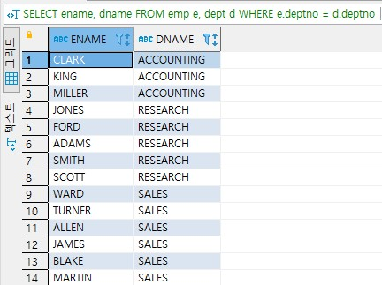


한 릴레이션에 속하는 투플을 동일한 릴레이션에 속하는 투플들과 조인하는 것을 __자체 조인(self joing)__ 이라고 부른다.  
실제로는 한 릴레이션이 접근되지만 FROM절에 두 릴레이션이 참조되는 것처럼 나타내기 위해서 그 릴레이션에 대한 별칭을 두 개 지정해야 한다.  
자체 조인은 EMPLOYEE 릴레이션에 사원의 ID와 사원의 상사의 ID를 함께 포함시켰을 경우 또는 EMPLOYEE 릴레이션에 직장주소와 집주소를 모두 포함시켰을 경우 등에 사용할 수 있다.  

```sql
모든 사원에 대해서 사원의 이름과 직속 상사의 이름을 검색
SELECT e.ename, m.ename
FROM emp e, emp m
WHERE e.empno = m.mgr;
```

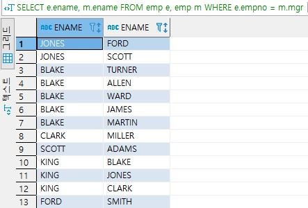


ORDER BY 와 같이 사용 예시

```sql
모든 사원에 대해서 소속 부서 이름, 사원의 이름, 직급, 급여를 검색하라.
부서 이름에 대해서 오름차순, 부서이름이 같은 경우에는 sal에 대해서 내림차순으로 정렬
SELECT dname, ename, job, sal
FROM emp e, dept d
WHERE e.deptno = d.deptno
ORDER BY dname, sal DESC;
```

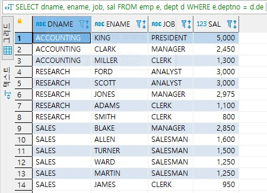


## 중첩 질의

일부 질의들은 데이터베이스에서 어떤 값들을 검색한 후에 이를 비교 조건에서 사용한다.  
이런 질의들은 중첩 질의를 사용해서 편리하게 표현할 수 있다.  
중첩 질의는 아래 그림과 같이 외부 질의의 WHERE절에 다시 SELECT...FROM...WHERE 형태로 포함된 SELECT 문을 말한다.  
중첩 질의를 __부질의(subquery)__ 라고 하며, 중첩 질의는 소괄호 안에 표기해야 한다.  
또한 여러 단계로 질의가 중첩될 수 있으며, INSERT, DELETE, UPDATE문에도 사용할 수 있다.

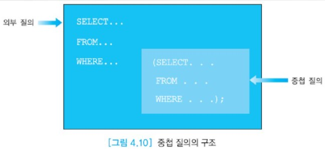

중첩 질의의 결과로 한 개의 스칼라 값(단일 값), 한 개의 애트리뷰트로 이루어진 릴레이션, 여러 애트리뷰트로 이루어진 릴레이션이 반환될 수 있다.  
단일 값이 반환되는 경우에는 외부 질의의 WHERE절에 IN, ANY(SOME), ALL EXISTS가 사용되고,  
여러 애트리뷰트로 이루어진 릴레이션이 반환되는 경우에는 EXISTS가 사용된다.  

- 한 개의 스칼라 값이 반환되는 경우

  중첩 질의는 외부 질의보다 먼저 수행되고, 외부 질의의 WHERE절에서 비교 연산자를 사용하여 중첩 질의의 결과와 비교하는데,  
  중첩 질의로 부터 여러 값들이 반환되는 경우에는 에러가 발생한다. 왜냐하면 비교 연산자는 단일 값을 비교하는 데 사용되기 때문이다.  
  한 개의 스칼라 값이 반환되는 경우에는 중첩 질의가 오직 한 번만 수행된다.  
  이런 경우에 중첩 질의의 SELECT절에 사용된 애트리뷰트의 데이터 타입은 외부 질의의 WHERE절에 사용된 애트리뷰트이 데이터 타입과 같아야 한다.  
  다시 말해서, "WHERE ColumnName = (SELECT ...);" 라고 입력한다면  
  중첩 질의의 SELECT절에는 한 개의 애트리뷰트만 명시하여야 하고, 이 애트리뷰트의 데이터 타입은 ColumnName의 데이터 타입과 같아야 한다.

  ```sql
  박영권과 같은 직급을 갖는 모든 사원들의 이름과 직급을 검색
  1. 각 사원의 이름과 직급을 검색하는 질의(외부 질의)가 필요하다.
  SELECT ename, job
  FROM emp
  WHERE job = 
  2. SCOTT의 직급을 검색하는 질의(중첩 질의)가 필요하다.
  SELECT job
  FROM emp
  WHERE ename = 'SCOTT'
  3. 두 질의를 하나로 결합하면 SCOTT과 같은 job을 갖는 모든 사원들의 이름과 직급을 검색할 수 있다.
  SELECT ename, job
  FROM emp
  WHERE job = (
  SELECT job
  FROM emp
  WHERE ename = 'SCOTT');
  ```

  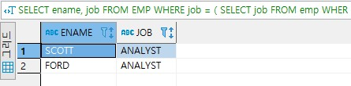

  

- 한 개의 애트리뷰트로 이루어진 릴레이션이 반환되는 경우

  중첩 질의의 결과로 한 개의 애트리뷰트로 이루어진 다수의 투플들(즉, 스칼라 값들의 집합)이 반환될 수 있다.  
  외부 질의의 WHERE절에서 IN, ANY(SOME), ALL, EXISTS와 같은 연산자를 사용해야 한다.  
  키워드 IN은 한 애트리뷰트가 값들의 집합에 속하는가를 테스트 할 때 사용된다.  
  만일 한 애트리뷰트가 값들의 집합에 속하는 하나 이상의 값들과 어떤 관계를 갖는가를 테스트하는 경우에는 ANY를 사용하고,  
  만일 한 애트리뷰트가 값들의 집합에 속하는 모든 값들과 어떤 관계를 갖는가를 테스트하는 경우에는 ALL을 사용한다.  
  EXISTS는 여러 애트리뷰트로 이루어진 릴레이션이 반환되는 경우에도 사용한다.  
  ANY 및 ALL과 결합하여 사용할 수 있는 다른 연산자들로는 {=, <>, <=, <, >, >=} 등의 비교 연산자가 있다.  
  =ANY는 IN과 의미가 같고, <>ALL은 NOT IN과 의미가 같다.

  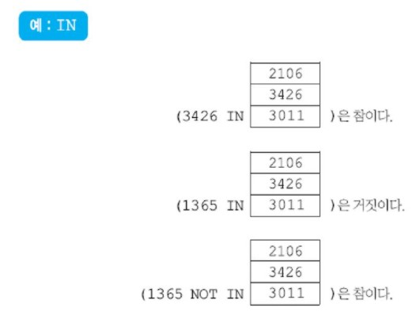

  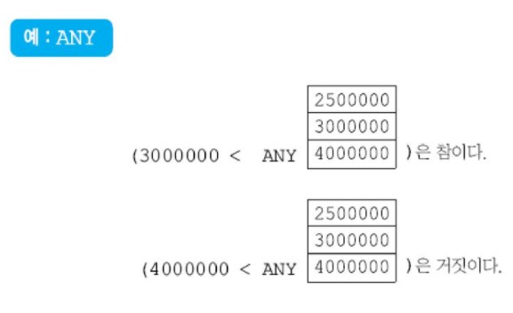

  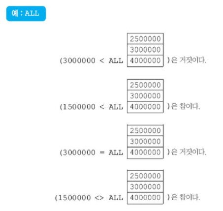

  ```sql
  RESEARCH나 SALES에 근무하는 사원들의 이름을 검색
  SELECT ename
  FROM emp
  WHERE deptno IN (
  SELECT deptno
  FROM dept
  WHERE dname ='RESEARCH' OR dname = 'SALES');
  
  위 질의를 중첩 질의를 사용하지 않은 조인 질의로 나타냄
  SELECT ename
  FROM emp e, dept d
  WHERE e.deptno = d.deptno
  	AND (d.dname ='RESEARCH' OR d.dname ='SALES');
  ```

  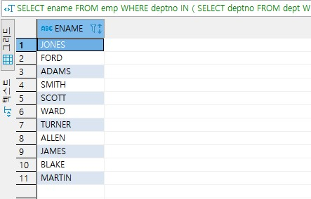

  

- 여러 애트리뷰트들로 이루어진 릴레이션이 반환되는 경우

  중첩 질의의 결과로 여러 애트리뷰트들로 이루어진 릴레이션이 반환되는 경우에는  
  EXISTS 연산자를 사용하여 중첩 질의의 결과가 빈 릴레이션인지 여부를 검사한다.  
  EXISTS 연산자는 중첩 질의의 결과가 비어 있지 않은지의 여부만 검사하므로  
  중첩 질의의 SELECT절에 임의의 애트리뷰트들의 리스트가 올 수 있다.  
  EXISTS subqery의 결과는 중첩 질의의 결과에 적어도 하나의 투플이 들어 있으면 참이 되고,  
  그렇지 않으면 거짓이 된다. NOT EXISTS는 EXISTS의 반대로 테스트한다고 생각하면 된다.

  ```sql
  RESEARCH나 SALES에 근무하는 사원들의 이름을 검색
  SELECT ename
  FROM emp e
  WHERE EXISTS (
  SELECT *
  FROM dept d
  WHERE e.deptno = d.deptno
  	AND (dname = 'RESEARCH' OR dname = 'SALES'));
  ```

  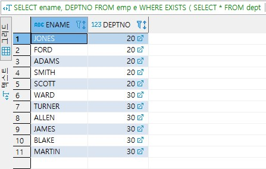

  

- 상관 중첩 질의

  중첩 질의의 WHERE절에 있는 프레디키트에서 외부 질의에 선언된 릴레이션의 일부 애트리뷰트를 참조하는 질의를 상관 중첩 질의라고 부른다.  
  중첩 질의의 수행 결과가 단일 값이든, 하나 이상의 애트리뷰트로 이루어진 릴레이션이든  
  외부 질의로 한 번만 결과를 반환하면 상관 중첩 질의가 아니다.  
  상관 중첩 질의에서는 외부 질의를 만족하는 각 투플이 구해진 후에 중첩 질의가 수행된다.  
  따라서 상관 중첩 질의는 외부 질의를 만족하는 투플 수만큼 여러 번 수행될 수 있다.  
  바로 앞에서 예로 든 EXISTS를 사용한 질의는 외부 질의의 FROM절에 명시된 emp 릴레이션의  
  각 투플마다 중첩해서 질의가 반복해서 수행되므로 상관 중첩 질의이다.

  ```sql
  자신이 속한 부서의 사원들의 평균 급여보다 많은 급여를 받는 사원들에 대해서
  이름, 부서번호, 급여를 검색
  
  SELECT ename, deptno, sal
  FROM emp e
  WHERE sal > (
  SELECT AVG(sal)
  FROM emp
  WHERE deptno = e.deptno);
  
  ```

  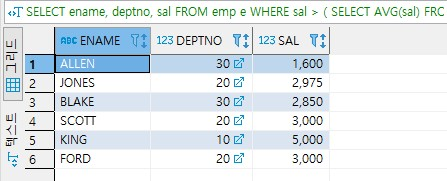

  
