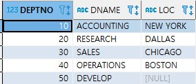
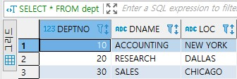

# INSERT, DELETE, UPDATE문

오라클의 데이터 조작어에는 데이터베이스를 갱신하는 세 가지 명령이 있다.  
INSERT문은 릴레이션에 새로운 투플을 삽입하고,  
DELETE문은 릴레이션에서 기존의 투플을 삭제하고,  
UPDATE문은 기존의 투플의 애트리뷰트 값들을 수정한다.  


## 목차

- [INSERT문](#insert문)
- [DELETE문](#delete문)
- [UPDATE문](#update문)


## INSERT문

INSERT문은 기존의 릴레이션에 투플을 삽입한다.  
참조되는 릴레이션에 투플이 삽입되는 경우에는 참조 무결성 제약조건의 위배가 발생하지 않으나  
참조하는 릴레이션에 투플이 삽입되는 경우에는 참조 무결성 제약조건을 위배할 수 있다.  
INSERT문은 릴레이션에 한 번에 한 투플씩 삽입하는 것과 한 번에 여러 개의 투플들을 삽입할 수 있는 것으로 구분한다.  
한 번에 한 투플씩 삽입하는 INSERT문의 구문은 아래와 같다.  
이 구문에서 애트리뷰트들의 리스트를 생략하는 경우에는 VALUES절의 값들의 순서가 릴레이션 내의 애트리뷰트들의 순서와 일치해야 한다.

```sql
INSERT 
INTO 릴레이션(애트리뷰트1, ..., 애트리뷰트n)
VALUES (값1, ..., 값n);
```


릴레이션을 정의할 때의 애트리뷰트들의 순서대로, 모든 애트리뷰트에 값을 명시하여 INSERT문을 작성하면  
INSERT문에서 애트리뷰트 이름들을 생략할 수 있지만 좋은 습관은 아니다.  
왜냐하면 나중에 릴레이션에 다른 애트리뷰트가 추가되면 그 INSERT문이 더 이상 동작하지 않기 때문이다.  

한 투플을 입력할 시점에 값이 알려지지 않은 일부 애트리뷰트들에 대해서는 값을 입력하지 않을 수 있다.  
INSERT문에서 값을 입력하지 않은 애트리뷰트에는 널값이 채워진다.  
문자나 날짜형의 애트리뷰트 값은 단일 인용기호( `)로 에워싼다.

```sql
dept 릴레이션에 (50, DEVELOP, ∧) 투플을 삽입하는 INSERT문
INSERT INTO dept
VALUES (50, DEVELOP, '');
```




릴레이션에서 한 번에 여러 개의 투플들을 입력하는 INSERT문의 구문은 아래와 같다.  
INSERT문 내의 SELECT문의 수행 결과로 검색된 투플들이 한꺼번에 릴레이션에 입력된다.  
이런 형식의 구문에는 VALUES절이 사용되지 않는다.  

```sql
INSERT
INTO 릴레이션(애트리뷰트1, ..., 애트리뷰트n)
SELECT ....
FROM ....
WHERE ...;
```

다른 릴레이션으로부터 SELECT한 결과를 어떤 릴레이션에 한꺼번에 삽입하는 것이 아니고,  
직접 다수의 투플을 삽입하려면 투플 개수만큼의 INSERT문을 일일히 작성해야 한다.  
데이터베이스 외부에서 릴레이션에 다수의 투플을 쉽게 삽입할 수 있도록 대부분의 DBMS들은 데이터 적재 명령(ex. copy명령)을 제공한다.

```sql
emp 릴레이션에서 급여가 3000 이상인 사원들의 이름, 직급, 급여를 검색하여 HIGH_SAL라는 릴레이션에 삽입하라. HIGH_SAL 릴레이션은 이미 생성되어 있다고 가정한다.
INSERT INTO HIGH_SAL (ename, job, sal)
SELECT ename, job, sal
FROM emp
WHERE sal >= 3000;
```


## DELECT 문

삭제 연산은 한 릴레이션으로부터 한 개 이상의 투플들을 삭제한다.  
참조되는 릴레이션의 삭제 연산의 결과로 참조 무결성 제약조건이 위배될 수 있으나,  
참조되는 릴레이션에서 투플을 삭제하면 참조 무결성 제약조건을 위배하지 않는다.

DELECT문의 구문은 아래와 같다.  FROM절에 명시한 릴레이션으로부터 WHERE절을 만족하는 투플들을 삭제한다.  
WHERE절을 생략하면 해당 릴레이션에서 모든 투플들이 삭제되어 빈 릴레이션이 되므로 매우 신중하게 사용해야 한다.

```sql
DELETE
FROM 릴레이션
[WHERE 조건];
```

```sql
dept 릴레이션에서 40번 부서를 삭제하라.
DELECT FROM dept
WHERE deptno = 40;
```




## UPDATE문

UPDATE문은 한 릴레이션에 들어 있는 투플들의 애트리뷰트 값들을 수정한다.  
UPDATE문은 수정된 애트리뷰트가 기본 키나 외래 키에 속하지 않는 한 어떤 무결성 제약조건도 위반하지 않는다.  
그러나 기본 키나 외래 키에 속하는 애트리뷰트의 값이 수정되면 참조 무결성 제약조건을 위배할 수 있다.  
외래 키에 속하는 애트리뷰트의 값을 수정하는 UPDATE문은 수정 후의 새로운 외래 키 값이 참조되는 릴레이션에 존재하는 어떤 투플과 대응될 때에는 참조 무결성을 위배하지 않는다.  
기본 키의 값을 수정하는 UPDATE문은 기존의 투플을 삭제한 후에 새로운 투플을 삽입한 것과 개념적으로 동등하므로  
기본 키가 삭제되었을 때 나타날 수 있는 문제가 UPDATE문에서도 발생할 수 있다.

UPDATE문의 구문은 아래와 같다.  
WHERE절을 만족하는 한 개 이상의 투플들이 해당 릴레이션에서 수정된다.  
WHERE절을 생략할 수 있다. WHERE절을 생략하면 릴레이션의 모든 투플들이 수정된다.  
하나의 UPDATE문에서 여러 애트리뷰트들의 값을 수정할 수 있다. 또한 값 대신에 식을 사용할 수도 있다.

```sql
UPDATE 릴레이션
SET 애트리뷰트 = 값 또는 식[,...]
[WHERE 조건];
```

```sql
사원번호가 7499인 사원의 소속 부서를 20번 부서로 옮기고, 급여를 20% 올려라.
UPDATE emp
SET deptno = 30, sal = sal* 1.2
WHERE empno = 7499;
```

