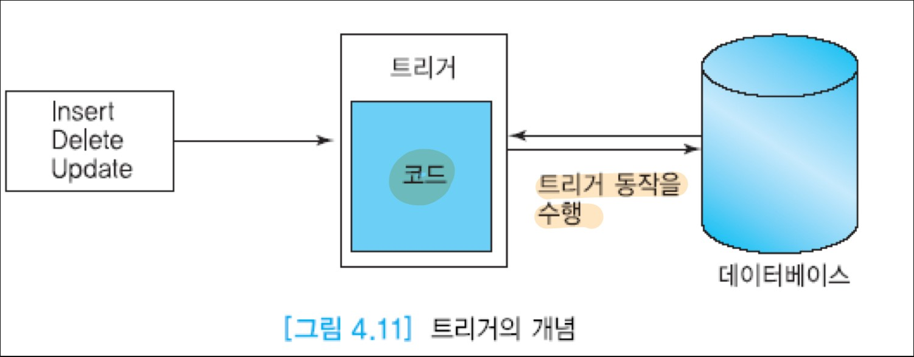
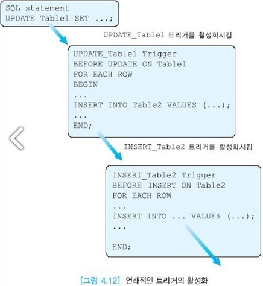

# 트리거(trigger)와 주장(assertion)

테이블 정의와 별도로 데이터베이스의 무결성을 시행하는 메커니즘인 트리거와 주장을 살펴보자.  
제약조건이 트리거보다 성능이 우수하고, 코딩이 불필요하고, 선언하고 수정하기가 용이하므로  
가능하면 제약 조건을 사용하는 것이 좋다.  
트리거는 주장보다 좀 더 절차적이다.


## 목차

- [트리거](#트리거)
- [주장](#주장)


## 트리거

트리거는 명시된 이벤트(데이터베이스의 갱신)가 발생할 때마다 DBMS가 자동적으로 수행하는, 사용자가 정의하는 문(프로시저)이다.  
트리거는 데이터베이스의 무결성을 유지하기 위한 일반적이고 강력한 도구이다.  
트리거는 테이블 정의 시 표현할 수 없는 기업의 비즈니스 규칙들을 시행하는 역할을 한다.  
무결성 제약조건을 유지하기 위하여 데이터베이스 갱신을 모니터링하고, 데이터베이스 갱신을 전파한다.  
아래 그림은 트리거의 개념을 보여준다.  
한 릴레이션에 대해서 삽입, 삭제, 수정이 발생하여 트리거가 활성화되면 트리거의 코드가 데이터베이스에 대해 실행된다.



트리거를 명시하려면 트리거를 활성화하는 사건인 이벤트, 트리거가 활성화되었을 때 수행되는 테스트인 조건, 트리거가 활성화되고 조건이 참일 때 수행되는 문(프로시저)인 동작을 표현해야 한다.  
트리거를 __이벤트-조건-동작(ECA)__ 규칙이라고도 부른다.  
여기서 E는 Event, C는 Condition, A는 Action을 의미한다. 트리거는 SQL3 표준에 포함되었으며 대부분의 상용 관계 DBMS에서 제공된다.  
각 상용 관계 DBMS마다 표준과 조금씩 다른 구문을 사용한다.

```sql
SQL3에서 트리거의 형식
CREATE TRIGGER <트리거이름>
AFTER <트리거를 유발하는 이벤트들이 OR로 연결된 리스트> ON <릴레이션>           -E 이벤트
[WHEN <조건>]															 -C 조건
BEGIN <SQL문(들)>END													 -A 동작
```

트리거에서 명시할 수 있는 이벤트는 외래 키 위반뿐만 아니라 보다 일반적인 이벤트도 포함한다.  
이벤트는 테이블에 대한 INSERT문, DELETE문, UPDATE문이다.  
SELECT문은 테이블을 갱신하지 않으므로 이벤트가 될 수없다.  조건은 임의의 형태의 프레디키트이다.  
WHERE절에 표현할 수 있는 어떤 형태도 조건으로 명시할 수 있다. 동작은 데이터베이스에 대한 임의의 갱신이다.  
하나의 SQL문 또는 내포된 SQL문을 포함한 프로그램이 될 수 있다.  
트리거가 제약조건과 유사하지만 어떤 이벤트가 발생했을 때 조건이 참이 되면 트리거와 연관된 동작이 수행되고,  
그렇지 않으면 아무 동작도 수행되지 않는다. 트리거는 __능동 데이터베이스(active database)__ 의 중요한 특징이다.

각 SQL문이 수행된 후에(immediate) 또한 한 트렌젝션의 수행이 종료된 후에(deferred) 검사가 이루어진다.  
테이블 수준의 트리거와 행 수준의 트리거로 구분한다.  
또한 삽입, 삭제, 수정 등이 일어나기 전(before)에 동작하는 트리거와 일어난 후(after)에 동작하는 트리거로 구분한다.

```sql
새로운 사원이 입사할 때마다, 사원의 급여가 1500 미만인 경우에는 급여를 10% 인상하는 트리거를 작성
여기서 이벤트는 새로운 사원 투플이 삽입될 때, 조건은 급여< 1500, 동작은 급여를 10% 인상하는 것이다. 오라클에서 트리거를 정의하는 문장은 SQL3의 트리거 정의문과 동일하지 않다.
CREATE TRIGGER raise_sal
AFTER INSERT ON emp
REFERENCING NEW AS newemp
FOR EACH ROW
WHEN (newemp.sal < 1500)
UPDATE emp
SET newemp.sal = sal * 1.1
WHERE empno = newemp.empno;
```

트리거가 데이터베이스의 일관성을 유지하는 데 매우 유용하지만 트리거를 과도하게 사용하면 복잡한 상호 의존성을 야기할 수 있다.  
대규모 데이터베이스 응용에서는 복잡한 상호 의존성을 관리하는 것이 어렵다.  
예를 들어, 하나의 트리거를 활성화하여 그 트리거 내의 SQL문이 수행될 수 있다. 그 결과로 다른 트리거를 활성화하여 그 트리거 내의 SQL문이 수행될 수 있다.  
이처럼 한 트리거 내의 SQL문이 다른 트리거의 할성화를 유발하면 트리거들이 연쇄된다고 말한다.  
아래 그림은 트리거들이 연쇄적으로 활성화되는 경우를 보여준다.



트리거를 과도하게 사용하지 않더라도 트리거를 작성할 때 신중해야 한다.  
왜냐하면 트리거는 조건이 맞으면 자동적으로 수행되기 때문에 사용자가 트리거의 영향을 인식하지 못할 수 있기 때문이다.


## 주장

주장의 조건은 그 조건을 위배할 가능성이 있는 각 갱신문마다 검사된다.  
주장은 SQL3에 포함되어 있으나 대부분의 상용 관계 DBMS가 아직 지원하고 있지 않다.  
트리거는 제약조건을 위반했을 때 수행할 동작을 명시하는 것이고,  
주장은 제약조건을 위반하는 연산이 수행되지 않도록 하는 것이다.  
주장을 정의하는 구문은 아래와 같다. 릴레이션과 마찬가지로, 불필요한 주장은 DROP문을 사용하여 삭제할 수 있다.

```sql
CREATE ASSERTION 이름
CHECK 조건;
```

주장은 트리거보다 좀 더 일반적인 무결성 제약조건이다.  
주장은 데이터베이스가 항상 만족하기를 바라는 조건을 직접적으로 표현하는 프레디키트이다.  
일반적으로 두 개 이상의 테이블에 영향을 미치는 제약조건을 명시하기 위해 사용된다.  
DBMS는 주장의 프레디키트를 검사하여 만일 참이면 주장을 위배하지 않는 경우이므로 데이터베이스 수정을 허용한다.

주장이 명시되었을 때 DBMS는 이 주장의 유효성을 검사한다.  
주장이 복잡하면 유효성 검사가 상당한 오버헤드(질의의 평가)를 유발할 수 있으므로 주장을 신중하게 사용해야 한다.

도메인 제약조건과 참조 무결성 제약조건은 주장의 특별한 유형이다.  
여러 테이블이 연관되어 도메인 제약조건과 참조 무결성 제약조건으로 표현할 수 없는 제약조건도 주장으로 명시할 수 있다.
