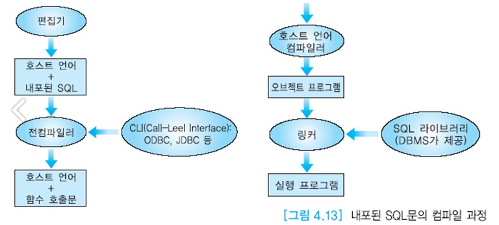

# 내포된 SQL

SQL은 강력한 선언적인 언어이다.  
SQL에서 질의를 작성하는 것은 일반적으로 고급 프로그래밍 언어(호스트언어)를 사용하여 동일한 질의를 코딩하는 것보다 간단하다.  
사용자의 관점에서 호스트 언어와 SQL을 함께 사용하여 데이터베이스를 접근하는 이유가 있다.  
SQL이 호스트 언어의 완전한 표현력을 갖고 있지 않기 때문에 모든 질의를 SQL로 표현할 수 는 없다.  
이런 질의를 표현하기 위해서는 SQL을 보다 강력한 언어에 내포시켜야 한다.  
SQL은 사용하기 쉬운 언어이지만 호스트 언어가 갖고 있는 조건문(IF문), 반복문(WHILE문),  
입출력 등과 같은 연산, 사용자와의 상호 작용, 질의 결과를 GUI로 보내는 등의 기능을 갖고 있지 않다. 

따라서 C, C++, 코볼, 자바 등의 언어로 작성하는 로그램에 SQL문을 삽입하여,  
데이터베이스를 접근하는 부분은 SQL이 맡고 SQL에 없는 기능은 호스트 언어로 작성하는 것이 필요하다.  
호스트 언어에 포함되는 SQL문을 __내포된 SQL__ 이라 부른다.

호스트 언어에 SQL문을 내포시켜 응용 프로그램을 작성하려면 프로그래머는 두 가지 언어에 익숙해야 한다.  
또한 두 언어 사이의 인터페이스와 데이터 타입 호환성, 에러 탐지,  
호스트 언어에서 제공하는 데이터 구조와 DBMS가 제공하는 __데이터 구조가 불일치 하는 문제(impedance mismatch 문제)__ 등을 해결해야 한다.  
내포된 SQL문의 또 다른 문제는 이식성이 높지 않다는 것이다.  
DBMS들마다 SQL문을 내포시키는 구문등에 다소 차이가 있다. 즉 서로 다른 DBMS마다 고유한 __전컴파일러(precompiler)__ 와 라이브러리를 사용하기 때문에  
한 DBMS를 사용하여 개발된 응용 프로그램을 다른 DBMS에서 사용하려면 응용 프로그램을 다시 컴파일해야 한다.

본 절에서는 오라클에서 C 프로그램에 SQL문을 내포시키는 환경을 가정하고 설명을 전개한다.  
이를 줄여서 __Pro*C__ 라 부르기로 한다.  
Pro\*C는 C 프로그래머가 데이터베이스 접근을 관리하는 환경에 적합하다.  
Pro\*C는 SQL문을 포함한 C 소스 프로그램을 받아들여 그 속에 삽입된 SQL문을  
__오라클 런타임 라이브러리__ 호출로 변환하여, 수정된 C 소스 프로그램을 생성하는 전컴파일러이다.  
사용자는 수정된 이 소스 프로그램을 C 컴파일러를 사용하여 컴파일하고, 링크하고, 수행한다.  
일반적으로 내포된 SQL문이 포함된 소스 파일의 확장자는 .pc이다.  
이 파일을 Pro\*C를 통하여 전컴파일하면 확장자가 .c인 C 소스 프로그램이 생성된다.  
Pro\*C++는 C++ 프로그램에 SQL문을 내포시킬 때 사용하는 전컴파일러이다.

호스트 언어로 작성 중인 프로그램에 SQL문을 내포시킬 때 해당 호스트 언어의 컴파일러가 어떻게 호스트 언어의 문과 SQL문을 구별할 것인가?  
예를 들어, C 언어로 작성 중인 프로그램에 자바 문장들을 삽입했다면 C 언어 컴파일러는 자바 문장들이 C 언어의 문법에 맞기 않기 때문에 번역할 수 없으므로 에러 메시지들을 출력할 것이다.  
호스트 언어로 작성 중인 프로그램에 포함된 SELECT, INSERT, DELETE, UPDATE 등 모든 SQL문에는 반드시 문장의 앞부분에 EXEC SQL을 붙인다.  
EXEC SQL은 EXEC SQL부터 세미콜론(;) 사이에 들어 있는 문장이 내포된 SQL문임을 전컴파일러에게 알린다.  
Pro\*C 전컴파일러는 내포된 SQL문을 C 컴파일러에서 허용되는 함수 호출로 변환한다.  
아래 그림은 Pro\*C환경에서 내포된 SQL문을 컴파일하는 과정을 보여준다.

Pro\*C는 __정적인 SQL문과 동적인 SQL문__ 모두를 지원한다.  
정적인 SQL문은 C 프로그램에 내포된 완전한 SQL문이다.  
동적인 SQL문은 응용을 개발할 때 완전한 SQL문의 구조를 미리 알고 있지 않아도 된다.  
동적인 SQL문은 불완전한 SQL문으로서 일부 또는 전부를 질의가 수행될 때 입력해도 좋다.




정적인 SQL문은 입력 값과 출력 데이터를 위해서 C의 변수들을 포함할 수 있다.  
SQL문에 포함된 C 프로그램의 변수를 __호스트 변수(host variable)__ 라고 부른다.  
호스트 변수는 내포된 SQL의 선언부에서 BEGIN DECLARE SECTION과 END DECLARE SECTION문을 사용하여 선언된 C 프로그램의 변수이다.  
C 프로그램에서 선언된 호스트 변수들은 C와 내포된 SQL문에서 사용할 수 있다.  
C의 변수들을 SQL문에서 사용하려면 다른 SQL 애트리뷰트들과 구별하기 위해 변수 이름 앞에 콜론(:)을 붙여야 한다.

```c
아래의 부분 프로그램은 호스트 변수를 사용한 C 프로그램의 예를 보여준다.
이 프로그램은 사용자에게 사원의 번호를 입력하도록 하고, 사용자가 입력한 값을 호스트 변수 no에 저장한다.
그 다음에 프로그램은 DBSERVER 데이터베이스의 EMPLOYEE 릴레이션에서 그 사원의 직급을 검색하여 호스트 변수 title에 저장한다.

#include <stdio.h>
   
EXEC SQL BEGIN DECLARE SECTION;
	int	no;
	varchar title[10];
EXEC SQL END DECLARE SECTION;

EXEC SQL INCLUDE SQLCA.H;

void main(){
    char *uid = "KIM/kim@DBSERVER";
    EXEC SQL WHENEVER SQLERROR GOTO errexit;
    EXEC SQL CONNECT :uid;	/* DBSERVER 데이터베이스에 사용자 KIM으로 접속*/
    
    printf("Enter employee number : ");
    scanf("%d",%no);
    
    EXEC SQL SELECT title INTO :title
             FROM EMPLOYEE WHERE empno = :no;
    printf("\nAuthor's title is %s.\n", title);
    EXEC SQL COMMIT WORK;
    exit(0);
errexit:
    EXEC SQL ROLLBACK WORK;
    exit(1);
}
```


오라클은 INTO절에 있는 호스트 변수들에 SELECT절의 애트리뷰트의 값들을 배정한다.  
SELECT절에 있는 애트리뷰트의 수와 INTO절에 있는 호스트 변수의 수가 같고,  
대응되는 애트리뷰트와 호스트  변수의 데이터 타입이 호환되어야 한다.


### 불일치 문제와 커서
