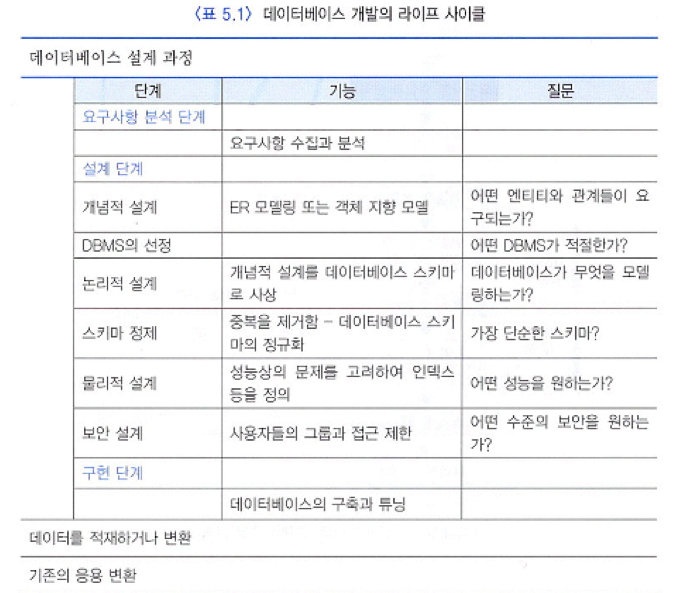
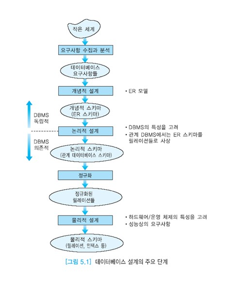

# 데이터베이스 설계의 개요

데이터베이스 설계는 한 조직체의 운영과 목적을 지원하기 위해 데이터베이스를 생성하는 과정이다.  
주요 목적은 모든 주요 어플리케이션과 사용자들이 요구하는 데이터, 데이터간의 관계를 표현하는 것이다.  
데이터베이스 설계는 일반적인 프로젝트 라이프 사이클 과정을 따른다.  
데이터베이스 설계의 기본적인 원칙은 요구사항에 반드시 충실해야 한다는 것이다.  

훌륭한 데이터베이스 설계는 관심의 대상이 되는 실세계를 잘 나타내는 것이다.  
시간의 흐름에 따른 데이터의 모든 측면을 나타내고, 데이터 항목의 중복을 최소화하고,  
데이터베이스에 대한 효율적인 접근을 제공하고, 데이터베이스의 무결성을 제공하고,  
깔끔하고 일관성이 있고, 이해하기 쉬워야 한다.  
종종 이런 목적들은 서로 상충되기도 한다.  

데이터베이스 설계는 요구사항 분석, 개념적 설계, DBMS의 선정, 논리적 설계,  
스키마 정제, 물리적 설계와 튜닝 등 여러 단계로 이루어진다.  
일반적으로, 데이터베이스 설계의 완성도를 높이기 위해서 이런 단계들을 앞뒤로 왔다갔다할 필요가 있다.  
또한 한 단계에 대한 결정은 다른 단계에 대한 선택에 영향을 미친다.  
어플리케이션에 대한 워크로드의 특성과 성능 목적을 이해하는 것은 훌륭한 설계를 완성하는 데 필수적이다.  
이제부터 설계의 각 단계를 차례대로 설명한다.  
직사각형으로 표시한 것은 설계의 주요 단계이고, 타원형으로 표기한 것은 각 단계의 결과물이다.  
요구사항 수집과 분석, 개념적 설계는 특정 DBMS와 독립적으로 진행된다.  
논리적 설계 단계부터는 특정 DBMS를 선정한 후 이 DBMS에 적용할 수 있도록 진행된다.

## 목차

- [요구사항 수집과 분석](#요구사항-수집과-분석)
- [개념적 설계](#개념적-설계)
- [DBMS 선정](#dbms-선정)
- [논리적 설계](#논리적-설계)
- [정규화](#정규화)
- [물리적 설계](#물리적-설계)
- [트랜잭션 설계](#트랜잭션-설계)

## 요구사항 수집과 분석

작은 세계는 데이터베이스에 표현하려는 실세계의 한 부분(도메인)이다.  
데이터베이스 설계자가 설계를 진행하려는 작은 세계의 전문가가 아닐 수 있기 때문에 요구사항 분석 및 수집 단계가 매우 중요하다.  
요구사항 수집과 분석 단계에서는 요구사항을 수집하고, 의견들을 평가하고 조정한다.  
자연어로 기술된 요구사항은 모호함을 제거하기 위해서 재작성하고 모든 요구사항이 표현되었는지 확인한다.  
요구사항을 수집하기 위해서 흔히 기존의 문서를 조사하고, 인터뷰나 설문 조사 등이 시행된다.  
기존의 문서를 조사하는 것은 데이터베이스의 필요성이 어떻게 발생하였는가를 파악하고, 문제가 있는 조직체의 부서를 식별하고, 현재의 시스템을 이해하는 데 유용하다.

핵심적인 사용자와의 인터뷰는 요구사항 수집을 위해 가장 흔히 사용되고 일반적으로 가장 유용한 방식이다.  
각 사람과 대면하여 정보를 수집하는 것이 가능하다.  
사실을 수집하고, 사실을 확인하고, 아이디어와 의견을 수집하고, 요구사항 등을 식별하는 데 유용하다.  
운영 중인 시스템을 관찰하는 것도 도움이 된다.  
설문 조사는 자유롭게 의견을 적어내도록 하는 방식과 주어진 질문에 대해서만 답을 하는 방식으로 구분한다.  두 가지 방식을 혼용할 수도 있다.

요구사항 수집 단계에서는 사용자들의 데이터 요구사항과 처리 요구사항들을 모두 파악해야 한다.  
주요 어플리케이션들을 식별하고, 기존의 시스템들을 조사하고, 요구사항들을 기술한다.

요구사항 분석은 실세계에서 관심 있는 부분의 정보 구조 요구를 파악하는 것이다.  
요구사항에 관한 지식을 기반으로 관련 있는 엔티티들과 이들의 애트리뷰트들이 무엇인가, 엔티티들 간의 관계가 무엇인가 등을 파악한다.  
또한 데이터 처리에 관한 요구사항에 대하여 전형적인 연산들은 무엇인가, 연산들의 의미, 접근하는 데이터의 양 등을 분석한다.

요구사항 분석의 주된 문제는 설계자와 사용자 간의 원할한 의사소통 문제이다.  
설계자와 사용자는 서로 다른 용어를 사용하는 경우가 많다.

## 개념적 설계

개념적 설계 단계는 모든 물리적인 사항과 독립적으로, 한 조직체에서 사용되는 정보의 모델을 구축하는 과정이다.  
사용자들의 요구사항 명세로부터 개념적 스키마가 만들어진다. 개념적 설계 단계의 결과물은 논리적 설계 단계의 입력으로 사용된다.

개념적 설계 단계에서는 높은 추상화 수준의 데이터 모델을 기반으로 정형적인 언어로 데이터 구조를 명시한다.  
단순하고, 표현력이 뛰어나고, 다이어그램으로 나타낼 수 있고, 정형적인 기반을 갖추고 있는 데이터 모델이 바람직하다.  
이런 용도로 사용되는 대표적인 데이터 모델이 ER 모델이다. ER 모델은 DBMS와 독립적인 데이터 모델이다.  
스키마 정보만 고려하며, 인스턴스(데이터)는 고려하지 않는다.

요구사항 명세를 개념적 설계로 변환하는 것은 쉽지 않다.  
사용자마다 동일한 객체에 대해 서로 다른 용어 또는 이름을 사용한다.  
서로 다른 객체에 대해 사용자들이 같은 용어를 사용할 수도 있다.  
개념적 설계의 단계에서는 엔티티 타입, 관계 타입, 애트리뷰트들을 식별하고, 애트리뷰트들의 도메인을 결정하고, 후보 키와 기본 키 애트리뷰트들을 결정한다.  
완성된 개념적 스키마(ER 스키마)는 ER 다이어그램으로 표현된다. 완성된 ER 다이어그램을 사용자와 함께 검토한다.   
데이터베이스 설계자가 요구사항 수집과 분석 후에 개념적 설계 단계를 생략하고 바로 논리적 설계 단계로 가는 경우가 있는데,  
이런 경우에는 흔히 좋은 관계 데이터베이스 스키마가 생성되지 않는다.

## DBMS 선정

여러 가지 요인들을 검토한 후 DBMS를 선정한다.  
기술적인 요인은 DBMS가 제공하는 데이터 모델, 저장 구조, 인터페이스, 질의어, 도구, 제공되는 서비스 등이다.  
정치적인 요인에는 고수준의 전략적인 결정 등이 있다.  
경제적인 요인에는 DBMS 구입 비용, 하드웨어 구입 비용, 요지 보수(서비스) 비용,  
기존의 시스템을 새로운 DBMS에 맞게 변환하는 데 소요되는 비용, 인건비, 교육비 등이 있다.

## 논리적 설계

논리적 설계에서는 데이터베이스 관리를 위해 선택한 DBMS의 데이터 모델을 사용하여 논리적 스키마(외부 스키마도 포함)를 생성한다.  
개념적 스키마에 알고리즘을 적용하여 논리적 스키마를 생성한다.  
논리적 스키마를 나타내기 위해 관계 데이터 모델을 사용하는 경우에는, ER 모델로 표현된 개념적 스키마를 관계 데이터베이스 스키마로 사상한다.

## 정규화

ER 스키마를 관계 데이터베이스 스키마로 자동적으로 사상하면 가장 좋은 관계 데이터베이스 스키마가 생성되지는 않는다.  
훌륭한 데이터베이스 설계를 보장하기 위해서는 ER 스키마를 변환해서 얻은 관계 스키마를 분석하여 더 정제하는 과정을 거쳐야 한다.  
관계 데이터베이스 스키마를 더 좋은 관계 데이터베이스 스키마로 변환하기 위해서 정규화 과정을 적용한다.  
정규화 과정에서는 관계 스키마에 중복과 갱신 이상이 발생하는지 검사한다.

## 물리적 설계

물리적 셀계에서는 처리 요구사항들을 만족시키기 위해 저장 구조와 인덱스 등을 결정한다.  
물리적 설계에 영향을 미치는 요인으로는 트랜잭션들의 예상 수행 빈도, 트랜잭션들의 시간 제약조건 등이 있다.  
초기에 개략적으로 인덱스를 선정하고, DBMS를 사용하면서 요구사항이 만족되었는가 테스트한다.  
성능을 향상시키기 위해서 튜닝을 수행한다. 전형적인 워크로드를 고려하여 데이터베이스 설계를 더욱 정제한다.

- 성능상의 주요 기준은 몇 가지로 구분할 수 있다.

  응답 시간: 질의와 갱신이 평균적으로 또는 피크 시간 때 얼마나 오래 걸릴 것인가?

  트랜잭션 처리율: 1초당 얼마나 많은 트랜잭션들이 평균적으로 또는 피크 시간 때 처리될 수 있는가?

  전체 데이터베이스에 대한 보고서를 생성하는 데 얼마나 오래 걸릴 것인가?

## 트랜잭션 설계

요구사항 수집과 분석 후에 데이터베이스 설계 과정과 별도로 트랜잭션 설계를 진행할 수 있다.  
트랜잭션은 완성될 데이터베이스에서 동작할 응용 프로그램이다.  
데이터베이스 스키마는 트랜잭션에서 요구하는 모든 정보들을 포함해야 한다.  
트랜잭션의 상대적인 중요성과 예상 수행 빈도 등이 성능상의 튜닝에 중요하다.  
검색, 갱신, 혼합 등 세 가지 유형으로 구분하여 입력과 출력, 동작 등을 식별한다.

데이터베이스 설계 과정을 요약하면, 성공적인 데이터베이스 설계는 처음에 개략적인 수준에서 시작하여 점차 상세한 수준을 나타내는 반복적인 방식에 의존한다.  
각 수준에서 적절한 데이터 모델을 사용하여 중요한 측면에 집중해야 한다.  
데이터베이스 설계의 최종 결과는 중요한 설계 결정이 문서화된, 완전히 동작하는 데이터베이스이다.

