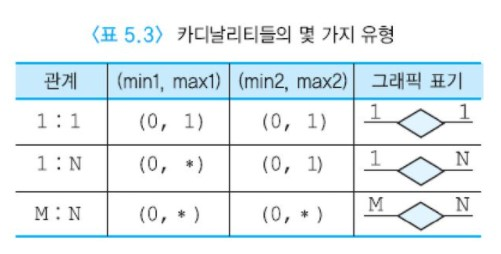
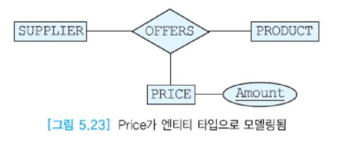
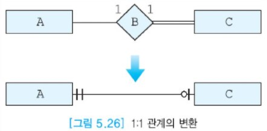

# ER 모델

ER 모델은 데이터베이스 설계를 용이하게 하기 위해서 P.P Chen이 1976년에 제안하였다.  
이 모델을 제안하게 된 주요 동기는 의미적으로 풍부한 데이터 모델을 제공하고, 개념들을 그래픽하게 나타낼 수 있으며,  
네트워크 데이터 모델, 관계 데이터 모델, 엔티티 집합 모델의 좋은 특성들을 결합하기 위한 것이다.  
Chen이 ER 모델을 제안한 후에 많은 학자들이 이 모델을 강화시켰다.  
현재는 __EER(Enhanced Entity Relationship)__ 모델이 데이터베이스 설계 과정에 널리 사용되고 있다.

ER 모델은 물리적인 데이터베이스 설계의 효율성에 관심을 두지 않으면서 한 조직의 개념적 스키마를 설명하기 위해 사용된다.  
ER 모델은 개념적 설계를 위한 인기 있는 모델로서, 높은 수준으로 추상화하며, 이해하기 쉬우며,  
구문들의 표현력이 뛰어나고 사람들이 어플리케이션에 대해 생각하는 방식과 가깝다.  
ER 모델은 초기의 고수준(개념적) 데이터베이스 설계를 표현하는 데 편리하다.

ER 모델은 실세계를 엔티티, 애트리뷰트, 엔티티들 간의 관계로 표현한다.  
ER 다이어그램은 엔티티 타입, 관계 타입, 이들의 애트리뷰트들을 그래픽하게 표현한 것이다.  
ER 다이어그램은 나중에 데이터베이스가 실제로 구현되는 다른 모델로 표현된 논리적 스키마로 바뀐다.  
ER 모델은 쉽게 관계 데이터 모델로 사상된다. 즉 ER 모델의 여러 구성요소들이 릴레이션들로 쉽게 변환된다.

기본적인 구문으로는 엔티티, 관계, 애트리뷰트가 있고, 기타 구문으로는 카디날리티 비율, 참여 제약조건 등이 있다.  
ER 모델에서 여러 유형의 무결성 제약조건들을 표현할 수 있다.  
모든 제약조건을 ER 모델에서 표현할 수 있는 것은 아니지만 응용 도메인과 실세계의 관점에서 제약조건들은 훌륭한 데이터베이스 설계를 결정하는 데 중요한 역할을 한다.  
이들 중의 일부는 엔티티 타입과 관계 타입을 릴레이션들로 변환할 때 SQL로 표현된다.

ER 모델은 적은 노력으로 쉽게 배울 수 있고, 전문가가 아니어도 이해하기 쉬우며, 자연어보다는 좀 더 정형적이고, 구현에 독립적이어서 기술적으로 덜 상세하므로 데이터베이스 설계자들이 최종 사용자들과 의사소통을 하는 데 적합하다.  
일반적으로 그림은 문장들로 서술한 것보다 의미 전달이 용이하다.

ER 모델을 기반으로 만들어진 다수의 CASE 도구(예: ERWin, DataArchitect, PowerBuilder 등)들이 있다.  
대부분의 DBMS 제조업체들은 이런 CASE 도구들을 지원한다.  
CASE 도구들의 장점은 데이터베이스 설계 시간과 비용을 감소시키고, 데이터베이스 설계 방법론을 표준화하며,  
CASE 도구를 사용하여 개발된 어플리케이션 시스템의 유지 보수를 용이하게 한다는 것이다.

전문적인 데이터베이스 설계자는 10개 이상의 엔티티 타입과 50개 이상의 애트리뷰트들을 포함하는 데이터베이스 설계에 CASE 도구와 자동적인 구현 생성기들을 사용한다.  
이런 도구들은 ER 설계를 자동적으로 오라클, 사이베이스 등의 데이터 정의어로 변환하고, 어떤 도구는 XML로 변환한다.  
이런 도구들은 이 책에서 사용한 표기법과 다소 다른 표기법을 사용한다.  
이런 도구들이 사용하는 표기법은 ER 다이어그램을 그래픽하게 나타내는 데 더 적합하다.

ER 모델링은 현재는 데이터베이스 설계에서 다소 구형 그래픽 표기법이다.  
대규모모델에는 잘 적용되지 않을 수 있다.  
현재, 대규모 기업의 데이터베이스 설계에는 __UML(Unified Modeling Language)__ 을 사용하는 경우가 많다.  
ER에서 UML로 직접 또는 간접적으로 사상할 수 있다.

ER 모델링을 가르치는 이유는 역사적이고 교육적인 효과가 높다는 것이다.  
개념적 모델링을 가르치는데 종이와 연필만 있으면 된다. 이에 반해서 UML은 방대하고 복잡한 설계 언어이다.  
UML 기반의 CASE 도구들을 대학교의 데이터베이스 교육에 도입하는 데는 어려운 점이 있으며 수업 시간에 다루는 간단한 설계 예들은 이런 도구들을 필요로 하지 않는다.  

## 목차

- [엔티티](#엔티티)
- [엔티티 타입](#엔티티-타입)
- [애트리뷰트](#애트리뷰트)
- [약한 엔티티 타입](#약한-엔티티-타입)
- [관계와 관계 타입](#관계와-관계-타입)
- [ER 스키마를 작성하기 위한 지침](#er-스키마를-작성하기-위한-지침)
- [데이터베이스 설계 과정](#데이터베이스-설계-과정)
- [ER 모델의 또 다른 표기법](#er-모델의-또-다른-표기법)


## 엔티티

하나의 엔티티는 사람, 장소, 사물, 사건 등과 같이 독립적으로 존재하면서 고유하게 식별이 가능한 실세계의 객체이다.  
예를 들어, 사원번호가 2106이고 이름이 김창섭인 사원, 학번이 20021033이고 이름이 홍길동인 학생, 과목 코드가 CS372인 데이터베이스 등이다.  
비록 엔티티는 사원처럼 실체가 있는 것도 있지만 생각이나 개념과 같이 추상적인 것도 있다.  
예를 들어, 프로젝트 번호가 P101인 프로젝트, 학과 번호가 D315인 학과는 개념적으로 존재하는 엔티티이다.  


## 엔티티 타입

엔티티들은 엔티티 타입(또는 엔티티 집합)들로 분류된다.  
엔티티 집합은 동일한 애트리뷰트들을 가진 엔티티들의 모임이다.  
예를 들어, 한 회사의 모든 사원들은 EMPLOYEE라는 엔티티 집합을 이루고, 모든 부서들은 DEPARTMENT라고 부르는 엔티티 집합에 속한다.  
하나의 엔티티는 한 개 이상의 엔티티 집합에 속할 수 있다.  
예를 들어, 어떤 사원은 EMPLOYEE와 MANAGER라는 두 엔티티 집합에 속할 수 있다.  
그러므로 엔티티 집합은 항상 서로 상이하지는 않다.

엔티티 타입은 동일한 애트리뷰트들을 가진 엔티티들의 틀이다.  
엔티티 타입은 관계 모델의 릴레이션의 내포에 해당하고, 엔티티 집합은 관계 모델의 릴레이션의 외연에 해당한다.  
엔티티 집합과 엔티티 타입을 엄격하게 구분할 필요는 없다. 문맥을 보고 판단하기 바란다.  
앞서 설명한 바와 같이 데이터베이스는 한 조직에서 서로 연관된 정보의 모임이므로 데이터베이스는 엔티티 집합들의 모임으로 이루어진다.  
또한 데이터베이스는 엔티티 집합들 간의 관계들에 관한 정보도 포함한다.

ER 다이어그램에서 엔티티 타입은 직사각형으로 나타낸다.  
일반적으로 엔티티 타입의 이름은 엔티티 타입의 의미를 잘 나타내는 단수형으로 명시한다.

엔티티 타입에는 두 가지 종류가 있다.  
__강한 엔티티 타입(정규 엔티티 타입)__ 은 독자적으로 존재하며 엔티티 타입 내에서  
자신의 키 애트리뷰트를 사용하여 고유하게 엔티티들을 식별할 수 있는 엔티티 타입을 의미한다.  
이에 반해서 __약한 엔티티 타입__ 은 키를 형성하기에 충분한 애트리뷰트들을 갖지 못한 엔티티 타입이다.  
이 엔티티 타입이 존재하려면 __소유 엔티티 타입__ 이 있어야만 한다.  
소유 엔티티 타입의 키 애트리뷰트를 결합해야만 고유하게 약한 엔티티 타입의 엔티티들을 식별할 수 있다.  
ER 스키마에서 대부분의 엔티티 타입은 정규 엔티티 타입이다.


## 애트리뷰트

하나의 엔티티는 연관된 애트리뷰트들의 집합으로 설명된다.  
예를 들어, 사원 엔티티는 사원번호, 이름, 직책, 급여 등의 애트리뷰트를 갖고,  
책은 저자, 제목, 출판사, 발간연도 등의 애트리뷰트를 갖는다.  
고객 엔티티는 이름, 나이, 주소, 성별, 신장, 몸무게 등의 애트리뷰트를 갖지만  
신장, 몸무게 등이 기업에 필요가 없는 경우에는 데이터베이스에 저장할 필요가 없다.  
각 엔티티를 기술하는 애트리뷰트 값들은 데이터베이스에 궁극적으로 저장되는 데이터의 중요한 부분이 된다.

각 객체는 애트리뷰트들과 어떤 시점의 애트리뷰트들의 값으로 설명된다.  
하지만 종종 애트리뷰트의 현재 값에만 관심을 가지므로 객체에 관한 정보에서 시간을 제외하는 것이 편리하다.  
그러나 어떤 응용 소프트웨어에서는 시간이 매우 중요하다.  
예를 들어, 인사과에서는 회사의 모든 사원에 대해 급여가 변화된 이력(history)과 직급이 변화된 이력을 알고 싶을 수 있다.  
이와 같은 시간 데이터를 저장하는 여러 가지 방법이 있지만 이를 자세하게 알 필요는 없다.

각 애트리뷰트가 가질 수 있는 값들의 집합이 있다.  
한 애트리뷰트의 도메인은 그 애트리뷰트가 가질 수 있는 모든 가능한 값들의 집합을 의미한다.  
예를 들어, 사원번호는 1000부터 9999까지의 값을 갖고, 사원의 나이는 20부터 60 사이의 값을 가질 수 있다.  
여러 애트리뷰트가 동일한 도메인을 공유할 수 있다. 예를 들어, 사원번호와 부서번호가 네 자리 정수를 가질 수 있다.

한 엔티티 타입 내의 엔티티들은 서로 식별이 가능해야 한다.  
키 애트리뷰트는 한 애트리뷰트 또는 애트리뷰트들의 모임으로서 한 엔티티 타입 내에서 각 엔티티를 고유하게 식별한다.  
데이터 의미에 따라 키의 정의가 달라질 수 있다. 한 엔티티 타입에 여러 개의 후보 키가 존재할 수 있다.  
개념적 설계 과정에서 후보 키 중 하나를 엔티티 타입의 기본 키로 선정한다.  
대체 키(보조 키)는 기본 키가 아닌 후보 키를 말한다. ER 다이어그램에서 기본 키에 속하는 애트리뷰트는 밑줄을 그어 표시한다.  
ER 다이어그램에서는 기본 키와 대체 키를 구분하지 않는다.

키로 사용하기에 적합한 애트리뷰트가 엔티티 타입에 없을 경우에는 때로 엔티티 식별을 쉽게 하기 위해서 인위적으로 기본 키 애트리뷰트를 엔티티 타입에 추가하기도 한다.  
예를 들어, STUDENT 엔티티 타입의 각 엔티티를 식별하기 위해서 학생이름, 주소, 생년월일 애트리뷰트들을 사용할 수도 있지만 각 학생 엔티티를 쉽게 식별하기 위해서 학번 애트리뷰트를 추가하는 것이 편리하다.

애트리뷰트는 요구사항 명세에서 명사나 형용사로 표현된다.  
엔티티와 애트리뷰트의 차이점은 엔티티는 독립적인 의미를 갖는 데 반해서 애트리뷰트는 독립적인 의미를 갖지 않는다는 것이다.  
ER 다이어그램에서 애트리뷰트는 타원형으로 나타낸다. 애트리뷰트와 엔티티 타입은 실선으로 연결한다.

애트리뷰트는 아래와 같이 여러 가지 유형으로 구분한다.  

- __단순 애트리뷰트(simple attribute)__: 단순 애트리뷰트는 더 이상 다른 애트리뷰트로 나눌 수 없는 애트리뷰트이다.  
  단순 애트리뷰트는 ER 다이어그램에서 실선 타원으로 표현한다.  
  아래 그림에서는 CUSTOMER 엔티티 타입에는 Address, Name, ID 등 세 개의 애트리뷰트가 있는데, 이 애트리뷰트들은 모두 단순 애트리뷰트이다.  
  ID 애트리뷰트에는 밑줄이 표시되었으므로 키 애트리뷰트이다.  
  ER 다이어그램에서 대부분의 애트리뷰트는 단순 애트리뷰트이다.

  

- __복합 애트리뷰트(composite attribute)__: 복합 애트리뷰트는 두 개 이상의 애트리뷰트로 이루어진 애트리뷰트이다.  
  동일한 엔티티 타입에 속하는 애트리뷰트들 중에서 밀접하게 연관된 것을 모아놓은 것이다.  
  아래 그림에서 애트리뷰트 Address는 City(시), Ku(구), Dong(동), Zipcode(우편번호)로 나눌 수 있으므로 복합 애트리뷰트이다.  
  여러 지역에 분점을 가진 대형 백화점이 각 분점에서 상품을 구입하는 고객들의 거주 지역을  
  세밀한 수준에서 분석하기 위해서는 주소를 시, 구, 동으로 구분하는 것이 필요할 수 있다.  
  주소 전체를 하나의 단순 애트리뷰트로 지정하면 하나의 문자열로 저장되므로 고객들의 거주 지역에 따른 소비 패턴을 분석하는 것이 매우 어렵게 된다.  
  신문에 세일 광고물을 끼워서 가정에 배달하는 경우에, 해당 분점을 자주 방문하는 고객들의 주요 거주 지역을 쉽게 파악할 수 있다면 상대적으로 저렴한 비용으로 광고 효과가 높은 지역을 선별하여 광고할 수 있다.  
  물론 Address의 각 구성요소를 구분해서 활용하지 않고 단순히 카드 사용 내역서 등을 발송하는 목적으로만 사용한다면,  
  Address를 여러 개의 애트리뷰트들로 나눌 필요는 없다.

  

- __단일 값 애트리뷰트(single-valued attribute)__: 단일 값 애트리뷰트는 각 엔티티마다 정확하게 하나의 값을 갖는 애트리뷰트이다.  
  다시 말해서, 값들의 집합이나 리스트를 갖지 않는 애트리뷰트이다.  
  단일 값 애트리뷰트는 ER 다이어그램에서 단순 애트리뷰트와 동일하게 표현된다.  
  예를 들어, 사원번호 애트리뷰트는 어떤 사원도 두 개 이상의 사원번호를 갖지 않으므로 단일 값 애트리뷰트이다.  
  ER 다이어그램에서 대부분의 애트리뷰트는 단일 값 애트리뷰트이다.

- __다치 애트리뷰트(multi-valued attribute)__: 다치 애트리뷰트는 각 엔티티마다 여러 개의 값을 가질 수 있는 애트리뷰트이다.  
  예를 들어, 사원은 여러 개의 취미를 가질 수 있으므로 사원 엔티티 타입에 취미 애트리뷰트가 있다면 다치 애트리뷰트로 지정해야 한다.  
  다치 애트리뷰트는 ER 다이어그램에서 이중선 타원으로 표현한다.

  

- __저장된 애트리뷰트(stored attribute)__: 저장된 애트리뷰트는 다른 애트리뷰트와 독립적으로 존재하는 애트리뷰트이다.  
  저장된 애트리뷰트도 ER 다이어그램에서 단순 애트리뷰트와 동일하게 표현된다.  
  ER 다이어그램에서 대부분의 애트리뷰트는 저장된 애트리뷰트이다.  
  예를 들어, 사원 엔티티 타입에서 사원이름, 급여는 다른 애트리뷰트와 독립적으로 존재한다.

- __유도된 애트리뷰트(derived attribute)__: 유도된 애트리뷰트는 다른 애트리뷰트의 값으로부터 얻어진 애트리뷰트이다.  
  예를 들어 , Age(나이) 애트리뷰트는 주민등록번호 애트리뷰트로부터 유도될 수 있는 애트리뷰트이다.  
  유도된 애트리뷰트는 반드시 필요한 애트리뷰트가 아니고 데이터의 불일치를 유발할 수 있으므로,  
  관계 데이터베이스에서 릴레이션의 애트리뷰트로 포함시키지 않는 것이 좋다.  
  Age 이외에도 합, 평균, 개수, 등이 유도된 애트리뷰트에 해당된다.  
  유도된 애트리뷰트는 ER 다이어그램에서 점선 타원으로 표현한다.

  


## 약한 엔티티 타입

어떤 경우에는 엔티티 타입 내의 엔티티들이 자체적으로 갖고 있는 애트리뷰트들의 값에 의해서 고유하게 식별이 안 된다.  
예를 들어, 회사에서 어떤 사원의 부양가족 이름은 다른 사원의 부양가족의 이름과 같을 수 있다.  
한 가지 해결 방안은 회사의 사원들의 모든 부양가족에 대해서 고유한 번호를 부여하는 것이다.  
이런 고유한 번호는 데이터베이스 처리에 사용되지 않을 수 있다.

또 다른 해결 방안은 부양가족이 속한 사원의 번호를 부양가족의 이름과 결합하여 부양가족의 키로 정하는 것이다.  
한 사원의 부양가족의 이름은 모두 다를 것이므로, 사원번호와 부양가족의 이름을 결합하면 모든 사원들의 부양가족들을 고유하게 식별할 수 있다.  
부양가족의 이름처럼 한 사원에 속한 부양가족 내에서는 서로 다르지만  
회사의 모든 사원들의 부양가족들 전체에서는 같은 경우가 생길 수 있는 애트리뷰트를 __부분 키(partial key)__ 라고 부른다. 
이처럼 자체적으로 키를 보유하지 못한 엔티티를 __약한 엔티티 타입(weak entity type)__ 이라고 부른다.  
즉 약한 엔티티 타입은 엔티티들을 고유하게 식별하기 위해서 다른 엔티티 타입으로부터 키 애트리뷰트를 가져오는 엔티티 타입이다.  
이때 약한 엔티티 타입에게 키 애트리뷰트를 제공하는 엔티티 타입을 __소유 엔티티 타입(owner entity type)__ 또는 __식별 엔티티 타입(identifying entity type)__ 이라고 부른다.  
약한 엔티티 타입은 소유 엔티티 타입이 존재하지 않으면 존재할 수 없는 엔티티 타입이다.  
ER 다이어그램에서 약한 엔티티 타입은 이중선 직사각형으로 표기한다. 약한 엔티티 타입의 부분 키는 점선 밑줄을 그어 표시한다.

기본 키를 가진 엔티티를 __강한 엔티티 타입(strong entity type)__ 또는 __정규 엔티티 타입(regular entity type)__ 이라고 부른다.  
마찬가지로 관계에도 약한 관계와 강한 관계가 있다.  
강한 관계는 강한 엔티티들 사이의 관계이고, 강한 엔티티 타입과 약한 엔티티 타입을 연결하는 관계는 약한 관계이다.  
약한 엔티티는 다른 엔티티의 존재에 의존하므로 종속되는 엔티티라고도 부른다.  
이를 __의존 종속성(existence dependence)__ 이라고 한다.  
만일 E가 약한 엔티티 타입이면 E에 하나 이상의 키를 제공하는 엔티티 타입 F들은 관계 타입 R에 의해서 E와 연관되어야 한다.


```
위의 ER 다이어그램은 정규 엔티티 타입 EMPLOYEE와 약한 엔티티 타입 DEPENDENT를 보여준다.
회사에서 사원들의 부양가족들에게 의료보험 해택을 제공하기 위해서 EMPLOYEE 엔티티 타입과 DEPENDENT 엔티티 타입을 POLICY(보험) 관계 타입으로 연결하였다.
약한 엔티티 타입 DEPENDENT의 부분키 Depname에는 점선 밑줄을 그어 표시하였다.
DEPENDENT 엔티티는 대응되는 EMPLOYEE 엔티티의 존재 여부에 의존한다.
EMPLOYEE 엔티티 타입은 DEPENDENT 엔티티 타입의 소유 엔티티 타입이다.
정규 엔티티 타입과 약한 엔티티 타입을 연결하는 POLICY(보험) 관계 타입은 이중선 다이아몬드로 표시한다. POLICY 관계 타입은 약한 관계 타입이다.
```


## 관계와 관계 타입

하나의 엔티티 자체는 다른 어떤 엔티티와 연관을 가질 수 있다.  
예를 들어, 사원 엔티티는 부서 엔티티에서 일을 한다. 이를 엔티티들 간의 __관계(relationship)__ 라고 한다.  
엔티티와 마찬가지로 주어진 문제 영역과 연관된 엔티티들 간의 관계들을 수집하여 저장한다.  
다시 말해서 데이터베이스에는 사원과 부서에 관한 데이터뿐만 아니라, 사원과 부서 간의 관계에 관한 데이터도 저장해야 한다.  
예를 들어, 데이터베이스 사용자는 사원에 관한 질의 또는 부서에 관한 질의뿐만 아니라,  
어떤 사원이 근무하는 부서를 질의하거나 어떤 부서에 근무하는 모든 사원들을 질의할 수 있다.

관계 타입은 아래 그림처럼 ER 다이어그램에서 다이아몬드로 표기하고,  
관계 타입이 서로 연관시키는 엔티티 타입들을 관계 타입에 실선으로 연결한다.


관계는 엔티티들 사이에 존재하는 연관이나 연결로서 두 개 이상의 엔티티 타입들 사이의 사상으로 생각할 수 있다.  
연관된 엔티티들은 동일한 타입이거나 서로 다른 타입일 수 있다.  
예를 들어, 위 그림의 WORKS_FOR 관계는 사원 엔티티 타입과 부서 엔티티 타입 사이의 연관을 나타낸다.

관계 집합은 동질의 관계들의 집합이다. 관계 타입은 동질의 관계들의 틀로서 하나의 관계와 구분해야 한다.  
그러나 관계 집합과 관계 타입도 엄격하게 구분할 필요는 없고, 문맥에 따라 판단하면 된다.  
요구사항 명세에서 흔히 동사는 ER 다이어그램에서 관계로 표현된다.  
따라서 엔티티와 관계를 "Employee가 Department를 위해 일한다"라는 문장처럼 읽을 수 있다.  
아래 표는 엔티티와 엔티티 간의 관계의 예를 보여준다.


- 관계의 애트리뷰트

관계 타입은 관계의 특징을 기술하는 애트리뷰트들을 가질 수 있다.  
위의 그림 관계 타입 WORKS_FOR은 SUPPLIER(공급자) 엔티티 타입과 PART(부품) 엔티티 타입을 연결하는 SUPPIES 관계 타입이 갖는 Quantity(수량)라는 애트리뷰트를 보여준다.  
수량 애트리뷰트는 어떤 공급자가 어떤 부품을 얼마나 공급하는가를 나타낸다.  
한 공급자가 여러 부품들을 서로 다른 개수로 공급할 수 있고,  
각 부품은 여러 공급자들로부터 서로 다른 개수로 공급될 수 있으므로  
수량 애트리뷰트를 공급자 엔티티 타입이나 부품 엔티티 타입에 붙일 수 없다.

관계 타입은 키 애트리뷰트를 갖지 않음을 유의하라.  
하나의 관계 집합 내에서 특정 관계의 식별은 참여하는 엔티티들의 키들을 통해서 이루어진다.


- 차수(degree)

  관계의 차수는 관계로 연결된 엔티티 타입들의 개수를 의미한다.  
  따라서 1진, 2진, 3진 관계는 각각 차수가 1, 2, 3이다.  
  임의의 개수의 엔티티 타입 사이의 관계를 정의할 수 있지만 실세계에서 가장 흔한 관계는 두 개의 엔티티 타입을 연결하는 2진 관계이다.  
  그러나 여러 엔티티 타입이 한 관계 타입에 참여할 수 있다. 아래 그림은 1진, 2진, 3진 n진 관계를 보여준다.  
  3진 이상의 관계 타입을 2진 관계 타입들로 변환하기 위해서는 주의를 기울어야 한다.

  

  3진 관계의 의미를 세 개의 2진 관계로 정확하게 나타낼 수 있는가?  
  3개의 2진 관계를 묶어도 한 개의 3진 관계의 의미를 정확하게 나타내지 못한다.  
  이에 반해서, 하나의 3진 관계는 세 개의 2진 관계의 의미를 나타낼 수 있다.

- 카디날리티 비율

  데이터베이스를 설계하기 위해서 데이터 모델링을 수행할 때, 두 개의 엔티티 타입이 서로 연관된다는 사실만 알아서는 충분하지 않다.  
  두 엔티티 타입 간의 카디날리티 비율도 정확하게 모델링해야 한다.  
  카디날리티 비율은 한 엔티티 타입의 몇 개의 엔티티가 다른 엔티티 타입의 몇 개의 엔티티와 연관되는가를 나타낸다.  
  이 비율은 관계 타입에 참여하는 엔티티들의 가능한 조합을 제한한다.

  카디날리티 비율은 모델링하려는 실세계의 시나리오로부터 유도된다.  
  두 개의 엔티티 타입 E1과 E2 사이의 2진 관계 R을 고려해보자.  
  E1의 한 엔티티가 E2의 한 엔티티와 정확하게 연관되거나, 임의의 개수의 엔티티와 연관될 수 있다.  
  또한 E1의 임의의 개수의 엔티티가 E2의 임의의 개수의 엔티티와 연관될 수도 있다.

  관계를 흔히 1:1, 1:N, M:N 으로 구분한다.  
  카디날리티에 관한 정보는 간선 위에 나타낸다.  
  아래 그림은 엔티티 타입 A와 B 사이의 세 가지 카디날리티 비율을 보여준다.

  

  - 1:1 관계

    E1의 각 엔티티가 정확하게 E2의 한 엔티티와 연관되고, E2의 각 엔티티가 정확하게 E1의 한 엔티티와 연관되면 이 관계를 1:1 관계라고 한다.  
    예를 들어, 각 사원에 대해 최대한 한 개의 PC가 있고 각 PC에 대해 최대한 한 명의 사원이 있으면 사원과 PC간의 관계는 1:1 관계이다.

    

  - 1:N 관계

    E1의 각 엔티티가 E2의 임의의 개수의 엔티티와 연관되고,  
    E2의 각 엔티티는 정확하게 E1의 한 엔티티와 연관되면 이 관계를 1:N 관계라고 한다.  
    예를 들어, 각 사원에 대해 최대한 한 대의 PC가 있고 각 PC에 대해 여러 명의 사원들이 있으면 PC와 사원 간의 관계는 1:N 관계이다.  
    1:N 관계는 실세계에서 가장 흔히 나타나는 유형이다.

    

  - M:N 관계

    M:N 관계에서는 한 엔티티 타입에 속하는 임의의 개수의 엔티티가 다른 엔티티 타입에 속하는 임의의 개수의 엔티티와 연관된다.  
    만일 각 사원에 대해 여러 대의 PC가 있고, 각 PC에 대해 여러 명의 사원이 있으면 사원과 PC 간의 관계는 M:N 관계이다.  
    M:N 관계의 또 다른 예는 학생들이 과목들을 수강하는 것이다.  
    각 학생은 여러 과목을 수강하고, 각 과목은 다수의 수강 학생을 갖는다.

  관계 타입의 카디날리티 비율을 최솟값과 최댓값을 사용하여 좀 더 명확하게 나타낼 수 있다.  
  ER 다이어그램에서 관계 타입과 엔티티 타입을 연결하는 실선 위에 (min, max) 형태로 표기한다.  
  어던 관계 타입에 참여하는 각 엔티티 타입에 대하여 min은 이 엔티티 타입 내의 각 엔티티는 적어도 min번 관계에 참여함을 의미하고,  
  max는 이 엔티티 타입 내의 각 엔티티는 최대한 max번 관계에 참여함을 의미한다.  
  min=0 또는 max=*는 특별한 경우이다. min=0은 어떤 엔티티가 반드시 관계에 참여해야 할 필요는 없음을 의미한다. 즉 선택적으로 참여한다.  
  max=\*는 어떤 엔티티가 관계에 임의의 수만큼 참여할 수 있음을 뜻한다.  
  아래 표는 개념적 설계에 흔히 사용되는 카디날리티들의 몇 가지 유형을 보여준다.

  

  

  아래 그림과 같이 3진 관계 타입에도 카디날리티를 명시할 수 있다.  
  어떤 SALESPER(판매원)이 어떤 CAR(자동차)를 어떤 CUSTOMER(고객)에게 판매했음을 나타내는 관계 타입이다.

  

  

- 역할(role)

  역할은 관계 타입의 의미를 명확하게 하기 위해 사용된다.  
  특히 하나의 관계 타입에 하나의 엔티티 타입이 여러 번 나타나는 경우에는 반드시 역할을 표기해야 한다.  
  역할은 관계 타입의 간선 위에 표시한다. 아래 그림은 EMPLOYEE 엔티티 타입이 MANAGES 관계에 두 번 나타난 것을 보여준다.  
  EMPLOYEE 엔티티 타입은 한 번은 부하 직원으로, 한 번은 상사로 MANAGES 관계에 참여한다.

  

  

- 전체 참여와 부분 참여

  참여 제약조건은 전체 참여와 부분 참여로 구분한다.  
  전체 참여는 어떤 관계에 엔티티 타입 E1의 모든 엔티티들이 관계 타입 R에 의해서  
  어떤 엔티티 타입 E2의 어떤 엔티티와 연관되는 것을 말한다.  
  만일 어떤 엔티티 타입 E1의 일부 엔티티만 참여하면 부분 참여라고 말한다.  
  특히 약한 엔티티 타입은 항상 관계에 전체 참여를 한다.

  전체 참여는 ER 다이어그램에서 이중 실선으로 표시한다.  
  아래 그림은 DEPARTMENT 엔티티 타입이 MANAGES 관계에 전체 참여함을 보여준다.  
  다시 말해서, DEPARTMENT 엔티티 타입에 속하는 모든 부서 엔티티들은 MANAGES 관계를 통해서  
  EMPLOYEE 엔티티 타입에 속하는 어떤 엔티티와 반드시 연결되어야 한다.  
  즉 모든 부서 엔티티에 대해서 각 부서마다 반드시 1명의 관리자가 있어야 한다.

  이에 반해서 EMPLOYEE 엔티티 타입은 MANAGES 관계에 부분 참여한다.  
  이는 EMPLOYEE 엔티티 타입에 속하는 하나 이상의 엔티티가 MANAGES 관계에 참가하지 않음을 의미한다.  
  즉 일부 사원들만 부서의 관리자가 될 수 있으므로 EMPLOYEE 엔티티 타입이 MANAGES 관계에 부분 참여한다.  
  카디날리티 비율과 함께 참여 제약 조건은 관계에 대한 중요한 제약조건이다.  
  특히 2진 관계 타입을 기술하는 데 매우 유용한 개념이다.

  

  

- 다중 관계

  두 엔티티 타입 사이에 두 개 이상의 관계 타입이 존재할 수 있다.  
  EMPLOYEE 엔티티 타입과 PROJECT 엔티티 타입 사이에 WORKS_FOR 관계 타입과 MANAGES 관계 타입이 존재하는 것을 보여준다.  
  즉 각 사원은 어떤 프로젝트에서 일하고(work_for), 일부 사원은 어떤 프로젝트의 관리자는(manages)이기도 하다.  
  프로젝트에서 사원으로 일하는 것과 프로젝트의 관리자는 의미가 완전히 다르므로 하나의 관계 타입으로 두 가지 의미를 나타낼 수 없다.

  

  

- 순환적 관계

  순환적 관계는 하나의 엔티티 타입이 동일한 관계 타입에 두 번 이상 참여하는 것이다.  
  아래 그림의 관계 타입 CONTAINS(포함)는 부품 엔티티 타입을 부품 엔티티 타입과 연결하는 관계 타입이다.  
  즉 어떤 부품은 다른 부품들이 한 개 이상 모여서 구성 될 수 있다.  
  


## ER 스키마를 작성하기 위한 지침

지금까지 ER 모델의 기초와 ER 모델을 ER 다이어그램으로 표현하는 것을 논의하였다.  
ER 모델이 단순하기는 하지만 ER 스키마 다이어그램을 작성하는 데 여러 가지 문제들이 있다.  
이런 문제들 중에서 몇 가지를 논의하고, 모델링 과정에 활용할 수 있는 지침들을 소개한다.

개념적 설계에서는 요구사항 명세로부터 실세계의 개념을 엔티티 타입, 애트리뷰트, 관계 타입 중  
어떤 것으로 모델링 할 것인가, 무엇이 엔티티와 관계인가, 이런 엔티티와 관계에 관해 어떤 정보를 데이터베이스에 저장해야 하는가,  
엔티티와 관계가 만족해야 하는 제약조건(또는 비즈니스 규칙)은 무엇인가 등을 파악하여 이런 정보를 ER 스키마 다이어그램으로 나타낸다.  
그 다음에 ER 스키마 다이어그램을 관계 스키마로 사상한다.  
엔티티, 엔티티들 간의 관계를 동일한 모델 내에서도 여러 가지 방법으로 정의하는 것이 가능하므로  
동일한 작은 세계를 설명하는 ER 다이어그램이 여러 가지 생성될 수 있다.

아래와 같은 고려 사항들에 대한 결정이 필요하다. 이런 고려 사항들에 대한 답이 간단하지는 않다.  
\- 한 객체를 애트리뷰트로 나타낼 것인가 또는 엔티티로 나타낼 것인가?  
\- 어떤 개념을 관계로 표현할 것인가 또는 엔티티로 나타낼 것인가?  
\- 고립된 엔티티를 어떻게 다룰 것인가?

- 애트리뷰트 vs. 엔티티

  엔티티의 개념을 논의했지만 엔티티에 관해 엄격하게 정의하지는 않았다.  
  엔티티 타입과 애트리뷰트를 구분하는 절대적인 기준이 없기 때문에 엄격하게 정의하는 것이 간단하지는 않다.  
  일반적으로 애트리뷰트는 엔티티 타입과 연관된 것으로만 존재할 수 있지만 어떤 상황에서는 애트리뷰트를 엔티티로 볼 수 있다.

  앞에서 설명한 바와 같이 엔티티는 관심이 있는 객체이다.  
  그러나 주어진 대상을 언제 엔티티로 간주해도 되는지 결정하는 것이 항상 쉬운 일은 아니다.  
  많은 선택은 애트리뷰트를 사용할 것인가 또는 엔티티를 사용할 것인가에 달려 있다.  
  예를 들어, 공급자-부품 데이터베이스에서 각 공급자에 대해 아래와 같은 정보가 있을 수 있다.

  ```
  공급자 번호, 공급자 이름, 신용, 공급자 도시
  ```

  공급자가 엔티티인 것은 명확하지만 공급자 도시가 엔티티인지 또는 공급자 엔티티의 한 애트리뷰트인지 결정해야 한다.  
  이런 상황에서 사용해야 할 대략적인 규칙은 아래와 같은 질문들에 대한 답을 생각해보는 것이다.

  \- 도시가 조직체에게 관심이 있는 객체인가?  
  \- 도시에 관한 애트리뷰트들을 유지할 필요가 있는가?  
  \- 도시를 여러 엔티티 타입들이 공유하는가?

  이들 중에서 하나라도 대답이 '예' 라면 도시를 새로운 엔티티로 나타내기 위해서 도시에 관해 좀 더 많은 정보를 확보해야 한다.  
  그러나 만일 도시 이름에만 관심이 있다면 도시는 공급자 엔티티의 한 애트리뷰트로 취급해야 한다.

  또 다른 예로, color가 자동차 회사에서는 자동차 엔티티의 애트리뷰트로 사용되지만, 페인트 제조 회사에서는 각 color마다 필요한 염료의 유형과 염료의 양 등의 정보를 유지해야 하므로 엔티티로 사용된다.

  그러므로 하나의 지침으로서, 각 엔티티는 키 애트리뷰트 이외에 별도의 애트리뷰트들을 포함해야 한다.  
  만일 한 객체가 식별자 이외에 관심을 가질 만한 정보를 추가로 갖지 않는다면 이 객체는 애트리뷰트로 취급해야 한다.

  엔티티는 최종적으로 릴레이션으로 변환되어야 하기 때문에 보다 복잡한 문제가 발생한다.  
  릴레이션은 다소 융통성이 없는 구조를 갖기 때문에 엔티티 자체는 여러 가지 인위적인 제약조건들을 만족해야 한다.  
  어떤 엔티티의 한 애트리뷰트가 두 개 이상의 값을 갖는다면 이 애트리뷰트를 엔티티로 간주해야 한다.  
  개념적으로는 다치 애트리뷰트가 아무런 문제를 야기하지는 않지만 관계 DBMS를 사용하여 데이터베이스를 구현할 목적으로 ER 스키마를 릴레이션들로 변환하려면 문제가 발생한다.  
  다치 애트리뷰트를 갖는 엔티티를 관계데이터베이스로 사상할 때 릴레이션의 각 애트리뷰트는  
  원잣값만 가질 수 있으므로 다치 애트리뷰트를 엔티티로 선언하는 것이 필요하다.  
  엔티티는 자신의 속성에 관해 식별자 이외에 추가로 정보를 가져야 한다고 설명했지만 값 이외에 아무런 속성을 갖지 않아도 다치 애트리뷰트는 엔티티로 취급하는 것이 좋다.

  

- 관계 vs. 엔티티

  어떤 개념을 엔티티 타입으로 모델링할 것인가 또는 관계 타입으로 모델링할 것인가?  
  아래 그림은 OFFERS 관계 타입에 Price 애트리뷰트가 사용된 예를 보여준다.  
  아래 그림에서 공급자는 동일한 상품을 수량에 따라 서로 다른 가격으로 공급할 수 없다. 그 이유는 무엇인가?

  

  가격을 아래 그림과 같이 엔티티 타입으로 모델링하면 이 문제를 해결할 수 있다.

  

  

  

- 고립된 엔티티

  고립된 엔티티는 어떤 관계를 통해서 ER 다이어그램 안의 어떤 엔티티와도 연결되지 않는 엔티티를 말한다.  
  ER 다이어그램에서 고립된 엔티티는 매우 드물게 존재한다.  
  만일 ER 다이어그램에서 고립된 엔티티를 발견하면 이 엔티티를 다른 엔티티와 연결하는 관계를 누락한 것인지 또는 이 엔티티가 실제로 필요한 것인지를 판단해야 한다.

  코드 엔티티는 ER 다이어그램의 다수의 엔티티와 연결되기 때문에 ER 다이어그램이 복잡해지지 않도록 일부러 고립된 엔티티로 나타내기도 한다.

  

요약하자면, ER 스키마를 작성할 때 아래와 같은 대략적인 규칙들을 고려해야 한다.

\- 엔티티는 키 애트리뷰트 이외에 설명 정보를 추가로 갖는다.  
\- 다치 애트리뷰트는 엔티티로 분류해야 한다.  
\- 애트리뷰트들이 직접적으로 설명하는 엔티티에 애트리뷰트들을 붙인다.  
\- 관계는 일반적으로 독자적으로 존재할 수 없지만 엔티티 타입과 관계 타입을 절대적으로 구분하는 것은 어렵다.


## 데이터베이스 설계 과정

데이터베이스 설계를 위해 ER 모델을 채택했을 때 사용할 수 있는 방안을 요약해서 정리하면 아래와 같은 단계들을 따라가는 것이다.  
데이터베이스 설계가 반복적인 과정임을 유념하자.  

1. 어플리케이션의 요구사항을 수집하여 기술한다.
2. 어플리케이션과 연관이 있는 엔티티 타입을 식별한다.
3. 어플리케이션과 연관이 있는 관계 타입들을 식별한다. 관계가 1:1, 1:N, M:N 중에서 어느 것에 해당하는지 결정한다.
4. 엔티티 타입과 관계 타입들에 필요한 애트리뷰트들을 식별하고, 각 애트리뷰트가 가질 수 있는 값들의 집합을 식별한다.
5. 응용을 위한 ER 스키마 다이어그램을 그린다.
6. 엔티티 타입들을 위한 기본 키를 식별한다.
7. ER 스키마 다이어그램이 응용에 대한 요구사항과 부합되는지 검사한다.
8. ER 스키마 다이어그램을 DBMS에서 사용되는 데이터베이스 모델로 변환한다.


## ER 모델의 또 다른 표기법

아래 그림은 지금까지 본 장에서 사용한 ER 다이어그램의 표기법을 요약하여 보여준다.  
표기법으로 수십 개 이상의 애트리뷰트가 엔티티 타입에 연결된 다이어그램을 나타내려면 매우 불편하고 공간을 많이 차지한다.  
실제 기업의 데이터베이스에는 수십 개~ 200개 정도의 애트리뷰트들을 갖는 릴레이션이 흔히 사용된다.


순수한 Chen 스타일의 ER 표기법을 채택한 CASE 도구는 거의 없다.  
ERWin 등의 CASE 도구들에서는 __새발(crow-feet)__ 표기법이 흔히 사용된다.  
새발 표기법에도 여러 가지 변형들이 존재한다.  
새발 표기법에서도 엔티티 타입은 직사각형으로 나타내지만 관계 타입을 의미하는 다이아몬드는 사용되지 않는다.  
관계의 의미나 제약조건 등은 엔티티 타입들을 연결하는 실선 위에 몇 가지 기호를 사용하여 표현한다.  
두 엔티티를 연결하는 실선 위에 위치한 기호들 중에서 안쪽(엔티티에서 먼 쪽)의 기호는 참여 제약조건을 나타내고,  
바깥쪽(엔티티에 가까운 쪽)의 기호는 카디날리티를 나타낸다.  
아래 그림은 새발 표기법의 몇 가지 예를 보여준다.


지금부터 본 장에서 사용한 ER 표기법이 어떻게 새발 표기법으로 표현되는가를 몇가지 예를 통해서 설명한다.

- 1:1 관계

  아래 그림에서 엔티티 타입 A는 관계 타입 B를 통해서 엔티티 타입 C와 연결된다.  
  엔티티 타입 A의 각 엔티티는 엔티티 타입 C의 엔티티 0개 또는 1개와 연관된다.  
  엔티티 타입 C의 각 엔티티는 엔티티 타입A의 엔티티 1개와 연관된다.  
  따라서 엔티티 타입 A는 관계 타입 B에 부분 참여하고, 엔티티 타입 C는 관계 타입 B에 전체 참여한다.  
  엔티티 타입 A와 엔티티 타입 C는 1:1 관계를 갖는다.  
  

  

- 1:N 관계

  아래 그림에서 엔티티 타입 C의 각 엔티티는 엔티티 타입 A의 엔티티 0개 또는 1개와 연관된다.  
  엔티티 타입 A의 각 엔티티는 엔티티 타입 C의 엔티티 0개 이상과 연관된다.  
  따라서 엔티티 타입 A와 엔티티 타입 C는 1:N 관계를 갖는다.  
  엔티티 타입 A와 엔티티 타입 C는 관계 타입 B에 부분 참여한다.

  

  

- M:N 관계

  아래 그림에서 엔티티 타입 A의 각 엔티티는 엔티티 타입 C의 엔티티 0개 이상과 연관된다.  
  엔티티 타입 C의 각 엔티티는 엔티티 타입 A의 엔티티 0개 이상과 연관된다.  
  따라서 엔티티 타입 A와 엔티티 타입 C는 M:N 관계를 갖는다.  
  엔티티 타입과 A와 엔티티 타입 C는 관계 타입 B에 부분 참여한다.

  

  

- 엔티티 타입과 애트리뷰트의 표기

  본 장의 표기법에서는 애트리뷰트와 엔티티 타입을 각각 타원과 직사각형으로 표현하고,  
  애트리뷰트를 엔티티 타입과 실선으로 연결하였다.  
  앞서 설명한 바와 같이 이런 표기법에서는 공간이 많이 요구된다.  
  새발 표기법에서는 엔티티 타입을 나타내는 직사각형을 확장하여,  
  그 엔티티 타입에 속하는 애트리뷰트들을 직사각형 내에 포함시킨다.(아래그림참고)  
  그러나 새발 표기법에서는 다치 애트리뷰트나 유도된 애트리뷰트, 복합 애트리뷰트들을 구분하는 것이 어렵다.

  

  아래 그림은 앞서 소개한 새발 표기법의 구성요소를 여러 개 포함한 좀 더 복잡한 ER 다이어그램을 보여준다.

  

  

  

