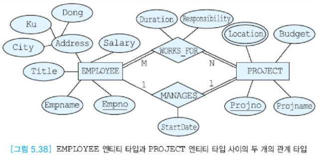
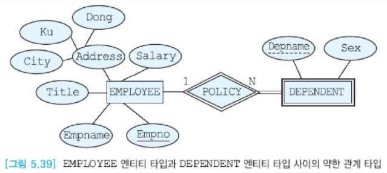
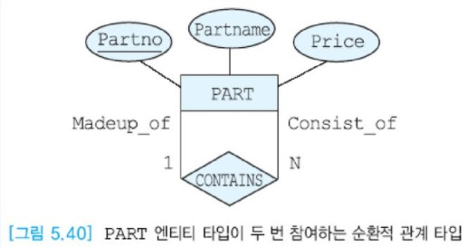
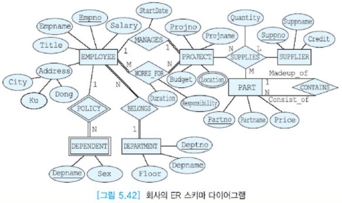

# 데이터베이스 설계 사례

앞에서 본 ER 모델에서는 ER 모델의 엔티티, 애트리뷰트, 관계 등의 표기법을 설명하면서 단편적인 요구사항들만 고려하였다.  
이 장에서는 좀 더 복잡한 요구사항을 바탕으로, 어떻게 ER 스키마를 작성할 것인가를 논의한다.  
요구사항을 잘 이해한 후에, 명사들을 엔티티 타입으로 나타내고 동사들을 관계 타입으로 나타내면서 연관된 엔티티 타입들을 연결한다.  
엔티티 타입들 중에서 정규 엔티티 타입과 약한 엔티티 타입을 구분한다.  
각 엔티티 타입이나 관계 타입을 설명하는 데 필요한 애트리뷰트를 찾아내서 엔티티 타입 또는 관계 타입에 연결한다.

본 절에서는 기업에서 흔히 볼 수 있는 작은 세계에 관한 요구사항을 고려한다.  
기존의 문서를 조사하고, 사용자들과의 인터뷰와 설문 조사 등을 통하여 아래와 같은 요구사항들을 수집했다고 가정한다.

1. 회사에는 다수의 사원들이 재직한다.
2. 각 사원에 대해서 사원번호(고유함), 이름, 직책, 급여, 주소를 저장한다.  
   각 시, 구 또는 동별로 거주하는 사원들의 정보를 구하기 위해서 주소는 시, 구, 동으로 세분해서 나타낸다.
3. 각 사원은 0명 이상의 부양가족을 가질 수 있다. 또한 한 부양가족은 두 명 이상의 사원에게 속하지 않는다.  
   각 부양가족에 대해서 부양가족의 이름과 성별을 저장한다.
4. 회사는 여러 개의 프로젝트들을 진행한다. 각 프로젝트에 대해서 프로젝트번호(고유함), 이름, 예산, 프로젝트가 진행되는 위치를 나타낸다.  
   한 프로젝트는 여러 위치에서 진행될 수 있다. 각 프로젝트마다 여러 명의 사원들이 일한다.  
   각 사원은 여러 프로젝트에서 근무할 수 있다. 각 사원이 해당 프로젝트에서 어떤 역할을 수행하고, 얼마 동안 근무해 왔는가를 나타낸다.  
   각 프로젝트마다 한 명의 프로젝트 관리자가 있다. 한 사원은 두 개 이상의 프로젝트의 관리자가 될 수는 없다. 프로젝트 관리자 임무를 시작한 날짜를 기록한다.
5. 각 사원은 한 부서에만 속한다. 각 부서에 대해서 부서번호(고유함), 이름, 부서가 위치한 층을 나타낸다.
6. 각 프로젝트에는 부품들이 필요하다. 한 부품이 두 개 이상의 프로젝트에서 사용 될 수 있다.  
   하나의 부품은 다른 여러 개의 부품들로 이루어질 수 있다.  
   각 부품에 대해서 부품번호(고유함), 이름, 가격, 그 부품이 다른 부품들을 포함하는 경우에는 그 부품들에 관한 정보도 나타낸다.
7. 각 부품을 공급하는 공급자들이 있다.  
   한 명의 공급자는 여러 가지 부품들을 공급할 수 있고, 각 부품은 여러 공급자들로부터 공급될 수 있다.  
   각 공급자에 대해서 공급자번호(고유함), 이름, 신용도를 나타낸다.  
   각 공급자에 대해서 그 공급자가 어떤 부품을 어떤 프로젝트에 얼마나 공급하는가를 나타낸다.

이제부터 위의 요구사항 명세를 분석하여 ER 스키마를 단계적으로 완성해보자.

- 엔티티 타입 및 애트리뷰트들을 식별

  요구사항 분석에서 엔티티 타입들을 식별하여 직사각형으로 나타내고,  
  이들을 설명하는 데 필요한 애트리뷰트들을 찾아서 엔티티 타입에 실선으로 연결한다.  
  회사를 모델링하는 것이기 때문에 회사 자체를 엔티티 타입으로 취급해서는 안 된다.

  먼저 EMPLOYEE(사원), 엔티티 타입을 ER 다이어그램으로 나타내자.  
  사원 엔티티 타입에는 Empno(사원번호), Empname(사원이름), Title(직책), Salary(급여), Address(주소) 등 다섯 개의 애트리뷰트가 필요하다.  
  이 중에서 사원번호가 기본 키 이므로 ER 다이어그램에서 밑줄을 그어 표시한다.  
  Address는 복합 애트리뷰트이므로 이 애트리뷰트를 구성하는 애트리뷰트들로 분해하여 나타낸다.  
  아래 그림은 EMPLOYEE 엔티티 타입의 다이어그램을 보여준다.

  

  PROJECT(프로젝트) 엔티티 타입을 ER 다이어그램으로 나타내자.  
  프로젝트 엔티티 타입에는 Projno(프로젝트번호), Projname(프로젝트이름), Budget(예산), Location(위치) 등 네 개의 애트리뷰트가 필요하다.  
  이 중에서 프로젝트번호가 기본키이므로 ER 다이어그램에서 밑줄을 그어 표시한다.  
  Location은 다치 애트리뷰트이므로 이중선 타원으로 표현한다.  
  아래 그림은 PROJECT 엔티티 타입의 다이어그램을 보여준다.

  

  DEPARTMENT(부서) 엔티티 타입을 ER 다이어그램으로 나타내자.  
  부서 엔티티 타입에는 Deptno(부서번호), Deptname(부서이름), Floor(층) 등 세 개의 애트리뷰트가 필요하다.  
  이 중에서 부서번호가 기본 키이므로 ER 다이어그램에서 밑줄을 그어 표시한다.  
  아래 그림은 DEPARTMENT 엔티티 타입의 다이어그램을 보여준다.

  

  SUPPLIER(공급자) 엔티티 타입을 ER 다이어그램으로 나타내자.  
  공급자 엔티티 타입에는 Suppno(공급자번호), Suppname(공급자이름), Credit(신용도) 등 세 개의 애트리뷰트가 필요하다.  
  이 중에서 공급자번호가 기본 키이므로 ER 다이어그램에서 밑줄을 그어 표시한다.  
  아래 그림은 SUPPLIER 엔티티 타입의 다이어그램을 보여준다.

  

  DEPENDENT(부양가족) 엔티티 타입을 ER 다이어그램으로 나타내자.  
  부양가족 엔티티 타입은 약한 엔티티 타입이므로 이중선 직사각형으로 나타낸다.  
  부양가족 엔티티 타입에는 Deptname(부양가족이름), Sex(성별) 등 두 개의 애트리뷰트가 필요하다.  
  이 중에서 부양가족이름이 부분 키이므로 ER 다이어그램에서 점선의 밑줄을 그어 표시한다.  
  아래 그림은 DEPENDENT 엔티티 타입의 다이어그램을 보여준다.

  

  마지막으로 PART(부품) 엔티티 타입을 ER 다이어그램으로 나타내자.  
  부품 엔티티 타입에는 Partno(부품번호), Partname(부품이름), Price(가격) 등 세 개의 애트리뷰트가 필요하다.  
  이 중에서 부품번호가 기본 키이므로 ER 다이어그램에서 밑줄을 그어 표시한다.  
  아래 그림은 DEPENDENT 엔티티 타입의 다이어그램을 보여준다.

  

  

- 관계와 애트리뷰트들을 식별

  이제부터 요구사항 명세로부터 동사를 주목하여 엔티티 타입들을 연관시키는 관계 타입들을 식별한다.  
  사원 엔티티 타입과 부서 엔티티 타입은 BELONG(소속) 관계 타입으로 연결된다.  
  각 부서에는 여러 명의 사원들이 속하고, 한 사원은 한 부서에만 속할 수 있으므로 부서 엔티티 타입과 사원 엔티티 타입은 1:N 관계를 갖는다.  
  또한 사원 엔티티 타입과 부서 엔티티 타입은 관계 타입에 전체 참여한다.  
  아래 그림은 EMPLOYEE 엔티티 타입과 DEPARTMENT 엔티티 타입 사이의 BELONGS 관계 타입을 보여준다.
  
  
  
  사원 엔티티 타입과 프로젝트 엔티티 타입은 두 가지 관계 타입으로 연결된다.  
  하나의 관계 타입(WORKS_FOR)은 각 사원이 어떤 프로젝트에서 근무하는가를 나타낸다.  
  이 관계 타입에서 사원 엔티티 타입과 프로젝트 엔티티 타입은 M:N 관계이다.  
  사원 엔티티 타입과 프로젝트 엔티티 타입은 이 관계 타입에 전체 참여한다.  
  이 관계 타입에는 Responsibility(역할)와 Duration(근무기간) 애트리뷰트가 필요하다.
  
  다른 관계 타입(MANAGES)은 어떤 사원이 어떤 프로젝트의 관리자인가를 나타낸다.  
  이 관계 타입에서 어떤 사원은 최대한 한 프로젝트의 관리자가 될 수 있고, 각 프로젝트에는 최대한 한 명의 관리자만 있으므로 사원 엔티티 타입과 프로젝트 엔티티 타입은 1:1 관계를 갖는다.  
  모든 사원이 어떤 프로젝트의 관리자가 될 수 없으므로 사원 엔티티 타입은 이 관계 타입에 부분 참여하고,  
  모든 프로젝트에는 관리자가 필요하므로 프로젝트 엔티티 타입은 이 관계 타입에 전체 참여한다.  
  또한 관계 타입에는 StartDate(시작날짜) 애트리뷰트가 필요하다.  
  아래 그림은 EMPLOYEE 엔티티 타입과 PROJECT 엔티티 타입 사이의 두 개의 관계 타입을 보여준다.
  
  
  
  사원의 부양가족은 회사의 의료보험 혜택을 받으므로 사원 엔티티 타입과 부양가족 엔티티 타입은 Policy(보험) 관계 타입으로 연결된다.  
  각 사원은 0명 이상의 부양가족을 가질 수 있고 각 부양가족은 한 명의 사원과 연관되므로 사원 엔티티 타입과 부양가족 엔티티 타입은 1:N 관계를 갖는다.  
  또한 부양가족 엔티티는 그 엔티티와 연관된 사원 엔티티가 존재하지 않으면 존재할 수 없으므로,  
  또는 부양가족 엔티티는 자체적으로 기본 키를 갖고 있지 않으므로 약한 엔티티 타입이다.  
  약한 엔티티 타입은 관계 타입에 전체 참여한다. 이때의 관계 타입은 이중선 다이아몬드로 표시한다.  
  아래 그림은 EMPLOYEE 엔티티 타입과 DEPENDENT 엔티티 타입 사이의 약한 관계 타입을 보여준다.
  
  
  
  한 부품은 다시 다른 부품들로 이루어질 수 있으므로 부품 엔티티 타입은 CONTAINS(포함) 관계 타입에 두 번 참여한다.  
  즉 순환적 관계 타입이 존재한다. 한 엔티티 타입이 어떤 관계 타입에 두 번 이상 나타나는 경우에는 반드시 역할을 표시한다.  
  부품 엔티티 타입과 부품 엔티티 타입 사이에는 1:N 관계 타입이 존재한다.  
  만일 한 부품이 여러 부품들의 구성요소가 될 수 있고, 한 부품이 여러 개의 부품들로 이루어질 수 있는 경우에 포함 관계 타입은 M:N 관계이다.  
  아래 그림은 PART 엔티티 타입이 두 번 참여하는 순환적 관계 타입을 보여준다.
  
  
  
  마지막으로, 공급자 엔티티 타입, 프로젝트 엔티티 타입, 부품 엔티티 타입을 연관시키는 3진 관계 타입 SUPPLIES(공급)가 존재한다.  
  이 관계  타입에 Quantity(수량) 애트리뷰트가 필요하다. 이 관계 타입에 참여하는 세 엔티티 타입은 L:M:N의 카디날리티를 갖는다.  
  아래 그림은 세 개의 엔티티 타입이 참여하는 3진 관계 타입을 보여준다.
  
  
  
  
  
  지금까지 그린 각각의 ER 다이어그램을 하나로 합치면 아래 그림과 같은 전체적인 ER 다이어그램이 만들어진다.
  
  
  
  
