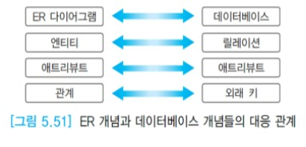

# 논리적 설계: ER 스키마를 관계 모델의 릴레이션들로 사상

개념적 살계 단계에서 ER 모델을 사용하여 조직체의 데이터베이스 어플리케이션을 위한 개념적 스키마를 생성하였으면,  
논리적 설계 단계에서는 ER 스키마를 관계 스키마를 관계 데이터 모델의 릴레이션들로 사상해야 한다.  
ER 데이터 모델을 기반으로 한 상용 DBMS가 없고 또한 대부분의 DBMS는 관계 데이터 모델을 기반으로 하기 때문에 ER 스키마를 관계 데이터 모델로 변환해야 한다.  
ER 스키마에는 엔티티 타입과 관계 타입이 존재하지만 관계 데이터베이스에는 엔티티 타입과 관계 타입을 구분하지 않고 릴레이션들만 들어 있다.

릴레이션으로 사상할 대상이 ER 스키마에서 엔티티 타입인지 또는 관계 타입인지,  
엔티티 타입이라면 정규 엔티티 타입인지 또는 약한 엔티티 타입인지,  
관계 타입이라면 2진 관계 타입인지 3진 이상의 관계 타입인지,  
관계 타입의 카디날리티가 1:1인지 또는 1:N인지 또는 M:N인지,  
애트리뷰트가 단일 값 애트리뷰트인지 또는 다치 애트리뷰트인지 등에 따라 사상하는 방법이 달라진다.

본 절에서는 ER 모델을 릴레이션들로 사상하는 7개의 단계로 이루어진 알고리즘을 설명한다. 각 단계를 거침에 따라 릴레이션들이 생성된다.  
먼저 ER 스키마에 존재하는 각 엔티티 타입들을 릴레이션들로 나타내고, 엔티티 타입을 설명하는 데 사용되는 애트리뷰트들을 릴레이션에 포함시킨다.  
그 다음에 외래 키를 사용하거나 별도의 릴레이션을 생성하여 관계 타입을 나타낸다.  
각 릴레이션에서 기본 키와 외래 키를 식별하는 작업은 다른 작업과 병행해도 좋다.

사용자가 아래의 7개의 단계들을 직접 따라가면서 많은 수의 엔티티 타입과 관계 타입들이 포함되어 있는 ER 스키마를 릴레이션들로 사상하는 것은 쉽지 않다.  
대부분의 CASE 도구들이 자동적으로 ER 스키마를 릴레이션들의 지합으로 변환한다.  
릴레이션의 이름은 대응되는 엔티티 타입이나 관계 타입의 이름을 따른다.

본 절의 알고리즘을 따라 ER 스키마를 릴레이션들의 집합으로 사상하는 것이 관계 DBMS에 릴레이션들을 생성하기 위한 최종 작업은 아니다.  
본 절의 알고리즘을 통해 생성된 릴레이션들은 정보의 중복과 갱신 이상 등의 문제를 유발할 수 있다.  
따라서 7장에서 논의할 정규화를 거쳐서 관계 스키마를 좀 더 훌륭한 관계 스키마로 정제해야 한다.

각 릴레이션은 (원자적) 애트리뷰트에 대응되는 애트리뷰트들을 갖는다. 이 애트리뷰트들은 각각 고유한 이름을 갖는다.  
릴레이션의 한 애트리뷰트는 ER 스키마의 애트리뷰트와 동일한 도메인을 갖는다.  
본 절에서는 아래 그림과 같이 논리적 설계 단계에서 수행되는 작업을 중점적으로 상세하게 논의한다.


아래 표는 알고리즘의 각 단계에서 릴레이션으로 사상되는 ER 스키마의 대상을 요약하여 나타낸다.


## 목차

- [ER-릴레이션 사상 알고리즘](#er-릴레이션-사상-알고리즘)
- [데이터베이스 설계 사례에 알고리즘 적용](#데이터베이스-설계-사례에-알고리즘-적용)


## ER-릴레이션 사상 알고리즘

### - 단계 1: 정규 엔티티 타입과 단일 값 애트리뷰트

ER 스키마의 각 정규 엔티티 타입 E에 대해 하나의 릴레이션 R을 생성한다.  
E에 있던 단순 애트리뷰트들을 릴레이션 R에 모두 포함시킨다.  
E에서 복합 애트리뷰트는 그 복합 애트리뷰트를 구성하는 단순 애트리뷰트들만 릴레이션 R에 포함시킨다.  
엔티티 타입 E에 유도된 애트리뷰트가 있으면 이를 릴레이션 R에 포함시키는 것은 사용자의 선택에 따른다.  
E의 기본 키가 릴레이션 R의 기본 키가 된다. 릴레이션의 한 투플은 엔티티 타입의 한 엔티티와 대응된다.

```
아래 그림에서 엔티티 타입 E1은 기본 키 애트리뷰트와 키가 아닌 애트리뷰트 A를 가지고 있다.
엔티티 타입 E1에 대하여 하나의 릴레이션 E1이 생성되고, 릴레이션 E1에는 엔티티 타입 E1에 있는 기본 키와 애트리뷰트 A를 포함시킨다.
릴레이션 E1의 기본 키도 엔티티 타입의 기본 키와 동일하다.
```


### - 단계 2: 약한 엔티티 타입과 단일 값 애트리뷰트

ER 스키마에서 소유 엔티티 타입 E를 갖는 각 약한 엔티티 타입 W에 대하여 릴레이션 R을 생성한다.  
W에 있던 모든 단순 애트리뷰트들을 릴레이션 R에 포함시킨다.  
소유 엔티티 타입에 해당하는 릴레이션의 기본 키를 약한 엔티티 타입에 해당하는 릴레이션에 외래 키로 포함시킨다.  
약한 엔티티 타입에 해당하는 릴레이션 R의 기본 키는 약한 엔티티 타입의 부분 키와  
소유 엔티티 타입에 해당하는 릴레이션을 참조하는 외래 키의 조합으로 이루어진다.  
단계 2까지 마친 후에는 ER 스키마에서 모든 엔티티 타입들이 릴레이션들로 사상되었다.

```
아래 그림에서 E1은 약한 엔티티 타입 E2의 소유 엔티티 타입이면서 정규 엔티티 타입이다.  
정규 엔티티 타입 E1에 해당하는 릴레이션 E1에는 기본 키 PK1이 들어 있다.
약한 엔티티 타입 E2에는 부분 키 K와 애트리뷰트 A2가 들어 있다.
이 엔티티 타입에 해당하는 릴레이션 E2에는 엔티티 타입 E2에 들어 있는 부분 키 K와 애트리뷰트 A2 외에 릴레이션 E1의 기본 키 PK1이 외래 키 FK1로 들어 있다.
릴레이션 E2의 기본 키는 PK1과 K의 조합이다. 이 경우에는 ER 스키마를 관계 데이터베이스 스키마로 사상하면 관계 타입이 릴레이션의 기본 키와 외래 키 관계로 흡수되어 표현된다.
```


### - 단계 3: 2진 1:1 관계 타입

ER 스키마의 각 2진 1:1 관계 타입 R에 대하여, R에 참여하는 엔티티 타입에 대응되는 릴레이션 S와 T를 찾는다.  
S와 T 중에서 한 릴레이션을 선택하여, 만일 S를 선택했다면 T의 기본 키를 S에 외래 키로 포함시킨다.  
S와 T 중에서 관계 타입에 완전하게 참여하는 릴레이션을 S의 역할을 하는 릴레이션으로 선택하는 것이 좋다.  
관계 타입 R이 가지고 있는 모든 단순 애트리뷰트(복합 애트리뷰트를 갖고 있는 경우에는  
복합 애트리뷰트를 구성하는 단순 애트리뷰트)들을 S에 대응되는 릴레이션에 포함시킨다.

다른 엔티티 타입에 속해 있는 애트리뷰트를 한 엔티티 타입에 포함시키면 애트리뷰트들의 이름이 같아지는 경우가 생길 수 있다.  
이런 경우에는, 한 릴레이션 내에서 애트리뷰트들의 이름은 서로 달라야 하므로 한 애트리뷰트의 이름을 변경해야 한다.

두 엔티티 타입이 관계 타입 R에 완전하게 참여할 때는 두 엔티티 타입과 관계 타입을 하나의 릴레이션으로 합치는 방법도 가능하다.

```
아래 그림에서 첫 번째 방법은 엔티티 타입 E1과 엔티티 타입 E2에 대하여 각각 릴레이션 E1과 릴레이션 E2를 생성하고,
릴레이션 E1의 기본 키 PK1을 릴레이션 E2에 외래키 FK1로 포함시켰다. 릴레이션 E2의 기본 키는 PK2이다.
두 번째 방법은 엔티티 타입 E1과 엔티티 타입 E2에 대하여 각각 릴레이션 E1과 릴레이션 E2를 생성하고,
릴레이션 E2의 기본 키 PK2를 릴레이션 E1에 외래 키 FK2로 포함시켰다. 릴레이션 E2의 기본 키는 PK1이다.
세 번째 방법은 엔티티 타입 E1과 엔티티 타입 E2에 대하여 각각 릴레이션 E1과 E2를 생성하고,
관계 타입 R에 대하여 릴레이션 R을 생성하고, 릴레이션 E1과 E2의 기본 키를 각각 외래 키로 포함시켰다.
릴레이션 R의 기본 키는 FK1과 FK2의 조합이다. 이 방법은 필요 이상으로 릴레이션의 수를 늘리므로 바람직한 방법이 아니다.
네 번째 방법은 E1과 E2가 관계 타입 R에 완전하게 참여할 때 엔티티 타입 E1과 E2, 관계 타입 R을 하나의 릴레이션에 통합하는 것이다.
이 릴레이션의 후보키는 PK1과 PK2이므로, 아래 그림에서는 이 중에서 PK1을 기본 키로 선정했다.
```


### - 단계 4: 정규 2진 1:N 관계 타입

정규 2진 1:N 관계 타입 R에 대하여 N측의 참여 엔티티 타입에 대응되는 릴레이션 S를 찾는다.  
관계 타입 R에 참여하는 1측의 엔티티 타입에 대응되는 릴레이션 T의 기본 키를 릴레이션 S에 외래 키로 포함시킨다.  
그 이유는 모든 N측 엔티티 인스턴스가 최대한 하나의 1측 엔티티 인스턴스와 관계를 갖기 때문이다.  
이와 반대로, N측의 릴레이션 S의 기본 키를 1측의 릴레이션 T에 외래 키로 포함시키면  
애트리뷰트에 값들의 집합이 들어가거나 정보의 중복이 많이 발생한다.  
관계 타입 R이 가지고 있는 모든 단순 애트리뷰트(복합 애트리뷰트를 갖고 있는 경우에는  
복합 애트리뷰트를 구성하는 단순 애트리뷰트)들을 S에 해당하는 릴레이션에 포함시킨다.

```
아래 그림에서 관계 타입 R에 참여하는 엔티티 타입 E1과 E2 중에서 N측에 해당하는 엔티티 타입은 E2이므로
엔티티 타입 E2에 대응되는 릴레이션 E2에는 엔티티 타입 E1에 대응되는 릴레이션의 기본 키 PK1을 참조하는 외래 키 FK1을 포함시킨다.
두 번째 방법은 엔티티 타입 E1과 E2에 대하여 각각 릴레이션 E1과 E2를 생성하고,
관계 타입 R에 대하여 릴레이션 R을 만든후 릴레이션 R에는 릴레이션 E1과 E2의 기본 키를 각각 참조하는 외래 키를 포함시킨다.
불필요하게 릴레이션 수를 늘리므로 이 방법은 바람직하지 않다.
하나의 엔티티 타입을 연관시키는 순환적 관게 타입 R에 대해서도 첫 번째 방법을 그대로 적용하면,
엔티티 타입 E1이 관계 타입 R에 1측으로, N측으로 참여하므로 엔티티 타입 E1에 해당하는 릴레이션의 기본 키를 외래 키로 포함시킨다.
단계 4를 거친 후에 1측에 참여하는 엔티티 타입에 대응되는 릴레이션에는 아무런 변화가 없다.
```


### - 단계 5: 2진 M:N 관계 타입

2진 M:N 관계 타입을 직접 관계 데이터베이스에 나타낼 수 없으므로 별도의 릴레이션으로 표현해야 한다.  
2진 M:N 관계 타입 R에 대해서 릴레이션 R을 생성한다. 참여 엔티티 타입에 해당하는 릴레이션들의 기본 키를  
릴레이션 R에 외래 키로 포함시키고, 이들의 조합이 릴레이션 R의 기본 키가 된다.  
또한 관계 타입 R이 가지고 있는 모든 단순 애트리뷰트(복합 애트리뷰트를 갖고 있는 경우에는  
복합 애트리뷰트를 구성하는 단순 애트리뷰트)들을 릴레이션 R에 포함시킨다.  
두 릴레이션의 기본 키를 외래 키로 포함시킬 때 두 기본 키의 이름이 같은 경우에는,  
한 릴레이션 내에서 애트리뷰트들의 이름은 서로 달라야 하므로 한 애트리뷰트의 이름을 변경해야 한다.  
애트리뷰트 이름을 변경해도 기본 키/외래 키의 특성에 영향을 주지는 않는다.

```
아래 그림에서 관계 타입 R에 대하여 새로운 릴레이션 R을 생성하고,
엔티티 타입 E1과 E2에 해당하는 릴레이션들의 기본 키 PK1과 PK2를 릴레이션 R에 각각 외래 키 FK1과 FK2로 포함시킨다.
두 외래 키의 조합이 릴레이션 R의 기본 키가 된다.
```


### - 단계 6: 3진 이상의 관계 타입

3진 이상의 각 관계 타입 R에 대하여 릴레이션 R을 생성한다.  
관계 타입 R에 참여하는 모든 엔티티 타입에 대응되는 릴레이션들의 기본 키를 릴레이션 R에 외래 키로 포함시킨다.  
또한 관계 타입 R이 가지고 있는 모든 단순 애트리뷰트(복합 애트리뷰트를 갖고 있는 경우에는  
복합 애트리뷰트를 구성하는 단순 애트리뷰트)들을 릴레이션 R에 포함시킨다.  
일반적으로 외래 키들의 조합이 릴레이션 R의 기본 키가 된다. 하지만 관계 타입 R에 참여하는 엔티티 타입들의  
카디날리티가 1:N:N이면 카디날리티가 1인 릴레이션의 기본 키를 참조하는 외래 키를 제외한  
나머지 외래 키들의 모임이 릴레이션 R의 기본 키가 된다.

```
아래 그림에서 N:N:N 관계 타입 R에 대하여 하나의 릴레이션 R이 생성되고, 이 관계 타입에 참여하는 엔티티 타입 E1, E2, E2에
대응되는 릴레이션들의 기본 키를 참조하는 세 개의 외래 키 FK1, FK2, FK3을 릴레이션 R에 포함시킨다.
이 세 개의 외래 키들의 조합이 릴레이션 R의 기본 키가 된다. 관계 타입 R이 가지고 있는 애트리뷰트 A가 릴레이션 R에 포함되었다.
아래 그림의 두 번째 그림에서 관계 타입 R에 참여하는 엔티티 타입들의 카디날리티가 1:N:N이므로
카디날리티가 1인 엔티티 타입에 해당되는 릴레이션의 기본 키 PK1을 참조하는 외래 키 FK1을 제외한
FK2와 FK3의 조합이 릴레이션 R의 기본 키가 된다.
```


### - 단계 7: 다치 애트리뷰트

각 다치 애트리뷰트에 대하여 릴레이션 R을 생성한다.  
다치 애트리뷰트에 해당하는 애트리뷰트를 릴레이션 R에 포함시키고, 다치 애트리뷰트를 애트리뷰트로 갖는 엔티티 타입이나  
관계 타입에 해당하는 릴레이션의 기본 키를 릴레이션 R에 외래 키로 포함시킨다.  
릴레이션 R의 기본 키는 다치 애트리뷰트와 외래 키의 조합이다.

```
아래 그림에서 엔티티 타입 E1은 단계 1을 거쳐서 릴레이션 E1으로 사상되었다.
다치 애트리뷰트 B에 대해서 새로운 릴레이션 MVA를 생성하고, 다치 애트리뷰트 B를 릴레이션 MVA에 포함시키고,
릴레이션 E1의 기본 키 PK1을 MVA에 외래 키 FK1로 포함시킨다. 릴레이션 MVA의 기본 키는 FK1과 B의 조합이다.
```


지금까지 설명한 7단계를 정확하게 적용하여 ER 스키마를 관계 데이터베이스로 사상하더라도,  
바람직하지 않은 특성을 갖는 관계 데이터베이스가 생성될 수 있다.  
그 이유는 데이터베이스 설계자가 잘못 판단하여 두 개 이상의 엔티티 타입에 속하는 애트리뷰트들을  
한 개의 엔티티 타입에 포함시킨 경우가 있을 수 있기 때문이다.  
단계 1과 단계 2에서 한 엔티티 타입이 하나의 릴레이션으로 사상된다.  
만일 한 엔티티 타입에 두 개 이상의 엔티티 타입에 속하는 애트리뷰트들이 섞여 있다면  
이 엔티티 타입이 사상된 릴레이션은 바람직하지 않은 특성을 나타낸다.

따라서 논리적 설계의 결과로 생성된 관계 데이터베이스에 7장의 정규화 이론을 적용하여  
보다 좋은 특성을 갖는 관계 데이터베이스로 정제해야 한다.


## 데이터베이스 설계 사례에 알고리즘 적용

아래 그림의 회사 ER 스키마에 앞에서 살펴본 [ER-릴레이션 사상 알고리즘](#er--릴레이션-사상-알고리즘)을 적용하여 릴레이션들로 사상해보자.


### - 단계 1: 정규 엔티티 타입과 단일 값 애트리뷰트

단계 1을 거치면 정규 엔티티 타입과 단순 애트리뷰트들이 릴레이션으로 사상된다.  
그림의 EMPLOYEE 엔티티 타입의 Address 애트리뷰트는 복합 애트리뷰트이므로  
이 애트리뷰트를 구성하는 단순 애트리뷰트들을 릴레이션에 포함시킨다.  
엔티티 타입의 기본 키가 릴레이션의 기본 키가 된다. 릴레이션의 기본 키에는 밑줄을 그어 표시한다.

EMPLOYEE (<u>Empno</u>, Empname, Title, City, Ku, Dong, Salary)

PROJECT 엔티티 타입에는 다치 애트리뷰트인 Location이 포함되어 있는데,  
단계 1에서는 다치 애트리뷰트는 고려하지 않고 있으므로 PROJECT 릴레이션에 Location 애트리뷰트는 포함시키지 않는다.

PROJECT (<u>Projno</u>, Projname, Budget)

DEPARTMENT 엔티티 타입은 아래의 릴레이션으로 사상된다.

DEPARTMENT (<u>Deptno</u>, Deptname, Floor)

SUPPLIER 엔티티 타입과 PART 엔티티 타입도 각각 아래와 같은 릴레이션으로 사상된다.

SUPPLIER (<u>Suppno</u>, Suppname, Credit)

PART (<u>Partno</u>, Partname, Price)


### - 단계 2: 약한 엔티티 타입과 단일 값 애트리뷰트

단계 2를 거치면 약한 엔티티 타입과 단일 값 애트리뷰트들이 릴레이션으로 사상된다.  
그림의 회사 ER 스키마에서 DEPENDENT가 유일한 약한 엔티티 타입이다. 이 엔티티 타입에는 단순 애트리뷰트만 들어 있다.  
이 엔티티 타입의 소유 엔티티 타입은 EMPLOYEE이므로 EMPLOYEE 릴레이션의 기본 키를  
DEPENDENT 릴레이션에 외래 키로 포함시킨다. DEPENDENT의 부분 키 Deptname과  
EMPLOYEE 릴레이션의 기본 키를 참조하는 외래 키 Empno가 모여서 DEPENDENT 릴레이션의 기본 키가 된다.

DEPENDENT (__<u>Empno</u>__, <u>Depname</u>, Sex)


### - 단계 3: 2진 1:1 관계 타입

회사 ER 스키마에서 EMPLOYEE 엔티티 타입과 PROJECT 엔티티 타입을 연결하는 MANAGES 관계 타입이 유일한 2진 1:1 관계 타입이다.  
이 관계 타입에 PROJECT 엔티티 타입은 전체 참여하고 EMPLOYEE 엔티티 타입은 부분 참여하므로,  
PROJECT 엔티티 타입에 대응되는 PROJECT 릴레이션이 S의 역할을 한다.  
T의 역할을 하는 EMPLOYEE 릴레이션의 기본 키를 PROJECT 릴레이션에 외래 키로 포함시킨다.  
따라서 단계 1에서 생성된 PROJECT 릴레이션에 EMPLOYEE 릴레이션을 참조하는 외래 키(Manager)가 추가된다.  
이 애트리뷰트는 PROJECT 릴레이션의 기본 키의 구성요소는 아니다.  
또한 MANAGES 관계 타입이 가지고 있는 StartDate 애트리뷰트를 PROJECT 릴레이션에 추가한다.

PROJECT(<u>Projno</u>, Projname, Budget, __StartDate__, __Manager__)


### - 단계 4: 정규 2진 1:N 관계 타입

회사 ER 스키마에는 정규 2진 1:N 관계 타입이 두 개 존재한다.   
EMPLOYEE 엔티티 타입과 DEPARTMENT 엔티티 타입을 연결하는 BELONGS 관계 타입,  
PART 엔티티 타입을 자체적으로 연결하는 CONTAINS 관계 타입이 정규 2진 1:N 관계 타입에 해당한다.  
EMPLOYEE 엔티티 타입과 DEPENDENT를 연결하는 POLICY 관계 타입은 2진 1:N 관계이지만 정규 2진 1:N 관계가 아님을 주의하라.  
EMPLOYEE 엔티티 타입과 DEPARTMENT 엔티티 타입을 연결하는 BELONGS 관계 타입에서  
EMPLOYEE 엔티티 타입이 N측에 참여하므로 EMPLOYEE 릴레이션을 S라고 한다.  
BELONGS 관계 타입에 참여하는 1측의 엔티티 타입에 대응되는 릴레이션이  
DEPARTMENT이므로 이를 T 라고 한다. T의 기본 키를 S에 외래 키로 포함시킨다.  
따라서 단계 1에서 생성된 EMPLOYEE 릴레이션에 DEPARTMENT 릴레이션의 기본 키를 참조하는  
외래 키(Dno)가 추가된다. 이 애트리뷰트는 EMPLOYEE 릴레이션의 기본 키의 구성요소는 아니다.

EMPLOYEE(<u>Empno</u>, Empname, Title, City, Ku, Dong, Salary, __Dno__)

PART 엔티티 타입에 대해서도 단계 4를 적용하면, 단계 1에서 생성된 PART 릴레이션에  
PART 릴레이션의 기본 키를 참조하는 외래 키(Subpartno)가 추가된다.  
이 애트리뷰트는 PART 릴레이션의 기본 키의 구성요소는 아니다.

PART(<u>Partno</u>, Partname, Price, __Subpartno__)


### - 단계 5: 2진 M:N 관계 타입

회사 ER 스키마에서 EMPLOYEE 엔티티 타입과 PROJECT 엔티티 타입을 연결하는  
WORKS_FOR 관계 타입이 유일한 2진 M:N 관계 타입이다. 2진 M:N 관계 타입에 대해서는 새로운 릴레이션을 생성한다.  
이 릴레이션의 이름을 WORKS_FOR라고 부르기로 하자. EMPLOYEE 엔티티 타입에 대응되는 릴레이션의 기본 키와  
PROJECT 엔티티 타입에 대응되는 릴레이션의 기본 키를 WORKS_FOR 릴레이션에 외래 키로 포함시킨다.  
이 두 외래 키의 조합이 WORKS_FOR 릴레이션의 기본 키가 된다.  
또한 WORKS_FOR 관계 타입이 갖고 있는 두 개의 애트리뷰트 Duration과 Responsibility를 WORKS_FOR 릴레이션에 추가한다.

WORKS_FOR(__<u>Empno</u>__, __<u>Projno</u>__, Duration, Responsibility)


### - 단계 6: 3진 이상의 관계 타입

회사 ER 스키마에서 SUPPLIER 엔티티 타입, PROJECT 엔티티 타입, PART 엔티티 타입을 연결하는 SUPPLIES 관계 타입이 유일한 3진 관계 타입이다.  
3진 관계 타입에 대해서는 새로운 릴레이션을 생성한다. 이 릴레이션의 이름을 SUPPLY라고 부르기로 하자.  
SUPPLIER 엔티티 타입에 대응되는 릴레이션의 기본 키, PROJECT 엔티티 타입에 대응되는 릴레이션의 기본 키,  
PART 엔티티 타입에 대응되는 릴레이션의 기본 키를 SUPPLY 릴레이션에 외래 키로 포함시킨다.  
세 외래 키의 조합이 SUPPLY 릴레이션의 기본 키가 된다. 또한 SUPPLIES 관계 타입이 갖고 있는 한 개의 애트리뷰트 Quantity를 SUPPLY 릴레이션에 추가한다.

SUPPLY(__<u>Suppno</u>__, __<u>Projno</u>__, __<u>Partno</u>__, Quantity)


### - 단계 7: 다치 애트리뷰트

회사 ER 스키마에서 PROJECT 엔티티 타입의 Location 애트리뷰트가 다치 애트리뷰트이다.  
다치 애트리뷰트에 대해서 새로운 릴레이션을 생성한다. 이 릴레이션의 이름을 PROJ_LOC라고 부르기로 하자.  
다치 애트리뷰트에 해당하는 애트리뷰트를 PROJ_LOC 릴레이션에 포함시키고, 다치 애트리뷰트를 갖고 있는 PROJECT 엔티티 타입에 대응되는 릴레이션의 기본 키를  
PROJ_LOC 릴레이션에 외래 키로 포함시킨다. 두 애트리뷰트의 조합이 PROJ_LOC 릴레이션의 기본 키가 된다.

PROJ_LOC(__<u>Projno</u>__, __<u>Location</u>__)

회사 ER 스키마에 대해 7단계의 알고리즘을 적용하면 최종적으로 아래와 같은 릴레이션들의 집합이 생성된다.  
회사 ER 스키마의 각 엔티티 타입에 대해서 정규 엔티티 타입이든 약한 엔티티 타입이든 하나의 릴레이션이 생성되어 6개의 릴레이션이 생성되었다.  
각 2진 M:N 관계 타입에 대해서도 하나의 릴레이션이 생성되었다. 그리고 각 3진 이상의 관계 타입에 대해서도 하나의 릴레이션이 생성되었다.  
따라서 회사 ER 스키마는 관계 데이터베이스에서 총 9개의 릴레이션으로 사상되었다.

그러나 이 릴레이션 스키마들은 관계 데이터베이스에 정의할 최종 스키마가 아니다.  
이들은 각 엔티티 타입의 애트리뷰트나 관계 타입의 애트리뷰트가 갖는 의미는 고려하지 않고,  
ER 스키마의 각 구성요소에 릴레이션으로 사상하는 알고리즘을 기계적으로 적용하여 생성한 릴레이션 스키마들이다.  
후에 논의할 정규화 과정을 적용하여 중복을 감소시키고, 여러 가지 갱신 이상들이 발생하지 않도록 릴레이션 스키마들을 정제한 후에 관계 데이터베이스에 릴레이션들로 정의하는 것이 바람직하다.

EMPLOYEE(<u>Empno</u>, Empname, Title, City, Ku, Dong, Salary, __Dno__)

PROJECT(<u>Projno</u>, Projname, Budget, __StartDate__, __Manager__)

DEPARTMENT (<u>Deptno</u>, Deptname, Floor)

SUPPLIER (<u>Suppno</u>, Suppname, Credit)

PART (<u>Partno</u>, Partname, Price)

DEPENDENT (__<u>Empno</u>__, <u>Depname</u>, Sex)

WORKS_FOR(__<u>Empno</u>__, __<u>Projno</u>__, Duration, Responsibility)

SUPPLY(__<u>Suppno</u>__, __<u>Projno</u>__, __<u>Partno</u>__, Quantity)

PROJ_LOC(__<u>Projno</u>__, __<u>Location</u>__)

앞에서 본 그림의 회사 ER 스키마 다이어그램이 최종적으로 9개의 릴레이션으로 변환되었다.  
물론 정규화를 추가로 적용하면 릴레이션 개수가 더 늘어날 수는 있다.  
이런 릴레이션들을 관계 DBMS의 데이터베이스에 정의하여 회사에서 생성되는 데이터를 저장하고, 관리하게 된다.  
아래 그림은 ER 개념과 데이터베이스 개념들의 대응 관계를 보여준다.





