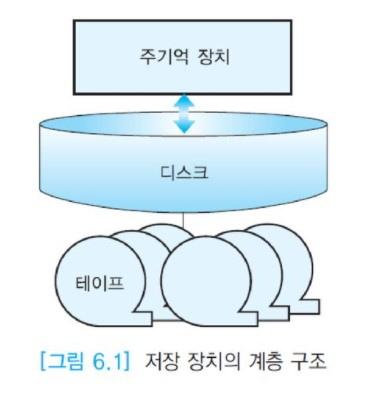
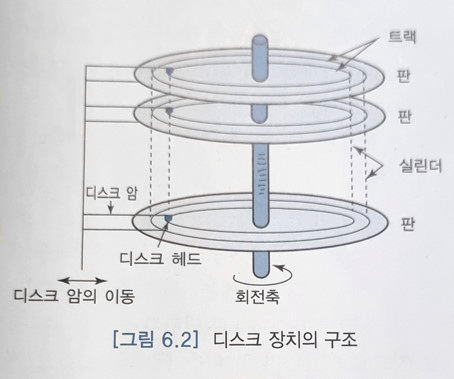
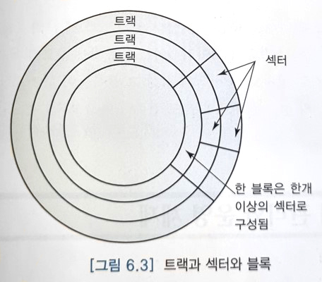

# 보조 기억 장치

사용자가 원하는 데이터를 검색하기 위해서 DBMS는 디스크상의 데이터베이스로부터 사용자가 원하는 데이터를 포함하고 있는 블록을 읽어서 주기억 장치로 가져와야 한다.  
데이터가 변경된 경우에는 블록들을 디스크에 다시 기록해야 한다. 보조 기억 장치에서 주기억 장치로 이동하는 데이터의 단위는 __블록(주기억 장치에서는 페이지)__ 이다.  
블록 크기는 운영 체제에 따라 다르다. 사용자가 블록 크기를 임의로 설정할 수 없다. 블록 크기는 512바이트부터 수 킬로바이트까지 다양한데,  
전형적인 블록 크기는 4,096바이트이다. 각 화일은 고정된 크기의 블록들로 나누어져서 저장된다.

주기억 장치는 매우 빠르지만 용량이 작아서 전체 데이터베이스(심지어 한 릴레이션 전체)를 저장할 수 없고,  
주기억 장치는 휘발성이어서 컴퓨터 시스템이 다운된 경우에는 내용이 모두 없어지므로 데이터베이스는 디스크에 저장하여 관리한다.

디스크는 데이터베이스를 장기간 보관하는 주된 보조 기억 장치이다. 일반적으로 전체 데이터베이스(모든 릴레이션 및 연관된 접근 구조)가 디스크에 저장된다.  
컴퓨터 시스템이 다운되는 경우에도 일반적으로 디스크의 데이터베이스는 손상되지 않는다.  
디스크는 직접 접근 장치이다. 즉 디스크상의 임의의 위치에 있는 데이터를 바로 접근할 수 있다.

이에 반해서 자기 테이프는 주로 데이터베이스를 백업하기 위해서 사용한다. 순차 접근만 가능하므로 디스크 장치보다 속도가 느리다.

현재 사용 중인 데이터베이스는 디스크에 있으므로 디스크에 중점을 두고 논의를 진행한다.  
아래 그림은 저장 장치의 계층 구조를 보여준다. 속도가 가장 빠른 주기억 장치가 제일 위에 위치하고, 중간에 디스크가 위치한다.  
맨 아래에 가장 속도가 느린 테이프 장치가 위치한다.

아래 그림과 같이 디스크는 자기 물질로 만들어진 여러 개의 판으로 이루어진다. 각 면마다 디스크 헤드가 있다.

아래 그림이 나타내듯이 각 판은 트랙과 섹터로 구분된다. 정보는 디스크 표면상의 동심원(트랙)을 따라 저장된다.  
디스크 팩에서 여러 개의 디스크 면 중에서 같은 지름을 갖는 트랙들을 실린더라고 부른다. 일반적으로 한 트랙이 용량이 매우 크기 때문에 더 작은 단위인 섹터들로 구분한다.  
블록은 한 개 이상의 섹터들로 이루어진다. 디스크 장치의 물리적인 특성은 회전 속도, 판의 개수, 각 면의 트랙 수, 트랙당 용량(바이트 수) 등에 따라 달라진다.

디스크에서 임의의 블록을 읽어오거나 기록하는데 걸리는 시간은 __탐구 시간(seek time)__, __회전 지연 시간(rotational delay)__, __전송 시간(transfer time)__의 합이다.  
탐구 시간은 원하는 실린더 위에 디스크 헤드가 놓일 때까지 걸리는 시간이다. 전형적인 디스크에서 약 5 ~ 10ms 정도 소요된다.  
회전 지연 시간은 원하는 블록이 디스크 헤드 밑에 올 때까지 걸리는 시간이다. 평균적으로 1/2 회전 시간만큼 걸린다.  
7200rpm 회전 속도의 디스크에서 약 4.2ms 정도 소요된다. 전송 시간은 블록을 주기억 장치로 전송하는 데 걸리는 시간이다.  
전송 시간은 블록 크기와 버스 속도에 따라 달라진다. 디스크 접근에 소요되는 시간을 감소시키기 위해서는 평균 회전 지연 시간을 줄이고, 블록 전송 횟수를 감소시켜야 한다.

디스크에서 블록들을 순차적으로 접근하는 겨웅에 연속된 블록들이 동일한 실린더상에 위치한다고 가정하면 탐구 시간이 0이고,  
다음에 읽을 데이터가 동일한 트랙 상에서 다음 블록에 위치한다면 회전 지연 시간이 0이다.  
따라서 임의 접근의 경우보다 순차 접근의 성능이 매우 빠르다. DBMS는 가능한 한 순차 접근을 이용하려고 노력한다.  
디스크상에 레코드들을 배치할 때 가능하면 연관된 레코드들을 동일한 블록, 동일한 트랙, 동일한 실린더, 인접한 실린더 순으로 유지한다.

연관된 정보를 저장하고 있는 블록들을 디스크상에서 가까운 곳에 위치시키는 근거는 만일 응용에서 x를 접근했다면 그 다음에는 x와 연관된 데이터 y를 읽을 가능성이 높다는 것이다. 블록 크기가 크면 데이터 x와 연관된 데이터 y를 동일 블록에 저장할 수 있는 가능성이 높아지므로 y를 읽기 위해 추가로 디스크를 접근할 필요가 줄어들 수 있다.

디스크 장치의 속도에 비해서 중앙 처리 장치의 속도가 매우 빠르기 때문에 디스크와 주기억 장치 간의 데이터 전송이 데이터베이스 응용에서 주요 병목이 된다.  
DBMS가 여러 블록들을 주기억 장치로 읽어올 때 항상 그 블록들이 디스크상에서 인접해 있지는 않으므로 DBMS의 성능은 주로 디스크 입출력 연산의 횟수에 좌우된다.
