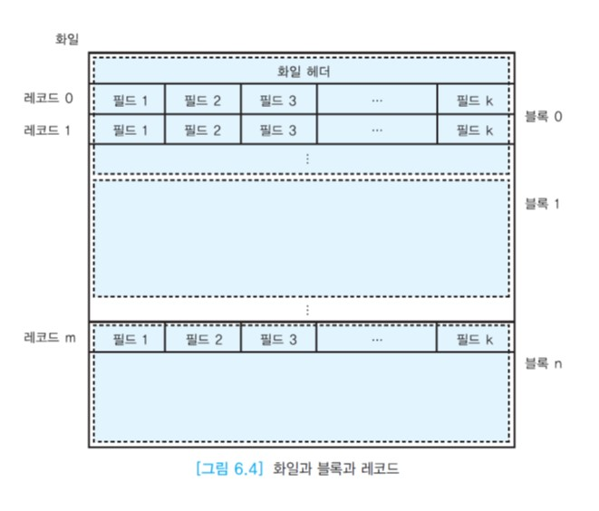
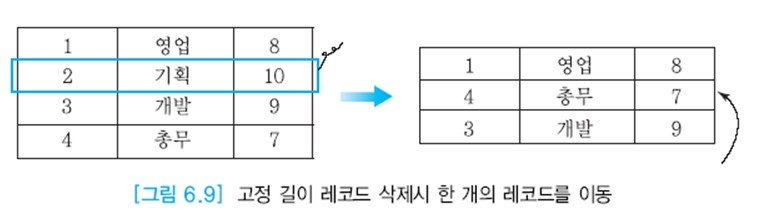

# 디스크상에서 화일의 레코드 배치

릴레이션의 애트리뷰트는 고정 길이 또는 가변 길이의 필드로 표현된다. 연관된 필드들이 모여서 고정 길이 또는 가변 길이의 레코드가 된다.  
레코드는 투플에 대응된다. 한 릴레이션을 구성하는 레코드들의 모임이 화일이라고 부르는 블록들의 모임에 저장된다.

한 화일에 속하는 블록들이 반드시 인접해 있을 필요는 없다. 아래 그림에서 EMPLOYEE 화일에 속하는 블록들이 첫 번째 블록, 네 번째 블록, 다섯 번째 블록에 위치해 있는데  
첫 번째 블록은 네 번째 블록을 가리키고, 네 번째 블록은 다섯 번째 블록을 가리킨다. 두 번째 블록은 현재 아무 화일에도 할당되지 않았다.  
인접한 블록들을 읽는 경우에는 탐구 시간과 회전 지연 시간이 들지 않기 때문에 입출력 속도가 빠르므로 블록들이 인접하도록 한 화일의 블록들을 재조직할 수 있다.




블록 크기는 일반적으로 레코드 크기보다 훨씬 크므로 많은 레코드들이 한 블록에 들어간다.  
만일 레코드 길이가 블록 크리를 초과하면 한 레코드를 두 개 이상의 블록에 걸쳐서 저장한다.  
이런 레코드를 __신장된 레코드(spanned record)__ 라고 부른다.  
__BLOB(Binary Large Object)__ 으로 선언된 애트리뷰트는 이미지(GIF, JPG), 동영상(MPEG, RM)등 대규모 크기의 데이터를 저장하는 데 사용된다. BLOB은 실린더 상에서 인접한 블록들을 할당하여 저장한다.

오라클에서 BLOB의 최대 크기는 8TB ~ 128TB이기 때문에 한 레코드 전체를 한 번에 검색한다는 가정이 더 이상 성립하지 않는다.  
BLOB 데이터는 한 번에 여러 블록씩 나눠서 검색한다.

__채우기 인수(fill factor)__ 는 각 블록에 레코드를 채우는 공간의 비율을 말한다. 한 블록에 레코들르 가득 채우지 않고 빈 공간을 남겨 두는 이유는 나중에 레코드가 삽입될 때 기존의 레코드들을 이동하는 가능성을 줄이기 위한 것이다.


투플은 필드들로 이루어진 레코드로 표현된다. 가장 간단한 경우는 모든 필드들이 고정 길이일 때이다.  
각 블록이 한 릴레이션에 속하는 투플들만 저장하고, 레코드가 고정 길이인 경우에는 레코드 관리가 단순해진다.

레코드 길이가 n바이트인 고정 길이 레코드에서 레코드 i를 접근하기 위해서는 n * (i-1) +1의 위치에서 레코드를 읽으면 된다.  
예를 들어, DEPARTMENT 릴레이션에 해당하는 화일에서 각 레코드의 길이는 18바이트(DEPTNO가 4바이트, DEPTNAME이 10바이트, FLOOR가 4바이트)이다.  
아래 그림에서 세 번째 레코드를 읽기 위해서는 18*2+1=37번째 바이트부터 18바이트를 읽으면 된다.


i번째 고정 길이 레코드를 삭제할 때는 i+1, ..., n번째 레코드를 i, ..., n-1로 하나씩 이동한다.  
아래 그림에서 두 번째 레코드가 삭제되면 세 번째 레코드는 두 번째 레코드의 위치로, 네 번째 레코드는 세 번째 레코드의 위치로 각각 이동한다.


만일 n번째 레코드를 바로 i번째 자리로 옮기면 속도가 보다 빨라진다.  
예를 들어, 아래 그림에서 네 번째 레코드를 두 번째 레코드 위치로 바로 이동하면 삭제된 빈 공간을 한 번에 채울 수 있다.



```
예를 들어, 고정 길이 레코드의 길이가 350바이트이고, 블록 크기가 4K바이트(4096바이트)이고, 블록 헤더의 길이가 12바이트이면 4,084바이트에 레코드를 저장할 수 있다. 한 블록에 11개의 레코드를 저장하고, 234바이트가 남는다.
```

가변 길이 레코드의 경우에는 특정 레코드의 접근이 어려워진다. i번째 레코드가 더 이상 (n-1)*i+1 위치에 있지 않다.  
한 가지 구현 방법은 각 레코드의 끝을 나타내는 특별한 문자를 사용하는 것이다. 레코드를 삭제한 후에 그 공간에 길이가 더 긴 레코드를 삽입하려면 레코드들의 위치를 옮겨서 필요한 공간을 만들어야 한다.

레코드들을 블록에 넣을 때 질의 처리 시 입출력을 최소화하기 위해서 하나의 질의에서 함께 요구될 정보를 동일한 블록에 넣는 클러스터링을 활용할 수 있다.  
첫 번째 클러스터링 방법은 한 화일 내의 레코드들을 클러스터링한다.  
__한 화일 내의 클러스트링(intra-file clustering)__ 은 한 화일 내에서 함께 검색될 가능성이 높은 레코드들을 디스크상에서 물리적으로 가까운 곳에 모아두는 것이다.  
두 번째 클러스터링 방법은 두 개 이상의 화일에 속하는 레코드들을 클러스터링한다.  
__화일 간의 클러스터링(inter-file clustering)__ 은 논리적으로 연관되어 함께 검색될 가능성이 높은 두 개 이상의 화일에 속한 레코드들을 디스크상에서 물리적으로 가까운 곳에 저장하는 것이다.

```
EMPLOYEE 릴레이션에 해당하는 화일에서 같은 부서에 속하는 사원 레코드들이 함께 검색될 가능성이 높으므로 아래 그림과 같이 블록 0에는 1번 부서, 블록 1에는 2번 부서에서 근무하는 사원 레코드들을 함께 저장한다.
```


공통된 애트리뷰트를 사용하여 빈번하게 조인이 수행되는 화일들에 대해서만 화일간의 클러스터링을 제공하는 것이 좋다.  
화일 간의 클러스터링이 조인 성능은 향상시키지만 화일 전체를 탐색하는 연산, 레코드를 삽입하는 연산, 조인 애트리뷰트를 수정하는 연산의 속도는 저하시킬 수 있다.

```
아래 그림과 같이 DEPARRTMENT 화일에서 1번 부서에 해당하는 레코드와 EMPLOYEE 화일에서 1번 부서에 소속된 레코드들을 가까운 곳(동일 블록)에 저장하고, 2번 부서에 해당하는 레코드와 2번 부서에 소속된 레코드들을 가까운 곳에 저장한다. 어떤 부서의 이름 등과 함께 그 부서에 소속된 사원들에 관한 정보를 함께 검색하는 경우가 많기 때문이다.
```


