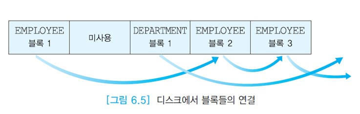

# 디스크상에서 화일의 레코드 배치

릴레이션의 애트리뷰트는 고정 길이 또는 가변 길이의 필드로 표현된다. 연관된 필드들이 모여서 고정 길이 또는 가변 길이의 레코드가 된다.  
레코드는 투플에 대응된다. 한 릴레이션을 구성하는 레코드들의 모임이 화일이라고 부르는 블록들의 모임에 저장된다.

한 화일에 속하는 블록들이 반드시 인접해 있을 필요는 없다. 아래 그림에서 EMPLOYEE 화일에 속하는 블록들이 첫 번째 블록, 네 번째 블록, 다섯 번째 블록에 위치해 있는데  
첫 번째 블록은 네 번째 블록을 가리키고, 네 번째 블록은 다섯 번째 블록을 가리킨다. 두 번째 블록은 현재 아무 화일에도 할당되지 않았다.  
인접한 블록들을 읽는 경우에는 탐구 시간과 회전 지연 시간이 들지 않기 때문에 입출력 속도가 빠르므로 블록들이 인접하도록 한 화일의 블록들을 재조직할 수 있다.

블록 크기는 일반적으로 레코드 크기보다 훨씬 크므로 많은 레코드들이 한 블록에 들어간다.  
만일 레코드 길이가 블록 크리를 초과하면 한 레코드를 두 개 이상의 블록에 걸쳐서 저장한다.  
이런 레코드를 __신장된 레코드(spanned record)__ 라고 부른다.  
__BLOB(Binary Large Object)__ 으로 선언된 애트리뷰트는 이미지(GIF, JPG), 동영상(MPEG, RM)등 대규모 크기의 데이터를 저장하는 데 사용된다. BLOB은 실린더 상에서 인접한 블록들을 할당하여 저장한다.

오라클에서 BLOB의 최대 크기는 8TB ~ 128TB이기 때문에 한 레코드 전체를 한 번에 검색한다는 가정이 더 이상 성립하지 않는다.  
BLOB 데이터는 한 번에 여러 블록씩 나눠서 검색한다.

__채우기 인수(fill factor)__ 는 각 블록에 레코드를 채우는 공간의 비율을 말한다. 한 블록에 레코들르 가득 채우지 않고 빈 공간을 남겨 두는 이유는 나중에 레코드가 삽입될 때 기존의 레코드들을 이동하는 가능성을 줄이기 위한 것이다.

투플은 필드들로 이루어진 레코드로 표현된다. 가장 간단한 경우는 모든 필드들이 고정 길이일 때이다.  
각 블록이 한 릴레이션에 속하는 투플들만 저장하고, 레코드가 고정 길이인 경우에는 레코드 관리가 단순해진다.

레코드 길이가 n바이트인 고정 길이 레코드에서 레코드 i를 접근하기 위해서는 n * (i-1) +1의 위치에서 레코드를 읽으면 된다.  
예를 들어, DEPARTMENT 릴레이션에 해당하는 화일에서 각 레코드의 길이는 18바이트(DEPTNO가 4바이트, DEPTNAME이 10바이트, FLOOR가 4바이트)이다.  
아래 그림에서 세 번째 레코드를 읽기 위해서는 18*2+1=37번째 바이트부터 18바이트를 읽으면 된다.

