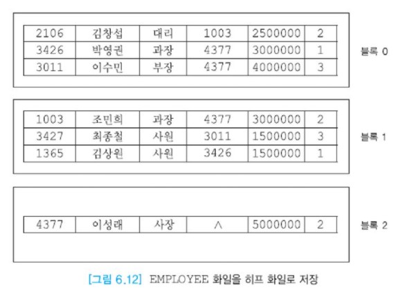
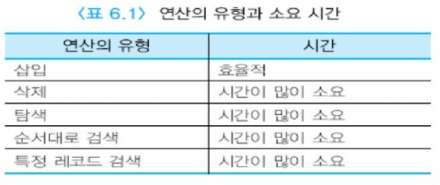
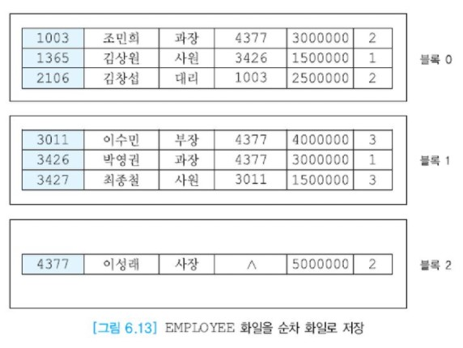
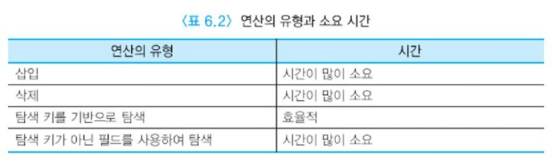

# 화일 조직

화일 조직은 화일 내의 데이터를 보조 기억 장치에서 블록과 레코드들로 배치하는 것이다.  
전형적인 화일 조직의 유형으로는 __히프 파일(heap file), 순차 파일(sequential file), 인덱스된 순차 화일(indexed sequential file), 직접 화일(hash file)__ 등이 있다.


## 목차

- [히프 화일(비순서 화일)](#히프-화일-비순서-화일-)
- [순차 화일(순서 화일)](#순차-화일-순서-화일-)


## 히프 화일(비순서 화일)

히프 화일은 가장 단순한 화일 조직이다. 일반적으로 레코드들이 삽입된 순서대로 화일에 저장된다. 일반적으로 새로 삽입되는 레코드는 화일의 가장 끝에 첨부된다.  
따라서 삽입이 쉬우며 레코드들의 순서는 없다. 원하는 레코드를 찾기 위해서는 모든 레코드들을 순차적으로 접근해야 한다.  
삭제는 원하는 레코드를 찾은 후에 그 레코드를 삭제하고, 삭제된 레코드가 차지하던 공간을 재사용하지 않는다.  
이 공간을 재사용하려면 레코드를 삽입할 때 화일의 끝 대신에 화일 중간에서 빈자리를 찾아야 하므로 레코드 삽입 시간이 증가한다.

시간이 오래 흐르면 삭제된 레코드들이 차지했던 공간이 사용되지 않으면서 빈 공간으로 남아 있어서 화일 크기가 증가하게 된다.  
검색 시에는 빈 공간도 검사하게 되므로 검색 시간이 오래 걸리게 된다. 따라서 좋은 성능을 유지하기 위해서 히프 화일을 주기적으로 재조직할 필요가 있다.  
화일 재조직 시에는 빈 공간들을 회수해서 자유 공간에 반환한다.

릴레이션에 데이터를 __한꺼번에 적재__할 때(bulk loading), 릴레이션에 몇 개의 블록들만 있을 때, 모든 투플들이 검색 위주로 사용될 때 히프 화일이 주로 사용된다.  
아래 그림은 EMPLOYEE 화일이 히프 화일로 저장된 것을 보여준다. EMPLOYEE 화일의 레코드들이 임의의 순서로 들어 있다.



### 히프 화일의 성능

히프 화일은 질의에서 모든 레코드들을 참조하고 레코드들을 접근하는 순서는 중요하지 않을 때 효율적이다.  
예를 들어, 아래의 질의는 EMPLOYEE 릴레이션에서 모든 레코드들을 임의의 순서로 검색한다.

```sql
SELECT *
FROM employee;
```

그러나 특정 레코드를 검색하는 경우에는 히프 화일이 비효율적이다.  
예를 들어, 아래 질의는 EMPLOYEE 릴레이션에서 EMPNO가 1365인 사원을 검색한다. 히프 화일에 b개의 블록이 있다고 가정하자.  
원하는 블록을 찾기 위해서 평균적으로 b/2개의 블록을 읽어야 한다.

```sql
SELECT title
FROM employee
WHERE empno = 1365;
```

몇 개의  레코드들을 검색하는 경우에도 비효율적이다.  
이 경우에는 조건에 맞는 레코드를 이미 한 개 이상 검색했더라도 화일의 마지막 블록까지 읽어서 원하는 레코드가 존재하는가를 확인해야 하기 때문에 b개의 블록을 모두 읽어야 한다.  
아래의 질의는 EMPLOYEE 릴레이션에서 2번 부서에 근무하는 사원 레코드들을 검색하는데, 2번 부서에 근무하는 사원이 여러 명 있을 수 있으므로 모든 레코드들을 접근해야만 한다.

```
SELECT empname, title
FROM employee
WHERE dno = 2;
```

급여의 범위를 만족하는 레코드들을 모두 검색하는 아래의 질의도 EMPLOYEE 릴레이션의 모든 레코드들을 접근해야 한다.

```
SELECT empname, title
FROM employee
WHERE salary >= 3000000 AND salary <= 4000000;
```

히프 화일을 갱신하는 데도 시간이 많이 걸린다. 아래 표는 히프 화일에 대한 여러가지 연산의 유형과 소요 시간을 개략적으로 보여준다.




## 순차 화일(순서 화일)

순차 화일은 레코드들이 하나 이상의 필드 값에 따라 순서대로 저장된 화일이다. 레코드들이 일반적으로 레코드의 __탐색 키(search key)__ 값의 순서에 따라 저장된다.  
탐색 키는 순차 화일을 정렬하는 데 사용되는 필드를 의미한다. 순차 화일은 레코드들을 순차 접근하는 응용에 적합하다.  
화일의 레코드들이 정렬된 필드를 사용하여 특정 레코드를 검색하는 경우에는 이진 탐색을 사용하여 순차 탐색보다 탐색 시간을 줄일 수 있다.

삽입 연산은 삽입하려는 레코드의 순서를 고려해야 하기 때문에 시간이 많이 걸릴 수 있다.  
삽입 연산ㅇ느 레코들르 삽입할 위치를 찾은 후에 그 자리에 빈 공간이 있으면 레코드를 삽입하고,  
빈 공간이 없는 경우에는 삽입할 레코드를 오버플로 블록에 넣거나, 삽입할 곳 이전의 레코드들을 이전 블록으로 이동하거나.  
삽입할 곳 이후의 레코드들을 다음 블록으로 하나씩 이동한다.

레코드를 삭제하는 연산은 삭제된 레코드가 사용하던 공간을 빈 공간으로 남기기 때문에 히프 화일의 경우와 마찬가지로 주기적으로 순차 화일을 재조직해야 한다.  
기본 인덱스가 순차 화일에 정의되지 않는 한 순차 화일은 데이터베이스 응용을 위해 거의 사용되지 않는다.

아래 그림은 EMPLOYEE 화일이 순차 화일로 저장된 것을 보여준다. EMPLOYEE 화일의 레코드들이 EMPNO의 값이 증가하는 순서로 들어 있다.



예를 들어, EMPLOYEE 화일이 EMPNO의 순서대로 저장되어 있을 때 첫 번째 SELECT문은 이진 탐색을 이용할 수 있고, 두번째 SELECT문의 WHERE절에 사용된 SALARY는 저장 순서와 무관하기 때문에 화일 전체를 탐색해야 한다.

```sql
SELECT title
FROM employee
WHERE empno = 1365;

SELECT empname, title
FROM employee
WHERE salary >= 3000000 AND salary <= 4000000;
```

아래 표는 순차 화일에 대한 여러 가지 연산의 유형과 소요 시간을 보여준다.



