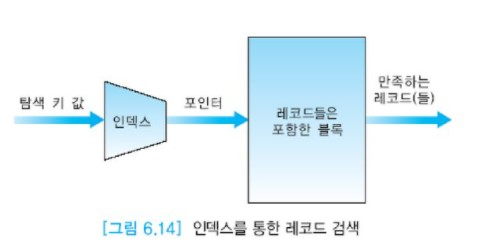
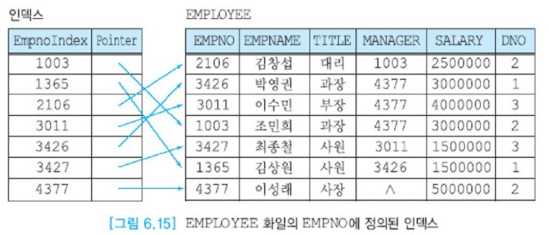
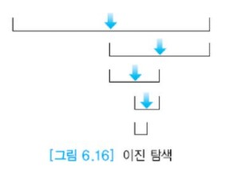
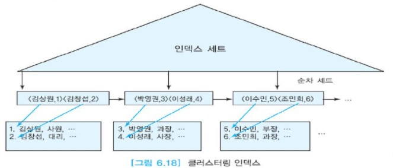
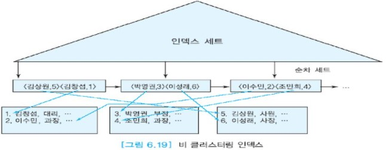
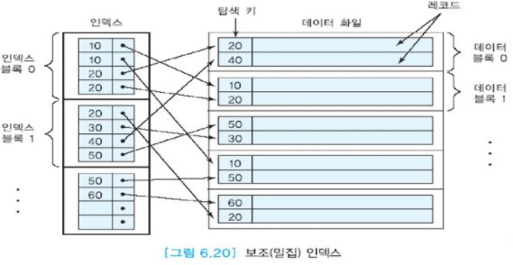
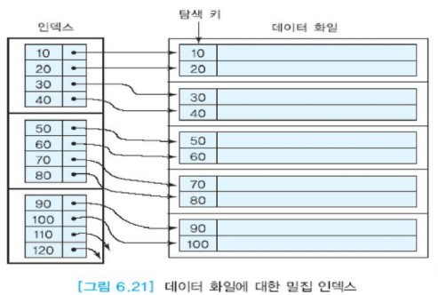

# 단일 단계 인덱스

만일 화일에 대한 접근이 일괄 방식으로 순차 접근만 한다면 어떤 종류의 인덱스도 거의 불필요하다.  
인덱스된 순차 화일은 인덱스를 통해서 임의의 레코드를 접근할 수 있는 화일이다.  
인덱스 자체가 화일을 의미하므로 '인덱스 화일'이라고 할 필요는 없다.

단일 단계 인덱스의 각 엔트리는

__< 탐색 키, 레코드에 대한 포인터>__

로 이루어진다. 엔트리들은 탐색 키 값의 오름차순으로 정렬된다. 인덱스는 DBMS가 화일 내의 특정 레코드들을 빠르게 찾을 수 있도록 하는 데이터 구조이므로 인덱스를 통하여 질의를 수행하면 응답 시간이 향상된다. (아래 그림 참고)

디스크 접근 시간이 주기억 장치 접근 시간에 비해서 매우 크고 대부분의 데이터베이스 응용에서 디스크 접근을 많이 요구하므로, 인덱스를 통해 디스크 접근 횟수를 줄이면 데이터베이스의 성능을 크게 향상시킬 수 있다.

인덱스는 임의 접근을 필요로 하는 응용에 적합하다. 인덱스는 데이터 화일과는 별도의 화일에 저장된다.  
데이터 화일에 들어 있는 여러 애트리뷰트들 중에서 탐색 키에 해당하는 일부 애트리뷰트만 인덱스에 포함되기 때문에  
인덱스의 크기는 데이터 화일의 크기에 비해 훨씬 작으며, 흔히 데이터 화일 크기의 10 ~ 20% 정도가 된다.  
또한 하나의 화일에 여러 개의 인덱스들을 정의할 수 있다.

아래 그림은 EMPLOYEE 화일의 EMPNO에 정의된 인덱스를 보여준다. 인덱스는 <EmpnoIndex, Pointer> 형식의 엔트리들로 이루어지며,  
EmpnoIndex의 값이 증가하는 순서대로 엔트리들이 정렬되어 있다. 앞의 EMPLOYEE 릴레이션의 정의를 보면 한 레코드이 길이가 36바이트이다. EmpnoIndex 필드의 길이가 4바이트이므로, 인덱스의 Pointer의 길이를 4바이트라고 가정하면 인덱스의 한 엔트리의 길이는 8바이트이다. 따라서 EMPLOYEE 화일의 크기보다 인덱스의 크기가 훨씬 작다.

인덱스가 정의된 필드를 탐색 키라고 부른다. 탐색 키의 값들은 후보 키처럼 각 투플마다 반드시 고유하지는 않다.  
즉 후보 키와 달리 두 개 이상의 투플들이 동일한 탐색 키 값을 가질 수 있다. 탐색 키라는 용어에 포함된 '키' 를 지금까지 사용해온 '키'와 혼동하지 않기를 바란다.  
키를 구성하는 애트리뷰트뿐만 아니라 어떤 애트리뷰트도 탐색 키로 사용될 수 있다.

인덱스가 데이터 화일보다 크기가 작으므로 인덱스를 순차적으로 찾는 시간은 데이터 화일을 순차적으로 탐색하는 시간보다 적게 걸린다.  
더욱이 인덱스의 엔트리들은 탐색 키 값의 오름차순으로 저장되어 있으므로 이진 탐색을 이용할 수도 있다.(아래 그림 참고) 이진 탐색을 이용하면 탐색 시간이 훨씬 적게 소요된다.

인덱스를 사용하면 한 화일에서 특정 레코드를 찾기 위해서 모든 레코드들을 탐색할 필요가 없으므로 특히 화일이 매우 클 경우에 유용하다.  
인덱스 전체를 주기억 장치에 유지할 수 있을 때 특히 인덱스가 성능에 도움이 된다. 어떤 레코드를 찾는 질의도 한 번의 디스크(데이터 화일에 대한) 접근만 필요로 한다.

인덱스의 유형은 크게 단일 단계 인덱스와 다단계 인덱스로 구분한다. B+-트리 인덱스는 관계 DBMS에서 가장 널리 사용되는 다단계 인덱스 구조이다.  
다단계 인덱스는 다음 절에서 자세하게 논의한다. 단일 단계 인덱스에는 아래와 같은 유형들이 있다.

## 목차

- [기본 인덱스(primary index)](#기본-인덱스primary-index)
- [클러스터링 인덱스(clustering index)](#클러스터링-인덱스clustering-index)
- [보조 인덱스(secondary index)](#보조-인덱스secondary-index)
- [희소 인덱스(sparse index)](#희소-인덱스sparse-index)
- [밀집 인덱스(dense index)](#밀집-인덱스dense-index)
- [희소 인덱스와 밀집 인덱스 비교](#희소-인덱스와-밀집-인덱스-비교)
- [클러스터링 인덱스와 보조 인덱스의 비교](#클러스터링-인덱스와-보조-인덱스의-비교)

## 기본 인덱스(primary index)

탐색 키가 데이터 화일의 기본 키인 인덱스를 기본 인덱스라고 부른다. 레코드들은 기본 키의 값에 따라 클러스터링된다.  
기본 인덱스는 기본 키의 값에 따라 정렬된 데이터 화일에 대해 정의된다. 기본 인덱스는 흔히 희소 인덱스로 유지할 수 있다.  
희소 인덱스는 데이터 화일을 구성하는 각 블록마다 하나의 탐색 키 값이 인덱스 엔트리에 포함된다.  
일반적으로 각 인덱스 엔트리는 블록 내의 첫 번째 레코드의 키 값(__블록 앵커__(block anchor)라고 부름)을 갖는다.

각 릴레이션마다 최대한 한 개의 기본 인덱스를 가질 수 있다. 아래 그림은 데이터 화일에 대한 기본 인덱스(또는 희소 인덱스)를 보여준다.  
데이터 화일의 레코드들을 저장하는 블록마다 두 개의 레코드가 들어 있다. 이에 반해서 인덱스 엔트리들을 저장하고 있는 블록마다 네 개의 엔트리들이 들어 있다.  
실제의 경우에는 데이터 블록당 레코드 수와 인덱스 블록당 엔트리 수는 훨씬 더 차이가 난다.

데이터 화일은 기본 키 값이 증가하는 순서로 정렬되어 있다. 각 데이터 블록의 첫 번째 레코드의 기본 키 값이 인덱스 엔트리에 포함된다.  
예를 들어, 첫 번째 데이터 블록에는 기본 키가 10, 20인 레코드가 들어 있는데, 이 중에서 기본 키 값 10이 인덱스에 포함된다.  
두 번째 데이터 블록에는 기본 키가 30, 40인 레코드가 들어 있는데, 이 중에서 기본 키 값 30이 인덱스 엔트리에 포함된다.

## 클러스터링 인덱스(clustering index)

클러스터링 인덱스는 탐색 키 값에 따라 정렬된 데이터 화일에 대해 정의된다.  
각 데이터 블록 대신에 각각의 상이한 키 값마다 하나의 인덱스 엔트리가 인덱스에 포함되어, 그 탐색 키 값을 갖는 첫 번째 레코드의 주소(또는 레코드가 들어 있는 블록의 주소)를 가리킨다.

클러스터링 인덱스는 범위 질의에 유용하다. 범위의 시작 값에 해당하는 인덱스 엔트리를 먼저 찾는다.  
클러스터링 인덱스에서는 인접한 탐색 키 값을 갖는 레코드들이 디스크에서 가깝게 저장되어 있으므로 범위에 속하는 인덱스 엔트리들을 따라가면서 레코드들을 검색할 때 디스크에서 읽어오는 블록 수가 최소화된다.  
어떤 인덱스 엔트리에서 참조되는 데이터 블록을 읽어오면 그 데이터 블록에 들어 있는 대부분의 레코드들은 범위를 만족한다.

아래 그림은 EMPLOYEE 화일의 EMPNAME 애트리뷰트에 대한 클러스터링 인덱스를 보여준다.  
데이터 화일의 레코드들은 EMPNAME 애트리뷰트의 값이 증가하는 순서대로 정렬되어 있다. 또한 인덱스의 엔트리들은 인덱스가 정의된 EMPNAME의 값이 증가하는 순서대로 정렬되어 있다.  
따라서 인덱스 엔트리들의 정렬 순서와 데이터 화일의 레코드들의 정렬 순서가 일치하므로 EMPNAME에 대한 어떤 범위를 만족하는 레코드들을 검색할 때  
범위에 속하는 첫 번째 레코드를 인덱스 엔트리에서 찾은 후에 인덱스 엔트리의 포인터들을 따라가면 주어진 범위에 속하는 레코드들을 인접한 데이터 블록들에서 빠르게 찾을 수 있다.

이에 반해서 아래 그림의 비클러스터링 인덱스에서는 데이터 화일의 레코드들이 탐색 키의 값과 무관하게 저장되어 있으므로,  
인덱스 엔트리들이 인접해 있어도 레코드들은 대부분의 경우에 멀리 떨어져 있다.  
따라서 어떤 범위에 속하는 레코드들을 검색하기 위해서는 범위를 만족하는 첫 번째 레코드를 인덱스 엔트리에서 찾은 후에,  
범위 내의 인덱스 엔트리들을 차례대로 읽으면서 데이터 레코드를 검색할 때마다 매번 디스크 블록을 접근해야 하는 경우가 많다.

## 보조 인덱스(secondary index)

한 화일은 기껏해야 한 가지 필드들의 조합에 대해서만 정렬될 수 있다.  
즉 EMPLOYEE화일을 EMPNO에 대해서 정렬하는 동시에 TITLE에 대해서도 정렬할 수 없다.  
만일 EMPLOYEE 화일이 EMPNO 애트리뷰트의 값이 증가하는 순으로 정렬되어 있는데, TITLE을 WHERE절에 사용하여 레코드들을 검색하기 위해서는 TITLE에 대해 인덱스를 정의해야 한다.

보조 인덱스는 탐색 키 값에 따라 정렬되지 않은 데이터 화일에 대해 정의된다.  
하지만 인덱스에서 탐색 키 값들은 물론 정렬되어 있다. 흔히 한 릴레이션에 여러 개의 인덱스를 정의해야 할 필요성이 있다.

보조 인덱스는 기본 인덱스처럼 레코드를 빠르게 찾는다는 동일한 목적을 달성한다.  
보조 인덱스는 일반적으로 밀집 인덱스이므로 같은 수의 레코드들을 접근할 때 보조 인덱스를 통하면 기본 인덱스를 통하는 경우보다 디스크 접근 횟수가 증가할 수 있다.  
또한 기본 인덱스를 사용한 순차 접근은 효율적이지만 보조 인덱스를 사용한 순차 접근은 비효율적이다.  
각 레코드를 접근하기 위해서 디스크에서 블록을 읽어올 필요가 있을 수 있다.

앞에서 예로 설명한 바와 같이 신용카드 회사에서는 신용카드 번호를 사용하여 고객의 레코드를 빈번하게 검색하므로 신용카드번호에 대해 기본 인덱스를 생성한다.  
또한 카드를 분실한 고객이 분실 신고를 할 때 신용카드번호를 기억하지 못한다면 주민등록번호를 사용하여 고객의 레코드를 빠르게 찾을 수 있어야 한다.  
만일 신용카드 회사의 고객 화일에 기본 인덱스만 존재하고 주민등록번호에 보조 인덱스가 존재하지 않는다면,  
주민등록번호를 사용하여 특정 고객의 레코드를 찾을 때 몇 십분씩 시간이 걸릴 수 있으므로 실제 업무에 도저히 적용할 수 없다.  
주민등록번호는 신용카드번호만큼 특정 고객의 레코드를 찾는 데 자주 사용되지는 않지만  
주어진 주민등록번호를 갖는 레코드를 빠르게 찾기 위해서 보조 인덱스를 정의하는 것이 바람직하다.

아래 그림은 보조 인덱스(밀집 인덱스)를 보여준다.  
데이터 화일의 레코드들은 인덱스가 정의된 필드의 값과 무관하게 저장되어 있다. 또한 데이터 화일의 각 레코드의 탐색 키 값이 인덱스의 엔트리에 포함된다.

## 희소 인덱스(sparse index)

희소 인덱스는 일부 키 값에 대해서만 인덱스에 엔트리를 유지하는 인덱스를 말한다.  
일반적으로 각 블록마다 한 개의 탐색 키 값이 인덱스 엔트리에 포함된다.  
희소인덱스의 그림은 기본 인덱스의 그림을 참조하기 바란다.

## 밀집 인덱스(dense index)

밀집 인덱스는 각 레코드의 키 값에 대해서 인덱스에 엔트리를 유지하는 인덱스를 말한다.  
아래 그림은 기본 인덱스를 밀집 인덱스로 나타낸 것이다. 데이터 화일의 각 레코드의 탐색 키 값이 인덱스 엔트리에 포함된다.  
보조 인덱스의 그림과 비교하자면 각 데이터 레코드의 탐색 키 값이 인덱스 엔트리에 포함된다는 것은 동일하지만  
밀집 인덱스의 데이터 레코드들은 탐색 키 값이 증가되는 순서대로 정렬되어 있다. 따라서 클러스터링 인덱스이기도 하다.

## 희소 인덱스와 밀집 인덱스의 비교

희소 인덱스는 각 데이터 블록마다 한 개의 엔트리를 갖는다. 밀집 인덱스는 각 레코드마다 한 개의 엔트리를 갖는다.  
따라서 밀집 인덱스 내의 엔트리 수는 희소 인덱스 내의 엔트리 수에 블록당 평균 레코드 수를 곱한 것이다.  
레코드의 길이가 블록 크기에 가까울 경우에는 밀집 인덱스와 희소 인덱스의 크기가 거의 비슷하다.  
레코드의 길이가 블록 크기보다 훨씬 작은 일반적인 경우에는 희소 인덱스의 엔트리 수가 밀집 인덱스의 엔트리 수보다 훨씬 적다.  
희소 인덱스는 일반적으로 밀집 인덱스에 비해 인덱스 단계 수가 1 정도 적으므로 인덱스 탐색 시 디스크 접근 수가 1만큼 적을 수 있다.  
희소 인덱스는 밀집 인덱스에 비해 모든 갱신과 대부분의 질의에 대해 더 효율적이다.  
하지만 만일 질의에서 인덱스가 정의된 애트리뷰트만 검색(예를 들어, COUNT 질의)하는 경우에는  
데이터 화일을 접근할 필요 없이 인덱스만 접근해서 질의를 수행 할 수 있으므로 밀집 인덱스가 희소 인덱스보다 유리하다.

희소 인덱스를 이용해서 키 값이 K인 레코드를 어떻게 찾을 것인가? 이진 탐색을 사용하여 인덱스에서 K와 같거나 K보다 작으면서 가장 큰 엔트리를 찾는다.  
그 엔트리의 포인터를 따라가서 데이터 블록을 접근한다. 그 데이터 블록 내에서 탐색 키 값이 K인 레코드를 찾는다. 앞의 기본 인덱스 그림(희소 인덱스)에서 탐색 키 값이 40인 레코드를 찾는 과정을 고려해보자.  
탐색 키 값 40보다 작으면서 가장 큰 인덱스 엔트리의 키 값은 30이다. 이 엔트리에 들어 있는 포인터를 따라가면 데이터 화일의 두 번째 블록을 접근하게 된다.  
이 데이터 블록에 들어 있는 레코드들의 탐색 키 값을 하나씩 확인해보면 두 번째 레코드의 탐색 키 값이 40인 것을 알 수 있다.  
따라서 "탐색 키 값이 K인 레코드가 존재하는가?"를 묻는 질의는 밀집 인덱스보다 디스크 접근 횟수가 1만큼 더 많을 수 있다.

한 화일은 한 개의 희소 인덱스와 다수의 밀집 인덱스를 가질 수 있다. 왜냐하면 회소 인덱스는 디스크상에서 데이터 화일의 물리적인 순서에 의존하기 때문이다.

## 클러스터링 인덱스와 보조 인덱스의 비교

클러스터링 인덱스는 희소 인덱스일 경우가 많으며 범위 질의 등에 좋다.  
클러스터링 인덱스가 불리한 경우에는 릴레이션의 중간에 투플이 삽입되어 오버플로를 야기하고, 이로 인해서 클러스터링의 장점을 잃게 되는 경우이다.  
클러스터링 인덱스를 정의 할 때는 채우기 인수에 낮은 값을 지정하여 추가로 삽입되는 레코드들에 대비하는 것이 바람직하다.  
보조 인덱스는 밀집 인덱스이므로 일부 질의에 대해서는 화일을 접근 할 필요 없이 처리할 수 있다.
