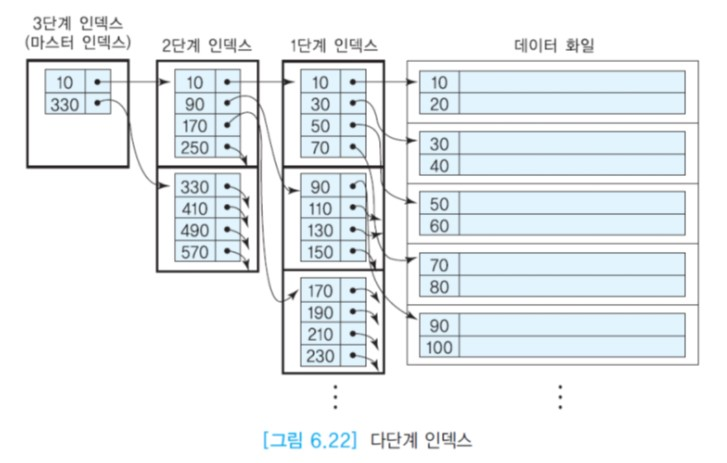

# 다단계 인덱스

단일 단계 인덱스 자체는 인덱스가 정의된 필드의 값에 따라 정렬된 화일로 볼 수 있다.  
인덱스 자체가 클 경우에는 인덱스를 탐색하는 시간도 오래 걸릴 수 있다. 인덱스 엔트리를 탐색하는 시간을 줄이기 위해서 단일 단계 인덱스를 디스크상의 하나의 순서 화일로 간주하고,  
단일 단계 인덱스에 대해서 다시 인덱스를 정의할 수 있다. 1단계 인덱스는 밀집 인덱스 또는 희소 인덱스 모두 가능하지만 2단계 이상의 인덱스는 희소 인덱스만 가능하다.

원래의 인덱스를 1단계 인덱스라 하고 이 인덱스에 대해 정의한 추가 인덱스를 2단계 인덱스라고 한다.  
교재에 따라서는 새로 추가된 1단계, 기존의 인덱스를 2단계라고 부르기도 한다.

다단계 인덱스는 가장 상위 단계의 모든 인덱스 엔트리들이 한 블록에 들어갈 수 있을 때까지 이런 과정을 반복한다.  
가장 상위 단계 인덱스를 __마스터 인덱스(master index)__ 라고 부른다.  
마스터 인덱스는 한 블록으로 이루어지기 때문에 주기억 장치에 상주할 수 있다.  
다단계 인덱스의 각 단계는 하나의 순서 화일이다. 새로운 인덱스 엔트리를 추가하거나 기존의 인덱스 엔트리를 삭제하면 단일 단계 인덱스의 경우보다 처리 과정이 복잡해진다.

아래 그림은 3단계로 이루어진 다단계 인덱스를 보여준다. 마스터 인덱스의 엔트리들은 2단계 인덱스의 블록들을 가리키고,  
2단계 인덱스의 엔트리들은 1단계 인덱스들의 블록들을 가리킨다. 마지막으로 1단계 인덱스의 엔트리들은 데이터 화일의 블록들을 가리킨다.



대부분의 다단계 인덱스는 B+-트리를 사용한다. B는 balanced의 첫 글자이다. 균형 이진 탐색 트리를 일반화한 것이다.  
B+-트리의 각 노드는 다수의 자식 노드들을 가진다. 각 노드는 한 개의 디스크 블록을 차지한다. 일반적으로 한 블록에 자식 노드들에 대한 포인터를 수백 개 저장할 수 있다.  
B+-트리는 4단계 이상을 필요로 하는 경우가 거의 없다. B+-트리는 추가될 인덱스 엔트리들을 위해 각 인덱스 블록에 예비 공간을 남겨둔다.

인덱스의 각 단계들이 오름차순으로 유지되어야 하므로 다단계 인덱스의 갱신은 단일 단계 인덱스의 갱신보다 시간이 오래 걸리고 복잡해진다.  
하지만 대부분의 데이터베이스 응용에서 검색 비율이 갱신 비율보다 월등히 높으므로 모든 DBMS에서는 인덱스를 다단계 인덱스로 유지한다.


## 목차

- [SQL의 인덱스 정의문](#sql의-인덱스-정의문)
- [다수의 애트리뷰트를 사용한 인덱스 정의](#다수의-애트리뷰트를-사용한-인덱스-정의)
- [인덱스의 장점과 단점](#인덱스의-장점과-단점)


## SQL의 인덱스 정의문

SQL의 CREATE TABLE문에서 PRIMARY KEY절로 명시한 애트리뷰트에 대해서는 DBMS가 자동적으로 기본 인덱스를 생성한다.  
UNIQUE로 명시한 애트리뷰트에 대해서는 DBMS가 자동적으로 보조 인덱스를 생성한다.  
SQL2는 인덱스 정의 및 제거에 관한 표준 SQL문을 제공하지 않는다. 다른 애트리뷰트에 추가로 인덱스를 정의하기 위해서는 DBMS다 다소 구문이 다른 CREATE INDEX문을 사용해야 한다.  
언제든지 인덱스를 릴레이션에 생성하거나 제거할 수 있다. 일반적으로 뷰(8장)에는 인덱스를 만들지 못한다. 뷰는 뷰를 정의하는 데 사용된 릴레이션에 정의된 인덱스를 이용한다.


## 다수의 애트리뷰트를 사용한 인덱스 정의

한 릴레이션에 속하는 두 개 이상의 애트리뷰트들의 조합에 대하여 하나의 인덱스를 정의할 수 있다.  
대부분의 데이터베이스 전문가들은 복합 애트리뷰트에 인덱스를 정의할 때 3개 이하의 애트리뷰트를 사용하라고 권고한다.  
인덱스가 정의된 복합 애트리뷰트에 포함된 애트리뷰트의 개수가 늘어날수록 이 인덱스를 활용하는 탐색 조건이 복잡해지고, 인덱스 엔트리의 길이가 늘어나기 때문에 탐색 성능이 저하된다.

복합 애트리뷰트 인덱스를 정의할 때 애트리뷰트들의 순서가 중요하다.  
예를 들어, 아래의 CREATE INDEX문은 EMPLOYEE 릴레이션의 (DNO, SALARY) 애트리뷰트에 대해 하나의 인덱스를 생성한다.

```sql
CREATE INDEX EmpIndex ON employee (dno, salary);
```

이 인덱스는

```sql
SELECT *
FROM employee
WHERE dno=3 AND salary = 4000000;
```

와 같이, 인덱스가 정의된 두 애트리뷰트를 참조하는 WHERE절의 프레디키트를 만족하는 레코드들을 찾기 위해 사용될 수 있다.  
이 인덱스는 두 애트리뷰트에 대한 범위 질의에도 사용될 수 있다.

```sql
SELECT *
FROM employee
WHERE dno>=2 AND dno <=3 AND salary >= 3000000 AND salary <= 4000000;
```

이 인덱스는 인덱스가 정의된 첫 번째 애트리뷰트만 참조하는 WHERE절의 프레디키트를 만족하는 레코드들을 찾기 위해서도 사용될 수 있다.

```sql
SELECT *
FROM employee
WHERE dno = 2;
```

그러나 인덱스가 정의된 두 번째 이후의 애트리뷰트만 참조하는 WHERE절의 프레디키트를 만족하는 레코드들을 찾기 위해서는 사용될 수 없다.

```sql
SELECT *
FROM employee
WHERE salary >= 3000000 AND salary <= 4000000;
```


## 인덱스의 장점과 단점

인덱스는 검색 속도를 향상시키지만 인덱스를 저장하기 위한 공간이 추가로 필요하고 삽입, 삭제, 수정 연산의 속도는 저하시킨다.  
데이터 화일이 갱신되는 경우에는 그 화일에 대해 정의된 모든 인덱스들에도 갱신 사항이 반영되어야 하므로 인덱스의 갱신은 데이터베이스의 성능을 저하시킨다.  
가능하면 릴레이션당 인덱스의 개수를 3개 이내로 유지하도록 하자.

그러나 소수의 레코드들을 수정하거나 삭제하는 연산의 속도는 향상된다. 왜냐하면 레코드를 수정하거나 삭제하려면 먼저 해당 레코드를 찾아야 하기 때문이다.  
이런 경우에는 화일에 많은 인덱스가 정의되어 있지 않는 한, 인덱스를 사용하여 레코드를 찾는 효율이 증가되므로 일반적으로 인덱스를 갱신하는 데 필요한 추가 오버헤드를 무시할 수 있다.

인덱스가 커서 주기억 장치에 인덱스 전체를 유지하지 못한다면 인덱스 블록들을 접근하기 위해서 디스크 입출력이 요구된다.  
릴레이션이 매우 크고, 질의에서 릴레이션의 투플들 중에 일부를 검색하고, WHERE절이 잘 표현되었을 때 특히 성능에 도움이 된다.
