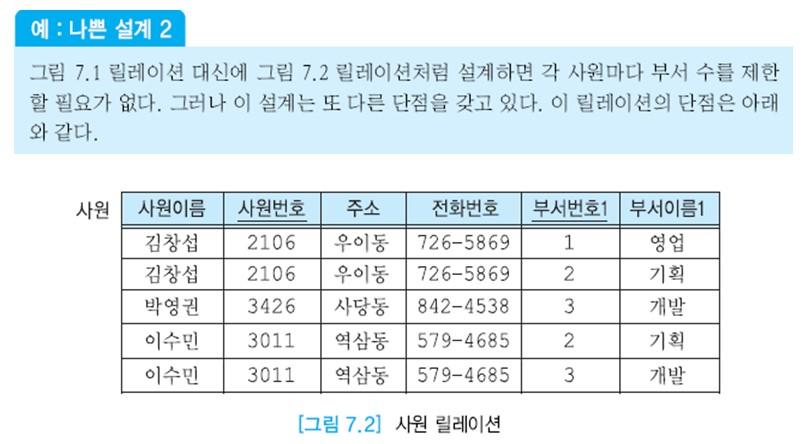
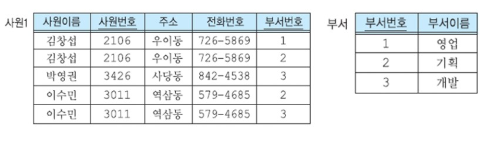

# 정규화 개요

좋은 관계 데이터베이스 스키마를 설계하는 목적은 정보의 중복과 갱신 이상이 생기지 않도록 하고, 정보의 손실을 막으며, 실세계를 훌륭하게 나타내고,  
애트리뷰트들간의 관계가 잘 표현되는 것을 보장하며, 어떤 무결성 제약조건의 시행을 간단하게 하며, 아울러 효율성 측면도 고려하는 것이다.  
실세계를 훌륭하게 나타낸 설계는 직관적으로 이해하기 쉬우며, 미래의 성장에 잘 대비할 수 있는 설계를 의미한다.  
먼저 갱신 이상이 발생하지 않도록 노력하고, 그 다음에 효율성을 고려한다.

ER 데이터 모델을 기반으로 고수준의 스키마를 생성하고, 이 설계를 릴레이션의 집합으로 사상한 후에 함수적 종속성을 기반으로 릴레이션들을 재구성한다.  
릴레이션을 재구성할 때 릴레이션을 어떻게 분해하는가에 따라 좋은 분해와 나쁜 분해로 구분할 수 있다. 나쁜 분해는 정보의 손실을 초래한다.  
좋은 분해에서는 분해된 릴레이션들을 조인하면 원래의 릴레이션을 만들어낼 수 있다.

관계 데이터 모델을 제안한 E. F. Codd는 검색 및 갱신 문제를 유발하는 릴레이션의 구조적인 특징들을 밝혀냈다.  
정보의 중복은 나쁜 릴레이션 스키마로부터 발생되는 많은 문제들의 원인이 된다.  
아래의 문제들 중에서 수정 이상, 삽입 이상, 삭제 이상을 총칭하여 갱신 이상이라고 부른다.

- 정보의 중복

  정보의 중복은 동일 정보를 두 곳 이상에 저장하는 것을 말한다.

- 수정 이상(modification anomaly)

  반복된 데이터 중에 일부만 수정하면 데이터의 불일치가 발생한다.

- 삽입 이상(insertion anomaly)

  불필요한 정보를 함께 저장하지 않고는 어떤 정보를 저장하는 것이 불가능하다.

- 삭제 이상(deletion anomaly)

  유용한 정보를 함께 삭제하지 않고는 어떤 정보를 삭제하는 것이 불가능하다.

```
예: 나쁜설계1
아래 그림과 같은 구조와 내용을 갖는 사원 릴레이션으로부터 설계를 시작한다고 가정해보자.
그림의 사원 릴레이션은 회사의 사원에 관한 정보를 저장하는 릴레이션이다.
이 회사에서는 각 사원이 두 개까지의 부서에 속할 수 있다.
```


```
각 사원마다 존재하는 하나의 투플은 그 사원이 속한 부서에 관한 정보를 두 개까지 나타낸다.
예를 들어, 김창섭 사원은 영업부와 기획부 두 곳에서 근무하고 있다.
현재 한 부서에만 속해 있던 사원 박영권이 또 다른 부서에도 발령을 받으면 박영권에 관한 정보(사원이름, 사원번호, 주소, 전화번호)는 반복할 필요 없이, 기존의 투플에 부서 정보를 추가로 나타내면 된다.
그러나 이 릴레이션에는 심각한 단점들이 있다.
첫째, 릴레이션의 투플이 길고 다루기 힘들다.
둘째, 각 사원마다 두 개까지의 부서에 속할 수 있도록 릴레이션을 생성했는데, 회사의 방침이 바뀌어 사원이 세 개 이상의 부서에 속할 수 있게 되면 어떻게 처리할 것인가?
SQL의 ALTER TABLE문을 사용하여 사원 릴레이션에 부서에 관한 애트리뷰트를 추가하거나, 더 많은 부서 정보를 가진 새로운 사원 릴레이션을 생성한 후에 기존의 사원 릴레이션의 투플들을 읽어서 새로운 릴레이션에 삽입하고, 기존의 사원 릴레이션은 제거해야 한다.
셋째, 각 사원이 속한 부서의 평균 개수가 각 사원이 속할 수 있는 최대 부서 수보다 적을 때는 부서 정보에 널값이 들어 있는 경우가 많아지므로 기억 장소 낭비가 초래된다.
```


```
예: 나쁜설계2
나쁜설계1의 릴레이션 대신에 아래 그림의 릴레이션처럼 설계하면 각 사원마다 부서 수를 제한할 필요가 없다.
그러나 이 설계는 또 다른 단점을 갖고 있다. 이 릴레이션의 단점은 아래와 같다.
```



```
정보의 중복
각 사원이 속한 부서 수만큼 동일한 사원의 투플들이 존재하므로 사원이름, 사원번호, 주소, 전화번호 등이 중복되어 저장 공간이 낭비된다.
예를 들어, 이수민이 두 개의 부서에 속하므로 사원번호가 3011, 주소가 역삼동, 전화번호가 579-4685라는 사실이 두 번 기록된다.

수정 이상
만일 어떤 부서의 이름이 바뀔 때 이 부서에 근무하는 일부 사원 투플에서만 부서이름을 변경하면 데이터베이스가불일치 상태에 빠진다.
예를 들어, 부서번호가 2인 기획부의 이름이 총무부로 바뀌면 두 번째 투플과 네 번째 투플에서 부서이름을 변경해야 한다.

삽입 이상
만일 어떤 부서를 신설했는데 아직 사원을 한명도 배정하지 않았다면 이 부서에 관한 정보를 입력할 수 없다.
왜냐하면 이 릴레이션의 기본 키가 (사원번호, 부서번호)이므로 사원번호가 기본 키의 구성요소인데,
엔티티 무결성 제약조건에 의해 사원번호가 널값을 가질 수 없기 때문이다.
예를 들어, 홍보부를 신설하여 릴레이션에 삽입하려면 홍보부에 근무하는 사원이 최소한 한 명 이상 존재해야 한다.

삭제 이상
만일 어떤 부서에 속한 사원이 단 한 명이 있는데, 이 사원에 관한 투플을 삭제하면 이 사원이 속한 부서에 관한 정보도 릴레이션에서 삭제된다.
예를 들어, 릴레이션에서 김창섭 투플을 삭제하면 부서번호가 1인 부서의 이름이 영업부라는 사실도 함께 삭제된다.
```


앞의 두 가지 설계 예에서 설명한 바와 같이, 나쁘게 설계된 릴레이션 또는 정규화 되지 않은 릴레이션들은 저장 공간을 낭비하고, 세 가지 갱신 이상을 유발하게 된다.  
정규화는 주어진 릴레이션 스키마를 함수적 종속성과 기본 키를 기반으로 분석하여, 원래의 릴레이션을 분해함으로써 중복과 세 가지 갱신 이상을 최소화하는 것이다.

정규화가 진행되면 기존의 릴레이션이 분해된다. 릴레이션의 분해는 하나의 릴레이션을 두 개 이상의 릴레이션으로 나누는 것이다.  
릴레이션의 분해는 필요한 경우에는 분해된 릴레이션들로부터 원래의 릴레이션을 다시 구할 수 있음을 보장해야 한다는 원칙을 기반으로 하므로  
두 릴레이션으로부터 얻을 수 있는 정보는 원래의 릴레이션이 갖고 있던 정보와 정확하게 일치해야 한다.  
중복을 감소시키고 어떤 정보도 잃지 않으면서 기존의 정보를 데이터베이스 내의 다른 정보로부터 유도할 수 있다는 것이다.  
분해를 잘못하면 두 릴레이션으로부터 얻을 수 있는 정보가 원래의 릴레이션이 나타내던 정보보다 적을 수도 있고 많을 수도 있다.

릴레이션의 분해는 릴레이션에 존재하는 함수적 종속성에 관한 지식을 기반으로 한다.

```
예: 릴레이션 분해
앞에서 살펴본 나쁜 설계2의 사원 릴레이션에 존재하는 좋지 않은 특성들은 바람직한 구조를 갖는 릴레이션들로 분해함으로써 해결할 수 있다.
즉 앞에서의 사원 릴레이션을 아래 그림의 사원1 릴레이션과 부서 릴레이션으로 분해한다. 부서 릴레이션은 각 부서를 한 개의 투플로 나타낸다.
사원1 릴레이션과 부서 릴레이션을 조인한 결과는 원래의 사원 릴레이션이 나타내는 정보와 일치한다.
```



