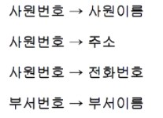
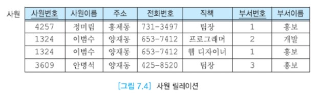
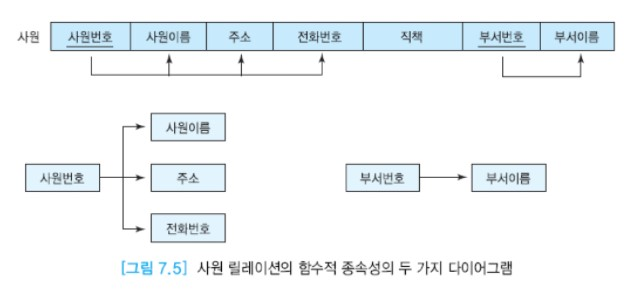
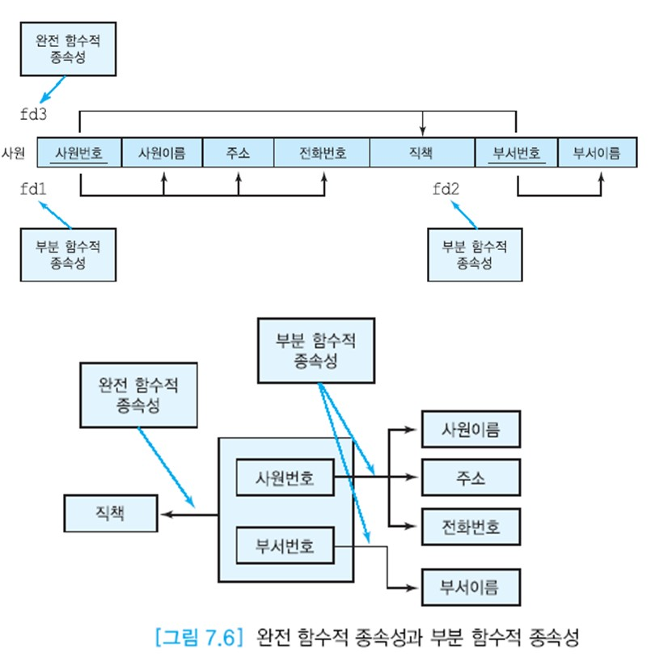
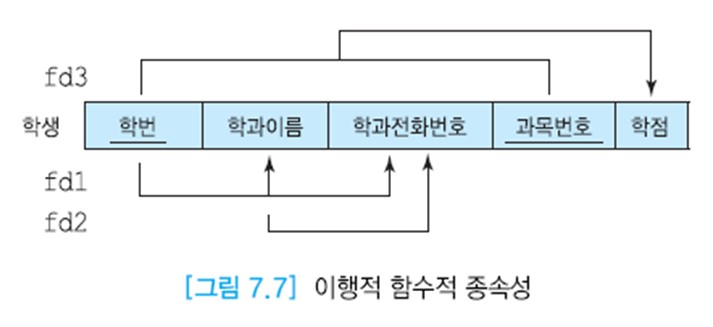

# 함수적 종속성

__함수적 종속성(FD: Functional Dependency)__ 의 개념은 정규화 이론의 핵심이다. 함수적 종속성은 관계 데이터 모델에서 가장 중요한 제약조건의 하나이다.  
함수적 종속성에 관한 지식은 갱신 이상과 중복을 제거하기 위해 데이터베이스 스키마를 설계하는 데 필수적이다.   
ER 다이어그램이모든 함수적 종속성들을 나타내지는 못한다.

함수적 종속성은 릴레이션의 애트리뷰트들의 의미로부터 결정된다.  
함수적 종속성은 릴레이션 스키마에 대한 주장이지 릴레이션의 특정 인스턴스에 대한 주장이 아니다.  
릴레이션의 상태에 포함될 수 있는 모든 가능한 투플에 대한 제약조건이다.  
함수적 종속성은 릴레이션의 가능한 모든 인스턴스들이 만족해야 한다.  
어떤 릴레이션 인스턴스가 주어졌을 때 이 인스턴스가 어떤 함수적 종속성을 위반하는지 검사할 수 있지만 함수적 종속성이 모든 릴레이션 인스턴스에서 성립하는지는 알 수 없다.  
함수적 종속성 제약조건을 만족하는 릴레이션의 인스턴스를 합법적인 인스턴스라고 부른다.

실세계에 대한 지식과 응용의 의미를 기반으로 어떤 함수적 종속성들이 존재하는가를 파악해야 한다.  
정규화에서 가장 중요한 작업의 하나는 함수적 종속성들을 찾아내고 기록하는 것이다. 모든 함수적 종속성들을 찾아내면 실세계를 보다 훌륭하게 모델링 할 수 있다.

함수적 종속성은 제2정규형부터 BCNF까지 적용된다. 간단한 함수적 종속성 구조를 가지는 소수의 릴레이션들에는 사용자가 직접 수작업으로 정규화를 적용할 수 있지만  
복잡한 함수적 종속성 구조를 갖는 많은 수의 릴레이션들이 포함된 대규모 데이터베이스에 대해서는 CASE 도구를 사용하여 정규화를 진행하는 것이 바람직하다.

## 목차

- [결정자(determinant)](#결정자determinant)
- [함수적 종속성](#함수적-종속성)
- [완전 함수적 종속성(FFD: Full Functional Dependency)](#완전-함수적-종속성ffd-full-functional-dependency)
- [이행적 함수적 종속성(transitive FD)](#이행적-함수적-종속성transitive-fd)


## 결정자(determinant)

어떤 애트리뷰트의 값은 다른 애트리뷰트의 값을 고유하게 결정할 수 있다.  
아래 그림의 사원 릴레이션에서 사원번호는 사원이름을 고유하게 결정한다. 또한 사원번호는 주소와 전화번호도 고유하게 결정한다.  
예를 들어, 사원번호의 값 4257이 주어지면 사원이름이 정미림, 주소가 홍제동, 전화번호가 731-3497인 것을 알 수 있다.  
이에 반해서 주소가 양재동일 때 사원이름이 이범수라고 말할 수 없다. 왜냐하면 주소가 양재동일 때 사원이름이 안명석일 수도 있기 때문이다.  
따라서 주소는 사원이름을 고유하게 결정하지 못한다.

결정자는 주어진 릴레이션에서 다른 애트리뷰트(또는 애트리뷰트들의 집합)를 고유하게 결정하는 하나 이상의 애트리뷰트를 의미한다.  
예를 들어, 사원 릴레이션에서 사원번호는 사원이름, 주소, 전화번호의 결정자이다. 또한 부서번호는 부서이름의 결정자이다.  
결정자를 아래와 같이 표기하고, 이를 "A가 B를 결정한다(또는 B가 A에 의해 결정된다. 또는 A는 B의 결정자이다.)"라고 말한다.

__A → B__

릴레이션 R에서 애트리뷰트 A가 B의 결정자이면 임의의 두 투플에서 A 애트리뷰트의 값이 같으면 B 애트리뷰트의 값도 같아야 한다.  |
A는 릴레이션의 키 애트리뷰트이거나 아닐 수 있다. 또한 A와 B는 복합 애트리뷰트일 수 있다.  
앞의 표기법을 사용하여 사원 릴레이션의 일부 결정자를 다음과 같이 표기한다.






## 함수적 종속성

만일 애트리뷰트 A가 애트리뷰트 B의 결정자이면 B가 A에 함수적으로 종속한다고 말한다.  
다른 말로 표현하면, 주어진 릴레이션 R에서 애트리뷰트 B가 애트리뷰트 A에 함수적으로 종속하는 필요충분조건은 각 A 값에 대해 반드시 한 개의 B 값이 대응된다는 것이다.  
하나의 함수적 종속성은 실세계의 의미에 따라 바뀐다. 어떤 응용에서는

__이름 → 주소__

가 성립할 수 있고, 또 다른 응용에서는

__이름 → 주소__

가 성립하지 않을 수 있다.

위의 사원 릴레이션 그림에서 각 사원은 한 개 이상의 부서에 속할 수 있다. 한 사원이 여러 부서에 속할 때에는 각 부서에서 고유한 직책을 맡는다.  
예를 들어, 이범수는 개발부에서는 프로그래머로, 홍보부에서는 웹 디자이너로 일한다.

사원번호가 사원이름, 주소, 전화번호의 결정자이므로 사원이름, 주소, 전화번호는 사원번호에 함수적으로 종속한다.  
그러나 직책은 (사원번호, 부서번호)에 함수적으로 종속하지, 사원번호에 함수적으로 종속하지는 않는다. 함수적 종속성을 아래 그림처럼 두 가지 형태의 다이어그램으로 나타내기도 한다.




## 완전 함수적 종속성(FFD: Full Functional Dependency)

주어진 릴레이션 R에서 애트리뷰트 B가 애트리뷰트 A에 함수적으로 종속하면서 애트리뷰트 A의 어떠한 진부분 집합에도  
함수적으로 종속하지 않으면 애트리뷰트 B가 애트리뷰트 A에 완전하게 함수적으로 종속한다고 말한다. 여기서 애트리뷰트 A는 복합 애트리뷰트이다.  
앞의 그림 7.4 사원 릴레이션에서 사원이름, 주소, 전화번호는 사원 번호에 함수적으로 종속하므로 (사원번호, 부서번호)에는 완전하게 함수적으로 종속하지 않는다.  
완전하게 함수적으로 종속하지 않으면 부분 함수적 종속성을 갖는다고 말한다.

어떤 사원의 직책은 그 사원이 속한 부서에 따라 달라지므로 직책은 (사원번호, 부서번호)에 완전하게 함수적으로 종속한다.

```
예: 완전 함수적 종속성과 부분 함수적 종속성
아래 그림에서 fd3은 완전 함수적 종속성을 나타내고, fd1과 fd2는 부분 함수적 종속성을 나타낸다.
```




## 이행적 함수적 종속성(transitive FD)

한 릴레이션의 애트리뷰트 A, B, C가 주어졌을 때 애트리뷰트 C가 이행적으로 A에 종속한다.(A→C)는 것의 필요충분조건은

__A → B Λ B → C__

가 성립하는 것이다. A가 릴레이션의 기본 키라면 키의 정의에 따라 A → B와 A → C가 성립한다.  
만일 C가 A외에 B에도 함수적으로 종속한다면 C는 A에 직접 함수적으로 종소갛면서 B를 거쳐서 A에 이행적으로 종속한다.  
이행적 종속성이 존재하는 릴레이션에는 키가 아닌 애트리뷰트가 적어도 두 개 이상 있어야 한다.

```
예: 이행적 종속성
아래 그림의 학생 릴레이션을 고려해보자. 각 학생은 한 학과에만 속하고 각 학과마다 전화번호가 고유하다고 가정하자.
학번은 학과이름을 결정한다. 각 학생은 여러 과목을 수강할 수 있고, 각 과목마다 학점을 받는다.
이 릴레이션에 존재하는 함수적 종속성들은 아래 그림과 같다. 이 그림에서 fd2가 이행적 함수적 종속성이다.
즉 어떤 학생의 학번을 알면 이 학생이 속한 학과이름과 학과전화번호를 알 수 있다.
또한 학과이름을 알면 학과전화번호를 알 수 있다.따라서 학과 전화번호는 학번에 이행적으로 종속한다.
```



