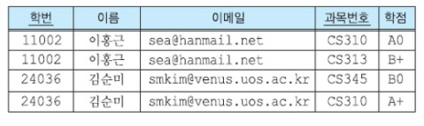
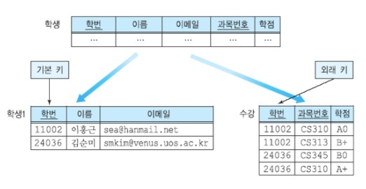
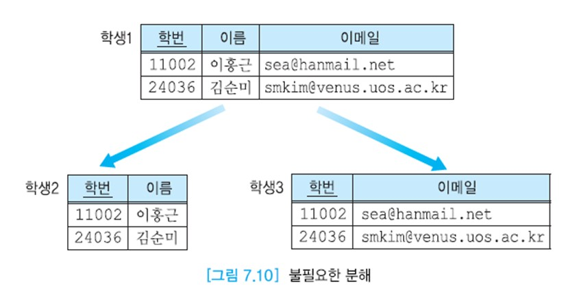
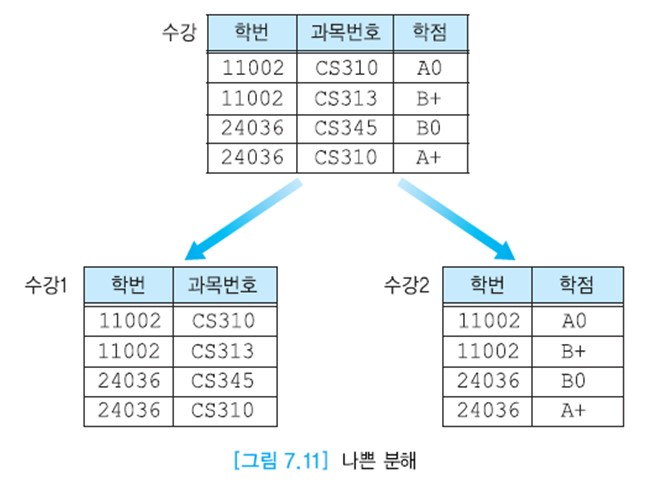
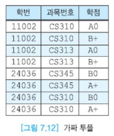

# 릴레이션 분해(decomposition)

릴레이션 분해는 하나의 릴레이션을 두 개 이상의 릴레이션으로 나누는 것이다.  
릴레이션을 분해하면 중복이 감소되고 갱신 이상이 줄어드는 장점이 있는 반면에, 바람직하지 않은 문제들을 포함하여 몇 가지 잠재적인 문제들을 야기할 수 있다.  
첫째, 일부 질의들의 수행 시간이 길어진다. 릴레이션이 분해되기 전에는 조인이 필요 없는 질의가 분해 후에는 조인을 필요로 하는 질의로 바뀔 수 있다.  
둘째, 분해된 릴레이션들을 사용해여 원래 릴레이션을 재구성하지 못할 수 있다.  
셋째, 어떤 종속성을 검사하기 위해서는 분해된 릴레이션들의 조인이 필요할 수 있다. 따라서 이런 잠재적인 문제와 중복성 감소 간의 균형을 고려해야 한다.

아래 그림의 학생 릴레이션을 사용하여 이런 잠재적인 문제들을 좀 더 자세하게 살펴보자.  
그림의 학생 릴레이션은 다섯 개의 애트리뷰트로 이루어진다. 각 학생마다 이메일 주소가 고유하다.  
한 학생은 여러 개의 과목을 수강하고 각 수강 과목마다 학점을 받는다.




학생 릴레이션에서 다음과 같은 함수적 종속성들이 만족된다.

__학번 → 이름, 이메일__  
__이메일 → 학번, 이름__  
__(학번, 과목번호) → 학점__

한 학생이 여러 과목을 수강하면 이 학생의 투플들에서 (학번, 이름, 이메일)이 중복해서 나타나며 갱신 이상이 발생할 수 있다.  
정보의 중복을 해결하기 위해서 학생 릴레이션을 아래 그림과 같이 두 개의 릴레이션 학생1과 수강으로 분해해보자.  
두 릴레이션으로부터 학생 릴레이션을 다시 얻으려면 자연 조인을 수행한다. 학생1 릴레이션과 수강 릴레이션에서 학번은 기본 키와 외래 키 관계이므로  
두 릴레이션을 조인하면 원래의 학생 릴레이션에 들어 있는 정보를 완전하게 얻을 수 있다. 이런 분해를 __무손실 분해(lossless decomposition)__ 라 한다.  
여기서 손실은 투플의 손실이 아니라 정보의 손실을 의미한다.  
정보의 손실은 원래의 릴레이션을 분해한 후에 생성된 릴레이션들을 조인한 결과에 들어 있는 정보가 원래의 릴레이션에 들어 있는 정보보다 적거나 많은 것을 모두 포함한다.



학생1 릴레이션을 아래 그림처럼 또 다시 분해하는 것은 불필요하다.  
학생1 릴레이션의 기본 키는 학번이고 이름과 이메일이 학번에 직접 함수적으로 종속하므로  
학생1 릴레이션을 추가로 분해하면 학번만 불필요하게 두 번 저장된다.  
또한 학생1 릴레이션에는 불필요한 중복이 존재하지도 않는다.



수강 릴레이션을 아래 그림처럼 분해하면 과목번호와 학점 간의 연관이 표현되지 않으므로 나쁜 분해이다.  
또한 수강1과 수강2 릴레이션을 조인하면 수강 릴레이션에 들어 있는 투플보다 많은 투플이 생성된다. 따라서 이 분해는 무손실 분해가 아니다.  
수강 릴레이션에 없는 투플이 수강1과 수강2 릴레이션의 조인 결과에 생긴 것을 __가짜 투플(spurious tuple)__ 이라고 말한다.



```
예: 가짜 투플
위 그림 나쁜 분해의 수강1 릴레이션과 수강2 릴레이션을 학번 애트리뷰트를 사용하여 자연 조인하면
아래 그림과 같은 결과를 얻는다. 이 릴레이션에서 파란색으로 표시한 투플들을 위 그림 나쁜 분해의 원래 릴레이션인 수강 릴레이션에 존재하지 않는 투플들이므로 가짜 투플에 해당한다.
```



