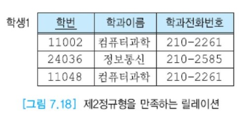
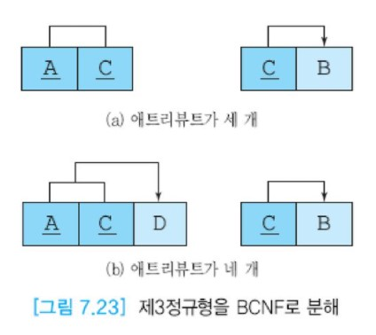

# 제1정규형, 제2정규형, 제3정규형, BCNF

정규형에는 제1정규형, 제2정규형, 제3정규형, BCNF, 제4정규형, 제5정규형 등이 있지만  
일반적으로 데이터베이스를 설계할 때 3NF 또는 BCNF까지만 고려하므로 BCNF까지만 살펴본다.


## 목차

- [제1정규형]
- [제2정규형]
- [제3정규형]
- BCNF


## 제1정규형

- 제1정규형의 정의

  한 릴레이션 R이 제1정규형을 만족할 필요충분조건은 릴레이션 R의 모든 애트리뷰트가 원잣값만을 갖는다는 것이다.  
  즉 릴레이션의 모든 애트리뷰트에 __반복 그룹(repeating group)__ 이 나타나지 않으면 제1정규형을 만족한다.  
  반복 그룹은 한 개의 기본 키값에 대해 두 개 이상의 값을 가질 수 있는 애트리뷰트를 의미한다.\

아래 그림의 학생 릴레이션에서 과목 번호 애트리뷰트는 각 학생이 수강하는 여러 과목들의 집합 값을 가지므로 제1정규형을 만족하지 못한다.  
릴레이션의 정의에 따르면 릴레이션의 각 애트리뷰트는 원잣값만 가질 수 있으므로, 모든 릴레이션은 적어도 제1정규형을 만족한다.  
실제로 아래 그림은 릴레이션이 아니다. 객체 지향 데이터베이스에서는 제1정규형을 완화하여 각 애트리뷰트가 원잣값이 아닌 집합, 리스트, 배열 등을 가질 수 있다.


제1정규형을 만족하지 않는 위 그림을 제1정규형으로 변환하는 한 가지 방법은 반복 그룹 애트리뷰트에 나타나는 집합에 속한 각 값마다 하나의 투플로 표현하는 것이다.  
아래 그림은 이런 방법을 적용하여 위 그림을 제1정규형을 만족하는 릴레이션으로 변환한 예를 보여준다.  
아래 그림의 제1정규형은 정보가 많이 중복되므로 갱신 이상을 유발한다.


제1정규형을 만족하지 않는 7.13 반복그룹을 1정규형으로 변환하는 또 다른 방법은 모든 반복 그룹 애트리뷰트들을 분리해서 새로운 릴레이션에 넣는다.  
원래 릴레이션의 기본 키를 새로운 릴레이션에 애트리뷰트로 추가한다.  
원래 릴레이션의 기본 키가 새로운 릴레이션에서도 항상 키가 되는 것은 아니다.  
아래 그림은 이런 방법을 적용하여 7.13 반복그룹을 제1정규형을 만족하는 릴레이션으로 변환한 예를 보여준다.


## 제2정규형


위 그림의 학생 릴레이션은 모든 애트리뷰트가 원잣값을 가지므로 제1정규형을 만족한다.  
이 릴레이션에 어떤 갱신 이상이 일어날 수 있는지 알아보자.  
한 한생이 여러 과목을 수강할 수 있으므로 이 릴레이션의 기본 키는 (학번, 과목번호)이다.

- 수정이상

  한 학과에 소속한 학생 수만큼 그 학과의 전화번호가 중복되어 저장되므로 여러 학생이 소속된 학과의 전화번호가 변경되었을 때  
  그 학과에 속한 모든 학생들의 투플에서 전화번호를 수정하지 않으면 데이터베이스의 일관성이 유지되지 않는다.  
  예를 들어, 컴퓨터학과의 전화번호가 바뀌었는데 첫 번째 투플에서만 수정하면 데이터베이스의 일관성이 깨진다.

- 삽입 이상

  한 명의 학생이라도 어떤 학과에 소속되지 않으면 이 학과에 관한 투플을 삽입 할 수 없다.  
  왜냐하면 학번이 기본 키의 구성요소인데 엔티티 무결성 제약조건에 따라 기본 키에 널값을 입력할 수 없기 때문이다.  
  예를 들어, 멀티미디어학과를 신설했는데 아직 학생을 선발하지 않았으면 이 학과에 관한 정보를 7.16 그림의 릴레이션에 삽입 할 수 없다.

- 삭제 이상

  어떤 학과에 소속된 마지막 학생 투플을 삭제하면 이 학생이 소속된 학과에 관한 정보도 삭제된다.  
  예를 들어, 정보통신학과에는 한 명의 학생만 소속되어 있는데, 이 학생의 투플을 삭제하면 정보통신학과에 관한 정보도 함께 삭제된다.

이와 같은 갱신 이상이 생기는 이유는 기본 키에 대한 부분 함수적 종속성이 학생 릴레이션에 존재하기 때문이다.  
즉 학과 이름과 학과전화번호는 학번에 부분적으로 종속한다.  
그림 7.17(a)는 그림 7.17의 학생 릴레이션에 존재하는 함수적 종속성들을 나타낸다.  
fd2는 완전 함수적 종속성을 나타내고, fd1은 부분 함수적 종속성을 나타낸다.

따라서 학생 릴레이션을 그림 7.17(b)와 같이 학생1 릴레이션과 수강 릴레이션으로 나누면 부분 함수적 종속성이 없어지며,  
두 릴레이션은 제2정규형을 만족한다. 그림 7.17(b)의 수강 릴레이션에서 학점은 기본 키에 완전하게 함수적으로 종속한다.  
또한 위에 기술한 갱신 이상이 발생하지 않는다.

두 릴레이션으로 분해할 때 원래 릴레이션에서 기본 키에 부분적으로 종속되는 애트리뷰트(예: 그림7.17(a)에서  
학과이름과 학과전화번호)들은 한 릴레이션(예: 그림 7.17(b)에서 학생1 릴레이션)에 속하도록 한다.  
이 애트리뷰트들이 부분적으로 종속됐던 애트리뷰트(예: 그림 7.17(a)에서 학번)가 이 릴레이션의 기본 키가 된다.  
원래 릴레이션의 나머지 애트리뷰트들이 또 다른 릴레이션(예: 그림 7.17(b)에서 수강)에 포함되며 학번 애트리뷰트를 외래 키로 이 릴레이션에 포함시킨다.  
학생1 릴레이션의 기본 키는 한 애트리뷰트로 이루어지므로 제2정규형을 만족한다.  
수강 릴레이션의 기본 키는 복합 애트리뷰트인 (학번, 과목번호)이지만 학점 애트리뷰트가 기본키에 완전하게 함수적으로 종속하므로 제2정규형을 만족한다.


- 제2정규형의 정의

  한 릴레이션 R이 제2정규형을 만족할 필요충분조건은 릴레이션 R이 제1정규형을 만족하면서,  
  어떤 후보 키에도 속하지 않는 모든 애트리뷰트들이 R의 기본 키에 완전하게 함수적으로 종속하는 것이다.

  기본 키가 두 개 이상의 애트리뷰트로 구성되었을 경우에만 제1정규형이 제2정규형을 만족하는가를 고려할 필요가 있다.  
  즉 기본 키가 한 개의 애트리뷰트로 이루어진 릴레이션이 제1정규형을 만족하면 제2정규형도 만족한다.


## 제3정규형

아래 그림의 학생1 릴레이션의 기본 키는 한 애트리뷰트인 학번이므로 제2정규형을 만족한다.  
이 릴레이션에 어떤 갱신 이상이 일어날 수 있는지 알아보자.



- 수정 이상

  여러 학생이 소속된 학과의 전화번호가 변경되었을 때 그 학과에 속한 모든 학생들의 투플에서 전화번호를 수정하지 않으면 데이터베이스의 일관성이 유지되지 않는다.

- 삽입 이상

  어떤 학과를 신설해서 아직 소속 학생이 없으면 그 학과의 정보를 입력할 수 없다.  
  왜냐하면 학번이 기본 키인데 엔티티 무결성 제약조건에 따라 기본 키에 널값을 입력할 수 없기 때문이다.

- 삭제 이상

  어떤 학과에서 마지막 학생의 투플이 삭제되면 그 학과의 전화번호도 함께 삭제된다.


이와 같은 갱신 이상이 생기는 이유는 학생1 릴레이션에 이행적 종속성이 존재하기 때문이다.  
제2정규형을 만족하는 릴레이션 스키마에 이행적 종속성이 존재할 수 있다. 즉 키가 아닌 애트리뷰트에 하나 이상의 애트리뷰트가 함수적으로 종속할 수 있다.  
학생1 릴레이션에서 학과이름과 학과전화번호는 기본 키인 학번에 함수적으로 종속하고, 학과전화번호는 학과이름에도 함수적으로 종속한다.  
즉 아래와 같은 이행적 종속성이 존재한다.

학번 → 학과이름 Λ 학과이름 → 학과전화번호 Λ 학번 → 학과전화번호


위 그림 7.19(a)에서 fd2가 이행적 종속성이다.  
따라서 학생1 릴레이션을 그림 7.19(b)와 같이 학생2와 학과 릴레이션으로 나누면 이행적 종속성이 없어지며, 두 릴레이션은 제3정규형을 만족한다.  
또한 앞에 기술한 갱신 이상이 발생하지 않는다.  
두 릴레이션으로 분해할 때 원래 릴레이션에서 기본 키가 아닌 애트리뷰트에 종속되는 애트리뷰트(예: 그림 7.19(a)에서 학과전화번호),  
키가 아니면서 다른 애트리뷰트를 결정하는 애트리뷰트(예: 그림 7.19(a)에서 학과이름)를 새로운 릴레이션에 속하도록 한다.  
키가 아니면서 다른 애트리뷰트를 결정하는 애트리뷰트는 새로운 학과 릴레이션의 기본 키가 된다.  
원래 릴레이션의 나머지 애트리뷰트들이 또 다른 릴레이션(예: 그림 7.19(b)에서 학생2)에 포함되며 학과이름 애트리뷰트를 외래 키로 이 릴레이션에 포함시킨다.  
구조적으로 제2정규형은 제1정규형보다 좋고, 제3정규형은 제2정규형보다 좋다.

- 제3정규형의 정의

  한 릴레이션 R이 제3정규형을 만족할 필요충분조건은 릴레이션 R이 제2정규형을 만족하면서,  
  키가 아닌 모든 애트리뷰트가 릴레이션 R의 기본 키에 이행적으로 종속 하지 않는 것이다.


## BCNF

BCNF를 만족하는 릴레이션 스키마들의 집합에서는 갱신 이상이 발생하지 않으므로 실제적인 정규화의 목표이다.  
BCNF를 만족하는 릴레이션에서는 중복이 존재하지 않으며, 갱신 이상도 발생하지 않는다.  
아래 그림의 수강 릴레이션에서 각 학생은 여러 과목을 수강할 수 있고, 각 강사는 한 과목만 가르친다. 이 릴레이션의 기본 키는 (학번, 과목)이다.  
키가 아닌 강사 애트리뷰트가 기본 키에 완전하게 함수적으로 종속하므로 제2정규형을 만족하고,  
키가 아닌 애트리뷰트가 기본 키에 직접 종속하므로 제3정규형도 만족한다.


이 릴레이션에서는 아래 그림과 같은 함수적 종속성들이 존재한다. 이 릴레이션에 어떤 갱신 이상이 일어날 수 있는지 알아보자.


- 수정 이상

  여러 학생이 수강 중인 어떤 과목의 강사가 변경되었을 때 그 과목을 수강하는 모든 학생들의 투플에서 강사를 수정하지 않으면 데이터베이스의 일관성이 유지되지 않는다.  
  예를 들어, 위 그림 7.20에서 이영준 강사가 가르치는 데이터베이스를 두 명의 학생이 수강하고 있는데,  
  강사가 김민정으로 바뀌면 첫 번째 투플과 다섯 번 째 투플에서 강사 이름을 모두 변경해야 한다.

- 삽입 이상

  어떤 과목을 신설하여 아직 수강하는 학생이 없으면 어떤 강사가 그 과목을 가르친다는 정보를 입력할 수 없다.  
  왜냐하면 학번이 기본 키를 구성하는 애트리뷰트인데 엔티티 무결성 제약조건에 따라 기본 키를 구성하는 애트리뷰트에 널 값을 입력할 수 없기 때문이다.  
  예를 들어, 정용순 강사가 데이터마이닝 과목을 처음 개설하여 아직 수강 학생을 받기 전이라면 릴레이션에 삽입할 수 없다.

- 삭제 이상

  어떤 과목을 이수하는 학생이 한 명밖에 없는데 이 학생의 투플을 삭제하면 그 과목을 가르치는 강사에 관한 정보도 함께 삭제된다.  
  예를 들어, 운영 체제 과목의 유일한 수강생인 두 번째 투플을 삭제하면 고성현 강사가 운영 체제를 가르친다는 사실도 함께 삭제된다.

이와 같은 갱신 이상이 발생하는 이유는 수강 릴레이션에서 키가 아닌 애트리뷰트가 다른 애트리뷰트를 결정하기 때문이다.  
이 릴레이션의 후보 키는 (학번, 과목)과 (학번, 강사)이다.


- BCNF의 정의

  한 릴레이션 R이 BCNF를 만족할 필요충분조건은 릴레이션 R이 제3정규형을 만족하고, 모든 결정자가 후보 키이어야 한다는 것이다.

제 3정규형을 만족하는 대부분의 릴레이션들은 BCNF도 만족한다. 하나의 후보 키만을 가진 릴레이션이 제3정규형을 만족하면 동시에 BCNF도 만족한다.  
제3정규형을 만족하지만 BCNF를 만족하지 않는 릴레이션에는 아래 그림처럼 키가 아닌 애트리뷰트가 키 애트리뷰트의 결정자인 경우가 존재한다.  
그림 7.20 수강 릴레이션에서 강사 애트리뷰트는 후보 키가 아님에도 불구하고 과목 애트리뷰트를 결정하기 때문에 BCNF가 아니다.


제3정규형을 만족하는 릴레이션(그림7.22)을 BCNF로 정규화하려면 아래 그림처럼 키가 아니면서 결정자 역활을 하는 애트리뷰트와  
그 결정자에 함수적으로 종속하는 애트리뷰트를 하나의 릴레이션에 넣는다. 이 릴레이션에서 결정자는 기본 키가 된다.  
그 다음에는 기존 릴레이션에 결정자를 남겨서 기본 키의 구성요소가 되도록 한다. 또한 이 결정자는 새로운 릴레이션에 대한 외래 키 역할도 한다.



```
예: BCNF로 정규화
그림 7.20의 수강 릴레이션을 BCNF로 정규화해보자.
그림 7.24와 같이 강사 애트리뷰트와 과목 애트리뷰트를 빼내어 새로운 릴레이션 수강2를 만든다.
이 릴레이션에서 강사 애트리뷰트가 기본 키이다. 원래의 릴레이션에는 학번 애트리뷰트와 강사 애트리뷰트가 남아 수강1 릴레이션이 된다.
강사 애트리뷰트는 수강1 릴레이션의 기본 키의 구성요소가 되면서, 수강2 릴레이션에 대한 외래 키 역할도 한다.
```


## 여러 정규형의 요약


