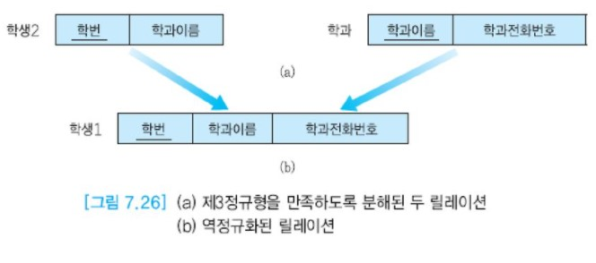

# 역정규화

앞에서 설명했듯이 정규화 단계가 진행될수록 중복이 감소하고 갱신 이상도 줄어든다.  
또한 정규화가 진전될수록 무결성 제약조건을 시행하기 위해 필요한 코드의 양이 줄어든다.  
정규화가 데이터베이스 설계의 중요한 요소이지만 높은 정규형이 항상 최선이라는 생각은 옳지 않다.  
성능상의 관점에서만 보면 높은 정규형을 만족하는 릴레이션 스키마가 최적인 것은 아니다.  
한 정규형에서 다음 정규형으로 진행될 때마다 하나의 릴레이션이 최소한 두 개의 릴레이션으로 분해된다.  
분해되기 전의 릴레이션을 대상으로 질의를 할 때는 조인이 필요 없지만 분해된 릴레이션을 대상으로  
질의를 할 때는 같은 정보를 얻기 위해서 보다 많은 릴레이션들을 접근해야 하므로 조인의 필요성이 증가한다.

```sql
예: 조인의 필요성
제2정규형을 만족하는 그림7.18의 학생1 릴레이션에서 "학번이 11002인 학생이 속한 학과의 이름과 전화번호를 검색하라."는 질의를 아래와 같은 SELECT문으로 표현한다.
한 릴레이션에서 필요한 정보를 모두 찾을 수 있으므로 조인이 필요 없다.

SELECT 학과이름, 학과전화번호
FROM 학생1
WHERE 학번 = '11002'

그러나 정규화 과정을 거쳐 그림 7.18의 릴레이션이 그림 7.19(b)처럼 두 개의 릴레이션으로 분해되면 동이랗ㄴ 정보를 찾기 위해 아래와 같이 조인을 포함한 SELECT문이 사용된다.

SELECT 학과이름, 학과전화번호
FROM 학생2, 학과
WHERE 학번 = '11002'
	  AND 학생2.학과이름 = 학과.학과이름;
```


앞에서 논의한 것처럼 조인 연산은 관계 DBMS에서 컴퓨터 시스템의 자원을 많이 사용하고,  
수행 시간이 오래 걸리는 연산이므로 앞의 예에서 두 번째 SELECT문은 첫 번째 SELECT문보다 응답 시간이 오래 걸린다.  
많은 데이터베이스 어플리케이션에서 검색 질의의 비율이 갱신 질의의 비율보다 훨씬 높으므로 검색 질의의 응답 시간을 줄이는 것이 중요하다.

때로 데이터베이스 설계자는 어플리케이션의 요구사항에 따라 데이터베이스 설계의 일부분을 역정규화함으로써  
데이터 중복 및 갱신 이상을 대가로 치르면서 성능상의 요구를 만족시키기도 한다.  
__역정규화(denormalization)__는 주어진 어플리케이션에서 빈번하게 수행되는 검색 질의들의 수행 속도를 높이기 위해서  
이미 분해된 두 개 이상의 릴레이션들을 합쳐서 하나의 릴레이션으로 만드는 작업이다. 즉 역정규화는 보다 낮은 정규형으로 되돌아가는 것이다.   
제3정규형이나 BCNF까지 릴레이션들을 정규화한 후 성능상의 요구사항을 고려하여 선별적으로 역정규화를 수행하는 것이 바람직한 전략이다.

```
예: 역정규화
그림 7.26(a)의 두 릴레이션에 대해 학번과 학과전화번호를 함께 검색하는 질의가 자주 수행된다면
제3정규형을 만족하도록 분해된 학생2와 학과 릴레이션을 자연 조인하여 그림 7.26(b)의 학생1 릴레이션처럼
한 릴레이션으로 합쳐서 역정규화를 할 수 있다. 앞서 설명한 것처럼 학생1 릴레이션은 더 이상 제3정규형을 만족하지 않는다.
따라서 제3정규형을 만족하지 못하는 릴레이션에 나타나는 정보의 중복과 갱신 이상이 존재하게 된다.
```



