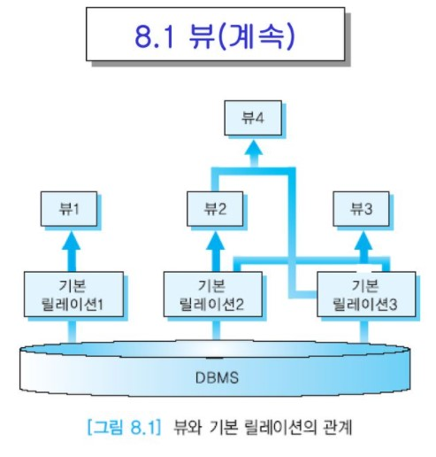
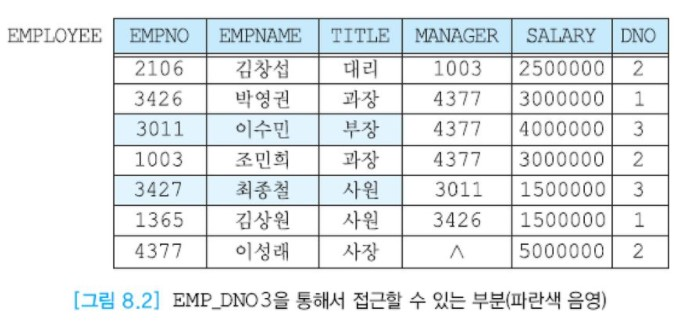

# 뷰


## 목차

- [뷰의 개요](#뷰의-개요)
- [뷰의 정의](#뷰의-정의)
- [뷰의 장점](#뷰의-장점)
- 뷰의 갱신


## 뷰의 개요

ANSI/SPARC 3단계 아키텍처에서 외부 뷰는 특정 사용자가 보는 데이터베이스의 구조라고 설명하였다.  
관계 데이터베이스에서 뷰라는 용어는 한 사용자의 전체 외부 뷰 대신에 하나의 __가상 릴레이션(virtual relation)__ 을 의미하는 데 사용된다.  
가상 릴레이션이란 실제로 투플을 갖지 않은 릴레이션이라는 뜻이다. 뷰는 기존의 __기본 릴레이션(base relation, 실제 릴레이션)__이나 또 다른 뷰에 대한 SELECT문의 형태로 정의된다.  
기본 릴레이션의 투플들은 데이터베이스에 물리적으로 저장된다. 관계 데이터베이스에서의 뷰는 자체적으로 디스크에 저장된 투플들을 갖고 있지 않지만  
사용자가 질의할 수 있는 릴레이션의 하나이다. 즉 한 사용자는 여러 개의 릴레이션과 뷰를 사용할 수 있다.

뷰는 기본 릴레이션이 나타날 수 있는 곳은 어디든지 사용될 수 있다.  
사용자에게 뷰는 기본 릴레이션과 같은 방법으로 조작할 수 있는 정상적인 릴레이션처럼 보인다.  
어떤 릴레이션으로부터 데이터를 검색하는 것과 동일한 방법으로 뷰를 통해서 데이터를 검색할 수 있다.  
뷰의 전체 내용을 검색하거나 특정 애트리뷰트와 투플들을 검색할 수 있다. 어떤 뷰에 대해서는 갱신 연산도 수행할 수 있다.  
뷰에 대한 어떤 연산도 뷰의 정의에 사용된 기본 릴레이션에 대한 연산으로 변환되어 수행된다.

뷰는 릴레이션으로부터 데이터를 검색하거나 갱신할 수 있는 __동적인 창(dynamic window)__ 의 역할을 한다.  
사용자는 이 창을 통해서 기본 릴레이션에 저장된 데이터를 볼 수 있다.  
기본 릴레이션의 투플들에 대한 갱신은 그 기본 릴레이션으로부터 유도된 뷰에 즉시 반영된다.  
뷰의 내용은 뷰를 참조하는 질의를 수행할 때마다 달라질 수 있다. 창문을 통해서 밖에 햇빛이 비치거나, 비가 오거나,  
눈이 오는 등 시시각각 변화하는 모습을 볼 수 있듯이 뷰를 통해서 기본 릴레이션의 현재 내용을 볼 수 있다.

이에 반해서 어느 시점에 SELECT문의 결과를 기본 릴레이션의 형태로 저장해놓은 것을 __스냅숏(snapshot)__이라고 부른다.  
일부 관계 DBMS들에서는 스냅숏을 구체화된 뷰(materialized view)라고 부른다.  
스냅숏은 사진을 찍은 것과 같아서 스냅숏을 정의하는 시점의 기본 릴레이션의 내용이 스냅숏에 반영된다.  
데이터베이스는 항상 현재의 상태만을 나타내므로 스냅숏을 정의한 이후에 기본 릴레이션이 갱신되면 이는 스냅숏에 반영되지 않으므로 주기적으로 내용을 __새롭게(refresh)__ 해야 한다.  
어떤 시점의 조직체의 현황, 예를 들어 몇년 몇월 시점에 근무하던 사원들의 정보, 재고 정보 등이 스냅숏으로 정의될 수 있다.

뷰를 사용하면 여러 사용자가 여러 방식으로 데이터를 볼 수 있다.  
데이터베이스가 공유 자원이므로 데이터베이스에 저장된 데이터에 관해 각 사용자에게 서로 다른 뷰를 제공하는 것이 유용하다.  
뷰는 하나의 기본 릴레이션을 사용자마다 서로 다르게 볼 수 있도록 한다.  
아래 그림에서 뷰1은 기본 릴레이션1 위에서 정의되었고, 뷰2는 기본 릴레이션2 위에서 정의되었으며, 뷰3은 기본 릴레이션2와 기본 릴레이션3을 사용하여 정의되었다.  
뷰는 또 다른 뷰를 참조할 수 있다. 아래 그림에서 뷰4는 뷰2와 기본 릴레이션3 위에서 정의되었다.




## 뷰의 정의

뷰를 정의하는 SQL문의 구문은 다음과 같다.

```sql
CREATE VIEW 뷰이름 [(애트리뷰트(들))]
AS SELECT문
[WITH CHECK OPTION];
```

CREATE VIEW 다음에 뷰의 이름을 지정한다. 뷰의 이름 다음에 애트리뷰트들을 생략하면  
뷰를 정의하는 데 사용된 SELECT문의 SELECT절에 열거된 애트리뷰트들의 이름과 동일한 애트리뷰트들이 뷰에 포함된다.  
뷰를 정의할 때 기본 릴레이션에서 사용된 애트리뷰트들의 이름 대신에 다른 이름을 부여할 수 있다.  
또한 기본 릴레이션의 애트리뷰트들의 순서와 다르게 명시해도 무방하다.

뷰를 정의하는 SELECT절에 산술식 또는 집단 함수에 사용된 애트리뷰트가 있는 경우,  
뷰의 정의에 조인이 포함되어 있고 두 개 이상의 다른 릴레이션으로부터 가져온 애트리뷰트들의 이름이 같아서  
뷰에서 두 개 이상의 애트리뷰트의 이름이 같게 되는 경우에는 뷰를 정의할 때 모든 애트리뷰트들의 이름을 지정해야 한다.

키워드 AS 다음에 뷰를 정의하는 SELECT문이 위치한다. 여러 단계로 중첩된 SELECT문, 여러 릴레이션을 참조하는 SELECT문도 가능하다.  
WITH CHECK OPTION은 뷰에 투플을 삽입할 때의 조건을 명시한다. 데이터베이스에는 뷰를 정의한 SELECT문이 저장된다.

뷰를 정의하려면 뷰를 만들 수 있는 권한을 데이터베이스 관리자로부터 받아야 하며 뷰 정의에서 참조되는 릴레이션이나 뷰에 대해 적절한 사용권한을 갖고 있어야 한다.

오라클과 같은 관계 DBMS에서는 뷰의 이름과 기본 릴레이션의 이름이 같을 수 없다.  
뷰를 정의하는 SELECT문에는 ORDER BY절이 포함될 수 없다. 그러나 사용자가 뷰로부터 데이터를 검색하는 SELECT문에는 물론 ORDER BY절을 명시할 수 있다.

```
예1: 한 릴레이션 위에서 뷰를 정의
4장의 그림 4.8의 EMPLOYEE 릴레이션에 대해서 "3번 부서에 근무하는 사원들의 사원번호, 사원이름, 직책으로 이루어진 뷰"를 정의해보자.
아래의 뷰의 정의에는 뷰의 애트리뷰트들을 별도로 명시했기 때문에 뷰에는 EMPNO, EMPNAME, TITLE의 세 애트리뷰트가 포함된다.

CREATE VIEW EMP_DNO3 (ENO, ENAME, TITLE)
AS SELECT EMPNO, EMPNAME, TITLE
FROM EMPLOYEE
WHERE DNO = 3;

앞서 설명한 바와 같이 EMP_DNO3에는 실제로 투플들이 저장되어 있지는 않지만 뷰 EMP_DNO3을 통해서 기본 릴레이션 EMPLOYEE를 접근하면
아래 그림과 같이 파란색 음영으로 표시한 부분만 접근할 수 있다. 뷰의 정의에 부합되는 투플(4293, '정용순', '과장', 3011 3000000, 2)이 기본 릴레이션에 삽입되면 뷰를 통해서 그 투플을 접근할 수 있다.
```




```sql
예2 : 두 릴레이션 위에서 뷰를 정의
4장의 그림 4.8의 EMPLOYEE와 DEPARTMENT 릴레이션에 대해서 "기획부에 근무하는 사원들의 이름, 직책, 급여로 이루어진 뷰"를 정의해보자.
아래의 뷰의 정의에는 뷰의 애트리뷰트들을 별도로 명시하지 않았기 때문에 뷰에 속하는 애트리뷰트들의 이름은 기본 릴레이션의 애트리뷰트들의 이름과 같다.
즉 뷰에는 EMPNAME, TITLE, SALARY의 세 애트리뷰트가 포함된다.

CREATE VIEW EMP_PLANNING
AS SELECT E.EMPNAME, E.TITLE, E.SALARY
FROM EMPLOYEE E, DEPARTMENT D
WHERE E.DNO = D.DEPTNO
	AND .DEPTNAME = '기획';
```

뷰를 사용하여 데이터를 접근할 때 관계 DBMS는 일반적으로 아래의 과정들을 거친다.

- 시스템 카탈로그로부터 뷰의 정의, 즉 SELECT문을 검색한다.
- 기본 릴레이션에 대한 뷰의 접근 권한을 검사한다.
- 뷰에 대한 질의를 기본 릴레이션에 대한 동등한 질의로 변환한다.  
  다시 말해서, 뷰를 통한 검색이나 수정은 기본 릴레이션을 통해서 수행된다.  
  예를 들어, 예1의 EMP_DNO3 뷰에 대하여 아래와 같은 SELECT문을 수행하면 기본 릴레이션 EMPLOYEE에 대한 질의로 변환되어 수행된다.  
  뷰에 대해 SELECT절에 ' * ' 를 명시했어도 기본 릴레이션에 대한 SELECT절에서는 뷰의 정의에 사용된 세 애트리뷰트들만 열거된다.  
  FROM절의 EMP_DNO은 EMPLOYEE로 바뀐다. 뷰에 대한 WEHRE절에 TITLE = '사원' 이외에, 뷰를 정의할 때에 사용된 조건은 DNO = 3 이 AND로 연결된다.

```sql
SELECT *				→		SELECT EMPNO, EMPNAME, TITLE
FROM EMP_ENO3			→		FROM EMPLOYEE
WHERE TITLE = '사원';			   WHERE TITLE = '사원'
										AND DNO = 3;
```

뷰를 생성한 후에 뷰가 더 이상 필요 없거나 뷰의 생성자가 뷰의 정의에서 참조된 기본 릴레이션에 대한 SELECT 권한을 잃으면 뷰를 삭제한다.  
뷰가 삭제될 때 이 뷰가 기반으로 하는 기본 릴레이션은 아무런 영향을 받지 않는다. 뷰를 제거하는 SQL의 구문은

DROP VIEW 뷰이름;

이다. 뷰의 생성자 또는 적절한 권한을 가진 사용자만이 뷰를 제거할 수 있다. 삭제된 뷰를 기반으로 하는 뷰나 기타  어플리케이션들은 무효화된다.


## 뷰의 장점

뷰는 관계 데이터베이스 시스템에서 여러 가지 장점을 갖는다.

- 뷰는 복잡한 질의를 간단하게 표현할 수 있게 한다.

  자주 사용되는 복잡한 질의 대신에 그 질의를 뷰로 정의하여 질의를 간단하게 표현 할 수 있다.  
  자주 사용하는 조인, 프로젝션, UNION 질의 등을 뷰로 정의하면 사용자가 해당 릴레이션에 대해 작업을 수행 할 때마다 모든 복잡한 조건을 지정하지 않아도 된다.  
  예를 들어, 요약 정보를 구하기 위하여 중첩 질의, 외부 조인, 집단 함수를 수행하고 여러 릴레이션으로부터 데이터를 검색하는 복잡한 SELECT문을 뷰로 만들 수 있다.

  기획부에 근무하는 사원들 중에서 직책이 부장인 사원의 사원이름과 급여를 검색하는 질의를 기본 릴레이션을 사용하여 표현하면 아래와 같이 다소 복잡한 형태의 질의가 된다.

  ```sql
  SELECT E.EMPNAME, E.SALARY
  FROM EMPLOYEE E, DEPARTMENT D
  WHERE D.DEPTNAME = '기획'
  	  AND D.DEPTNO = E.DNO
  	  AND E.TITLE = '부장';
  ```

  그러나 앞의 예2 : 두 릴레이션 위에서 뷰를 정의와 같이 EMP_PLANNING 뷰를 생성한 후에 이 뷰에 대해서 같은 결과를 검색하는 질의를 표현하면

  ```SQL
  SELECT EMPNAME, SALARY
  FROM EMP_PLANNING
  WHERE TITLE = '부장';
  ```

  과 같이 간단한 형태의 질의가 된다. 사용자가 조인 질의를 표현하는 방법을 몰라도 다수의 릴레이션으로부터 정보를 검색하는 질의를 뷰를 통해서 수행할 수 있다.

- 뷰는 데이터 무결성을 보장하는데 활용된다.

  기본적으로 뷰를 통하여 투플을 추가하거나 수정할 때에 투플이 뷰를 정의하는 SSELECT문의 WHERE절의 기준에 맞지 않으면 뷰의 내용에서 사라진다.  
  앞의 예1에서 3번 부서에 근무하는 사원들의 사우너번호, 사원이름, 직책으로 이루어진 뷰 EMP_DNO3을 정의하였다.  
  이 뷰에 대해서 아래의 UPDATE문을 수행하면 사원번호가 3427인 사원의 부서번호가 2로 수정된다.  
  따라서 이 사원은 더 이상 EMP_DNO3 뷰를 통해서 질의하면 접근할 수 없다.

  ```SQL
  UPDATE EMP_DNO3
  SET	   DNO = 2
  HERE   ENO = 3427;
  ```

  이 뷰를 정의할 때 다음과 같이 WITH CHECK OPTION을 명시했다고 가정하자.

  ```SQL
  CREATE VIEW EMP_DNO3 (ENO, ENAME, TITLE)
  AS SELECT 	EMPNO, EMPNAME, TITLE
  FROM 		EMPLOYEE
  WHERE 		DNO = 3
  WITH CHECK OPTION;
  ```

  WITH CHECK OPTION과 함께 뷰를 정의하면 뷰는 데이터의 무결성을 유지하는데 사용될 수 있다.  
  WITH CHECK OPTION은 뷰를 통해 수행되는 INSERT문과 UPDATE문이 뷰가 선택할 수 없는 투플들을 생성할 수 없도록 보장한다.  
  따라서 삽입되는 데이터나 수정되는 데이터에 대해 무결성 제약조건과 데이터 유효성 검사가 시행될 수 있도록 한다.  
  이 절을 사용하면 투플이 뷰에서 사라지도록 투플을 수정할 수 없다.  
  튜플이 뷰에서 사라지도록 투플을 수정하려 하면 수정이 취소되고 오류가 표시된다.

  위의 뷰에 대해서 아래와 같은 UPDATE문을 수행하여 부서번호를 수정하려고 시도하면 WITH CHECK OPTION을 위배하므로 DBMS가 수행을 거절한다.  
  왜냐하면 UPDATE문을 수행하면 수정된 투플이 더 이상 뷰를 정의한 조건을 만족하지 못하기 때문이다.

  ```sql
  UPDATE EMP_DNO3
  SET    DNO = 2
  WHERE  ENO = 3427;
  ```

- 뷰는 데이터 독립성을 제공한다.

  뷰는 데이터베이스의 구조가 바뀌어도 기존의 질의(응용 프로그램)를 다시 작성할 필요성을 줄이는 데 사용될 수 있다. 뷰를 정의하는 질의만 변경하면 된다.  
  예를 들어, 어플리케이션의 요구사항이 변경되어 기존의 EMPLOYEE 릴레이션이 두 개의 릴레이션  
  EMP1(EMPNO, EMPNAME, SALARY)과 EMP2(EMPNO, TITLE, MANAGER, DNO)로 분해되었다고 가정하자.  
  응용 프로그램에서 기존의 EMPLOYEE 릴레이션을 접근하던 SELECT문은 더 이상 수행되지 않으므로, EMP1과 EMP2에 대한 SELECT문으로 변경해야 한다.

  EMPLOYEE 릴레이션을 EMP1과 EMP2로 분해하고 EMPLOYEE 릴레이션을 제거한 후에 다음과 같이 EMPLOYEE라는 뷰를 정의하였다면 응용 프로그램에서 EMPLOYEE 릴레이션을 접근하던 SELECT문은 계속해서 수행될 수 있다.

  ```sql
  CREATE VIEW EMPLOYEE
  AS SELECT   E1.EMPNO, E1.EMPNAME, E2.TITLE, E2.MANAGER
  			E1.SALARY, E2.DNO
  	FROM	EMP1 E1, EMP2 E2
  	WHERE   E1.EMPNO = E2.EMPNO;
  ```

  이와 같이 만일 어플리케이션들이 뷰를 다루도록 하면 어플리케이션에 영향을 주지 않으면서 기본 릴레이션들의 스키마를 변경할 수 있다.  
  실제의 데이터베이스 응용들에서 뷰가 많이 활용되는 이유는 보안 및 데이터 독립성을 유지하기 위해서이다.

- 뷰는 데이터 보안 기능을 제공한다.

  뷰는 뷰의 원본이 되는 기본 릴레이션에 직접 접근할 수 있는 권한을 부여하지 않고 뷰를 통해 데이터를 접근하도록 하기 때문에 보안 매커니즘으로 사용할 수 있다.  
  사용자가에게 기본 릴레이션에 대한 접근은 허가하지 않고, 그 대신에 각 사용자가 필요로하는 데이터베이스 요구사항을 뷰로 정의하고, 뷰에 대한 권한을 허가한다.  
  뷰는 일반적으로 기본 릴레이션의 일부 애트리뷰트들 또는 일부 투플들을 검색하는 SELECT문으로 정의되므로  
  뷰를 통해서 기본 릴레이션을 접근하면 기본 릴레이션의 일부만 검색할 수 있다.  
  뷰는 사용자 또는 응용 프로그램이 작업하고 있는 데이터만 제공함으로써 사용자가 바탕이 되는 기본 릴레이션들에 대허서 사용자가 알 필요가 없도록 한다.  
  예를 들어, EMPLOYEE 릴레이션의 SALARY 애트리뷰트는 숨기고 나머지 애트리뷰트들은 모든 사용자가 접근할 수 있도록 하려면  
  SALARY 애트리뷰트를 제외하고 EMPLOYEE 릴레이션의 모든 애트리뷰트를 포함하는 뷰를 정의한다.  
  사용자들에게 뷰에 대한 SELECT 권한을 허용하면 사용자가 EMPLOYEE 릴레이션에 대한 권한이 없어도 SALARY 애트리뷰트를 제외한 모든 애트리뷰트를 검색할 수 있다.

  뷰는 여러 릴레이션의 애트리뷰트들을 조인하여 하나의 릴레이션처럼 보이도록 할수도 있다.  
  자세한 정보를 제공하는 대신 집단 함수의 결과를 제공할 수도 있다.

- 동일한 데이터에 대한 여러 가지 뷰를 제공한다.

  뷰는 사용자들의 그룹이 각자 특정한 기준에 따라 데이터를 접근하도록 한다.


이처럼 뷰가 많은 장점을 갖고 있지만 단점도 몇 가지 있다.  
뒤에서 논의하듯이, 모든 뷰가 갱신이 가능하지는 않으며 기본 릴레이션을 접근하는 것보다 성능이 약간 저하될 수 있다.  
왜냐하면 뷰를 참조하는 질의는 시스템 카탈로그에서 뷰의 정의를 가져온 후에 기본 릴레이션에 대한 질의로 변환되어 수행되므로 기본 릴레이션에 대한 질의보다 디스크 접근 횟수가 많을 수 있다.


## 뷰의 갱신

