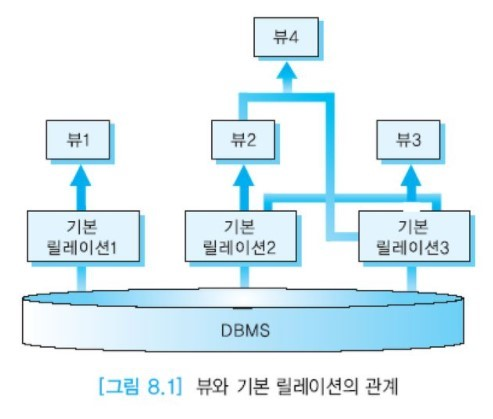

# 뷰

## 목차

- [뷰의 개요](#뷰의-개요)
- [뷰의 정의](#뷰의-정의)
- 뷰의 장점
- 뷰의 갱신

## 뷰의 개요

ANSI/SPARC 3단계 아키텍처에서 외부 뷰는 특정 사용자가 보는 데이터베이스의 구조라고 설명하였다.  
관계 데이터베이스에서 뷰라는 용어는 한 사용자의 전체 외부 뷰 대신에 하나의 __가상 릴레이션(virtual relation)__ 을 의미하는 데 사용된다.  
가상 릴레이션이란 실제로 투플을 갖지 않은 릴레이션이라는 뜻이다. 뷰는 기존의 __기본 릴레이션(base relation, 실제 릴레이션)__이나 또 다른 뷰에 대한 SELECT문의 형태로 정의된다.  
기본 릴레이션의 투플들은 데이터베이스에 물리적으로 저장된다. 관계 데이터베이스에서의 뷰는 자체적으로 디스크에 저장된 투플들을 갖고 있지 않지만  
사용자가 질의할 수 있는 릴레이션의 하나이다. 즉 한 사용자는 여러 개의 릴레이션과 뷰를 사용할 수 있다.

뷰는 기본 릴레이션이 나타날 수 있는 곳은 어디든지 사용될 수 있다.  
사용자에게 뷰는 기본 릴레이션과 같은 방법으로 조작할 수 있는 정상적인 릴레이션처럼 보인다.  
어떤 릴레이션으로부터 데이터를 검색하는 것과 동일한 방법으로 뷰를 통해서 데이터를 검색할 수 있다.  
뷰의 전체 내용을 검색하거나 특정 애트리뷰트와 투플들을 검색할 수 있다. 어떤 뷰에 대해서는 갱신 연산도 수행할 수 있다.  
뷰에 대한 어떤 연산도 뷰의 정의에 사용된 기본 릴레이션에 대한 연산으로 변환되어 수행된다.

뷰는 릴레이션으로부터 데이터를 검색하거나 갱신할 수 있는 __동적인 창(dynamic window)__ 의 역할을 한다.  
사용자는 이 창을 통해서 기본 릴레이션에 저장된 데이터를 볼 수 있다.  
기본 릴레이션의 투플들에 대한 갱신은 그 기본 릴레이션으로부터 유도된 뷰에 즉시 반영된다.  
뷰의 내용은 뷰를 참조하는 질의를 수행할 때마다 달라질 수 있다. 창문을 통해서 밖에 햇빛이 비치거나, 비가 오거나,  
눈이 오는 등 시시각각 변화하는 모습을 볼 수 있듯이 뷰를 통해서 기본 릴레이션의 현재 내용을 볼 수 있다.

이에 반해서 어느 시점에 SELECT문의 결과를 기본 릴레이션의 형태로 저장해놓은 것을 __스냅숏(snapshot)__이라고 부른다.  
일부 관계 DBMS들에서는 스냅숏을 구체화된 뷰(materialized view)라고 부른다.  
스냅숏은 사진을 찍은 것과 같아서 스냅숏을 정의하는 시점의 기본 릴레이션의 내용이 스냅숏에 반영된다.  
데이터베이스는 항상 현재의 상태만을 나타내므로 스냅숏을 정의한 이후에 기본 릴레이션이 갱신되면 이는 스냅숏에 반영되지 않으므로 주기적으로 내용을 __새롭게(refresh)__ 해야 한다.  
어떤 시점의 조직체의 현황, 예를 들어 몇년 몇월 시점에 근무하던 사원들의 정보, 재고 정보 등이 스냅숏으로 정의될 수 있다.

뷰를 사용하면 여러 사용자가 여러 방식으로 데이터를 볼 수 있다.  
데이터베이스가 공유 자원이므로 데이터베이스에 저장된 데이터에 관해 각 사용자에게 서로 다른 뷰를 제공하는 것이 유용하다.  
뷰는 하나의 기본 릴레이션을 사용자마다 서로 다르게 볼 수 있도록 한다.  
아래 그림에서 뷰1은 기본 릴레이션1 위에서 정의되었고, 뷰2는 기본 릴레이션2 위에서 정의되었으며, 뷰3은 기본 릴레이션2와 기본 릴레이션3을 사용하여 정의되었다.  
뷰는 또 다른 뷰를 참조할 수 있다. 아래 그림에서 뷰4는 뷰2와 기본 릴레이션3 위에서 정의되었다.

## 뷰의 정의

