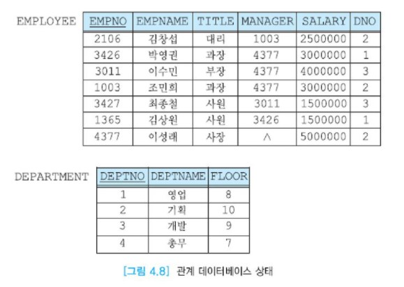

# 관계 DBMS의 시스템 카탈로그

DBMS는 사용자가 저장된 항목의 특성을 알아볼 수 있는 기능을 제공해야 한다.  
이런 기능은 질의 최적화 모듈 등 DBMS 자신의 구성요소에 의해서도 사용된다.  
시스템 카탈로그는 데이터베이스의 객체(릴레이션, 뷰, 인덱스 권한 등)와 구조들에 관한 모든 데이터를 포함한다.  
따라서 시스템 카탈로그를 메타데이터라고 한다. 메타데이터는 '데이터에 관한 데이터' 라는 뜻이다.  
시스템 카탈로그는 시스템의 사용자들에 관한 정보도 저장한다.  
예를 들어, 각 사용자가 접근 가능한 데이터베이스의 부분에 관한 정보뿐만 아니라 권한을 가진 사용자의 이름 등에 관한 정보도 저장한다.  
이들중의 일부 정보는 데이터베이스 관리자만 접근할 수 있다.

시스템 카탈로그는 관계 DBMS마다 표준화되어 있지 않아서 관계 DBMS마다 서로 다른 형태로 시스템 카탈로그 기능을 제공한다.  
시스템 카탈로그는 __데이터 사전(data dictionary)__ 또는 __시스템 테이블__이라고도 부른다.

시스템 카탈로그가 질의 처리에 어떻게 활용되는가를 살펴보자.  
예를 들어, "직급이 과장이고 2번 부서에 속하는 사원들에 대하여 사원이름과, 현재의 급여, 급여가 10% 인상됐을 때의 값을 검색하라."는 아래의 SELECT문을 살펴보자.

```SQL
SELECT	EMPNAME, SALARY, SALARY * 1.1
FROM 	EMPLOYEE
WHERE TITLE = '과장' AND DNO = 2;
```

DBMS가 이 SELECT문을 받으면 사용자가 원하는 투플들을 검색하기 위해서 몇가지 과정을 거친다.  
먼저 SELECT문이 문법적으로 정확한가를 검사한다. 즉 SELECT, FROM, WHERE와 같은 키워드들이 정확하게 표기됐는가,  
각 항목들 사이에 쉼표를 정확하게 표기했는가 등을 검사한다.  
SELECT문이 문법적으로 올바르게 작성되었으면 데이터베이스에 없는 릴레이션으로부터 정보를 검색할 수는 없으므로,  
이 SELECT문에서 참조하는 EMPLOYEE 릴레이션이 데이터베이스에 존재하는가를 검사해야 한다.  
또한 EMPLOYEE 릴레이션에 SELECT절에 열거된 애트리뷰트와 WHERE절에서 조건에 사용된 애트리뷰트가 존재하는가를 확인해야 한다.  
즉 EMPNAME, SALARY, TITLE, DNO 애트리뷰트가 EMPLOYEE 릴레이션에 포함되어 있는가를 검사한다.  
SALARY 애트리뷰트가 수식에 사용되었으므로 이 애트리뷰트의 데이터 타입이 숫자형(정수형이나 실수형)인가를 검사하고  
TITLE이 문자열과 비교 되었으므로 이 애트리뷰트의 데이터 타입이 문자형(CHAR(n) 또는 VARCHAR(n)등)인가를 검사한다.

지금까지의 확인 과정에 문제가 없으면 이 질의를 입력한 사용자가 EMPLOYEE 릴레이션의 EMPNAME, SALARY 애트리뷰트를 검색할 수 있는 권한이 있는가를 확인한다.

그 다음에 DBMS는 WHERE절에서 참조된 TITLE 애트리뷰트와 DNO 애트리뷰트에 인덱스가 정의되어 있는지 확인한다.  
두 애트리뷰트에 각각 인덱스가 존재한다고 가정하자.  
그러면 TITLE = '과장'을 만족하는 투플 수와 DNO = 2를 만족하는 투플 수 중에서 어느 것이 더 적은가를 알 필요가 있다.  
왜냐하면 EMPLOYEE 릴레이션의 모든 투플을 순차 탐색하면서 각 투플이 WHERE절을 만족하는가 검사하면 시간이 매우 오래 걸릴 수 있으므로 인덱스를 활용하는 효율적인 경우가 많기 때문이다.

TITLE = '과장' 과 DNO = 2를 모두 만족하는 투플만 사용자에게 결과로 제시되므로 TITLE에 정의된 인덱스와 DNO에 정의된 인덱스 중에서  
한 인덱스만 사용하여 그 인덱스에 관한 조건을 만족하는 투플을 검색한 후 나머지 조건도 만족하는가를 검사하면 된다.  
예를 들어, DBMS가 TITLE 인덱스를 사용하기로 결정했다면 EMPLOYEE의 투플들 중에서 TITLE = '과장'인 투플만 검색한 후 이 투플이 DNO 값이 2인가를 검사하면 된다.  
그러면 두 인덱스 중에서 DBMS가 어떤 인덱스를 선택하는 것이 질의 수행 시간을 단축할 수 있을까?  
조건을 만족하는 투플 수가 적은 인덱스가 당연히 유리하다. 이런 인덱스의 __선택율(selectivity)__이 높다고 말한다.  
DBMS가 두 인덱스중에서 조건을 만족하는 투플 수가 적은 것을 선택하기 위해서는 관계 데이터베이스 시스템에 데이터베이스 외에 추가로 정보를 유지해야 한다.  
한 릴레이션의 전체 투플수와 그 릴레이션에 정의된 각 인덱스에 존재하는 상이한 값들의 개수를 유지한다면 어느 인덱스를 사용하는 것이 유리한가를 예상할 수 있다.



위 그림을 보면 EMPLOYEE 릴레이션의 전체 투플 수는 7이다.  
TITLE 애트리뷰트에는 {사원, 대리, 과장, 부장, 사장}의 다섯 가지 값들이 존재한다. 이에 반해서 DNO 애트리뷰트에는 {1, 2, 3}의 세 가지 값들이 존재한다.  
따라서 TITLE 애트리뷰트에 정의된 인덱스가 DNO에 정의된 인덱스보다 대상 투플들을 더 좁혀주므로 유리하다.

이처럼 DBMS가 질의를 수행하는 여러 가지 방법들 중에서 가장 비용이 적게 드는 방법을 찾는 과정을  
__질의 최적화(query optimization)__ 라 하고, 이런 기능을 담당하는 DBMS 모듈을 질의 최적화 모듈이라 한다.  
이런 기능을 담당하는 DBMS 모듈을 질의 최적화 모듈이라 한다. 질의 최적화 모듈은 DBMS의 성능에 매우 중요한 역할을 담당한다.  
질의 최적화 모듈이 정확한 결정을 내릴 수 있도록 DBMS는 자체 목적을 위해서 시스템 카탈로그에 다양한 정보를 유지한다.  
사용자가 질의 최적화 모듈을 깊이 있게 이해할 필요는 없지만 질의 최적화 모듈이 정확한 수행 방법을 결정하기 위해서는  
릴레이션에 관한 다양한 통계 정보가 정확하게 유지해야 한다는 것을 알고 있는 것이 바람직하다.

위드 프로세서로 문서 작업을 하는 경우를 비교해보자. 여러 개의 문서를 작업하는 사용자는 원하는 문서의 이름을 정확하게 기억하지 못할 수 있다.  
이런 경우에 사용자는 파일 찾기를 이용하거나 원하는 문서가 들어 있을 만한 폴더를 열어본다.

데이터베이스의 사용자는 릴레이션 이름, 애트리뷰트 이름, 애트리뷰트의 데이터 타입 등 워드 프로세싱보다 기억할 것이 더 많으므로 이들을 항상 암기하고 있을 수 없다.  
사용자는 시스템 카탈로그를 통해서 자신이 원하는 릴레이션의 이름, 그 릴레이션의 애트리뷰트들에 관한 정보를  
쉽게 찾을 수 있으므로 시스템 카탈로그는 사용자를 위한 목적으로도 활용된다. 시스템 카탈로그를 잘 이해하는 것은 DBMS를 잘 활용하는 데 매우 중요하다.

관계 DBMS에서는 흔히 시스템 카탈로그도 사용자 릴레이션과 마찬가지 형태로 저장되기 때문에  
사용자 릴레이션에 적용되는 회복 기법과 동시성 제어 기법을 동일하게 사용할 수 있다.  
또한 사용자 릴레이션처럼 SELECT문을 사용하여 시스템 카탈로그의 내용을 검색할 수 있다.

시스템 카탈로그에는 릴레이션, 애트리뷰트, 인덱스, 사용자, 권한 등 각 유형마다 별도의 릴레이션이 유지된다.  
4-3에서 정의한 EMPLOYEE 릴레이션과 DEPARTMENT 릴레이션에 대해서 시스템 카탈로그에  
어떤 정보들이 유지되는가를 이해하기 쉽도록 시스템 카탈로그를 매우 단순화하여 설명한다.  
실제의 DBMS의 시스템 카탈로그에는 다수의 릴레이션들이 존재하고, 각 시스템 카탈로그의 릴레이션에는 많은 애트리뷰트들이 들어 있다.  
여기에서는 릴레이션에 관한 정보를 유지하는 릴레이션의 이름이 SYS_RELATION, 애트리뷰트에 관한 정보를 유지하는 릴레이션의 이름이 SYS_ATTRIBUTE라고 가정한다.  
각 릴레이션의 스키마는 아래와 같다.

```sql
SYS_RELATION(RelId,RelOwner,RelTups,RelAtts,RelWidth)
SYS_ATTRIBUTE(AttRelId,AttId,AttName,AttOff,AttType,AttLen)
```

SYS_RELATION 릴레이션은 데이터베이스 내의 각 릴레이션(시스템 카탈로그의 릴레이션과 사용자가 정의한 릴레이션)마다 하나의 투플로 그 릴레이션에 관한 정보를 나타낸다.  
RelId는 릴레이션의 이름 또는 식별자이고, RelOwner는 릴레이션을 생성한 사용자의 식별자이고, RelTups는 릴레이션의 투플 수이고,  
RelAtts는 릴레이션의 애트리뷰트 수이고, RelWidth는 투플의 길이를 나타낸다.
