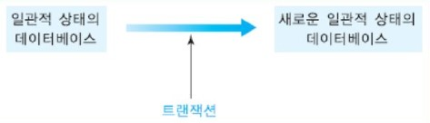

# 트랜잭션 개요

데이터베이스 시스템 환경에서 흔히 볼 수 있는 몇 가지 응용의 예를 살펴보자.

```sql
예 1: 전체 사원의 급여를 6% 인상

사원이 500명 재직하고 있는 회사에서 모든 사원의 급여를 6% 인상하는 연산을 데이터베이스의 EMPLOYEE 릴레이션에서 수행한다.

UPDATE		EMPLOYEE
SET			SALARY = SALARY * 1.06;
```

이때 500명 전원의 급여가 수정되거나 한 명의 급여도 갱신되지 않도록 DBMS가 보장해야 한다.  
예를 들어, 아래 그림과 같이 320번째 사원까지 수정한 상태에서 컴퓨터 시스템이 다운된 후에 재기동되었을 때 DBMS는 어떻게 대응해야 하는가?  
위의 수정 연산을 처음부터 다시 수행한다면 320번째까지의 직원의 급여는 두 번 인상되고 321번째 직원부터는 정상적으로 한 번만 인상되는 결과를 가져오므로 이렇게 해서는 안 된다.

DBMS는 항상 현재의 데이터베이스 상태만 유지하므로 각 투플이 수정된 시점을 알 수 없다.  
따라서 DBMS가 추가로 정보를 유지하지 않는다면 DBMS가 재기동된 후에 어느 직원의 투플까지 수정되었는가를 알 수 없다.  
이를 위해 DBMS가 유지하는 __로그(log)__ 에 관해서는 뒤에서 자세하게 논의한다.


```sql
예 2 : 계좌 이체

은행 고객은 자신의 계좌에서 다른 계좌로 송금할 수 있따. 정미림은 자신의 계좌에서 100,000원을 인출하여 안명석의 계좌로 이체하려고 한다.
고객들의 계좌 정보가 ACCOUNT 릴레이션에 들어 있다.

UPDATE		ACCOUNT
SET			BALANCE = BALANCE - 100000
WHERE		CUST_NAME = '정미림';

UPDATE		ACCOUNT
SET			BALANCE = BALANCE + 100000
WHERE		CUST_NAME = '안명석';
```

ACCOUNT 릴레이션에서 정미림의 투플과 안명석의 투플은 서로 상이하므로 하나의 UPDATE문으로 계좌 이체를 표현할 수 없다. 즉 WHERE절에서

CUST_NAME = '정미림' __AND__ CUST_NAME = '안명석'

과 같이 표현하면 이 조건을 만족하는 투플이 하나도 없으며, WHERE절에서

CUST_NAME = '정미림' __OR__ CUST_NAME = '안명석'

과 같이 표현하면 WHERE절을 만족하는 두 개의 투플에 대해 SET절에서 명시한 대로 잔액이 모두 100,000원 증가하거나 100,000원 감소한다.

따라서 위와 같이 두 개의 UPDATE문을 사용하여, 하나의 UPDATE문에서는 정미림의 잔액을 100,000원 감소시키고,  
또 다른 UPDATE문에서는 안명석의 잔액을 100,000원 증가시켜야 한다. 물론 두 UPDATE문의 순서는 중요하지 않다.  
컴퓨터 시스템은 언제든지 다운될 수 있다. 만약 첫 번째 UPDATE문을 수행한 후에 두 번째 UPDATE문을 수행하기 전에 컴퓨터 시스템이 다운되면 재기동한 후에 DBMS는 어떻게 대응해야 하는가?  
위의 두 UPDATE문을 처음부터 다시 수행한다면 정미림의 계좌에서는 100,000원이 두 번 빠져나가게 되므로 총 200,000원이 인출되고,  
안명석의 계좌에는 100,000원만 증가하므로 정미림의 입장에서는 100,000원을 손해보는 것이다.  
만일 DBMS가 아무런 작업을 하지 않는다면 정미림의 계좌에서는 100,000원이 빠져나갔지만 안명석의 계좌에는 100,000원이 증가되지 않았기 때문에 이 또한 안 된다.

위의 두 개의 UPDATE문은 둘 다 완전하게 수행되거나 한 UPDATE문도 수행되어서는 안 되도록, 즉 하나의 __트랜잭션(단위)__처럼 DBMS가 보장해야 한다.  
DBMS는 사용자가 입력하는 SQL문들 중에서 어떤 것들을 하나의 트랜잭션으로 취급해야 하는지 알 수 없다.  
기본적으로 각각의 SQL문이 하나의 트랜잭션으로 취급된다. 따라서 두 개 이상의 SQL문들을 하나의 트랜잭션으로 취급하려면  
사용자가 이를 명시적으로 표시해야 한다. 또한 성공적인 계좌 이체 트랜잭션의 결과는 데이터베이스에 지속적으로 반영되어야 한다.


SQL문 (1)은 키보드로부터 입력받은 항공기편과 날짜를 WHERE절에 사용하여, 고객이 원하는 항공기편에 대해 현재까지 팔린 좌석 수와  
그 항공기의 총 좌석 수를 검색하여 고급 프로그래밍 언어의 변수 temp1과 temp2에 각각 배정한다.  
고급프로그래밍 언어의 if문에서 그 항공기에 빈 좌석이 남아 있는가를 검사하고, 빈 좌석이 남아 있지 않으면 예약을 할 수 없으므로  
"빈 좌석이 없습니다"는 메세지를 모니터에 보여주고 프로그램의 수행을 중단한다.  
이 경우에는 아직 데이터베이스를 갱신하지 않았으므로 데이터베이스의 일관성에 전혀 영향을 주지 않는다.

빈 좌석이 남아 있는 경우에는 SQL문 (2)와 같이 UPDATE문을 사용하여 그 항공기의 팔린 좌석 수를 1만큼 증가시키고,  
SQL문 (3)과 같이 INSERT문을 사용하여 고객의 인적 사항을 항공사의 데이터베이스에 입력한다.  
그리고 "예약이 완료되었습니다"는 메시지를 모니터에 보여주고 프로그램의 수행을 성공적으로 종료한다.

만일 SQL문 (2)를 수행하고 SQL문 (3)을 수행하기 전에 컴퓨터 시스템이 다운된다면 재기동한 후에 DBMS는 어떻게 대응해야 하는가?  
DBMS가 위의 트랜잭션을 처음부터 다시 수행한다면 팔린 좌석수는 또 1만큼 증가하여 총 2개의 좌석이 팔린 것으로 데이터베이스에 기록되지만  
한 명의 고객만 예약한 것이므로 이렇게 해서는 안된다.

DBMS가 아무런 후속 조치를 취하지 않는다면 팔린 좌석 수는 1만큼 증가했지만 고객의 정보가 입력되지 않았으므로 예약한 고객이 그 항공기에 탑승할 수 없다.  
따라서 항공사 입장에서는 좌석 1개에 고객을 태우지 못하게 되므로 수입이 줄어들고, 고객은 항공기를 타지 못하게 되므로 일정에 큰 차질이 생길 수 있으므로 이렇게 해서는 안된다.

위의 세 개의 SQL문이 모두 완전하게 수행되거나 하나도 수행되어서는 안되도록, 즉 하나의 트랜잭션(단위)처럼 DBMS가 취급해야 한다.  
계좌 이체 예에서 설명한 바와 같이 DBMS는 각 SQL문의 의미를 알 수 없으므로 하나의 트랜잭션으로 취급해야 하는 SQL문들의 범위를 사용자가 명시적으로 표시해야 한다.


## 트랜잭션의 특성

트랜잭션은 데이터베이스 시스템에서 매우 중요한 개념이다.  
트랜잭션은 아래와 같은 네 가지 특성을 만족해야 한다. 네 가지 특성을 나타내는 영어 단어들의 첫 글자를 모아서 __ACID__ 특성이라고도 한다.

- 원자성(__A__tomicity)

  원자성은 한 트랜잭션 내의 모든 연산들이 완전히 수행되거나 전혀 수행되지 않음(all or nothing)을 의미한다.  
  즉 한 트랜잭션의 모든 연산이 데이터베이스에 완전히 반영되거나 전혀 반영되지 않아야 한다.  
  시스템이 다운되는 경우에 DBMS의 회복 모듈은 부분적으로 데이터베이스를 갱신한 트랜잭션의 영향을 취소함으로써 트랜잭션의 원자성을 보장한다.  
  또한 완료된 트랜잭션이 갱신한 사항은 트랜잭션의 영향을 재수행함으로써 트랜잭션의 원자성을 보장한다.  

  ```sql
  예 1 : 계좌 이체
  
  정미림 계좌에서 안명석 계좌로 100,000원을 송금하는 경우에 정미림 계좌에서 100,000원이 빠지고 안명석 계좌에 100,000원이 증가하는 것이 모두 데이터베이스에 반영되거나,
  정미림 계좌에서도 100,000원이 빠지지 않고 안명석 계좌에도 100,000원이 증가되지 않도록 보장해야 한다.
  만일 정미림 계좌에서 100,000원이 빠져나간 직후에 시스템이 다운되면 어떻게 하겠는가?
  이런 경우에는 컴퓨터 시스템이 재기동된 후에 DBMS의 회복 모듈이 정미림 계좌에서 빠져나간 100,000원을 정미림 계좌에 다시 증가시킴으로써 트랜잭션이 수행되지 않은 상태로 되돌린다.
  안명석 계좌를 수정하기 전에 시스템이 다운되었으므로 안명석 계좌에는 변화가 없다.
  만일 두 번째 UPDATE문까지 수행한 후에 시스템이 다운되었다면, 컴퓨터 시스템이 재기동된후에 DBMS의 회복 모듈은 정미림 계좌에서 100,000원이 줄어들고,
  안명석 계좌에서 100,000원이 증가된 것이 데이터베이스에 반영하는 것을 보장한다.
  
  		UPDATE	ACCOUNT
  		SET		BALANCE = BALANCE - 100000
  		WHERE	CUST_NAME = '정미림';
  		-------------------------------------------------> 시스템 다운
  		UPDATE ACCOUNT
  		SET		BALANCE = BALANCE + 100000
  		WHERE	CUST_NAME = '안명석';
  ```

  ```
  예 2 : 급여 인상
  
  직원들의 급여를 6% 인상하는 트랜잭션의 예에서도 500명 전원의 급여가 인상되거나 1명의 급여도 인상되지 않도록 해야 한다.
  즉 일부 직원들의 급여만 수정된 상태에서 컴퓨터 시스템이 다운된 후 재기동되면 DBMS는 급여가 인상된 직원들의 급여를 인상 전으로 되돌림으로써 트랜잭션이 수행되지 않은 상태로 되돌린다.
  ```

  

- 일관성(__C__onsistency)

  한 트랜잭션을 정확하게 수행하고 나면 데이터베이스가 하나의 일관된 상태에서 다른 일관된 상태로 바뀐다.  
  어떤 트랜잭션이 수행되기 전에 데이터베이스가 일관된 상태를 가졌다면 트랜잭션이 수행된 후에 데이터베이스는 또 다른 일관된 상태를 갖는다.

  

  다만 아래 그림이 나타내는 것처럼 트랜잭션이 수행되는 도중에는 데이터베이스가 일시적으로 일관된 상태를 갖지 않을 수 있다.  
  일관성은 트랜잭션을 작성하는 사용자(응용 프로그래머)와 무결성 제약조건을 유지하는 DBMS의 일부 모듈이 유지한다.  
  DBMS는 CREATE TABLE문에서 정의된 무결성 제약조건들을 유지한다. 이를 넘어서는 데이터의 의미에 관해서는 DBMS가 알지 못한다.  
  예를 들어, DBMS는 은행 계좌의 잔액의 이자가 어떻게 계산되는지 알지 못한다.

  동시에 다수 사용자가 데이터베이스를 접근하여 검색 및 연산을 수행하는 환경에서 무결성 제약조건만 검사해서는 데이어베이스의 일관성을 보장할 수 없다.  
  DBMS의 동시성 제어 모듈이 다수 사용자의 서로 상충되는 데이터베이스 접근을 조정해야 한다.

  

  ```
  예 3 : 계좌 이체
  
  앞의 계좌 이체 예에서 송금하기 전에 정미림과 안명석 계좌에 각각 900,000원과 500,000원이 들어 있었다면 계좌 이체하기 전에 정미림과 안명석 계좌의 합은 1,400,000원이다.
  계좌 이체가 성공적으로 수행된 후에는 정미림과 안명석 계좌에 각각 800,000원과 600,000원이 들어 있으므로 정미림과 안명석의 계좌의 합은 여전히 1,400,000원이다.
  ```

  

- 고립성(__I__solation)

  한 트랜잭션이 데이터를 갱신하는 동안 이 트랜잭션이 완료되기 전에는갱신 중인 데이터를 다른 트랜잭션들이 접근하지 못하도록 해야 한다.  
  고립성은 다수의 트랜잭션이 동시에 수행되는 것을 다룬다. 즉 각 트랜잭션은 시스템 내에서 동시에 수행되고 있는 다른 트랜잭션들을 알지 못한다.  
  다수의 트랜잭션들이 동시에 수행되더라도 그 결과는 어떤 순서에 따라 트랜잭션들을 하나씩 차례대로 수행한 결과와 같아야 한다.

  만일 초기의 데이터베이스 상태가 일관적이고 정확하게 실세계의 상태를 반영한다면, 일관된 트랜잭션들의 집합을 차례로 수행하면 이런 성질을 보존한다.  
  그러므로 트랜잭션들의 직렬 수행은 일관성을 보존한다. 그러나 성능상의 관점에서는 직렬 수행이 적절하지 않다.  
  트랜잭션들의 집합을 동시 수행하면 성능이 향상되는 효과를 얻을 수 있지만 결과가 정확하지 않을 수 있다.  
  DBMS의 동시성 제어 모듈이 트랜잭션의 고립성을 보장한다. DBMS는 응용들의 요구사항에 따라 다양한 __고립 수준(isolation level)__을 제공한다.

  ```
  예 4 : 계좌 이체
  
  앞의 계좌 이체 예에서 정미림 계좌에서 100,000원을 빼고, 안명석 계좌에 100,000원을 증가시키는 트랜잭션을 수행하는 동안 다른 트랜잭션이 정미림과 안명석 계좌를 접근하지 못하도록 해야 한다.
  만일 트랜잭션이 수행되는 도중에 다른 트랜잭션들이 정미림과 안명석 계좌를 접근 할 수 있으면 불일치한 데이터
  (예를 들어 정미림 계좌는 갱신된 후, 안명석 계좌는 갱신되기 전)를 읽거나 갱신하는 경우가 발생할 수 있다.
  ```

  

- 지속성(__D__urability)

  일단 한 트랜잭션이 완료되면 이 트랜잭션이 갱신한 것은 그 후에 시스템에 고장이 발생하더라도 손실되지 않는다.  
  완료된 트랜잭션의 효과는 시스템이 고장난 경우에도 데이터베이스에 반영된다. DBMS의 회복 모듈은 시스템이 다운되는 경우에도 트랜잭션의 지속성을 보장한다.

  아래 그림은 트랜잭션의 네 가지 특성과 이들을 지원하기 위한 DBMS의 기능들의 관계를 나타낸다.

  

  대부분의 DBMS들은 데이터를 갱신하는 명령들을 트랜잭션으로 관리한다.  
  데이터베이스 연산들을 사용자(프로그래머)가 정의하는 트랜잭션으로 묶는 것이 편리하다.  
  하나의 응용 프로그램은 단일 트랜잭션이나 트랜잭션들의 그룹으로 이루어질 수 있다. 트랜잭션은 데이터베이스를 수정하는 임의의 SQL문으로 시작한다.  
  트랜잭션에서 변경하려는 내용이 데이터베이스에 완전하게 반영되면 __완료(commit)__되었다고 말한다.  
  트랜잭션에서 변경하려는 내용이 데이터베이스에 일부만 반영된 경우에는 원자성을 보장하기 위해서,  
  트랜잭션이 갱신한 사항을 트랜잭션이 수행되기 전의 상태로 되돌리도록 __철회(abort)__해야 한다.  
  SQL 구문상으로는 각각 COMMIT WORK와 ROLLBACK WORK이다. 대부분의 데이터베이스 언어에서 한 트랜잭션의 경계를 다음과 같이 표시한다.  
  아래 표 9.1은 COMMIT과 ROLLBACK의 차이점을 요약한 것이다.

  ```
  SQL문
  SQL문
  ...
  COMMIT WORK (또는 ROLLBACK WORK)
  ```

  

  아래 그림은 DELETE문이 1개, UPDATE문이 1개, INSERT문이 2개 들어 있는 한 트랜잭션이 수행될 때,  
  COMMIT과 ROLLBACK되는 경우를 비교하여 보여준다.  
  트랜잭션을 구성하는 모든 SQL문의 수행이 끝나면 COMMIT을 하고, 어느 SQL문이라도 수행하지 못하게 되면 ROLLBACK을 한다.

  


## 트랜잭션이 성공하지 못하는 원인

사용자가 DBMS에 트랜잭션의 수행을 요청한 후에 컴퓨터 시스템의 다운을 포함하여, 트랜잭션이 성공적으로 완료되지 못하는 경우는 아래와 같이 몇 가지 유형으로 구분할 수 있다. 일부 유형들은 서로 중복되기도 한다.


- 시스템(사이트)고장

  중앙 처리 장치, 주기억 장치, 전원 공급 장치 등이 고장 나는 경우를 말한다.  
  주기억 장치의 내용이 모두 없어지지만 보조 기억 장치의 내용은 안전하다.

- 트랜잭션 고장

  트랜잭션 고장은 트랜잭션이 수행되는 도중에 철회되는 것을 말한다.  
  사용자가 트랜잭션의 수행을 시작한 후에 마음을 바꿔서 트랜잭션을 철회시킬 수 있고, DBMS가 데드록을 탐지하여 어떤 트랜잭션을 철회시킬 수도 있다.  
  트랜잭션내에서 0으로 어떤 값을 나누거나 오버플로가 발생해서 트랜잭션이 철회될 수 도 있다.  
  평균적으로 약 3%의 트랜잭션이 비정상적으로 종료된다.

- 매체 고장

  디스크 헤드, 디스크 콘트롤러 등이 고장 나서 보조 기억 장치의 전부 또는 일부 내용이 지워지는 경우를 말한다.  
  지금까지 연구된 대부분의 회복 기법들은 매체 고장이 일어나지 않는 경우에 적용된다.  
  매체 고장에 대비하기 위해서는 데이터베이스를 자기 테이프 등에 백업하고 이를 안전하게 따로 보관하는 것이 중요하다.

- 통신 고장

  분산 데이터베이스 시스템 환경이나 클라이언트-서버 환경에서 메시지가 상대방에서 전달되지 못하거나 네트워크가 두 개 이상으로 분할되어 트랜잭션이 철회되는 경우를 말한다.

- 자연적 재해

  홍수, 화재, 지진 등의 자연적 재해가 발생하여 컴퓨터 시스템이 붕괴되는 경우를 말한다.

- 부주의 또는 고의적인 고장

  오퍼레이터나 사용자가 부주의하게 또는 고의적으로 데이터베이스에 손상을 입히는 경우를 의미한다.
