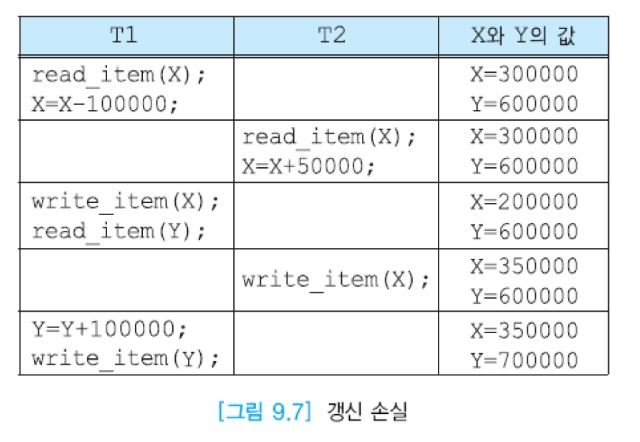
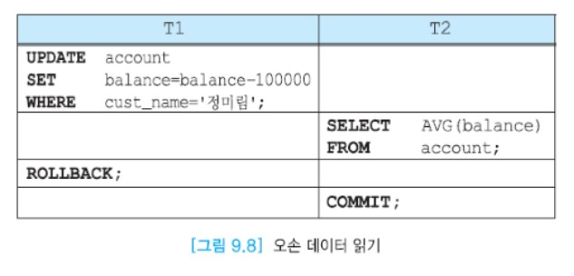
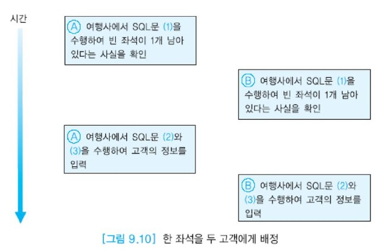

# 동시성 제어


## 목차

- 동시성의 개요
- 로킹(locking)


## 동시성의 개요

대부분의 DBMS들은 다수 사용자용이다. 아래 그림처럼 여러 사용자들이 동시에 동일한 테이블을 접근하기도 한다.  
DBMS의 성능을 높이기 위해 여러 사용자의 질의나 프로그램들을 동시에 수행하는 것이 필수적이다.  
본 절에서는 동시에 수행되는 다수의 트랜잭션들이 존재할 때 고립성을 유지하는 동시성 제어를 논의한다.


DBMS가 아무런 조치를 취하지 않고 트랜잭션들을 동시에 수행시키면 여러 가지 문제가 발생할 수 있다.  
동시성 제어 기법은 여러 사용자들이 다수의 트랜잭션을 동시에 수행하는 환경에서 부정확한 결과를 생성할 수 있는, 트랜잭션들 간의 간섭이 생기지 않도록 한다.  
트랜잭션을 수행하는 각 사용자가 혼자서 데이터베이스를 접근하는 것처럼 생각할 수 있도록 해야 한다.

각 트랜잭션은 데이터베이스의 일관성을 유지하므로 여러 트랜잭션들의 집합을 한번에 한 트랜잭션씩 차례대로 수행하는 __직렬 스케줄(serial schedule)__에서는 데이터베이스의 일관성이 유지된다.  
여러 트랜잭션들을 동시에 수행하는 __비직렬 스케줄(non-serial schedule)__의 결과가 어떤 직렬 스케줄의 수행 결과와 동등하다면 __직렬가능(serializable)__하다고 말한다.

사용자의 프로그램에서는 데이터베이스로부터 검색한 데이터에 대해 여러 가지 연산들을 수행할 수도 있지만 DBMS는 읽기와 쓰기 연산만 관심을 갖는다.

:large_blue_circle: 데이터베이스 연산

응용에서 접근하려는 데이터베이스 항목을 포함하고 있는 디스크 블록을 주기억 장치와 디스크 간에 이동하는 연산은 Input (X) 와 Output (X) 이다.  
Input (X) 연산은 데이터베이스 항목 X를 포함하고 있는 블록을 주기억 장치의 버퍼로 읽어들인다. Output (X) 연산은 데이터베이스 항목 X를 포함하고 있는 블록을 디스크에 기록한다.  
주기억 장치의 버퍼와 응용 간에 데이터베이스 항목을 이동하는 연산은 read_item(X)와 write_item (X) 이다.  
read_item (X) 연산은 주기억 장치 버퍼에서 데이터베이스 항목 X의 값을 프로그램 변수 X로 복사한다.  
write_item(X) 연산은 프로그램 변수 X의 값을 주기억 장치 내의 데이터베이스 항목 X에 기록한다.  
read_item (X) 와 write_item (X) 에 Input (X) 연산이 모두 필요하다.  
아래 그림은 디스크, 주기억 장치 버퍼, 응용의 변수들 간의 값의 이동을 보여준다.


동시성 제어를  하지 않고 다수의 트랜잭션을 동시에 수행하면 __갱신 손실(lost update)__, __오손 데이터 읽기(diry read)__, __반복할 수 없는 읽기(unrepeatable read)__ 등의 문제가 발생할 수 있다.  
갱신 손실은 수행 중인 트랜잭션이 갱신한 내용을 다른 트랜잭션이 덮어 씀으로써 갱신이 무효가 되는 것을 뜻한다.  
__오손 데이터(dirty data)__는 완료되지 않은 트랜잭션이 갱신한 데이터이다.  
반복할 수 없는 읽기는 한 트랜잭션이 동일한 데이터를 두 번 읽을 때 서로 다른 값을 읽는 것을 말한다.

```
예 : 갱신 손실

하나의 SQL문은 DBMS 내에서 여러 개의 명령들로 나뉘어 명령들로 나뉘어 수행된다.
다수 사용자 환경에서는 여러 사용자들이 동시에 요청한 트랜잭션의 명령들이 섞여서 수행될 수 있다.
트랜잭션 T1은 X에서 Y로 100000을 이체하고, 트랜잭션 T2는 X의 값에 50000을 더하려고 한다.
두 트랜잭션이 수행되기 전의 X와 Y의 초깃값이 각각 300000과 600000이라고 가정하면 T1의 수행을 먼저 완료하고 T2의 수행을 완료하는지,
T2의 수행을 먼저 완료하고 T1의 수행을 완료하는지 관계 없이 X의 최종값은 250000, Y의 최종값은 700000이 되어야 한다.
아래 그림과 같은 순서대로 두 트랜잭션의 연산들이 수행되는 경우에 T1이 기록한 값을 T2가 덮어 쓰게 되므로 T1의 갱신이 손실되었고,
X의 최종 값이 350000, Y의 최종 값이 700000이 되므로 불일치가 생겼다.
```




```
예 : 오손 데이터 읽기

아래 그림에서 트랜잭션 T1이 정미림의 잔액을 100,000원 감소시킨 후에 트랜잭션 T2는 모든 계좌의 잔액은 평균값을 검색하였다.
그 이후에 T1이 어떤 이유로 철회되면 T1이 갱신한 정미림 계좌의 잔액은 원래 상태로 되돌아간다.  
따라서 T2는 완료되지 않은 트랜잭션이 갱신한 데이터, 즉 틀린 데이터를 읽었다.
```



```
예 : 반복할 수 없는 읽기

아래 그림에서 먼저 트랜잭션 T2는 모든 계좌의 잔액의 평균값을 검색하였다.
트랜잭션 T2가 완료되기 전에 트랜잭션 T1이 정미림의 잔액을 100,000원 감소시키고 완료되었다.
트랜잭션 T2가 다시 모든 계좌의 잔액의 평균값 검색하면 첫 번째 평균값과 다른 값을 보게 된다.
틀린 데이터를 읽는 문제는 생기지 않지만 동일한 읽기 연산을 여러 번 수행할 때 매번 서로 다른 값을 보게 될 수 있다.
```


9.1절의 세 번째 트랜잭션을 다시 살펴보자. 여러 여행사에서 동시에 고객들의 요청에 따라 동일한 날짜에 출발하는 항공기의 빈 좌석 유무를 검사할 수 있다.  
아래 그림의 순서와 같이 만일 두 여행사에서 각각 트랜잭션을 수행하는 과정에 SQL문 (1)의 수행 결과로 특정 항공기에 빈 좌석이 1개 남아 있다는 사실을 확인하고  
동시에 SQL문 (2)와 (3)을 수행하여 팔린 좌석 수를 1만큼씩 증가시키고 자신의 고객의 정보를 항공사 데이터베이스에 입력하려 할 때  
DBMS가 아무런 조치를 취하지 않으면, 1개 남은 좌석에 두 명의 고객이 배정되는 결과를 초래하게 된다.

DBMS의 동시성 제어 모듈은 이와 같은 문제들을 방지한다.




## 로킹(locking)

