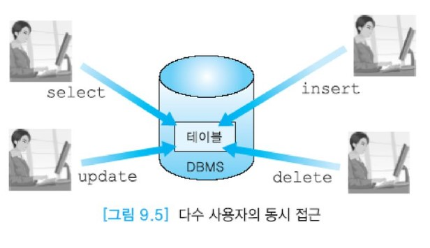
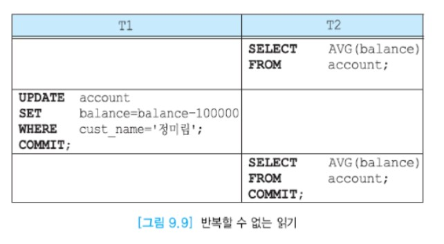

# 동시성 제어


## 목차

- 동시성의 개요
- 로킹(locking)


## 동시성의 개요

대부분의 DBMS들은 다수 사용자용이다. 아래 그림처럼 여러 사용자들이 동시에 동일한 테이블을 접근하기도 한다.  
DBMS의 성능을 높이기 위해 여러 사용자의 질의나 프로그램들을 동시에 수행하는 것이 필수적이다.  
본 절에서는 동시에 수행되는 다수의 트랜잭션들이 존재할 때 고립성을 유지하는 동시성 제어를 논의한다.



DBMS가 아무런 조치를 취하지 않고 트랜잭션들을 동시에 수행시키면 여러 가지 문제가 발생할 수 있다.  
동시성 제어 기법은 여러 사용자들이 다수의 트랜잭션을 동시에 수행하는 환경에서 부정확한 결과를 생성할 수 있는, 트랜잭션들 간의 간섭이 생기지 않도록 한다.  
트랜잭션을 수행하는 각 사용자가 혼자서 데이터베이스를 접근하는 것처럼 생각할 수 있도록 해야 한다.

각 트랜잭션은 데이터베이스의 일관성을 유지하므로 여러 트랜잭션들의 집합을 한번에 한 트랜잭션씩 차례대로 수행하는 __직렬 스케줄(serial schedule)__에서는 데이터베이스의 일관성이 유지된다.  
여러 트랜잭션들을 동시에 수행하는 __비직렬 스케줄(non-serial schedule)__의 결과가 어떤 직렬 스케줄의 수행 결과와 동등하다면 __직렬가능(serializable)__하다고 말한다.

사용자의 프로그램에서는 데이터베이스로부터 검색한 데이터에 대해 여러 가지 연산들을 수행할 수도 있지만 DBMS는 읽기와 쓰기 연산만 관심을 갖는다.

:large_blue_circle: 데이터베이스 연산

응용에서 접근하려는 데이터베이스 항목을 포함하고 있는 디스크 블록을 주기억 장치와 디스크 간에 이동하는 연산은 Input (X) 와 Output (X) 이다.  
Input (X) 연산은 데이터베이스 항목 X를 포함하고 있는 블록을 주기억 장치의 버퍼로 읽어들인다. Output (X) 연산은 데이터베이스 항목 X를 포함하고 있는 블록을 디스크에 기록한다.  
주기억 장치의 버퍼와 응용 간에 데이터베이스 항목을 이동하는 연산은 read_item(X)와 write_item (X) 이다.  
read_item (X) 연산은 주기억 장치 버퍼에서 데이터베이스 항목 X의 값을 프로그램 변수 X로 복사한다.  
write_item(X) 연산은 프로그램 변수 X의 값을 주기억 장치 내의 데이터베이스 항목 X에 기록한다.  
read_item (X) 와 write_item (X) 에 Input (X) 연산이 모두 필요하다.  
아래 그림은 디스크, 주기억 장치 버퍼, 응용의 변수들 간의 값의 이동을 보여준다.


동시성 제어를  하지 않고 다수의 트랜잭션을 동시에 수행하면 __갱신 손실(lost update)__, __오손 데이터 읽기(diry read)__, __반복할 수 없는 읽기(unrepeatable read)__ 등의 문제가 발생할 수 있다.  
갱신 손실은 수행 중인 트랜잭션이 갱신한 내용을 다른 트랜잭션이 덮어 씀으로써 갱신이 무효가 되는 것을 뜻한다.  
__오손 데이터(dirty data)__는 완료되지 않은 트랜잭션이 갱신한 데이터이다.  
반복할 수 없는 읽기는 한 트랜잭션이 동일한 데이터를 두 번 읽을 때 서로 다른 값을 읽는 것을 말한다.

```
예 : 갱신 손실

하나의 SQL문은 DBMS 내에서 여러 개의 명령들로 나뉘어 명령들로 나뉘어 수행된다.
다수 사용자 환경에서는 여러 사용자들이 동시에 요청한 트랜잭션의 명령들이 섞여서 수행될 수 있다.
트랜잭션 T1은 X에서 Y로 100000을 이체하고, 트랜잭션 T2는 X의 값에 50000을 더하려고 한다.
두 트랜잭션이 수행되기 전의 X와 Y의 초깃값이 각각 300000과 600000이라고 가정하면 T1의 수행을 먼저 완료하고 T2의 수행을 완료하는지,
T2의 수행을 먼저 완료하고 T1의 수행을 완료하는지 관계 없이 X의 최종값은 250000, Y의 최종값은 700000이 되어야 한다.
아래 그림과 같은 순서대로 두 트랜잭션의 연산들이 수행되는 경우에 T1이 기록한 값을 T2가 덮어 쓰게 되므로 T1의 갱신이 손실되었고,
X의 최종 값이 350000, Y의 최종 값이 700000이 되므로 불일치가 생겼다.
```


```
예 : 오손 데이터 읽기

아래 그림에서 트랜잭션 T1이 정미림의 잔액을 100,000원 감소시킨 후에 트랜잭션 T2는 모든 계좌의 잔액은 평균값을 검색하였다.
그 이후에 T1이 어떤 이유로 철회되면 T1이 갱신한 정미림 계좌의 잔액은 원래 상태로 되돌아간다.  
따라서 T2는 완료되지 않은 트랜잭션이 갱신한 데이터, 즉 틀린 데이터를 읽었다.
```


```
예 : 반복할 수 없는 읽기

아래 그림에서 먼저 트랜잭션 T2는 모든 계좌의 잔액의 평균값을 검색하였다.
트랜잭션 T2가 완료되기 전에 트랜잭션 T1이 정미림의 잔액을 100,000원 감소시키고 완료되었다.
트랜잭션 T2가 다시 모든 계좌의 잔액의 평균값 검색하면 첫 번째 평균값과 다른 값을 보게 된다.
틀린 데이터를 읽는 문제는 생기지 않지만 동일한 읽기 연산을 여러 번 수행할 때 매번 서로 다른 값을 보게 될 수 있다.
```



9.1절의 세 번째 트랜잭션을 다시 살펴보자. 여러 여행사에서 동시에 고객들의 요청에 따라 동일한 날짜에 출발하는 항공기의 빈 좌석 유무를 검사할 수 있다.  
아래 그림의 순서와 같이 만일 두 여행사에서 각각 트랜잭션을 수행하는 과정에 SQL문 (1)의 수행 결과로 특정 항공기에 빈 좌석이 1개 남아 있다는 사실을 확인하고  
동시에 SQL문 (2)와 (3)을 수행하여 팔린 좌석 수를 1만큼씩 증가시키고 자신의 고객의 정보를 항공사 데이터베이스에 입력하려 할 때  
DBMS가 아무런 조치를 취하지 않으면, 1개 남은 좌석에 두 명의 고객이 배정되는 결과를 초래하게 된다.

DBMS의 동시성 제어 모듈은 이와 같은 문제들을 방지한다.


## 로킹(locking)

데이터 항목을 로킹하는 개념은 동시에 수행되는 트랜잭션들의 동시성을 제어하기 위해서 가장 널리 사용되는 기법이다.  
동일한 데이터 항목에 대한 여러 트랜잭션들의 동시 접근을 조정하기 위해서 __로크(lock)__가 사용된다. 로크는 데이터베이스 내의 각 데이터 항목과 연관된 하나의 변수이다.  
일반적으로 데이터베이스 내의 모든 데이터 항목마다 로크가 존재한다. 각 트랜잭션이 수행을 시작하여 데이터 항목을 접근할 때마다 요청한 로크에 관한 정보는 __로크 테이블(lock table)__ 등에 유지된다.

식당에서 각 의자에는 한 사람만 앉아서 식사를 할 수 있다. 하지만 식당 내의 빈 공간은 빈 자리가 생길 때까지 여러 순님들이 함께 머무를 수 있다.  
한 데이터 항목에 대한 갱신은 식당의 각 의자처럼 한 트랜잭션에 대해서만 허용되므로, 트랜잭션에서 갱신을 목적으로 데이터 항목을 접근할 때는 __독점 로크(X-lock, eXclusive lock)__ 를 요청한다.

이에 반해서, 트랜잭션에서 읽을 목적으로 데이터 항목을 접근할 때는 __공유 로크(S-lock, Shared lock)__ 를 요청한다.  
한 트랜잭션이 어떤 데이터를 읽기만 하기 위해 공유 로크를 걸어놓은 경우에 또 다른 트랜잭션이 그 데이터 항목을 읽으려고 공유 로크를 요청한 경우에는 이를 함께 허용해도 무방하다.  
그러나 공유 로크가 걸려 있는 데이터 항목에 대해 독점 로크를 요청하거나, 독점 로크가 걸려 있는 항목에 대해 독점 로크나 공유 로크를 요청하는 경우에는 로크를 허용해서는 안 된다.  
아래 표는 한 트랜잭션이 어떤 데이터 항목을 접근하기 위해서 로크를 요청했을 때 그 데이터 항목에 현재 걸려 있는 로크에 따라 로크 요청이 허가되는지 또는 현재 걸려 있는 로크가 해제될때까지 기다려야 하는지를 보여준다.  
트랜잭션이 데이터 항목에 대한 접근을 끝낸 후에 __로크를 해제(unlock)__ 한다.


- 2단계 로킹 프로토콜(2-phase locking protocol)

  단순히 로킹 기법을 사용한다고 해서 동시성 제어 문제가 완전하게 해결되지는 않는다.  
  아래 그림에서 트랜잭션 T1은 데이터 항목 A와 B에 각각 1을 더한다.  
  트랜잭션 1이 수행되기 전에 A=B였다면 수행된 후에도 A=B가 만족되어야 한다.  
  트랜잭션 T2는 A와 B에 각각 2를 곱한다. 트랜잭션 T2가 수행되기 전에 A=B였다면 트랜잭션이 완료된 후에도 A=B가 만족되어야 한다.  
  따라서 T1을 먼저 수행하고 T2를 나중에 수행하든, T2를 먼저 수행하고 T1을 나중에 수행하든,  
  직렬 스케줄에 따라 두 트랜잭션을 수행하면 최종적으로 A=B를 만족하게 된다.  
  그러나 아래의 스케줄에 따라 두 트랜잭션을 수행하면 비록 동시성 제어를 위해 로킹을 사용했더라도 최종적으로 A≠B가 된다.  
  일관성이 위배된 이유는 로크를 너무 일찍 해제했기 때문이다.

  

  2단계 로킹 프로토콜에서는 로크를 요청하는 것과 로크를 해제하는 것이 다음과 같이 2단계로 이루어진다.  
  로크 확장 단계가 지난 후에 로크 수축 단계에 들어간다. 일단 로크를 한 개라도 해제하면 로크 수축 단계에 들어간다.  
  따라서 위 그림의 스케줄은 2단계 로킹 프로토콜을 따르지 않는다.

  :triangular_flag_on_post: 로크 확장 단계(1단계)

  로크 확장 단계에서는 트랜잭션이 데이터 항목에 대하여 새로운 로크를 요청할 수 있지만 보유하고 있던 로크를 하나라도 해제할 수 없다.

  :triangular_flag_on_post: 로크 수축 단계(2단계)

  로크 수축 단계에서는 보유하고 있떤 로크를 해제할 수 있지만 새로운 로크를 요청할 수 없다.  
  로크 수축 단계에서는 로크를 조금씩 해제할 수도 있고(그림 9.12), 트랜잭션이 완료 시점에 이르렀을 때 한꺼번에 모든 로크를 해제할 수도 있다.(그림 9.13).  
  일반적으로 한꺼번에 해제하는 방식이 사용된다. 아래 그림 9.12와 그림 9.13에서 __로크 포인트(lock point)__ 는 한 트랜잭션에서 필요로 하는 모든 로크를 걸어놓은 시점이다.

  

  사용자는 원하는 SQL문을 사용하기만 하면 된다. 대부분의 로킹 관련 작업은 사용자에게 투명하게 DBMS에서 이루어진다.  
  즉 로크를 요청하고 해제하는 연산을 포함하여 2단계 로킹 프로토콜과 관련된 모든 작업은 DBMS가 관리한다.  
  데이터베이스를 처음에 디스크에 적재할 때처럼 한 트랜잭션만 수행 중일 때는 로킹이 동작하지 않도록 할 수 있다.  
  또한 데이터 웨어하우스와 같이 모든 트랜잭션들이 읽기 트랜잭션일때도 로킹이 동작하지 않도록 할 수 있다.

  

- 데드록(deadlock)

  2단계 로킹 프로토콜을 따라 동시성 제어를 하면 데이터베이스의 일관성을 보장할 수 있다는 것이 증명되었다.  
  그러나 2단계 로킹 프로토콜에서는 데드록이 발생할 수 있다. 데드록은 두 개 이상의 트랜잭션들이 서로 상대방이 보유하고 있는 로크를 요청하면서 기다리고 있는 상태를 말한다.  
  아래 그림은 두 트랜잭션 T1과 T2가 데이터 항목 X와 Y에 대해 각각 로크를 요청해 가는 과정에서 데드록이 생기는 예를 보여준다.  
  데드록을 해결하기 위해서는 데드록을 방지하는 기법이나, 데드록을 탐지하고 희생자를 선정하여 데드록을 푸는 기법 등을 사용한다.  

  :one: T1이 X에 대해 독점 로크를 요청하여 허가받음

  :two: T2가 Y에 대해 독점 로크를 요청하여 허가받음

  :three: T1이 Y에 공유 로크나 독점 로크를 요청하면 로크가 해제될 때까지 기다리게 됨

  :four: T2가 X에 대해 공유 로크나 독점 로크를 요청하면 로크가 해제될 때까지 기다리게 됨

  

  

- 다중 로크 단위(multiple granularity)

  대부분의 트랜잭션들이 소수의 투플들을 접근하는 데이터베이스 응용에서는 투플 단위로 로크를 해도 로크 테이블을 다루는 시간이 오래 걸리지 않는다.  
  그러나 트랜잭션들이 많은 투플을 접근하는 데이터베이스 응용에서 투플 단위로만 로크를 한다면 로크 테이블에서 로크 충돌을 검사하고, 로크 정보를 기록하는 시간이 오래 걸린다.  
  따라서 트랜잭션이 접근하는 투플의 수에 따라 로크를 하는 데이터 항목의 단위를 구분하는 것이 필요하다.

  한 트랜잭션에서 로크할 수 있는 데이터 항목이 두 가지 이상 있으면 다중 로크 단위라고 말한다.  
  데이터베이스에서 로크할 수 있는 단위로는 데이터베이스, 릴레이션, 디스크 블록, 투플 등이 있다.  
  아래 그림은 다중 로크 단위의 계층 구조를 보여준다. 최적의 로크 단위는 트랜잭션에서 접근하는 투플 수에 의존한다.  
  적은 수의 투플을 접근하는 트랜잭션에 대해서는 투플을 로크 단위로 하고,  
  한 릴레이션에 속하는 대부분의 투플들을 접근하는 트랜잭션에 대해서는 릴레이션을 로크 단위로 하는 것이 바람직하다.  
  일반적으로 DBMS는 각 트랜잭션에서 접근하는 투플 수에 따라 자동적으로 로크 단위를 조정한다.

  

  로크 단위가 작을수록 로킹에 따른 오버헤드가 증가한다. 즉 트랜잭션이 각 투플에 대해서 로크를 할 때마다 로크 테이블에 이에 관한 정보를 입력하고,  
  트랜잭션이 끝날 때는 로크 테이블에서 이 트랜잭션에 관한 모든 로크 정보를 삭제해야 한다. 그러나 로크 단위가 작을수록 동시성의 정도는 증가한다.

  ```
  예 : 다중 단위 로크
  
  EMPLOYEE 릴레이션에 속하는 디스크 블록 b1에 다섯 개의 투플 t1, t2, t3, t4, t5가 있다고 가정하자.
  또한 트랜잭션 T1은 이 중에서 투플 t1과 t4를 갱신하고, 트랜잭션 T2는 투플 t2를 검색한다고 가정하자.
  만일 로크 단위가 투플이라면 두 트랜잭션이 접근하는 투플들이 서로 상이하므로 해당 투플에 로크를 걸고 두 트랜잭션이 동시에 수행될 수 있다.
  ```

  

  ```
  그러나 만일 로크 단위가 블록이면 두 트랜잭션 중에서 먼저 로크를 요청한 트랜잭션이 블록 b1에 대해 로크를 걸게 되고,
  두 트랜잭션 T1과 T2가 걸려고 하는 로크는 서로 상충되므로 다른 한 트랜잭션은 그 로크가 해제될 때까지 기다리게 된다.
  트랜잭션 T1은 블록 단위, T2는 투플 단위로 로크를 하더라도, 먼저 T1이 블록 b1에 대해 독점 로크를 요청하여 허가를 받으면
  이 블록에 들어 있는 투플 다섯 개에도 모두 독점 로크가 걸린다. 그 다음에 트랜잭션 T2가 투플 t2에 대해 공유 로크를 요청하면 트랜잭션 T1이 로크를 풀 때까지 기다려야 한다.
  ```

  

  

- 팬텀 문제(phantom problem)

  두 개의 트랜잭션 T1과 T2가 그림 4.8의 EMPLOYEE 릴레이션에 대해서 아래와 같은 순서대로 수행된다고 가정하자.  
  아래 그림에서 트랜잭션 T1은 EMPLOYEE 릴레이션에서 1번 부서에 근무하는 사원들의 이름을 검색하는 동일한 SELECT문을 두 개 포함하고 있고,  
  트랜잭션 T2는 1번 부서에 근무하는 사원 투플을 한 개 삽입하는 INSERT문을 포함하고 있다.

  

  트랜잭션 T1의 첫 번째 SELECT문이 수행된 후에 트랜잭션 T2의 INSERT문이 수행되고, 그 다음에 트랜잭션 T1의 두 번째 SELECT문이 수행된다.

  시간 1에 트랜잭션 T1의 SELECT문이 수행되면 1번 부서에 근무하는 사원들의 이름인 박영권, 김상원이 검색된다.  
  시간 2에 트랜잭션 T2의 INSERT문이 수행되면 EMPLOYEE 릴레이션에 1번 부서에 근무하는 정희연 투플이 삽입된다.  
  그 다음에 시간 3에 트랜잭션 T1의 두 번째 SELECT문이 수행되면 박영권, 김상원, 정희연이 검색된다.  
  즉 한 트랜잭션 T1에 속한 첫 번째 SELECT문과 두 번째 SELECT문의 수행 결과가 다르게 나타난다.

  시간 1에 트랜잭션 T1의 SELECT문이 수행될 때 1번 부서에 속한 두 개의 사원 투플에 공유 로크를 걸고 트랜잭션 T1이 완료될 때까지 공유 로크를 보유하더라도,  
  시간 2에 트랜잭션 T2가 삽입할 정희연 투플의 존재를 미리 알 수 없으므로 이 투플에는 공유 로크를 걸 수 없다.  
  또한 시간 2에 트랜잭션 T2가 삽입하는 정희연 투플은 시간 1에 수행된 트랜잭션 T1이 공유 로크를 걸어놓은 박영권, 감상원 투플과 겹치지 않으므로 EMPLOYEE 릴레이션에 삽입된다.  
  시간 3에 트랜잭션 T1이 두 번째 SELECT문을 수행할 때, 트랜잭션 T2가 삽입한 정희연 투플이 1번 부서에 속하므로 추가로 검색되는 것이다.  
  이와 같은 현상을 팬텀 문제라고 부른다. 트랜잭션들이 2단계 로킹 프로토콜을 따르더라도 팬텀 현상이 발생할 수 있다.

