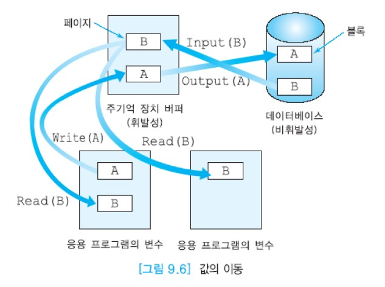

# 동시성 제어


## 목차

- 동시성의 개요
- 로킹(locking)


## 동시성의 개요

대부분의 DBMS들은 다수 사용자용이다. 아래 그림처럼 여러 사용자들이 동시에 동일한 테이블을 접근하기도 한다.  
DBMS의 성능을 높이기 위해 여러 사용자의 질의나 프로그램들을 동시에 수행하는 것이 필수적이다.  
본 절에서는 동시에 수행되는 다수의 트랜잭션들이 존재할 때 고립성을 유지하는 동시성 제어를 논의한다.


DBMS가 아무런 조치를 취하지 않고 트랜잭션들을 동시에 수행시키면 여러 가지 문제가 발생할 수 있다.  
동시성 제어 기법은 여러 사용자들이 다수의 트랜잭션을 동시에 수행하는 환경에서 부정확한 결과를 생성할 수 있는, 트랜잭션들 간의 간섭이 생기지 않도록 한다.  
트랜잭션을 수행하는 각 사용자가 혼자서 데이터베이스를 접근하는 것처럼 생각할 수 있도록 해야 한다.

각 트랜잭션은 데이터베이스의 일관성을 유지하므로 여러 트랜잭션들의 집합을 한번에 한 트랜잭션씩 차례대로 수행하는 __직렬 스케줄(serial schedule)__에서는 데이터베이스의 일관성이 유지된다.  
여러 트랜잭션들을 동시에 수행하는 __비직렬 스케줄(non-serial schedule)__의 결과가 어떤 직렬 스케줄의 수행 결과와 동등하다면 __직렬가능(serializable)__하다고 말한다.

사용자의 프로그램에서는 데이터베이스로부터 검색한 데이터에 대해 여러 가지 연산들을 수행할 수도 있지만 DBMS는 읽기와 쓰기 연산만 관심을 갖는다.

:large_blue_circle: 데이터베이스 연산

응용에서 접근하려는 데이터베이스 항목을 포함하고 있는 디스크 블록을 주기억 장치와 디스크 간에 이동하는 연산은 Input (X) 와 Output (X) 이다.  
Input (X) 연산은 데이터베이스 항목 X를 포함하고 있는 블록을 주기억 장치의 버퍼로 읽어들인다. Output (X) 연산은 데이터베이스 항목 X를 포함하고 있는 블록을 디스크에 기록한다.  
주기억 장치의 버퍼와 응용 간에 데이터베이스 항목을 이동하는 연산은 read_item(X)와 write_item (X) 이다.  
read_item (X) 연산은 주기억 장치 버퍼에서 데이터베이스 항목 X의 값을 프로그램 변수 X로 복사한다.  
write_item(X) 연산은 프로그램 변수 X의 값을 주기억 장치 내의 데이터베이스 항목 X에 기록한다.  
read_item (X) 와 write_item (X) 에 Input (X) 연산이 모두 필요하다.  
아래 그림은 디스크, 주기억 장치 버퍼, 응용의 변수들 간의 값의 이동을 보여준다.



동시성 제어를  하지 않고 다수의 트랜잭션을 동시에 수행하면 __갱신 손실(lost update)__, __오손 데이터 읽기(diry read)__, __반복할 수 없는 읽기(unrepeatable read)__ 등의 문제가 발생할 수 있다.  
갱신 손실은 수행 중인 트랜잭션이 갱신한 내용을 다른 트랜잭션이 덮어 씀으로써 갱신이 무효가 되는 것을 뜻한다.  
__오손 데이터(dirty data)__는 완료되지 않은 트랜잭션이 갱신한 데이터이다.  
반복할 수 없는 읽기는 한 트랜잭션이 동일한 데이터를 두 번 읽을 때 서로 다른 값을 읽는 것을 말한다.

```
```


