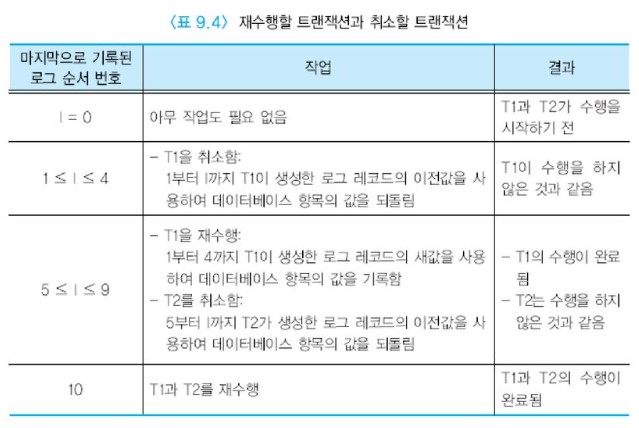

# 회복

어떤 트랜잭션 T를 수행하는 도중에 시스템이 다운되었을 때, T의 수행 효과가 디스크의 데이터베이스에 일부 반영되었을 수 있다.  
어떻게 T의 수행을 취소하여 원자성을 보장할 것인가? 또한 트랜잭션 T가 종료된 직후에 시스템이 다운되면 T의 모든 갱신 효과가 주기억 장치로부터 디스크에 기록되지 않을 수 있다.  
어떻게 T의 수행 결과가 데이터베이스에 완전하게 반영되도록 하여 지속성을 보장할 것인가?  
디스크의 헤드 등이 고장 나서 디스크의 데이터베이스를 접근할 수 없다면 어떻게 할 것인가?

본 절에서는 이와 같은 물음들에 대한 해결 방안을 알아본다.  
어떤 이유로 DBMS가 다운되든지 DBMS의 회복 모듈은 트랜잭션의 원자성과 지속성을 보장해야 한다.


## 목차

- 회복의 개요
- 로그를 사용한 즉시 갱신
- 데이터베이스 백업과 재해적 고장으로부터의 회복


## 회복의 개요

어떤 응용1에서 데이터베이스 항목 X가 필요해서 디스크로부터 주기억 장치 버퍼로 읽어들이면, 응용2에서 동일한 데이터베이스 항목 X가 필요할 때  
디스크로부터 다시 읽을 필요가 없이 주기억 장치 내의 데이터베이스 항목 X를 사용하면 된다.  
또한 응용1에서 주기억 장치 내의 데이터베이스 항목 X를 갱신한 후에 응용2에서도 동일한 데이터베이스 항목 X를 갱신할 수 있으므로 응용1에서 X를 갱신한 후에 디스크에 즉시 기록할 필요는 없다.  
각 응용에서 어떤 데이터베이스 항목을 갱신할 때마다 즉시 디스크에 기록한다면 디스크 접근 회수가 크게 증가하여 성능이 저하될 수 있다.  
따라서 여러 응용이 주기억 장치 버퍼 내의 동일한 데이터베이스 항목을 갱신한 후에 디스크에 기록함으로써 성능을 향상시키는 것이 중요하다.

이처럼 주기억 장치의 버퍼는 디스크로부터 데이터를 읽거나 디스크에 데이터를 기록하는 비용을 최소화하기 위해서 완충 역할을 수행한다.  
버퍼의 내용을 디스크에 기록하는 것을 가능하면 최대한 줄이는 것이 일반적이다.  
예를 들어, 버퍼가 꽉 찼을 때 또는 트랜잭션이 완료될 때 버퍼의 내용이 디스크에 기록될 수 있다.

트랜잭션이 버퍼에는 갱신 사항을 반영했지만 버퍼의 내용이 디스크에 기록되기 전에 고장이 발생할 수 있다.  
이런 경우에 DBMS의 회복 모듈은 고장이 발생한 시점에 갱신을 수행한 트랜잭션들의 상태를 조사해야 한다.  
만일 고장이 발생하기 전에 트랜잭션이 완료 명령을 수행했다면 회복 모듈은 이 트랜잭션의 갱신 사항을 __재수행(REDO)__ 하여 트랜잭션의 갱신이 지속성을 갖도록 해야 한다.  
한편 고장이 발생하기 전에 트랜잭션이 완료 명령을 수행하지 못했다면 원자성을 보장하기 위해서 이 트랜잭션이 데이터베이스에 반영했을 가능성이 있는 갱신 사항을 __취소(UNDO)__ 해야 한다.

DBMS는 데이터베이스의 회복을 위해서 백업, 로깅, 체크포인트 등을 수행한다.  
__백업(backup)__ 은 데이터베이스를 주기적으로 자기 테이프 등에 복사하는 것이다.  
__로깅(logging)__ 은 현재 수행 중인 트랜잭션의 상태와 데이터베이스의 갱신 사항을 기록한다.  
__체크포인트(checkpoint)__ 는 시스템이 붕괴된 후 재기동되었을 때 재수행하거나 취소해야 하는 트랜잭션들의 수를 줄여준다.


:large_blue_circle:저장 장치의 유형

주기억 장치와 같은 휘발성 저장 장치에 들어 있는 내용은 시스템이 다운된 후에 모두 사라진다.  
이에 반해서 디스크와 같은 비휘발성 저장 장치에 들어 있는 내용은 디스크 헤드 등이 손상을 입지 않는 한 시스템이 다운된 후에도 유지된다.  
__안전 저장 장치(stable storage)__ 는 모든 유형의 고장을 견딜 수 있는 저장 장치를 의미한다.  
두 개 이상의 비휘발성 저장 장치가 동시에 고장 날 가능성이 매우 낮으므로 비휘발성 저장 장치에 두 개 이상의 사본을 중복해서 저장함으로써 안전 저장 장치를 구현한다.

디스크가 손상을 입어서 데이터베이스를 읽을 수 없는 고장을 __재해적 고장__ 이라 하고, 그 이외의 고장을 __비재해적 고장__ 이라고 한다.  
고장의 유형에 따라 회복 절차는 재해적 고장으로부터 회복과 비지해적 고장으로부터의 회복으로 분류된다.  
재해적 고장으로부터의 회복은 데이터베이스를 백업해놓은 자기 테이프를 기반으로 한다.  
대부분의 회복 알고리즘들은 비재해적 고장에 적용된다. 비재해적 고장으로부터의 회복은 __로그를 기반으로 한 즉시 갱신__,  
__로그를 기반으로 한 지연 갱신__, __그림자 페이징(shadow paging)__ 등 여러 알고리즘을 기반으로 한다.  
대부분의 상용 DBMS에서 로그를 기반으로 한 즉시 갱신 방식을 사용하므로 본 절에서는 여러 회복 기법들 중에서 이 기법만 논의한다.


## 로그를 사용한 즉시 갱신

즉시 갱신에서는 트랜잭션이 데이터베이스를 갱신한 사항이 주기억 장치의 버퍼에 유지되다가 트랜잭션이 완료되기 전이라도 드시크의 데이터베이스에 기록될 수 있다.  
데이터베이스에는 완료된 트랜잭션의 수행 결과뿐만 아니라 철회된 트랜잭션의 수행 결과도 반영될 수 있으므로 트랜잭션의 원자성과 지속성을 보장하기 위해 추가로 정보를 유지해야 한다.  
이런 목적을 위해 DBMS는 로그라고 부르는 특별한 화일을 유지한다. 로그에 대한 기록은 화일의 끝에 순차적으로 이루어지므로 로그 유지가 성능에 나쁜 영향을 주지는 않는다.  
로그를 유지하기 때문에 생길 수 있는 성능 저하를 피하기 위해서, 데이터베이스와 로그가 동시에 손상을 입는 것을 피하기 위해서, 일반적으로 전용 디스크에 로그를 저장한다.

데이터베이스 항목에 영향을 미치는 모든 트랜잭션의 연산들에 대해서 로그 레코드를 기록한다.  
각 로그 레코드는 __로그 순서 번호(LSN: Log Sequence Number)__ 로 식별된다.  
아래 그림은 이전의 데이터베이스 상태에 갱신 연산을 적용하면 새로운 데이터베이스 상태와 로그가 생성되는 것을 보여준다.


주기억 장치의 버퍼에 데이터베이스 갱신 사항을 유지하다가 버퍼가 꽉 차면 디스크의 데이터베이스에 기록하듯이, 주기억 장치 내의 로그 버퍼에 로그 레코드들을 기록하고 로그 버퍼가 꽉 찰 때 디스크의 로그로 출력한다.  
트랜잭션에서 로그 레코드를 하나 생성할 때마다 디스크에 기록하면 디스크 입출력 횟수가 크게 증가하여 성능이 나빠지기 때문이다.  
로그는 데이터베이스 회복에 필수적이므로 일반적으로 안전 저장 장치에 저장된다. 로그를 두 개의 디스크에 중복해서 저장하는 것을 __이중 로그(dual log)__ 라 부른다.  
비재해적 고장이 발생하면 디스크상의 로그가 계속 남아 있게 된다.

각 로그 레코드가 어떤 트랜잭션에 속한 것인가를 식별하기 위해서 각 로그 레코드마다 트랜잭션 ID를 포함시킨다.  
트랜잭션 ID는 트랜잭션이 생성될 때마다 고유한 번호가 부여된다. 동일한 트랜잭션에 속하는 로그 레코드들은 연결 리스트로 유지된다.  
로그와 관련된 모든 작업은 사용자에게 투명하게 DBMS에서 이루어진다.


흔히 사용되는 로그 레코드의 유형은 아래와 같다.

- [Trans-ID, start]

  한 트랜잭션이 생성될 때 기록되는 로그 레코드이다.

- [Trans-ID, X, old_value, new_value]

  주어진 Trans_ID를 갖는 트랜잭션이 데이터 항목 X를 이전 값(old_value)에서 새 값(new_value)로 수정했음을 나타내는 로그 레코드이다.  
  한 트랜잭션에서 여러 데이터 항목을 갱신하는 경우에는 한 트랜잭션에서 이런 로그 레코드를 여러 개 생성한다.  
  이전 값은 트랜잭션을 취소할 때 사용되고, 새 값은 트랜잭션을 재수행할 때 사용된다.

- [Trans-ID, commit]

  주어진 Trans_ID를 갖는 트랜잭션이 데이터베이스에 대한 갱신을 모두 성공적으로 완료하였음을 나타내는 로그 레코드이다.  
  어떤 트랜잭션에 대해 디스크의 로그에 이런 로그 레코드가 기록되어 있으면 그 트랜잭션의 갱신 사항은 데이터베이스에 영구적으로 반영될 수 있다.

- [Trans-ID, abort]

  주어진 Trans_ID를 갖는 트랜잭션이 철회되었음을 나타내는 로그 레코드이다.  
  어떤 트랜잭션에 대해 디스크의 로그에 이런 로그 레코드가 기록되어 있으면 그 트랜잭션의 갱신 사항을 데이터베이스에서 취소해야 한다.

```
예 : 트랜잭션의 로그 레코드

아래의 두 트랜잭션 T1과 T2를 고려해보자.
T1 다음에 T2가 수행되고, 데이터베이스 항목 A, B, C, D, E의 초깃값은 각각 100, 300, 5, 60, 80이라고 가정한다.
이 두 트랜잭션을 수행하면 아래 표와 같은 로그 레코드들이 생성된다. 표에서 2번 로그 레코드는 트랜잭션 T1이 데이터베이스 항목 B를 이전 값 300에서 새 값 400으로 갱신했음을 나타낸다.
일단 이 로그 레코드가 디스크의 로그에 기록된 후에는 B가 새 값으로 고쳐진 주기억 장치의 버퍼가 언제든지 디스크의 데이터베이스에 기록될 수 있다.
```


한 트랜잭션의 데이터베이스 갱신 연산이 모두 끝나고 데이터베이스 갱신 사항이 로그에 기록되었을 때 그 트랜잭션이 __완료점(commit point)__ 에 도달한다고 말한다.  
시스템이 다운된 후에 재기동되면, 사용자들이 데이터베이스를 사용할 수 있돌폭 허용하기 전에 회복 과정을 거쳐야 한다.

DBMS의 회복 모듈은 로그를 검사하여 로그에 [Trans-ID, start] 로그 레코드와 [Trans-ID, commit] 로그 레코드가 모두 존재하는 트랜잭션들은 재수행한다.  
아래 그림 9.17은 이전의 데이터베이스 상태에 로그를 적용하여 트랜잭션을 재수행하면 새로운 데이터베이스 상태가 생성되는 것을 보여준다.  
이에 반해서 [Trans-ID, start] 로그 레코드는 로그에 존재하지만 [Trans-ID, commit] 로그 레코드가 존재하지 않는 트랜잭션들은 취소한다.  
아래 그림 9.18는 새로운 데이터베이스 상태에 로그를 적용하여 트랜잭션을 취소하면 이전의 데이터베이스 상태가 생성되는 것을 보여준다.  
트랜잭션의 재수행은 로그가 기록되는 방향으로 진행되고, 트랜잭션의 취소는 로그를 역방향으로 따라가면서 진행된다.


 아래 표는 앞의 표 9.3의 예에서 로그 레코드가 어디까지 디스크에 기록되었는가에 따라 재수행할 트랜잭션과 취소할 트랜잭션이 달라지는 것을 나타낸다.




:large_blue_circle: 로그 먼저 쓰기(WAL: Write-Ahead Logging)

트랜잭션이 데이터베이스를 갱신하면 주기억 장치의 데이터베이스 버퍼에 갱신 사항을 기록하고, 로그 버퍼에는 이에 대응되는 로그 레코드를 기록한다.  
디스크에 로그 버퍼와 데이터베이스 버퍼를 한 번에(하나의 단위 작업으로) 기록하는 것이 불가능하므로 데이터베이스 버퍼와 로그 버퍼 중 어느 하나가 먼저 디스크에 기록된다.  
만일 데이터베이스 버퍼가 로그 버퍼보다 먼저 디스크에 기록된다면 디스크의 데이터베이스에서 이전 값이 없어진다.  
로그 버퍼가 디스크에 기록되기 전에 시스템이 다운되었다가 재기동되었을 때 주기억 장치는 휘발성이므로 데이터베이스 버퍼와 로그 버퍼의 내용은 전혀 남아 있지 않다.  
어떤 트랜잭션을 취소하려면 그 트랜잭션이 갱신한 데이터베이스 항목의 이전 값을 알아야 하는데, 로그 레코드가 없어서 이전 값을 알 수 없으므로 트랜잭션의 취소가 불가능하다.  
따라서 데이터베이스 버퍼보다 로그 버퍼를 먼저 디스크에 기록해야 한다. 이를 로그 먼저 쓰기라고 한다.

:large_blue_circle: 체크포인트(checkpoint)

DBMS는 시스템이 다운된 후 재기동되었을 때 [Trans-ID, start] 로그 레코드와 [Trans-ID, commit] 로그 레코드가 모두 디스크의 로그에 존재하면  
이 트랜잭션을 재수행하고, [Trans-ID, commit] 로그 레코드가 존재하지 않는 트랜잭션은 취소한다.  
시스템이 다운되기 직전에 완료된트랜잭션이 데이터베이스를 갱신한 내용은 주기억 장치의 버퍼에 남아 있으면서 아직 디스크에 기록되지 않았을 가능성이 높으므로  
로그 레코드를 보고 트랜잭션의 갱신 사항을 재수행해야 하지만 시스템이 다운된 시점으로부터 오래 전에 완료된 트랜잭션들이 데이터베이스를 갱신한 사항은 이미 디스크에 반영되었을 것이다.  
이런 트랜잭션들을 재수행하는 것은 불필요하다.

DBMS가 로그를 사용하더라도 어떤 트랜잭션의 갱신 사항이 주기억 장치 버퍼로부터 디스크에 기록되었는가를 구분할 수 없다.  
로그는 단지 데이터베이스의 어떤 항목이 어떤 이전 값에서 어떤 새값으로 바뀌었는가만 기록한다.  
추가 정보 없이 로그만 검사해서는 주기억 장치의 버퍼가 디스크에 기록되었는가를 식별할 수 없다.  
따라서 DBMS는 회복시 재수행할 트랜잭션의 수를 줄이기 위해서 주기적으로 체크포인트를 수행한다.  
체크포인트 시점에는 주기억 장치의 버퍼 내용이 디스크에 강제로 기록되므로, 체크포인트를 수행하면 디스크 상에서 로그와 데이터베이스의 내용이 일치하게 된다.  
체크 포인트 작업이 끝나면 로그에 [checkpoint] 로그 레코드가 기록된다.

따라서 시스템이 다운된 후 재기동되었을 때 DBMS의 회복 모듈은 로그에서 가장 최근의 [checkpoint] 로그 레코드를 찾는다.  
체크포인트 시점 이전에 시작되었더라도 완료되지 않은 트랜잭션들은 모두 취소해야 하지만, [checkpoint] 로그 레코드 이전에 완료된 트랜잭션들은 재수행할 필요가 없다.  
체크포인트 이후에 완료된 모든 트랜잭션들은 재수행한다. 일반적으로 체크포인트를 10~20분마다 한 번씩 수행한다.

체크포인트를 할 때 수행되는 작업을 좀 더 자세하게 설명하면 아래와 같다.

- 수행 중인 트랜잭션들을 일시적으로 중지시킨다. 회복 알고리즘에 따라서는 이 작업이 필요하지 않을 수 있다.
- 주기억 장치의 로그 버퍼를 딛스크에 강제로 출력한다.
- 주기억 장치의 데이터베이스 버퍼를 디스크에 강제로 출력한다.
- [checkpoint] 로그 레코드를 로그 버퍼에 기록한 후 디스크에 강제로 출력한다. 체크포인트 시점에 수행 중이던 트랜잭션들의 ID도 [checkpoint] 로그 레코드에 함께 기록한다.
- 일시적으로 중지된 트랜잭션의 수행을 재개한다.

```
예 : 체크포인트를 하지 않았을 때

아래 그림은
```


